# Nautobot External Data Import — Design

_Status: Scope committed. One-way ETL from external APIs into Nautobot._
_Date: 2026-07-01_

> **Note on the filename.** This doc used to be called "Sync Plan Design" and lived under the Generic SSoT integration name. The scope has narrowed and the framing has shifted: **one-way import forever, never bidirectional.** The concepts and naming below reflect that. The filename can be updated (`NAUTOBOT_DATA_IMPORT_DESIGN.md` would fit) when it's convenient — the file path is the least important part.

---

## Decisions Locked In

1. **One Django model: `ImportPlan`** holds the entire configuration as a JSON document.
2. **UI is the primary interface.** Most Nautobot administrators aren't coders.
3. **YAML/JSON view exists** as a power-user escape hatch and for export/import, but is not the default surface.
4. The system **does the heavy lifting** around Nautobot's schema: required fields, FK resolution, parent-object auto-creation, validation.
5. **One-way import only, forever.** External API → Nautobot. Never Nautobot → external. No sync direction field. No export path. If someone later wants to push Nautobot data outward, that's a different feature.
6. **This is an ETL job, not an SSoT adapter.** Positioned in the UI as "External Data Import" — no DiffSync jargon, no adapter concepts, no "sync direction". DiffSync stays as an internal execution helper for dry-run only.

---

## What an Import Plan Is

An Import Plan is a single artifact that fully describes _"pull data from this external API and project it into these Nautobot models."_ A user creates one through a guided wizard; the system stores it as a versionable document.

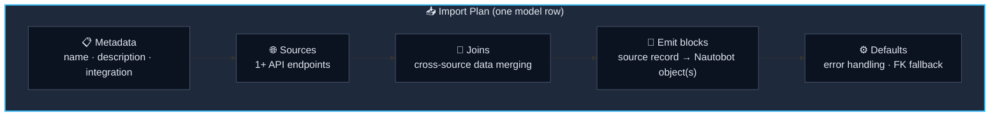

---

## System Architecture

Four layers, each with a clean responsibility. **No dedicated history model** — Nautobot's `JobResult` already provides that.

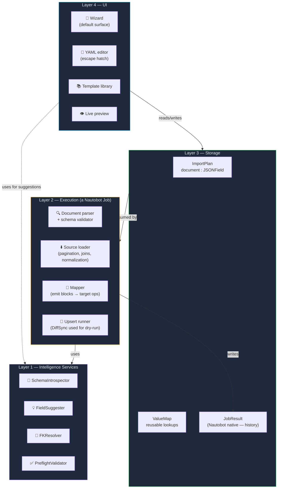

The same intelligence services power both the UI (autosuggest while building) and the Job (resolve FKs at runtime). One source of truth for "what does Nautobot need."

---

## Django Models (the entire storage layer)

**Two new models.** `JobResult` is Nautobot's, not ours.

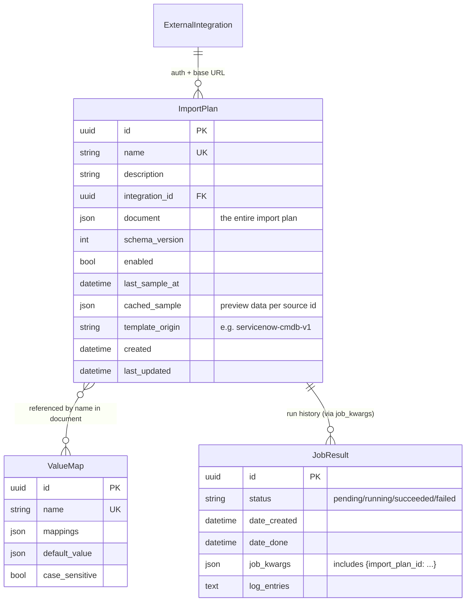

Everything else (sources, joins, emit blocks, field mappings, FK rules) lives inside `ImportPlan.document`. The document is the source of truth; the model row is just the envelope. Every run of the plan produces a native `JobResult` — no separate history table.

---

## The Document Schema (v1)

The document validates against a strict JSON schema. Top-level shape:

```yaml
version: 1                       # schema version
sources:                         # 1+ endpoint definitions
  - id: <string>                 # local identifier, referenced by emit blocks
    api_path: <string>
    data_path: <jmespath>        # path into the response body
    method: GET | POST
    pagination:
      type: none | offset | page | cursor | link
      page_size: <int>
      params: { ... }
    headers: { ... }
    query_params: { ... }
    body_template: <jinja>       # for POST
    iterates: <source_id>        # optional: this is a child endpoint
    iterates_key: <jmespath>     # optional: extract param from parent record
    normalize: [ ... ]           # optional canonical-field defs (raw → clean)

joins:                           # optional cross-source joins
  - left: <source_id>
    left_key: <jmespath>
    right: <source_id>
    right_key: <jmespath>
    type: left | inner

emit:                            # source records → Nautobot objects
  - from: <source_id>
    to: <app_label.model>        # e.g. dcim.device
    when: <jmespath>             # optional record filter
    identifiers:                 # natural keys
      <nautobot_field>: <expr>
    fields:
      <nautobot_field>:
        source: <jmespath>
        default: <literal>
        required: true | false
        value_map: <inline_dict> | <ValueMap.name>
        type_cast: int | float | bool | datetime
        fk:                      # only for FK fields
          on_missing: skip_record | skip_field | create | lookup_only | static
          lookup_field: name | display_name | …
          create_defaults: { ... }
          static_value: <string>          # only when on_missing == static
          also_emit:                      # optional nested emit for parent
            to: <app_label.model>
            identifiers: { ... }
            fields: { ... }

defaults:                        # plan-wide fallbacks
  on_missing_fk: skip_record
  on_record_error: continue      # continue | abort
  delete_unmatched: false        # if true, remove Nautobot objects not seen in the import
```

Note the schema has no `direction` field, no `export` field, no `sync_direction`. Import Plans only import.

### How a Field Maps Visually


Each step is optional. The user only sees pieces they configure; the engine assembles the pipeline.

---

## Runtime Execution Flow

What happens when a user clicks "Run import".

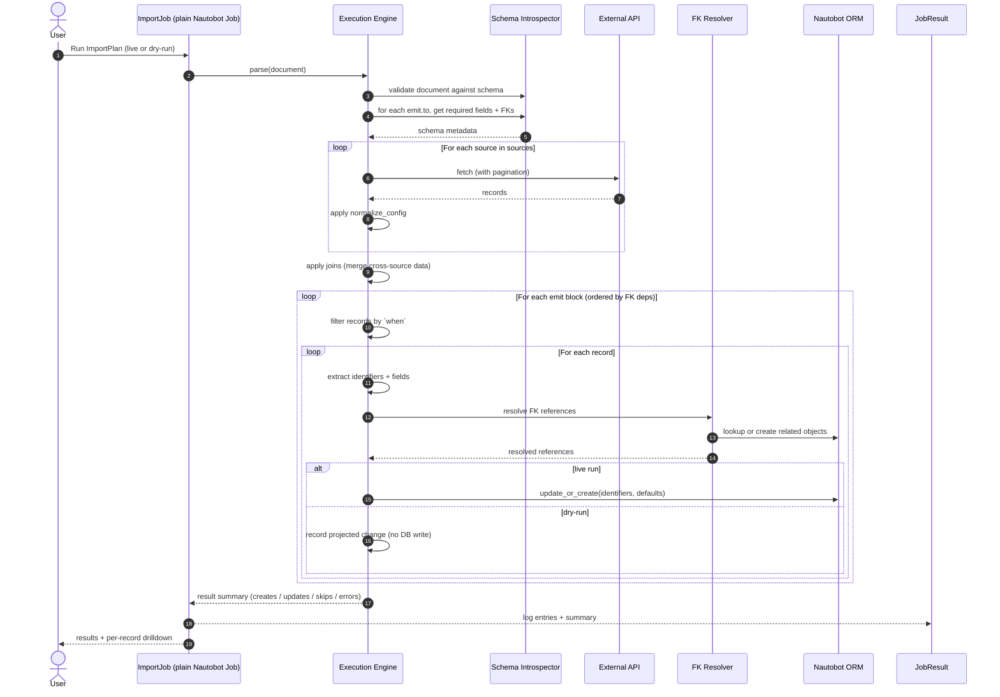

**Dry-run implementation:** the engine runs the full pipeline but replaces the ORM `update_or_create` call with a "would create/update this" record. No DiffSync adapter dance required — dry-run is just "run the pipeline in report mode." Same code path, different terminal step.

---

## UI Surface

The user never has to see the YAML if they don't want to. Every document feature has a UI affordance.

### The Wizard Journey

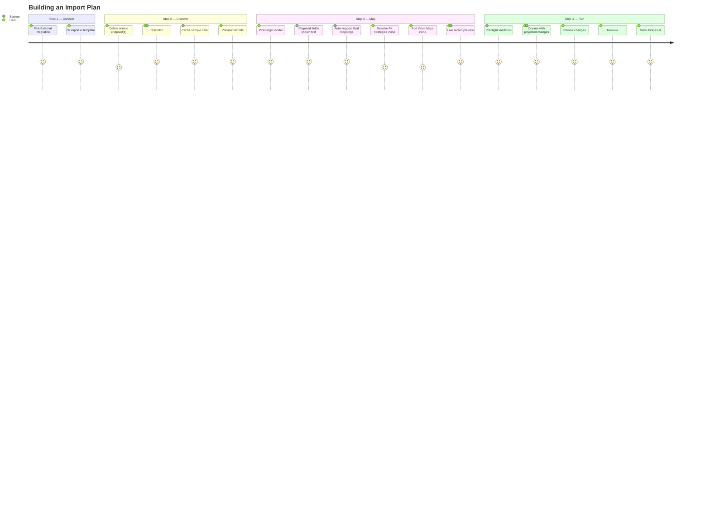

### UI Affordances Map Cleanly to Document Features

| Document feature | UI affordance |
| --- | --- |
| `name`, `description`, `integration` | Step 1 form fields |
| `sources[].api_path`, `pagination`, etc. | Step 2 endpoint cards with a "Test fetch" button |
| `sources[].iterates` (child endpoint) | Step 2: "this endpoint runs per record of…" dropdown |
| `joins` | Step 2: "Combine data" panel (only visible if 2+ sources) |
| `emit[]` (multiple blocks) | Step 3: tab per target model (or "+ Add another model") |
| `emit[].identifiers` vs `fields` | Visual distinction in the mapping table (★ marker for identifiers) |
| `emit[].fields[].source` | Source field dropdown with autocomplete + JMESPath hint |
| `emit[].fields[].fk` | Inline popover triggered by an ⓘ next to FK fields |
| `emit[].fields[].fk.also_emit` | "Auto-create parent objects" toggle in the FK popover |
| `emit[].fields[].value_map` | "Add value map" modal that lists distinct sample values |
| `emit[].when` | "Only import records where…" filter at the top of the emit tab |
| `defaults` | Step 4 settings panel (with sensible defaults pre-set) |
| Full document | "View YAML" toggle (hidden by default; collapses everything to text) |

### Where YAML Hides

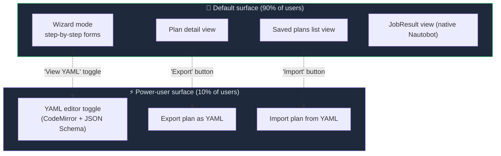

The YAML editor is _never_ the default. It's a toggle/button on the wizard and detail pages, primarily for templates, debugging, and Git-backed configuration management.

---

## Intelligence Layer (the "heavy lifting")

These are the four utility services that make the system feel smart. They're shared between the UI (for autosuggest) and the Job (for runtime resolution).

### 1. SchemaIntrospector

Given a Nautobot ContentType, returns everything we need to know:

```python
{
  "required_fields": ["name", "status", "device_type", "role", "location"],
  "optional_fields": ["serial", "asset_tag", "platform", "tenant", ...],
  "custom_fields": [
    {"key": "servicenow_id", "type": "text", "label": "ServiceNow ID"},
    ...
  ],
  "foreign_keys": {
    "status":      {"model": "extras.Status",      "lookup": "name"},
    "role":        {"model": "extras.Role",        "lookup": "name"},
    "location":    {"model": "dcim.Location",      "lookup": "name"},
    "device_type": {"model": "dcim.DeviceType",    "lookup": "model",
                    "parents": ["manufacturer"]},
    "primary_ip4": {"model": "ipam.IPAddress",     "lookup": "host",
                    "parents": ["parent"]},
    ...
  },
  "natural_keys": ["name"],
}
```

The wizard uses this to render the field list "required first, optional next". The Job uses it to validate the document before run.

### 2. FieldSuggester

Given sample data + a target model, proposes field mappings using fuzzy match.

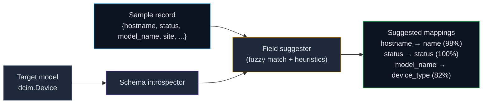

### 3. FKResolver

Handles every FK strategy declared in the document:

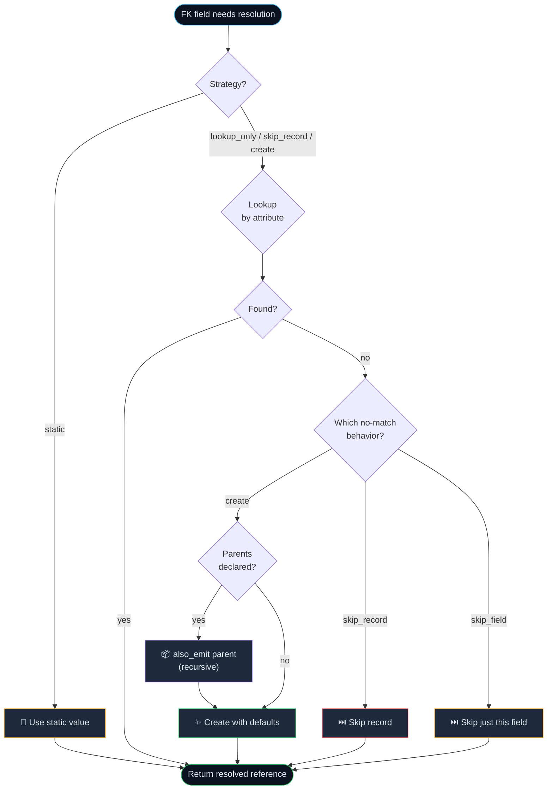

### 4. PreflightValidator

Runs before a user can hit "Run live". Inline warnings, not exceptions.

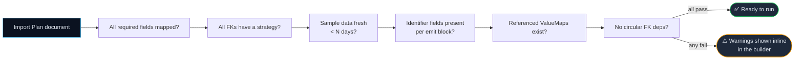

---

## Template Library

Ship pre-built import plans for common integrations. Users import a template, point it at their integration, customize anything that differs, run.

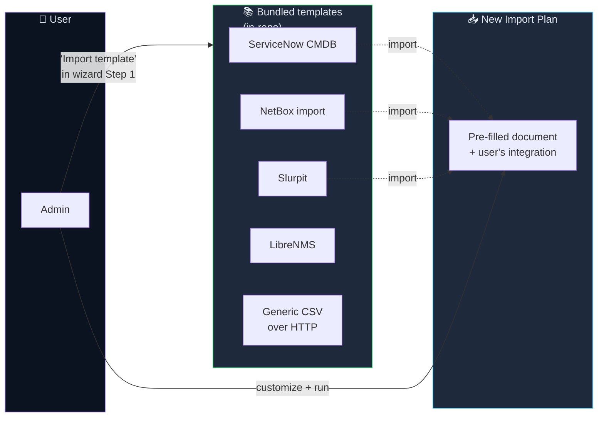

Templates live as JSON files under `nautobot_ssot/integrations/generic_ssot/templates/` (folder rename can follow later — path is not user-visible). The "Import Template" button in Step 1 lists them.

---

## The Import Job

A single Nautobot Job class powers all Import Plans:

```python
class RunImportPlan(Job):
    """Execute an Import Plan against Nautobot."""

    class Meta:
        name = "Run Import Plan"

    import_plan = ObjectVar(model=ImportPlan, queryset=ImportPlan.objects.filter(enabled=True))
    dry_run = BooleanVar(default=True)

    def run(self, import_plan, dry_run):
        engine = ImportEngine(import_plan.document, job_logger=self.logger)
        summary = engine.execute(dry_run=dry_run)
        self.create_file("import_report.json", json.dumps(summary))
        return summary
```

That's the entire Job surface. Every run creates a `JobResult` — Nautobot's native history mechanism. No custom `SyncRun` model, no history table to maintain, no separate dashboard.

**Scheduling** is Nautobot's existing scheduled-job mechanism. You schedule this Job with `{"import_plan": <uuid>}` as its kwargs and Nautobot's scheduler fires it. No new scheduling concept.

---

## Implementation Phases

Three phases, each delivering value independently.

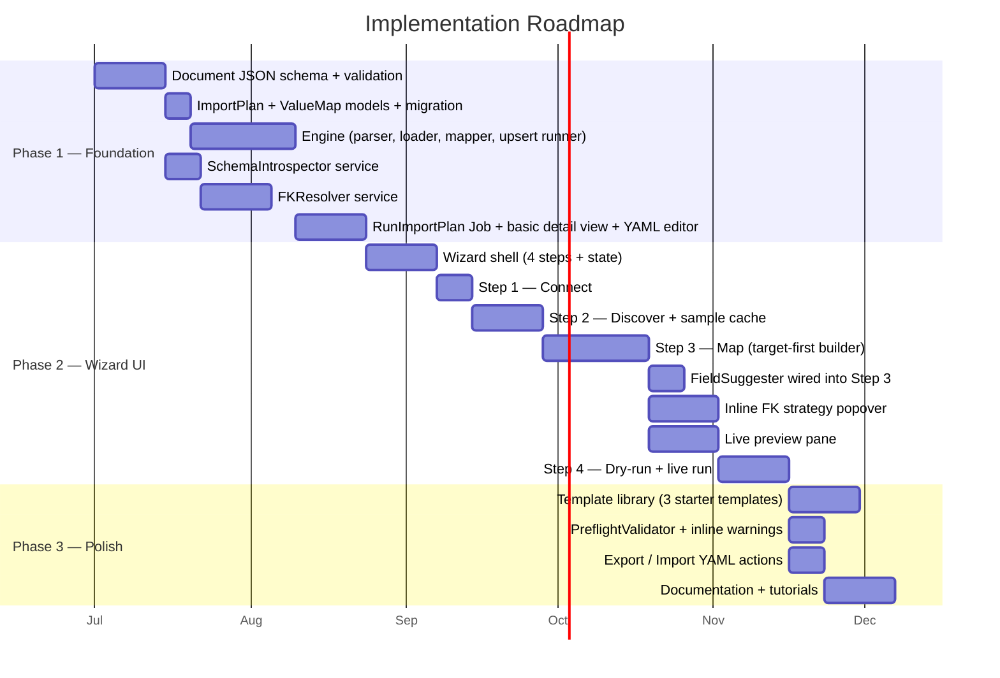

### Phase 1 — Foundation (engine + storage, no wizard yet)

- Define and version the document JSON schema
- Build `ImportPlan` and `ValueMap` models (no `SyncRun` — use `JobResult`)
- Build the execution engine (parser → loader → mapper → upsert runner)
- Build `SchemaIntrospector` and `FKResolver` services
- Ship the `RunImportPlan` Job and a minimal detail view with a YAML editor — power users can run import plans without the wizard

**End-of-phase test**: a developer writes a YAML document by hand, saves it as an ImportPlan, runs the Job, sees Nautobot objects created and a `JobResult` populated.

### Phase 2 — Wizard UI (the main UX)

- Build the 4-step wizard
- Wire `FieldSuggester` into the Map step
- Build the inline FK strategy popover
- Build the live record preview pane
- Build the dry-run projected-changes viewer

**End-of-phase test**: a non-developer admin creates a working import from scratch using only the wizard, no YAML.

### Phase 3 — Polish

- Ship 3 starter templates (ServiceNow CMDB, NetBox, generic CSV-over-HTTP)
- Build the preflight validator with inline warnings
- Build YAML export / import for the GitOps workflow
- Document the system

**End-of-phase test**: new users start from a template and reach a working import in <15 minutes.

---

## Clean Slate — Existing MVP Models Are Discarded

The previous MVP iteration was never put into production use, so there's no migration burden. **Phase 1 starts from an empty slate**: drop the existing tables (`SSOTEndpoint`, `SSOTSyncConfig`, `SSOTFieldMapping`, `SSOTFKCreateRule`, `SSOTEndpointJoin`, `SSOTDataSample`, `GenericSSOTDataDiscovery`, and their through-models) and create the two new tables fresh.

```mermaid
graph LR
    subgraph Old["🗑 Old MVP (drop)"]
        T1[SSOTEndpoint]
        T2[SSOTSyncConfig]
        T3[SSOTSyncConfigEndpoint]
        T4[SSOTFieldMapping]
        T5[SSOTFKCreateRule]
        T6[SSOTEndpointJoin]
        T7[SSOTDataSample]
        T8[GenericSSOTDataDiscovery]
    end

    subgraph New["✨ New (build)"]
        N1[ImportPlan]
        N2[ValueMap]
        N3["(JobResult — Nautobot native)"]
    end

    Old -->|"single migration:<br/>delete all"| New

    style Old fill:#1e293b,stroke:#ef4444,color:#e2e8f0
    style New fill:#1e293b,stroke:#22c55e,color:#e2e8f0
```

A single Django migration drops the old tables and creates the new ones. No data migration, no compatibility shims.

---

## What The Reframing Eliminated

Committing to "one-way import forever" — and adopting the ETL positioning — deletes the following complexity from the design:

| Removed | Because |
| --- | --- |
| `sync_direction` field on ImportPlan | Only one direction exists |
| Export path in the execution engine | Not building it |
| `DataSource` / `DataTarget` job hierarchy | Plain `Job` is sufficient |
| `SyncRun` model | `JobResult` covers history |
| Bidirectional conflict-resolution UI | Not applicable |
| "Which system is source of truth?" framing | Nautobot is target; external is source; done |
| The word "sync" throughout the UX | Replaced with "import" — clearer, honest |
| DiffSync adapter classes as user-facing concepts | Engine uses DiffSync only for dry-run internally |

That's not superficial. Each of those was going to consume design time, code, and docs. All gone.

---

## Open Questions To Resolve Before Phase 1

1. **YAML editor library** — Monaco (heavy, full-featured) vs CodeMirror (lighter, simpler). Recommend CodeMirror 6 with JSON Schema validation extension.
2. **Document storage format** — store as JSON in the DB, render as YAML in the UI? Or store as YAML string? Recommend: JSON in DB (cleaner queries), YAML in UI (more readable).
3. **Schema versioning strategy** — how do we evolve the document schema without breaking saved plans? Recommend: explicit `version: N` field + migration functions per version bump.
4. **Where do templates live?** In-repo JSON files vs. database fixtures vs. external Git repo. Recommend: in-repo as JSON files with a Django management command to refresh them.
5. **Delete-unmatched semantics** — when `delete_unmatched: true`, do we only delete records that _were_ imported by this plan (tracked via a custom field), or any Nautobot record matching the target type? Recommend: track-imported-only. Nautobot might have manually-created objects the user does not want removed.
6. **Multi-tenancy** — can an ImportPlan be scoped to a Tenant? Recommend: yes, via a standard `tenant` FK on `ImportPlan` (Nautobot pattern).
7. **Folder/name renames** — the code currently lives at `nautobot_ssot/integrations/generic_ssot/`. Rename to something like `integrations/data_import/` to match the new naming? Not urgent; the path isn't user-visible. Can wait until Phase 3.

---

## A Concrete Example, End-to-End

To make the design tangible, here's what a real ServiceNow → Nautobot Devices Import Plan looks like.

### What the user does in the wizard

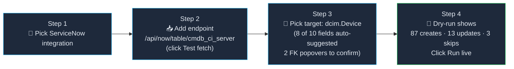

### What's stored in the database

A single `ImportPlan` row with this document:

```yaml
version: 1
sources:
  - id: servers
    api_path: /api/now/table/cmdb_ci_server
    data_path: result
    method: GET
    pagination:
      type: offset
      page_size: 100
      params: { limit_param: sysparm_limit, offset_param: sysparm_offset }

emit:
  - from: servers
    to: dcim.device
    identifiers:
      name: "{{ name }}"
    fields:
      status:
        fk: { on_missing: static, static_value: Active }
      role:
        source: u_device_role
        fk: { on_missing: create }
      device_type:
        source: "model_id.display_value"
        fk:
          on_missing: create
          also_emit:
            to: dcim.devicetype
            identifiers:
              model: "{{ model_id.display_value }}"
            fields:
              manufacturer:
                source: "manufacturer.display_value"
                fk: { on_missing: create }
      location:
        source: "location.display_value"
        fk: { on_missing: skip_record }
      serial:        { source: serial_number }
      asset_tag:     { source: asset_tag }
      _cf_servicenow_id: { source: sys_id }

  - from: servers
    to: ipam.ipaddress
    when: "ip_address != null"
    identifiers:
      host: "{{ ip_address }}"
    fields:
      parent: { fk: { on_missing: auto_parent_prefix } }

defaults:
  on_missing_fk: skip_record
  on_record_error: continue
  delete_unmatched: false
```

The user never typed any of that. The wizard built it. But it's there if they want to export it, version it in Git, code-review it, or share it with a colleague.

That's the whole point.
