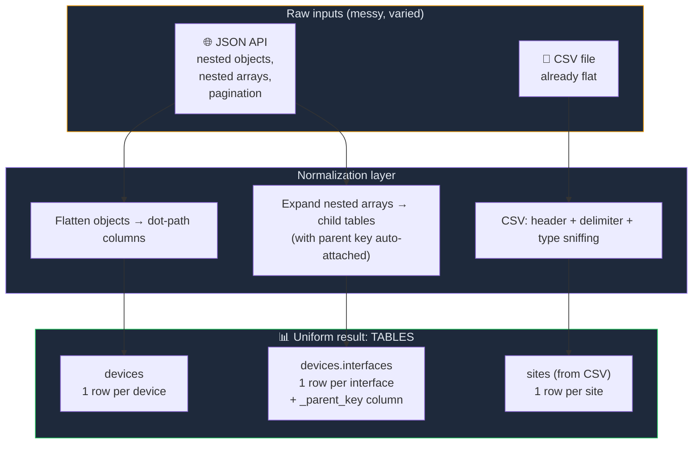
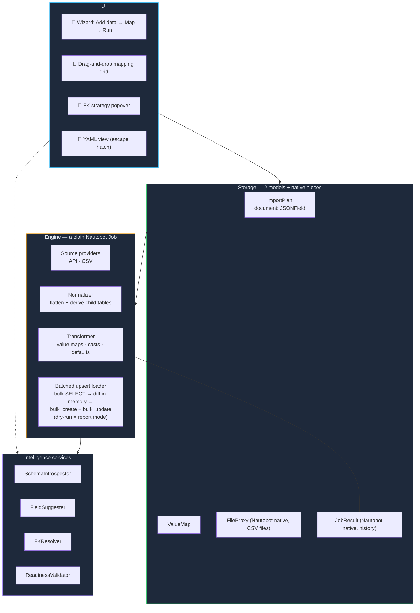

# Nautobot Data Import — Fresh Analysis (v2)

_Status: Supersedes prior analyses. Incorporates: one-way import forever · CSV + JSON API sources · drag-and-drop field matching · multi-model with relationships._
_Date: 2026-07-09_

---

## What We Are Actually Building

**A user-friendly ETL tool inside Nautobot**: take records from any JSON API or CSV file, map their fields onto Nautobot models by dragging and dropping, resolve relationships automatically, and create/update objects — repeatably, with dry-run, without writing code.

Requirements, restated plainly:

1. **Sources**: any JSON REST API (via `ExternalIntegration`) and CSV files (uploaded or fetched from a URL).
2. **UX**: drag-and-drop / visual field matching. The user should feel like they're labeling spreadsheet columns, not programming.
3. **Targets**: multiple Nautobot models per import, including parent/child relationships between them (Location → Device → Interface → IPAddress).
4. **Heavy lifting is ours**: required fields, FK lookups, auto-creating missing related objects, dependency ordering — the system knows Nautobot's schema, so the user shouldn't have to.
5. **One-way, forever**: External → Nautobot. Never export. Not an SSoT; an importer.

---

## The One Big Simplification: Everything Becomes a Table

Previous iterations treated "API endpoint with nested JSON" as the primary shape and made users think in JMESPath. Adding CSV as a peer source flips this on its head — and makes the whole system simpler.

**Normalize every source into flat tables (rows × columns) as early as possible.** CSV is already a table. JSON gets flattened: nested objects become dot-path columns (`location.display_value` → column `location.display_value`), and nested *arrays* become **derived child tables** with a link back to the parent row.



Why this is the load-bearing decision:

- **One mapping UX for everything.** Whether the data came from ServiceNow or a spreadsheet, the user sees the same thing: a grid of real data with columns to label. No "API mode" vs "CSV mode".
- **Drag-and-drop becomes natural.** You can't drag onto abstract JMESPath expressions; you *can* drag onto columns of a visible table. Flattening is what makes the requested UX possible.
- **JMESPath demotes to an escape hatch.** The flattener names columns automatically; power users can still add a computed column with a custom expression. Novices never see it.
- **Nested arrays stop being special.** The old design needed "child endpoints" with URL parameter substitution *and* would have needed something else for JSON-embedded arrays. Now both collapse into one concept: a **child table** that knows its parent key. (Per-parent child API endpoints still exist as a fetch detail, but they produce the same thing: a child table.)
- **Engine gets simpler.** The transform/load pipeline consumes tables. It doesn't care where they came from.

---

## Source Providers

Two providers behind one interface (`fetch() → tables`), extensible later (Excel, JSON file upload, GraphQL):

| Provider | Config | Notes |
| --- | --- | --- |
| **API** | `ExternalIntegration` + path, method, pagination, data path | Existing design carries over unchanged |
| **CSV** | Upload (Nautobot `FileProxy`) or URL | Header row detection, delimiter sniffing, encoding handling, type inference for preview |

CSV re-run semantics matter and are easy to get right:

- **Attached file**: the plan stores a `FileProxy` reference; re-running re-reads the stored file. Good for one-time migrations.
- **Prompt at run time**: the run job exposes a `FileVar`; user uploads a fresh file each run. Good for recurring manual drops ("here's this month's inventory export").
- **URL**: the plan stores an HTTP(S) URL (optionally behind an `ExternalIntegration` for auth); fetched fresh each run. Good for scheduled imports.

---

## The Mapping UX: Label the Spreadsheet

This is the heart of the redesign. Instead of form-per-field (previous design) the user sees **their actual data as a grid** and drags **Nautobot field chips** onto column headers.

```
┌────────────────────────────────────────────────────────────────────────────┐
│ Tables:  [ devices ]  [ devices.interfaces ]  [ sites.csv ]                 │
├──────────────┬─────────────────────────────────────────────────────────────┤
│ FIELD CHIPS  │  DATA GRID (real sample rows)                                │
│ (Device)     │                                                              │
│              │  ┌────────────┬──────────────┬───────────┬────────────────┐ │
│ REQUIRED     │  │ hostname   │ serial_no    │ site      │ os_version     │ │
│ ★ name       │  │ [★Device.  │ [Device.     │ [Device.  │ (unmapped)     │ │
│ ● status     │  │   name]    │   serial]    │ location🔗]│                │ │
│ ● role       │  ├────────────┼──────────────┼───────────┼────────────────┤ │
│ ● device_type│  │ rtr-dc1-01 │ FCH2345X1Y2  │ DC1       │ 17.3.5         │ │
│ ● location ✓ │  │ rtr-dc1-02 │ FCH2345X1Y3  │ DC1       │ 17.3.5         │ │
│              │  │ sw-dc2-01  │ FDO1122A3B4  │ DC2       │ 16.12.4        │ │
│ OPTIONAL     │  └────────────┴──────────────┴───────────┴────────────────┘ │
│   serial ✓   │                                                              │
│   asset_tag  │  Readiness: 3 of 5 required fields mapped                    │
│   platform   │  ⚠ status: not mapped — drag it, or set a fixed value        │
│   _cf_*      │  ⚠ role: not mapped — drag it, or set a fixed value          │
└──────────────┴─────────────────────────────────────────────────────────────┘
```

Mechanics:

- **Chips palette on the left**, grouped Required / Optional / Custom fields, generated by `SchemaIntrospector` for the chosen target model. Required chips are visually loud until placed.
- **Drag a chip onto a column header** to map it. Click-to-assign works too (accessibility + laptops without mice).
- **Dropping an FK chip** (location, role, status, device_type…) immediately opens the **FK strategy popover** (already designed — lookup / create / skip / static, with parent cascade). The header then shows a small 🔗 badge.
- **Fields with no source column** (e.g. status not in the CSV) get a **fixed value** instead: click the chip → "Set fixed value" → constrained picker (only Statuses valid for Device). No fake columns needed.
- **Identifier marking**: the chip dropped on the natural key column gets a ★ toggle (defaults from `SchemaIntrospector.natural_keys`, e.g. `Device.name`).
- **A readiness bar** replaces preflight-as-afterthought: "3 of 5 required fields mapped" with one-click fixes. You cannot reach dry-run until it's green.
- **Value-map nudge**: if a mapped column has few distinct values that don't match existing Nautobot objects (`status`: `1/2/6`), the header shows a "map values →" hint that opens the value-map mini-editor pre-filled with the distinct values.
- **Live row preview** (bottom drawer): pick any sample row, see the projected Nautobot object(s), including "will create Role: router" annotations.

Multi-model from one table: a table can have more than one **output**. Example: `inventory.csv` produces Devices *and* the distinct Locations. Each output is a tab-within-the-table with its own chip set (chips are color-coded per model). In practice, most users won't need this — FK strategies with "create if missing" already auto-create related objects — but it's there when someone wants explicit control over the created Locations' extra fields.

---

## Relationships: Three Kinds, Three Answers

This is where the "support multiple models and parent/child relationships" requirement gets concrete. There are exactly three shapes of relationship in this problem, and each gets one mechanism:

```mermaid
graph TB
    subgraph K1["1️⃣ Same-row FK<br/>(column holds the related object's name)"]
        A1["devices table<br/>column: site = 'DC1'"] -->|"FK strategy popover<br/>lookup / create / skip / static"| A2["Device.location →<br/>Location 'DC1'"]
    end

    subgraph K2["2️⃣ Parent/child across tables<br/>(child row references parent row)"]
        B1["interfaces table<br/>column: device = 'rtr-dc1-01'<br/>(or auto _parent_key)"] -->|"identifier includes<br/>device name; import<br/>ordered parent-first"| B2["Interface.device →<br/>Device 'rtr-dc1-01'"]
    end

    subgraph K3["3️⃣ Implied parent chain<br/>(target's FK needs its own FK)"]
        C1["devices table<br/>column: model = 'C9300'"] -->|"FK cascade (also_emit):<br/>Manufacturer → DeviceType"| C2["Device.device_type →<br/>DeviceType 'C9300'<br/>→ Manufacturer 'Cisco'"]
    end

    style K1 fill:#1e293b,stroke:#38bdf8,color:#e2e8f0
    style K2 fill:#1e293b,stroke:#22c55e,color:#e2e8f0
    style K3 fill:#1e293b,stroke:#a78bfa,color:#e2e8f0
```



**Kind 2 is the newly sharpened one.** When the user maps the `devices.interfaces` derived table (or a second CSV of interfaces), the system already knows the parent linkage:

- For a **derived table** (nested JSON array), the `_parent_key` column was attached automatically during flattening — the user does nothing. The Interface's `device` FK is pre-mapped.
- For a **separate table** (second CSV, second endpoint), the user maps the `device` column to `Interface.device` like any FK — the popover offers "this matches the `devices` table's identifier" so the engine knows it's an inter-table dependency, not just a lookup against existing Nautobot data.

The engine **topologically sorts outputs by their dependencies** (Location before Device before Interface before IPAddress) — same Kahn's-algorithm idea as before, now driven by declared table relationships plus FK metadata from `SchemaIntrospector`. The user never orders anything manually.

---

## Architecture (consolidated)



Carried forward from prior decisions (unchanged): single `ImportPlan` model with a JSON document · UI-first with YAML escape hatch · no DiffSync (batched-hybrid upsert engine, dry-run as report mode) · `JobResult` for history · plain `Job`, Nautobot-native scheduling · template library.

### Document schema deltas (v2)

The document evolves to speak "tables and outputs" instead of "endpoints and emits":

```yaml
version: 2
sources:
  - id: inventory
    type: csv                      # NEW: csv | api
    file: <fileproxy-ref> | url | prompt_at_run
  - id: snow
    type: api
    api_path: /api/now/table/cmdb_ci_server
    data_path: result
    pagination: { ... }

tables:                            # NEW: named, flattened record sets
  - id: devices
    from: snow                     # root table of a source
  - id: device_interfaces
    from: snow
    expand: "interfaces[*]"        # derived child table from nested array
    parent: devices                # parent linkage carried automatically

outputs:                           # was "emit" — one per target model
  - table: devices
    to: dcim.device
    identifiers: { name: hostname }          # column names, not JMESPath
    fields:
      serial: { column: serial_no }
      status: { fixed: Active }              # fixed value, no column
      location: { column: site, fk: { on_missing: skip_record } }
  - table: device_interfaces
    to: dcim.interface
    identifiers: { name: if_name, device__name: _parent_key }   # kind-2 link
    fields: { ... }
```

Columns replace JMESPath as the user-facing addressing scheme; an optional `expr:` key on a computed column keeps JMESPath available underneath.

---

## Why Not Just Use Nautobot's Built-In CSV Import?

Worth answering explicitly since CSV is now in scope. Native CSV import: one model at a time, exact column-name matching, no transformations, no FK auto-creation, no reuse, no APIs. This tool: multi-model with relationship ordering, fuzzy column matching + drag-and-drop, value maps and fixed values, FK strategies with cascade creation, saved re-runnable plans, API sources, dry-run. Different league; no overlap worth unifying.

---

## What Changed vs. the Previous Design

| Previous (v1) | Now (v2) | Why |
| --- | --- | --- |
| API endpoints only | API **and CSV** providers behind one interface | New requirement; also forces the table abstraction |
| JMESPath as the user-facing mapping language | **Columns** (auto-flattened); JMESPath demoted to escape hatch | Non-coders think in columns, not path expressions |
| Target-first form builder (dropdown per field) | **Drag-and-drop chips onto a live data grid** | Requested UX; grid + real data beats abstract forms |
| "Child endpoints" with URL substitution as a special case | **Derived child tables** (one concept for nested arrays *and* child endpoints *and* second CSVs) | Unifies three cases into one |
| `emit.from` a source | `outputs.table` referencing normalized tables | Sources and tables decoupled cleanly |
| Preflight validation at the end | **Readiness bar** live in the mapping grid | Errors surface while mapping, not after |

Everything else stands: ImportPlan document model, FK popover design, intelligence services, batched upsert engine, wizard shell, templates, clean-slate migration.

---

## Open Questions (new ones only)

1. **Flattening depth limit** — flatten JSON to what depth before it's noise? Suggest: depth 3, with "add column…" for deeper paths.
2. **Large CSVs** — stream-parse over N MB? Suggest: preview from first 1,000 rows; full file streamed at run time; hard cap configurable.
3. **Grid library** — hand-rolled table (like the mockups) vs. a datagrid lib. Suggest: hand-rolled first; the interactions are simple (drop targets on headers).
4. **M2M fields** (tags, VLANs on interfaces) — v1 supports delimiter-split column → M2M by name; richer handling later.
