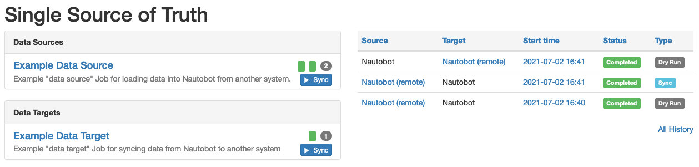
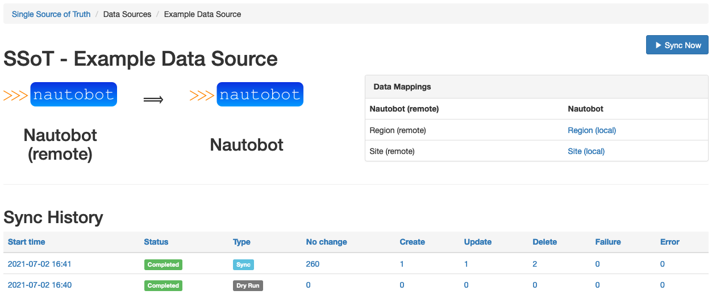
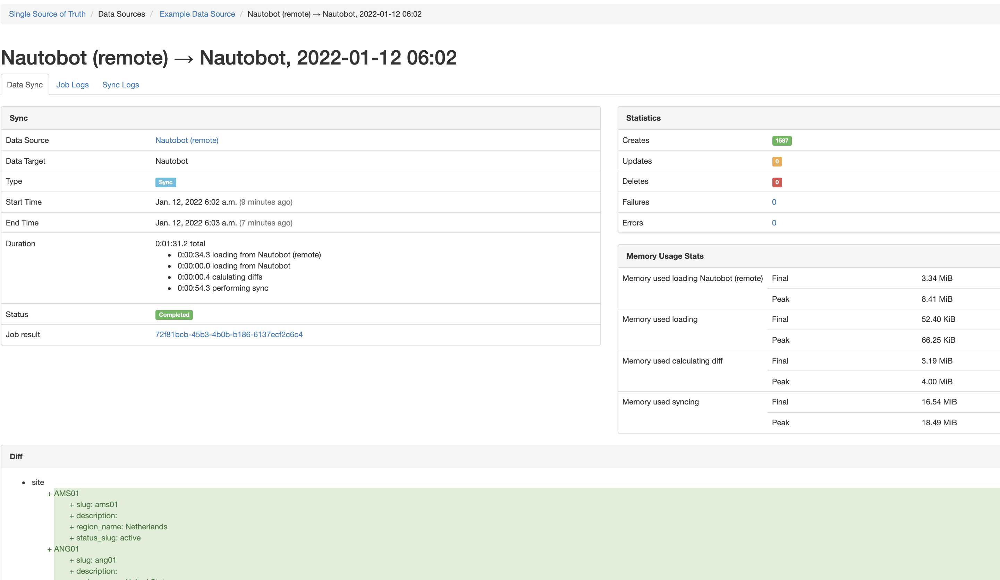

# Nautobot Single Source of Truth (SSoT)

A plugin for [Nautobot](https://github.com/nautobot/nautobot). This plugin facilitates integration and data synchronization between various "source of truth" (SoT) systems, with Nautobot acting as a central clearinghouse for data - a Single Source of Truth, if you will.

## Installation

The plugin is available as a Python package in PyPI and can be installed with `pip`:

```shell
pip install nautobot-ssot
```

> This plugin is compatible with Nautobot 1.0.3 and higher.

To ensure Nautobot Single Source of Truth is re-installed during future upgrades, create a file named `local_requirements.txt` (if not already existing) in the Nautobot root directory and list the `nautobot-ssot` package in this file:

```shell
$ echo nautobot-ssot >> local_requirements.txt
```

Once installed, the plugin needs to be enabled in your `nautobot_config.py`:

```python
# In your nautobot_config.py
PLUGINS = ["nautobot_ssot"]

PLUGINS_CONFIG = {
    "nautobot_ssot": {
        "hide_example_jobs": False,  # defaults to False if unspecified
    }
}
```

The plugin behavior can be controlled with the following list of settings:

- `"hide_example_jobs"`: By default this plugin includes a pair of example data source / data target jobs so that you can see how it works without installing any additional plugins to provide specific system integrations. Once you have installed or developed some "real" system integrations to work with this plugin, you may wish to hide the example jobs, which you may do by setting this configuration setting to `True`.

## Usage

Refer to the [documentation](./docs/index.md) for usage details.

## Questions

For any questions or comments, please check the [FAQ](FAQ.md) first and feel free to swing by the [Network to Code slack channel](https://networktocode.slack.com/) (channel #networktocode).
Sign up [here](http://slack.networktocode.com/)

## Screenshots






