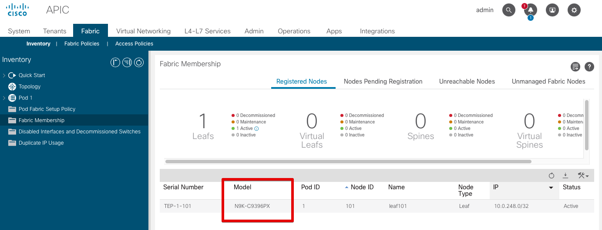

# Cisco ACI Integration Setup

This guide will walk you through steps to set up Cisco ACI integration with the `nautobot_ssot` app.

## Prerequisites

Before configuring the integration, please ensure, that `nautobot-ssot` app was [installed with the ACI integration extra dependencies](../install.md#install-guide).

```shell
pip install nautobot-ssot[aci]
```

## Configuration

!!! note
    Legacy configuration settings defined in `nautobot_config.py` for `aci_apics` is now deprecated. All information related to communicating to an APIC has been updated to use the Controller and its related ExternalIntegration objects.

Integration behavior can be controlled with the following settings:

| Setting Name<br>(* required) | Type | Description |
|---|:---:|---|
| aci_tag* | _String_ | Tag which is created and applied to all <br>synchronized objects. |
| aci_tag_color* | _String_ | Hex color code used for the tag. |
| aci_tag_up* | _String_ | Tag indicating the state applied to synchronized <br>interfaces. |
| aci_tag_up_color* | _String_ | Tag color applied to the "UP" tag on interface <br>status. |
| aci_tag_down* | _String_ | Tag indicating the state applied to synchronized <br>interfaces. |
| aci_tag_down_color* | _String_ | Tag color applied to the "DOWN" tag on interface <br>status. |
| aci_manufacturer_name* | _String_ | Manufacturer name. Specifically existing, or a new <br>one with this name will be created. |
| aci_ignore_tenants* | _List[String]_ | List of ACI Tenants that should not be synchronized<br>from APIC. |
| aci_comments* | _String_ | Comment added to synchronized objects. |

Below is an example snippet from `nautobot_config.py` that demonstrates how to enable and configure Cisco ACI integration:

```python
PLUGINS_CONFIG = {
    "nautobot_ssot": {
        "enable_aci": True,
        # Tag which will be created and applied to all synchronized objects.
        "aci_tag": "ACI",
        "aci_tag_color": "0047AB",
        # Tags indicating state applied to synchronized interfaces.
        "aci_tag_up": "UP",
        "aci_tag_up_color": "008000",
        "aci_tag_down": "DOWN",
        "aci_tag_down_color": "FF3333",
        # Manufacturer name. Specify existing, or a new one with this name will be created.
        "aci_manufacturer_name": "Cisco",
        # Exclude any tenants you would not like to bring over from ACI.
        "aci_ignore_tenants": ["common", "mgmt", "infra"],
        # The below value will appear in the Comments field on objects created in Nautobot
        "aci_comments": "Created by ACI SSoT Integration",
    }
```

### Per-APIC settings

All APIC specific settings have been updated to use the Controller and related ExternalIntegration objects. The ExternalIntegration object that is assigned to the Controller will define the APIC base URL, user credentials, and SSL verification. It will also have a `tenant_prefix` key in the `extra_config` section of the ExternalIntegration to define the Tenant prefix.

The `aci_apics` setting from the `nautobot_config.py` file is no longer used and any configuration found for it will be automatically migrated into a Controller and an ExternalIntegration object.

## Nautobot Objects Affected by Settings

The Job form has been updated to allow specifying a Location for the imported objects. If that is left unspecified then the Location associated to the specified Controller will be used.

Tenants imported from ACI will be prefixed with the unique name specified by the corresponding `tenant_prefix` key in the Controller's associated ExternalIntegration `extra_config`. This uniquely identifies tenants which might have the same name, but belong to two different APIC clusters.

## Configuring Device Templates

To create a new Nautobot Device Type mapping to a specific ACI leaf or spine switch model you need to provide YAML file describing that model.  This model definition includes interface template with the ports and transceiver types (ex. 10GE SFP+) specification.

The YAML files need to be placed in the `nautobot_ssot/integrations/aci/diffsync/device-types` directory. Their names need to match the model name as it appears in the ACI Fabric Membership area of the APIC dashboard.

For example, given a Model name of `N9K-C9396PX` as shown below, the YAML file should be named `N9K-C9396PX.yaml`.



There are example YAML files for a few common switch models in `nautobot_ssot/integrations/aci/diffsync/device-types`, and additional ones can be downloaded [here](https://github.com/netbox-community/devicetype-library/tree/master/device-types/Cisco).

## Upgrading from `nautobot-plugin-ssot-aci` App

!!! warning
    When upgrading from `nautobot-plugin-ssot-aci` app, it's necessary to [avoid conflicts](../upgrade.md#potential-apps-conflicts).

- Uninstall the old app:
    ```shell
    pip uninstall nautobot-plugin-ssot-aci
    ```
- Upgrade the app with required extras:
    ```shell
    pip install --upgrade nautobot-ssot[aci]
    ```
- Fix `nautobot_config.py` by removing `nautobot_ssot_aci` from `PLUGINS` and merging app configuration into `nautobot_ssot`:
    ```python
    PLUGINS = [
        "nautobot_ssot",
        # "nautobot_ssot_aci"  # REMOVE THIS LINE
    ]

    PLUGINS_CONFIG = {
        # "nautobot_ssot_aci": {  REMOVE THIS APP CONFIGURATION
        #     MOVE CONFIGURATION TO `nautobot_ssot` SECTION
        #     "tag": "ACI",
        #     ...
        # }
        "nautobot_ssot": {
            # Enable Cisco ACI integration
            "enable_aci": True,
            # Following lines are moved from `nautobot_ssot_aci` and prefixed with `aci_`
            "aci_tag": "ACI",
            ...
        }
    }
    ```

!!! note
    Configuration keys are prefixed with `aci_`.

!!! note
    Other environment variables for this integration are prefixed with `NAUTOBOT_SSOT_ACI_`.
