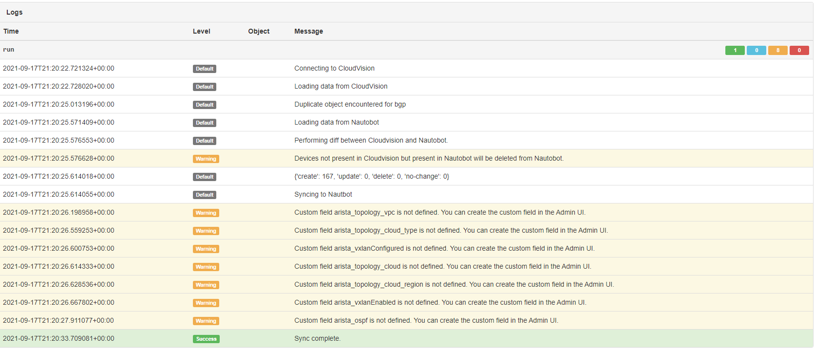

# Arista CloudVision Integration Setup

This guide will walk you through steps to set up Arista CloudVision integration with the `nautobot_ssot` app.

## Prerequisites

Before configuring the integration, please ensure, that `nautobot-ssot` app was [installed with Arista CloudVision integration extra dependencies](../install.md#install-guide).

```shell
pip install nautobot-ssot[aristacv]
```

## Configuration

Integration behavior can be controlled with the following settings:

| Configuration Variable | Type    | Usage                                                                                                 |
| ---------------------- | ------- | ----------------------------------------------------------------------------------------------------- |
| aristacv_cvp_host      | string  | Hostname or ip address of the onprem instance of CloudVision.                                         |
| aristacv_cvp_port      | string  | gRPC port (defaults to 8443, but this port has changed to 443 as of CVP 2021.3.0)                     |
| aristacv_cvp_user      | string  | The username used to connect to the on-prem instance of CloudVision.                                  |
| aristacv_cvp_password  | string  | The password used by the user specified above.                                                        |
| aristacv_cvp_token     | string  | Token to be used when connecting to CloudVision.                                                      |
| aristacv_verify        | boolean | If False, the integration will download the certificate from CloudVision and trust it for gRPC calls. |

To connect to a cloud instance of CloudVision you must set the following variable:

| Configuration Variable | Type   | Usage                                       | Default           |
| ---------------------- | ------ | ------------------------------------------- | ----------------- |
| aristacv_cvaas_url     | string | URL used to connect to your CvaaS instance. | www.arista.io:443 |

When syncing from CloudVis integration will create new Arista devices that do not exist in Nautobot. When creating new devices in Nautobot, a site, device role, device role color, device status, and device are required. You may define which values to use by configuring the following values in your `nautobot_config.py` file. If you define a `default_device_role` and `default_device_status` that already exist, the default color value for both of those will be ignored as it will pull that information from Nautobot.

| Configuration Variable                              | Type   | Usage                                                      | Default              |
| --------------------------------------------------- | ------ | ---------------------------------------------------------- | -------------------- |
| aristacv_from_cloudvision_default_site              | string | Default site created when syncing new devices to Nautobot. | cloudvision_imported |
| aristacv_from_cloudvision_default_device_role       | string | Default role created when syncing new devices to Nautobot. | network              |
| aristacv_from_cloudvision_default_device_role_color | string | Default role color used for default role.                  | ff0000               |

> When these variables are not defined in the app settings, the integration will use the default values mentioned.

When an Arista device exists in Nautobot but not in CloudVision, this integration can either delete or leave the device in Nautobot. That behavior can be set with the following variable in the `nautobot_config.py` file.

| Configuration Variable          | Type    | Usage                                                                                                                                                              | Default |
| ------------------------------- | ------- | ------------------------------------------------------------------------------------------------------------------------------------------------------------------ | ------- |
| aristacv_delete_devices_on_sync | boolean | If true, devices in Nautobot with device type manufacturer name set to Arista that do not exist in CloudVision but do exist in Nautobot upon sync will be deleted. | False   |

> When this variable is not defined in the app settings, the integration will default to using `False`.

Optionally, an import tag with the name `cloudvision_imported` can be applied to devices that are imported from CloudVision.

| Configuration Variable    | Type    | Usage                                                  | Default |
| ------------------------- | ------- | ------------------------------------------------------ | ------- |
| aristacv_apply_import_tag | boolean | Apply import tag to devices imported from CloudVision. | False   |

> If apply_import_tag is set to True, the tag value that is applied to devices is `cloudvision_imported`.

In addition, you can control whether only active devices are imported or whether all devices regardless of status are imported.

| Configuration Variable | Type    | Usage                                        | Default |
| ---------------------- | ------- | -------------------------------------------- | ------- |
| aristacv_import_active | boolean | Only import active devices from CloudVision. | False   |

There is also the option of having your CloudVision instance created within Nautobot and linked to the Devices managed by the instance. If the `create_controller` setting is `True` then a CloudVision Device will be created and Relationships created to the imported Devices from CVP. The `controller_site` setting allows you to specify the name of the Site you wish the Device to be created in. If this setting is blank a new CloudVision Site will be created and the Device will be placed in it.

| Configuration Variable     | Type    | Usage                                         | Default |
| -------------------------- | ------- | --------------------------------------------- | ------- |
| aristacv_create_controller | boolean | Create CloudVision Device in Nautobot.        | False   |
| aristacv_controller_site   | string  | The Site to associate with CloudVision Device.| ""      |

Finally, there is the option to parse device hostname's for codes that indicate the assigned site or device role. This is done through a combination of a few settings. First, the hostname_patterns setting defines a list of regex patterns that define your hostname structure. These patterns must include a named capture group using the `site` and `role` key to identify the portion of the hostname that indicates those pieces of data, ie `(?P<site>\w+)` and `(?P<role>\w+)`. Once those pieces are extracted they are then evaluated against the relevant map, ie the value for the `site` capture group is looked for in the `site_mappings` dictionary expecting the value to be a key with the map value being the name of the Site. If the Site doesn't exist it will be created in Staging status. For the Device Role, it will be created if it doesn't exist in Nautobot. Please note that the hostname is converted to all lowercase when the parsing is performed so the keys are expected to be all lowercase too.

| Configuration Variable     | Type      | Usage                                                      | Default |
| -------------------------- | --------- | ---------------------------------------------------------- | ------- |
| aristacv_hostname_patterns | List[str] | Define the portions of a hostname that indicate site/role. | []      |
| aristacv_site_mappings     | dict      | Define the site name associated with code in hostname.     | {}      |
| aristacv_role_mappings     | dict      | Define the role name associated with code in hostname.     | {}      |

> As the Device hostname is used as the identifier for Device objects any change in hostname implies a new Device and thus should trigger a deletion and creation of a new Device in Nautobot. For this reason, the hostname parsing feature is not done during updates and only at initial creation of the Device. If you need to correct the Site or Role for a Device after initial creation you will need to manually correct it or delete it and run the import Job again.

Below is an example snippet from `nautobot_config.py` that demonstrates how to enable and configure Arista CloudVision integration:

```python
PLUGINS_CONFIG = {
    "nautobot_ssot": {
        "enable_aristacv": True,
        "aristacv_cvp_token": os.getenv("NAUTOBOT_ARISTACV_TOKEN", ""),
        "aristacv_cvp_host": os.getenv("NAUTOBOT_ARISTACV_HOST", ""),
        "aristacv_cvp_port": os.getenv("NAUTOBOT_ARISTACV_PORT", 443),
        "aristacv_cvp_user": os.getenv("NAUTOBOT_ARISTACV_USERNAME", ""),
        "aristacv_cvp_password": os.getenv("NAUTOBOT_ARISTACV_PASSWORD", ""),
        "aristacv_verify": is_truthy(os.getenv("NAUTOBOT_ARISTACV_VERIFY", True)),
        "aristacv_from_cloudvision_default_site": "",
        "aristacv_from_cloudvision_default_device_role": "",
        "aristacv_from_cloudvision_default_device_role_color": "",
        "aristacv_delete_devices_on_sync": is_truthy(os.getenv("NAUTOBOT_ARISTACV_DELETE_ON_SYNC", False)),
        "aristacv_apply_import_tag": is_truthy(os.getenv("NAUTOBOT_ARISTACV_IMPORT_TAG", False)),
        "aristacv_import_active": is_truthy(os.getenv("NAUTOBOT_ARISTACV_IMPORT_ACTIVE", False)),
        "aristacv_create_controller": is_truthy(os.getenv("NAUTOBOT_ARISTACV_CREATE_CONTROLLER", False)),
        "aristacv_controller_site": os.getenv("NAUTOBOT_ARISTACV_CONTROLLER_SITE", ""),
        "aristacv_hostname_patterns": [""],
        "aristacv_site_mappings": {},
        "aristacv_role_mappings": {},
    }
```

!!! note
    All integration settings are defined in the block above as an example. Only some will be needed as described below.

Upon installation, this integration creates the following custom fields in Nautobot:

- `arista_bgp`
- `arista_eos`
- `arista_eostrain`
- `arista_mlag`
- `arista_mpls`
- `arista_pim`
- `arista_pimbidir`
- `arista_sflow`
- `arista_systype`
- `arista_tapagg`
- `arista_terminattr`
- `arista_topology_network_type`
- `arista_topology_type`
- `arista_ztp`

> While these contain the prefix "arista" in the custom field admin portal, when looking at them on a device the prefix is removed.

Other custom fields may need to be created by the user. When a sync is run and a system tag for a device in CloudVision is found without a corresponding custom field, the sync log will display a message. To have that data synced, a custom field must be created in the Admin UI using the given name in the message.



## Upgrading from `nautobot-plugin-ssot-aristacv` App

!!! warning
    When upgrading from `nautobot-plugin-ssot-aristacv` app, it's necessary to [avoid conflicts](../upgrade.md#potential-apps-conflicts).

- Uninstall the old app:
    ```shell
    pip uninstall nautobot-plugin-ssot-aristacv
    ```
- Upgrade the app with required extras:
    ```shell
    pip install --upgrade nautobot-ssot[aristacv]
    ```
- Fix `nautobot_config.py` by removing `nautobot_ssot_aristacv` from `PLUGINS` and merging app configuration into `nautobot_ssot`:
    ```python
    PLUGINS = [
        "nautobot_ssot",
        # "aristacv"  # REMOVE THIS LINE
    ]

    PLUGINS_CONFIG = {
        # "nautobot_ssot_aristacv": {  REMOVE THIS APP CONFIGURATION
        #     MOVE CONFIGURATION TO `nautobot_ssot` SECTION
        #     "cvp_token": os.getenv("NAUTOBOT_ARISTACV_TOKEN", ""),
        #     "cvp_host": os.getenv("NAUTOBOT_ARISTACV_HOST", ""),
        #     "cvp_port": os.getenv("NAUTOBOT_ARISTACV_PORT", 443),
        #     "cvp_user": os.getenv("NAUTOBOT_ARISTACV_USERNAME", ""),
        #     "cvp_password": os.getenv("NAUTOBOT_ARISTACV_PASSWORD", ""),
        #     "verify": is_truthy(os.getenv("NAUTOBOT_ARISTACV_VERIFY", True)),
        #     "from_cloudvision_default_site": "",
        #     "from_cloudvision_default_device_role": "",
        #     "from_cloudvision_default_device_role_color": "",
        #     "delete_devices_on_sync": is_truthy(os.getenv("NAUTOBOT_ARISTACV_DELETE_ON_SYNC", False)),
        #     "apply_import_tag": is_truthy(os.getenv("NAUTOBOT_ARISTACV_IMPORT_TAG", False)),
        #     "import_active": is_truthy(os.getenv("NAUTOBOT_ARISTACV_IMPORT_ACTIVE", False)),
        #     "create_controller": is_truthy(os.getenv("NAUTOBOT_ARISTACV_CREATE_CONTROLLER", False)),
        #     "controller_site": os.getenv("NAUTOBOT_ARISTACV_CONTROLLER_SITE", ""),
        #     "hostname_patterns": [""],
        #     "site_mappings": {},
        #     "role_mappings": {},
        # }
        "nautobot_ssot": {
            # Enable Arista CloudVision integration
            "enable_aristacv": True,
            # Following lines are moved from `nautobot_ssot_aristacv` and prefixed with `aristacv_`
            "aristacv_cvp_token": os.getenv("NAUTOBOT_ARISTACV_TOKEN", ""),
            "aristacv_cvp_host": os.getenv("NAUTOBOT_ARISTACV_HOST", ""),
            "aristacv_cvp_port": os.getenv("NAUTOBOT_ARISTACV_PORT", 443),
            "aristacv_cvp_user": os.getenv("NAUTOBOT_ARISTACV_USERNAME", ""),
            "aristacv_cvp_password": os.getenv("NAUTOBOT_ARISTACV_PASSWORD", ""),
            "aristacv_verify": is_truthy(os.getenv("NAUTOBOT_ARISTACV_VERIFY", True)),
            "aristacv_from_cloudvision_default_site": "",
            "aristacv_from_cloudvision_default_device_role": "",
            "aristacv_from_cloudvision_default_device_role_color": "",
            "aristacv_delete_devices_on_sync": is_truthy(os.getenv("NAUTOBOT_ARISTACV_DELETE_ON_SYNC", False)),
            "aristacv_apply_import_tag": is_truthy(os.getenv("NAUTOBOT_ARISTACV_IMPORT_TAG", False)),
            "aristacv_import_active": is_truthy(os.getenv("NAUTOBOT_ARISTACV_IMPORT_ACTIVE", False)),
            "aristacv_create_controller": is_truthy(os.getenv("NAUTOBOT_ARISTACV_CREATE_CONTROLLER", False)),
            "aristacv_controller_site": os.getenv("NAUTOBOT_ARISTACV_CONTROLLER_SITE", ""),
            "aristacv_hostname_patterns": [""],
            "aristacv_site_mappings": {},
            "aristacv_role_mappings": {},
        }
    }
    ```

!!! note
    Configuration keys are prefixed with `aristacv_`.
