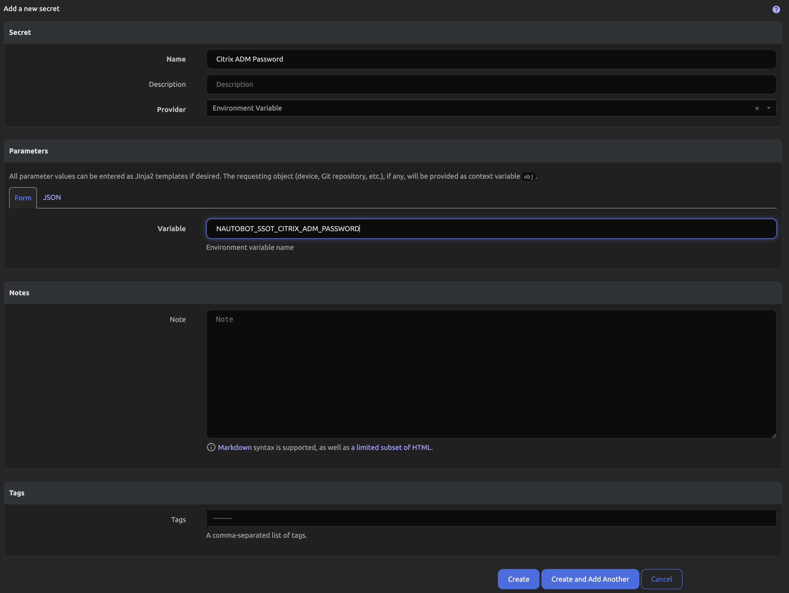
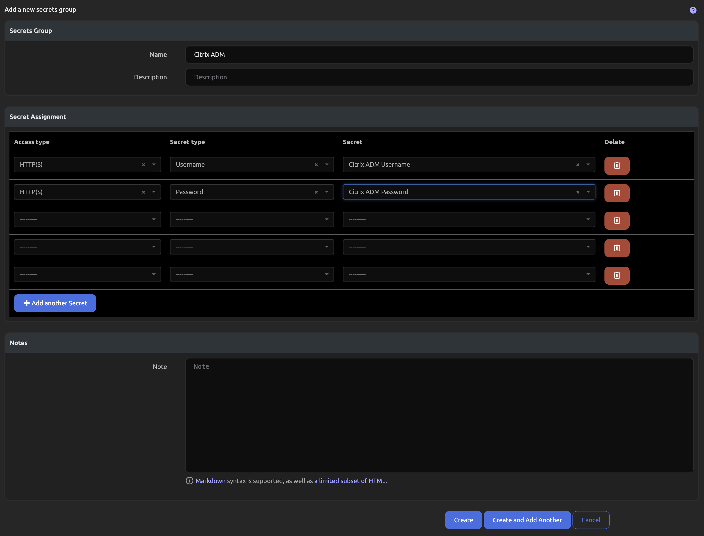
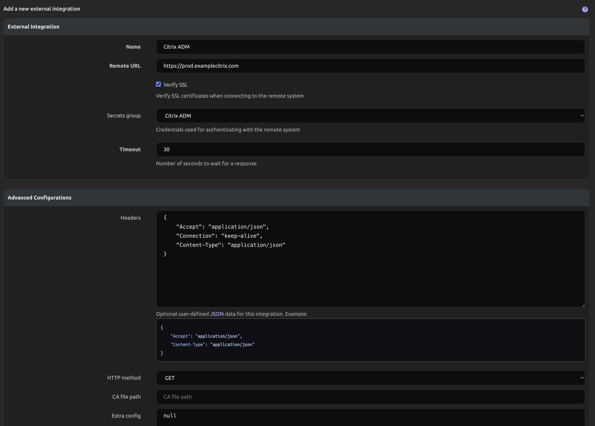

# Citrix ADM Integration Setup

This guide will walk you through the steps to set up Citrix ADM integration with the `nautobot_ssot` app.

## Prerequisites

Before configuring the integration, please ensure, that the `nautobot-ssot` app was [installed with the Citrix ADM integration extra dependencies](../install.md#install-guide).

```shell
pip install nautobot-ssot[citrix-adm]
```

## Configuration

Access to your Citrix ADM instance is defined using the [ExternalIntegration](https://docs.nautobot.com/projects/core/en/stable/user-guide/platform-functionality/externalintegration/) model which allows you to utilize this integration with multiple instances concurrently. Please bear in mind that it will synchronize all data 1:1 with the specified instance to match exactly, meaning it will delete data missing from an instance. Each ExternalIntegration must specify a SecretsGroup with Secrets that contain the Citrix ADM Username and Password to authenticate with. You can find Secrets and SecretsGroups available under the Secrets menu.






The Secrets Group linked to the Citrix ADM ExternalIntegration must contain Secrets defined as per the below:

| Access Type | Secret Type |
| ----------- | ----------- |
| HTTP(S)     | Username    |
| HTTP(S)     | Password    |

Once the SecretsGroup is created you'll need to create the ExternalIntegration. You'll find this under the Extensibility menu.



> The only required portions are the Name, Remote URL, Verify SSL, and Secrets Group.

When utilizing multiple SSoT integrations that contain differing Locations you might want to ensure that your existing Locations aren't updated by another integration. You can control whether these updates are made with the `citrix_adm_update_sites` setting in your `nautobot_config.py` file.

| Configuration Variable                              | Type    | Usage                                                      | Default              |
| --------------------------------------------------- | ------- | ---------------------------------------------------------- | -------------------- |
| citrix_adm_update_sites                             | boolean | Whether to update loaded Datacenter Locations.             | True                 |

Below is an example snippet from `nautobot_config.py` that demonstrates how to enable and configure the Citrix ADM integration:

```python
PLUGINS_CONFIG = {
    "nautobot_ssot": {
        "enable_citrix_adm": is_truthy(os.getenv("NAUTOBOT_SSOT_ENABLE_CITRIX_ADM", "true")),
        "citrix_adm_update_sites": os.getenv("NAUTOBOT_SSOT_CITRIX_ADM_UPDATE_SITES", "true"),
    }
```

Once the integration has been enabled you can find instructions on using it in the [Usage instructions](../../user/integrations/citrix_adm.md#usage).
