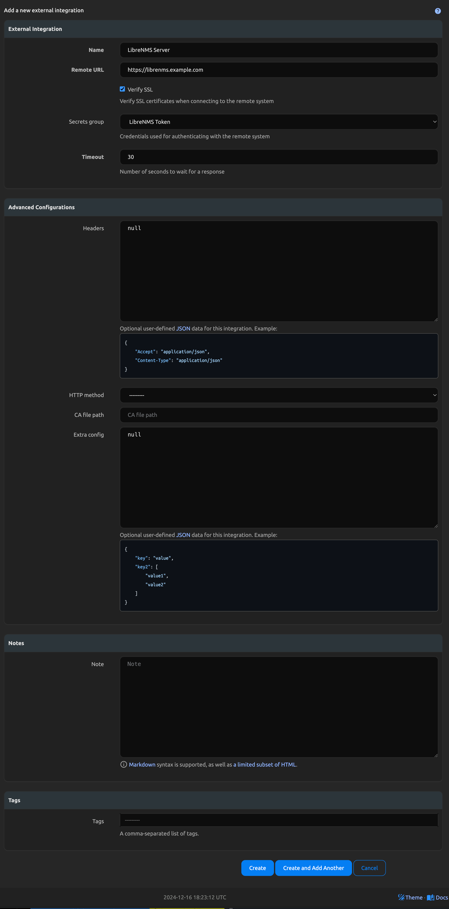

# LibreNMS

## Description

This App will sync data from the LibreNMS API into Nautobot to create Device and IPAM inventory items. Most items will receive a custom field associated with them called "System of Record", which will be set to "LibreNMS" (or whatever you set the `NAUTOBOT_SSOT_LIBRENMS_SYSTEM_OF_RECORD` environment variable to). These items are then the only ones managed by the LibreNMS SSoT App. Other items within the Nautobot instance will not be affected unless there's items with overlapping names. If an item exists in Nautobot by it's identifiers but it does not have the "System of Record" custom field on it, the item will be updated with "LibreNMS" (or `NAUTOBOT_SSOT_LIBRENMS_SYSTEM_OF_RECORD` environment variable value) when the App runs. This way no duplicates are created, and the App will not delete any items that are not defined in the LibreNMS API data but were manually created in Nautobot.

## Installation

Before configuring the integration, please ensure, that `nautobot-ssot` app was [installed with LibreNMS integration extra dependencies](../install.md#install-guide).

```shell
pip install nautobot-ssot[librenms]
```

## Configuration
Once the SSoT package has been installed you simply need to enable the integration by setting `enable_librenms` to True.

```python
PLUGINS = ["nautobot_ssot"]

PLUGINS_CONFIG = {
  "nautobot_ssot": {
        # Other nautobot_ssot settings omitted.
        "enable_librenms": is_truthy(os.getenv("NAUTOBOT_SSOT_ENABLE_LIBRENMS", "true")),
        "librenms_allow_ip_hostnames": is_truthy(os.getenv("NAUTOBOT_SSOT_LIBRENMS_ALLOW_IP_HOSTNAMES", "false")),
        "librenms_permitted_values": {  # Allows the SSOT to only sync certain values from LibreNMS
            "role": ["network"],
        },
  }
}
```

### External Integrations


#### LibreNMS as DataSource
The way you add your LibreNMS server instance is through the "External Integrations" objects in Nautobot. First, create a secret in Nautobot with your LibreNMS API token using an Environment Variable (or sync via secrets provider). Then create a SecretsGroup object and select the Secret you just created and set the Access Type to `HTTP(S)` and the Secret Type to `Token`.

Once this is created, go into the Extensibility Menu and select `External Integrations`. Add an External Intergration with the Remote URL being your LibreNMS server URL (including http(s)://), set the method to `GET`, and select any other headers/settings you might need for your specific instance. Select the secrets group you created as this will inject the API token. Once created, you will select this External Integration when you run the LibreNMS to Nautobot SSoT job.



##### Device Secrets Group

The `LibreNMS to Nautobot` job has a second, optional Secrets Group field, `Device Secrets Group`. This one is separate from the API token group above and serves a different purpose: it is assigned to each Device the job creates, and holds the credentials used to log in to the device itself.

Devices need this because credential-dependent jobs read it off the Device. nautobot-device-onboarding's `Sync Network Data From Network`, for example, has no credentials field on its own form and resolves credentials only from `Device.secrets_group`; without it, the job fails with `A paramiko SSHException occurred during connection creation: No authentication methods available`.

To build it, create Secrets for your network service account's username and password, then create a SecretsGroup and add both with the Access Type set to `Generic` and the Secret Types set to `Username` and `Password` respectively. That is the combination `nautobot-plugin-nornir` reads when resolving device credentials.

Leaving the field blank is supported; Devices are then created without a Secrets Group, as before.

#### LibreNMS as DataTarget
NotYetImplemented


### LibreNMS API
An API key with global read-only permissions is the minimum needed to sync information from LibreNMS.


### Field Validation

Name, Role, DeviceType, Location, and Platform fields must have a populated string.  Cannot be None or an empty value.
