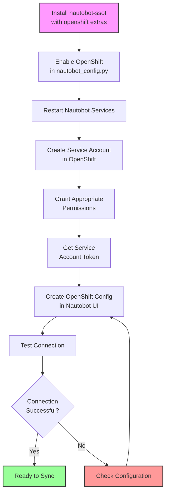
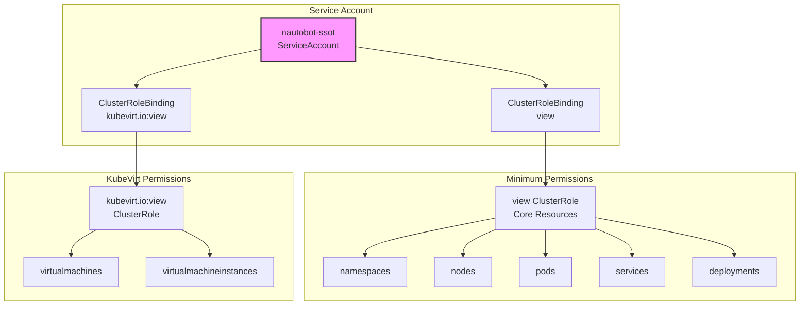

# OpenShift Integration Setup

This guide will walk you through the steps to set up Red Hat OpenShift integration with the `nautobot_ssot` app.

## Prerequisites

The OpenShift integration requires the Kubernetes Python client and optionally the OpenShift client. Install `nautobot-ssot` with the OpenShift extras:

```shell
pip install nautobot-ssot[openshift]
```

Alternatively, add the dependency to your `pyproject.toml`:

```toml
[tool.poetry.dependencies]
nautobot-ssot = { version = "^3.0", extras = ["openshift"] }
```

Next, enable the integration by adding the key `enable_openshift` with the value `True` to the `nautobot_ssot` section of your `nautobot_config.py`:

```python
PLUGINS_CONFIG = {
    "nautobot_ssot": {
        "enable_openshift": True,
    }
}
```

## Configuration Flow



## Configuration

Configuration for the OpenShift integration is defined in the instance of the `SSOTOpenshiftConfig` model. Multiple configuration instances are supported. Synchronization jobs take the `Config` parameter which specifies the configuration instance to use.

To access integration configuration navigate to `Apps -> Installed Apps` and click on the cog icon in the `Single Source of Truth` entry. Then, in the table `SSOT Integration Configs` click on the `OpenShift Configuration Instance` link. This will take you to the view where you can view/modify existing config instances or create new ones.

Configuration instances contain the below settings:

| Setting                   | Default | Description                                                                                              |
| :------------------------ | :------ | :------------------------------------------------------------------------------------------------------- |
| Name                      | N/A     | Unique name of the configuration instance.                                                               |
| Description               | N/A     | Description of the configuration instance.                                                               |
| OpenShift API URL         | N/A     | The URL of the OpenShift API server (e.g., https://api.cluster.example.com:6443)                        |
| API Token                 | N/A     | Service account token for authentication                                                                 |
| Verify SSL                | True    | Verify SSL certificates when connecting to OpenShift                                                     |
| Sync Namespaces/Projects  | True    | Import OpenShift projects as Nautobot tenants                                                          |
| Sync Nodes                | True    | Import OpenShift nodes as Nautobot devices                                                             |
| Sync Containers           | True    | Import container workloads as Nautobot applications                                                     |
| Sync Deployments          | True    | Import OpenShift deployments as Nautobot applications                                                  |
| Sync Services             | True    | Import OpenShift services as Nautobot services                                                         |
| Sync KubeVirt VMs         | True    | Import KubeVirt virtual machines as Nautobot VMs (requires KubeVirt)                                    |
| Namespace Filter          | ""      | Regex pattern to filter namespaces (leave empty to sync all)                                           |
| Workload Types            | all     | Types of workloads to synchronize (all, containers, vms)                                               |

### Authentication Setup

The OpenShift integration uses service account tokens for authentication. To create a service account:

1. Create a service account in OpenShift:
```bash
oc create serviceaccount nautobot-ssot -n default
```

2. Grant appropriate permissions (adjust based on your security requirements):
```bash
# For read-only access to cluster resources
oc create clusterrolebinding nautobot-ssot-reader \
  --clusterrole=view \
  --serviceaccount=default:nautobot-ssot

# If syncing KubeVirt VMs, add permissions for virtualization resources
oc create clusterrolebinding nautobot-ssot-kubevirt \
  --clusterrole=kubevirt.io:view \
  --serviceaccount=default:nautobot-ssot
```

3. Get the service account token:
```bash
# OpenShift 4.x
oc create token nautobot-ssot -n default --duration=87600h

# Or create a long-lived token secret
oc apply -f - <<EOF
apiVersion: v1
kind: Secret
metadata:
  name: nautobot-ssot-token
  namespace: default
  annotations:
    kubernetes.io/service-account.name: nautobot-ssot
type: kubernetes.io/service-account-token
EOF

# Get the token
oc get secret nautobot-ssot-token -n default -o jsonpath='{.data.token}' | base64 -d
```

### KubeVirt Support

The integration automatically detects if KubeVirt is installed in your OpenShift cluster. When KubeVirt is available:

- Virtual machines created with KubeVirt will be synced as Nautobot Virtual Machines
- Regular container workloads will be synced as Nautobot Applications
- The integration intelligently differentiates between VM pods and container pods

If KubeVirt is not installed, the integration will operate in container-only mode.

### Workload Type Configuration

The `Workload Types` setting allows you to control what types of workloads are synchronized:

- **All Workloads** (default): Sync both containers and virtual machines
- **Containers Only**: Only sync container workloads (pods, deployments)
- **Virtual Machines Only**: Only sync KubeVirt virtual machines

## Custom Fields, Statuses and Tags

The OpenShift Integration creates the following Nautobot Custom Fields, Statuses and Tags automatically when Nautobot is started. Care should be taken to ensure these are not deleted.

### Custom Fields

- `Last Synced From OpenShift` - Records the last date an object was synced from OpenShift
- `OpenShift Namespace` - Stores the source namespace for synced objects
- `OpenShift UID` - Stores the unique identifier from OpenShift
- `KubeVirt VM` - Boolean field indicating if a VM was created via KubeVirt

### Statuses

The following statuses are created for various object types:

**Virtual Machine Statuses:**
- `Running` - VM is running
- `Stopped` - VM is stopped
- `Paused` - VM is paused
- `Migrating` - VM is being migrated

**Pod/Container Statuses:**
- `Running` - Pod is running
- `Pending` - Pod is pending
- `Failed` - Pod has failed
- `Succeeded` - Pod completed successfully
- `Unknown` - Pod status is unknown

### Tags

- `SSoT Synced from OpenShift` - Tag assigned to objects synced from OpenShift
- `KubeVirt VM` - Tag assigned to virtual machines created via KubeVirt
- `OpenShift Container` - Tag assigned to container workloads

## Permission Requirements



## Performance Considerations

When syncing large OpenShift clusters:

1. **Use Namespace Filtering**: Limit the sync scope using the namespace filter regex
2. **Selective Sync**: Disable sync options for resource types you don't need
3. **Workload Type Selection**: If you only need VMs or containers, select the appropriate workload type
4. **Schedule Off-Peak**: Run sync jobs during off-peak hours for large clusters

## Troubleshooting

### Connection Issues

If you encounter connection errors:

1. Verify the API URL is correct and accessible from Nautobot
2. Check the service account token is valid
3. Ensure SSL certificates are valid (or disable SSL verification for testing)
4. Verify network connectivity between Nautobot and OpenShift

### KubeVirt Detection

If KubeVirt VMs are not being detected:

1. Verify KubeVirt is installed: `oc get virtualmachines --all-namespaces`
2. Check service account has permissions for KubeVirt resources
3. Review job logs for KubeVirt API availability messages

### Sync Performance

For performance issues:

1. Enable debug logging to identify bottlenecks
2. Use namespace filtering to reduce scope
3. Consider splitting large syncs across multiple config instances
4. Monitor OpenShift API rate limits 

## Development and Testing

### Running Tests

The OpenShift integration includes a comprehensive test suite:

```bash
# Run all OpenShift integration tests
invoke unittest nautobot_ssot.tests.openshift

# Run specific test modules
invoke unittest nautobot_ssot.tests.openshift.test_openshift_client
invoke unittest nautobot_ssot.tests.openshift.test_models
invoke unittest nautobot_ssot.tests.openshift.test_kubevirt_utils
```

### Test Coverage

The test suite includes:
- **Client Tests**: API connection, KubeVirt detection, resource parsing
- **Model Tests**: Django model validation, field constraints
- **DiffSync Tests**: All DiffSync models (14 total) and adapters
- **Job Tests**: Sync job execution and data mappings
- **Mock Fixtures**: Sample API responses for projects, nodes, and VMs

### Development Environment

For development and testing:

1. Use mock fixtures to avoid requiring a real OpenShift cluster
2. Test KubeVirt detection logic with both VM and container workloads
3. Validate workload type filtering (all, containers only, VMs only)
4. Test namespace filtering with regex patterns

### Contributing

When contributing to the OpenShift integration:
- Add tests for any new functionality
- Update mock fixtures if adding new resource types
- Follow the existing patterns from other integrations (e.g., vSphere)
- Update documentation for any new features or configuration options 