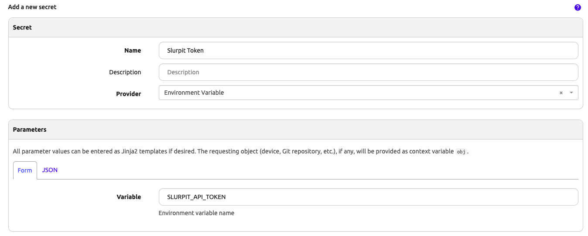
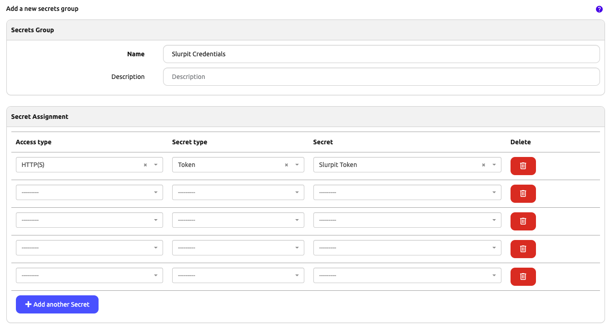
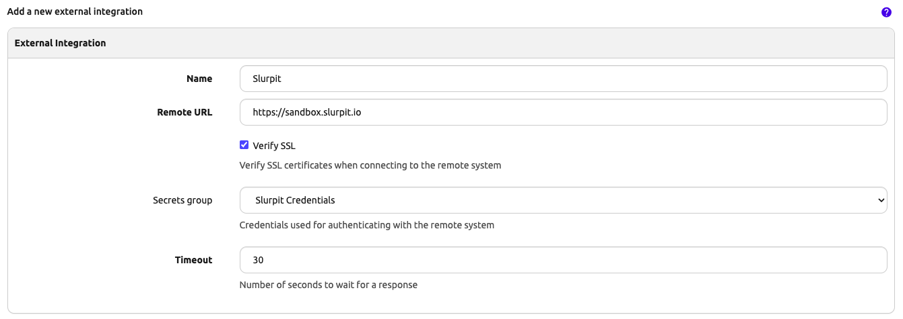

# Slurpit Integration Setup

This guide will walk you through steps to set up Slurpit integration with the `nautobot_ssot` app.

## Prerequisites

Before configuring the integration, please ensure, that `nautobot-ssot` app was [installed with Slurpit integration extra dependencies](../install.md#install-guide).

```shell
pip install nautobot-ssot[slurpit]
```

## Configuration

Access to your Slurpit instance is defined using the [ExternalIntegration](https://docs.nautobot.com/projects/core/en/stable/user-guide/platform-functionality/externalintegration/) model which allows you to utilize this integration with multiple instances concurrently. Each ExternalIntegration must specify a SecretsGroup that contains Secrets that contain the Slurpit token to authenticate against that instance. You can find Secrets and SecretsGroups available under the Secrets menu.





Please note that is it imperative for the SecretsGroup used for Slurpit uses HTTP(S) Access type and Token. Also note that the name of the Secrets or SecretsGroup are irrelevant but are recommended to be relevant to the Slurpit instance in question.

Once the SecretsGroup is created you'll need to create the ExternalIntegration. You'll find this under the Extensibility menu.



Below is an example snippet from `nautobot_config.py` that demonstrates how to enable and configure the Slurpit integration:

```python
PLUGINS_CONFIG = {
    "nautobot_ssot": {
        "enable_slurpit": is_truthy(os.getenv("NAUTOBOT_SSOT_ENABLE_SLURPIT")),
    }
```
