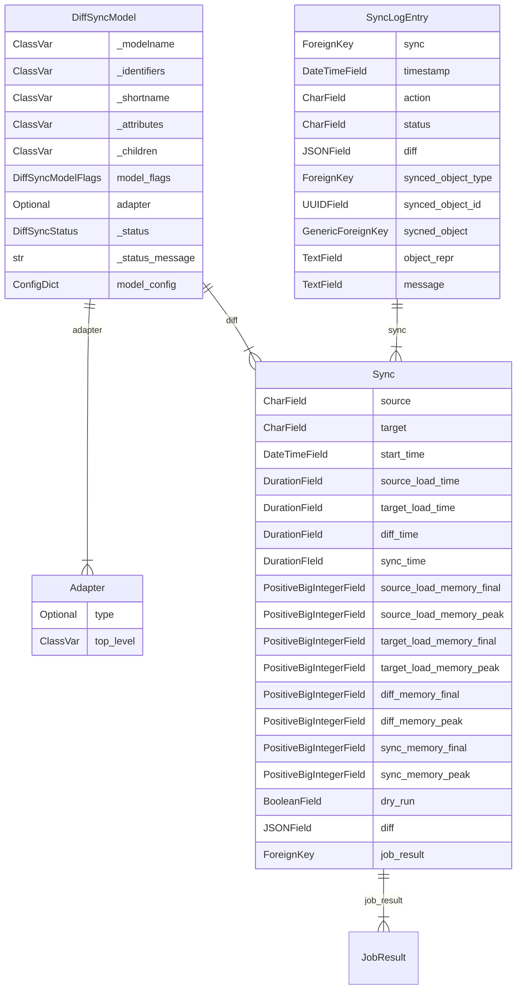

# Model Diagrams

To aide developers in understanding the various models and how they interoperate for the SSoT project.

```mermaid
erDiagram
DiffSyncModel{
    ClassVar _modelname
    ClassVar _identifiers
    ClassVar _shortname
    ClassVar _attributes
    ClassVar _children
    DiffSyncModelFlags model_flags
    Optional adapter
    DiffSyncStatus _status
    str _status_message
    ConfigDict model_config
}
Adapter{
    Optional type
    ClassVar top_level
}
Sync{
    CharField source
    CharField target
    DateTimeField start_time
    DurationField source_load_time
    DurationField target_load_time
    DurationField diff_time
    DurationFIeld sync_time
    PositiveBigIntegerField source_load_memory_final
    PositiveBigIntegerField source_load_memory_peak
    PositiveBigIntegerField target_load_memory_final
    PositiveBigIntegerField target_load_memory_peak
    PositiveBigIntegerField diff_memory_final
    PositiveBigIntegerField diff_memory_peak
    PositiveBigIntegerField sync_memory_final
    PositiveBigIntegerField sync_memory_peak
    BooleanField dry_run
    JSONField diff
    ForeignKey job_result
}
SyncLogEntry{
    ForeignKey sync
    DateTimeField timestamp
    CharField action
    CharField status
    JSONField diff
    ForeignKey synced_object_type
    UUIDField synced_object_id
    GenericForeignKey sycned_object
    TextField object_repr
    TextField message
}
DiffSyncModel||--|{Sync : diff
DiffSyncModel||--|{Adapter : adapter
SyncLogEntry||--|{Sync : sync
Sync||--|{JobResult : job_result
```
