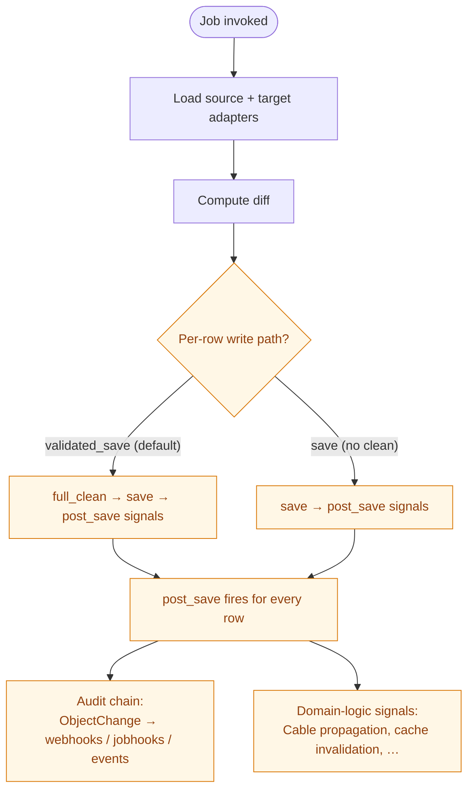

# SSoT Performance & Validation Menu

Nautobot SSoT and DiffSync provide a straightforward ETL (Extract, Transform,
Load) framework with many features out of the box. ETL is not a new idea, so
the goal isn't to invent a new technology — it's to provide structure and
best practices around one. The platform's default behavior follows a KISS
(Keep It Simple, Stupid) approach: the slow, safe, boring path that's
correct out of the box. With that approach and the breadth of features
available, there are — as always — tradeoffs worth considering.

These features aren't always easy to understand, and their performance
implications (wall-clock time, CPU, memory, I/O) aren't always obvious from
the API surface. The most common pattern for loading data into Nautobot
includes the following:

* Every object is validated for correctness
* Every object creates a changelog entry tracking the change
* Every object dispatches webhooks
* Every object fires job hooks
* Every object publishes an event
* Some objects fire additional Django signals for:
    * Cache invalidation
    * Data cleanup
    * Other custom business logic
* All data is committed together, or none of it is (atomic transactions)
* The ability to run in dry-run mode
* The ability to track changes per job run

Some — or even all — of these features may not be needed for your
implementation. For example, if you're migrating from a legacy system
where data ownership is not yet established, do you really need a changelog?
Do you want webhooks firing if you're syncing thousands of records in one
go?

Sometimes the answer is a resounding yes; other times a clean no. Sometimes
you want most of these features but are willing to trade a slightly weaker
correctness guarantee for speed. Sometimes you already know the data is
valid and don't need to validate it again. There are many reasons to choose
speed over the KISS default — and this document is intended to make those
decisions clear, and to show you how each one can be implemented.

---

## How to read this doc

* **Part 1 — the anatomy of a sync** lays out what fires per object today
  and frames each downstream effect as a knob you can dial.
* **Part 2 — the axes** is one chapter per behavioral knob. Each chapter
  follows the same shape: *what it controls, default behavior, when you'd
  dial it, alternatives, cost & tradeoffs, how to wire it*. Skip to the
  axis you care about.
* **Part 3 — composing it** offers pre-mixed presets, the measured matrix,
  and a per-integration recipe for adding the menu to a new SSoT
  integration.

This document grows alongside the codebase. Each axis is added as the
feature that backs it lands. Today only the baseline behavior ships;
later commits add bulk writes, validation hooks, streaming, scope, and
the rest.

### The benchmark substrate

Every claim in this document is measured. The bundled benchmark
(`scripts/benchmark_infoblox.py --matrix`) exercises every available
mode at three scales — tiny / small / medium (8,143 objects) — and
prints a TOTAL-time pivot table per scale. Re-run via:

```bash
./scripts/run_benchmark_matrix.sh
```

Inside the dev container, `scripts/_bench_env.sh` exports the env
variables (DB / Redis hosts, password, settings module) needed to run
the benchmark against the local instance. All numbers in this document
are from medium scale.

The "audit chain" column in the measured matrix tracks whether each
mode produces ObjectChange rows and fires webhooks/jobhooks/events —
that distinction matters more than raw speed for many integrations.

Today's matrix has five modes covering the production-shaped baselines:
`validated_save`, `validated_save_no_cl`, `save`, `save_immediate_cl`,
`save_deferred_cl`. Future commits add bulk and streaming modes.

---

## Part 1 — The anatomy of a sync



Every yellow node above is a knob. The default path is the leftmost —
the KISS guarantee. Future commits add additional branches (bulk
writes, streaming, validation hooks). The rest of Part 2 walks through
each axis individually.

---

## Part 2 — The axes

The chapters below grow as the feature set grows. Today only the
baselines that come with vanilla DiffSync are described; subsequent
commits add new axes for bulk writes, validation, streaming, scoped
sync, and more.

### Dry-run

**What it controls.** Whether the sync writes or just computes the diff.

**Default behavior.** Dry-run is on by default in the Job UI (per
`DryRunVar` default). Engineers should explicitly turn it off to commit
writes.

**When you'd dial it.** Always on for the first run when wiring up a
new sync. Off for production runs.

**Alternatives.** On / off (the `DryRunVar`).

**Cost & tradeoffs.** Dry-run runs the load + diff phases and skips the
write phase. Same cost as a full sync minus the writes. Useful for
preview, capacity planning, and CI smoke tests.

**How to wire it.** `dryrun=True` on the Job — provided by the standard
`DataSyncBaseJob` base class.
