# SSoT Performance & Validation Menu

Nautobot SSoT and DiffSync provide a straightforward ETL (Extract, Transform,
Load) framework with many features out of the box. The platform's default
behavior follows a KISS approach: the slow, safe, boring path. There are —
as always — tradeoffs worth considering.

The most common pattern for loading data into Nautobot includes:

* Every object is validated for correctness
* Every object creates a changelog entry tracking the change
* Every object dispatches webhooks
* Every object fires job hooks
* Every object publishes an event
* Some objects fire additional Django signals for cache invalidation,
  data cleanup, and other custom business logic
* All data is committed together, or none of it is (atomic transactions)
* The ability to run in dry-run mode
* The ability to track changes per job run

Some — or even all — of these features may not be needed for your
implementation. There are many reasons to choose speed over the KISS
default — and this document is intended to make those decisions clear.

---

## How to read this doc

* **Part 1** — anatomy of a sync.
* **Part 2** — one chapter per axis (knob).
* **Part 3** — pre-mixed presets, measured matrix, per-integration recipe.
* For mechanical contracts (`SSoTFlags`, where the code lives), see
  [Performance & Validation Reference][ref].

[ref]: performance_validation_reference.md

This document grows alongside the codebase.

### The benchmark substrate

The bundled benchmark (`scripts/benchmark_infoblox.py --matrix`)
exercises every available mode at three scales — tiny / small / medium
(8,143 objects). All numbers are from medium scale.

### Composable flag word

`nautobot_ssot.flags.SSoTFlags` is the single composable knob word.
Bits 0..3 mirror `diffsync.enum.DiffSyncFlags`. Default is
`CONTINUE_ON_FAILURE | LOG_UNCHANGED_RECORDS`.

---

## Part 1 — The anatomy of a sync

```mermaid
flowchart TD
    Job([Job invoked]) --> Q1{streaming?}

    Q1 -->|No — legacy| L1[load src + dst<br/>both fully in memory]
    L1 --> L2[diff_to&#40;&#41; — build DiffSync Diff tree]
    L2 --> L3[sync_to&#40;&#41;]
    L3 --> Done([Done])

    Q1 -->|Yes — streaming| Q2{strict source?}
    Q2 -->|Yes| H1[Hook 1: Pydantic validators<br/>fire on DiffSyncModel __init__]
    Q2 -->|No| S_src
    H1 --> S_src

    S_src[load src adapter] --> D_src{validate_on_dump?}
    D_src -->|Yes| H2[Hook 2: clean_fields per row<br/>via dst.to_orm_kwargs]
    D_src -->|No| Sd_src
    H2 --> Sd_src
    Sd_src[dump src to SQLite<br/>release adapter store] --> L_dst[load dst adapter]
    L_dst --> Sd_dst[dump dst to SQLite]
    Sd_dst --> Diff[StreamingDiffer:<br/>walk SQLite -> diff_results]
    Diff --> Replay[BulkSyncer replays<br/>tier1 or tier2]
    Replay --> Done

    classDef knob fill:#fff7e6,stroke:#d97706,color:#92400e
    class Q1,Q2,H1,H2,D_src,L1,L3,S_src,Sd_src,Sd_dst,Diff,Replay knob
```



---

## Part 2 — The axes

### Validation

**What it controls.** What gets checked about each row, when, and how
expensively, before the row reaches the database.

**Default behavior.** `validated_save()` runs Django's `full_clean()`
on every row before INSERT. Cost ~1.7 ms/row.

**Alternatives (sub-axes).**

| Sub-axis | When it runs | Cost | Activated by |
|---|---|---|---|
| **Source-shape** (Pydantic) | At `adapter.load()`, before diff | µs/row | Per-integration: `IPAMShapeValidationMixin` + `Strict<Adapter>` |
| **Per-field** (`clean_fields()`) | At dump time, no DB round-trip | 10–20 µs/row | `SSoTFlags.VALIDATE_ON_DUMP` (streaming pipeline) + `to_orm_kwargs()` resolver on the target adapter |
| **Model `clean()`** | Per row inside `validated_save()` | ~1.7 ms/row | Default |
| **Relational** (validator registry) | Phase A (pre-flush) / B (between flushes) / C (post-flush) | depends; e.g. IP-in-prefix Phase B ≈ 37 µs/row | `SSoTFlags.VALIDATE_RELATIONS`; validators registered on the adapter via `validator_registry` class attr |
| **Batched `bulk_clean()`** | Once per flush stage | depends on the model | `SSoTFlags.BULK_CLEAN`; **no-op until Nautobot core ships `Model.bulk_clean(instances)`** |
| **Strict failure mode** | Combines with above | — | `SSoTFlags.VALIDATE_STRICT` (raise instead of log) |

**How to wire relational (Hook 3).** Subclass `Validator` (in
`nautobot_ssot/utils/validator_registry.py`) and register on the
adapter's `validator_registry` class attribute. Phase A validators run
once before any flush; Phase B run between FK-ordered flushes; Phase C
run after. Shipped IPAM validators: `IPAddressContainmentValidator`
(Phase A), `VlanVidUniqueValidator` (Phase A), `IPInPrefixValidator`
(Phase B). For the registry contract see the reference doc.

**How to wire per-field (Hook 2).** The streaming pipeline calls the
target adapter's `to_orm_kwargs(model_type, ids, attrs)` to construct
a transient ORM instance and run `clean_fields(exclude=exclude_fields)`
— catches Nautobot domain errors (custom-field schema, value ranges)
without a DB round-trip. FK fields are excluded; DB constraints handle
FK validity at INSERT.

### Change logging — `ObjectChange` rows

Per-row immediate (default) / Deferred-batched
(`deferred_change_logging_for_bulk_operation`) / None (when
`bulk_create()` skips `post_save`).

### Webhooks / Job hooks / Events

Driven by `ObjectChange` creation. Disable changelog → none fire.

### Business-logic signals (post_save consumers)

Default per-row Django `post_save`. `bulk_create` skips them.
`SSoTFlags.REFIRE_POST_SAVE` re-fires per instance after bulk;
`SSoTFlags.BULK_SIGNAL` fires `bulk_post_*` once per FK stage.

### Atomic transactions

Per-Job atomic block by default; no SSoT-side knob.

### Bulk-write batching

`validated_save()` per row by default. `bulk_create` (default batch
250) via `BulkOperationsMixin` or `SSoTFlags.BULK_WRITES` in streaming.
~30× faster at medium. `bulk_b250_audit` restores full audit chain on
the bulk path.

### Memory shape

In-memory `Diff` tree (default, ~30 MiB at medium) vs SQLite-backed
streaming (~20 MiB at medium). `SSoTFlags.STREAMING` /
`SSoTFlags.STREAM_TIER2`.

### Concurrency

Sequential by default. `SSoTFlags.PARALLEL_LOADING` for concurrent
adapter loading.

### Dry-run

On by default. `DryRunVar`.

### Memory profiling

Off by default. `SSoTFlags.MEMORY_PROFILING` enables `tracemalloc`.

---

## Part 3 — Composing it

### Per-integration recipe (in progress)

#### Step 1 — Strict source models (optional)

```python
from nautobot_ssot.utils.diffsync_validators import IPAMShapeValidationMixin
from .base import MyIntPrefix, MyIntIPAddress

class StrictMyIntPrefix(IPAMShapeValidationMixin, MyIntPrefix):
    pass

class StrictMyIntAdapter(MyIntAdapter):
    prefix = StrictMyIntPrefix
```

#### Step 2 — Bulk write adapter (with optional Hook 2 resolver)

```python
from nautobot_ssot.utils.bulk import BulkOperationsMixin

class BulkNautobotMyIntAdapter(BulkOperationsMixin, NautobotMyIntAdapter):
    foo = BulkNautobotFoo
    bar = BulkNautobotBar
    _bulk_create_order = [OrmFoo, OrmBar]

    refire_post_save: bool = False
    bulk_signal: bool = False
    bulk_clean: bool = False

    # Optional Hook 2: per-field validation hook
    def to_orm_kwargs(self, model_type, ids, attrs):
        if model_type == "foo":
            return OrmFoo, {"field": ids["field"]}, []
        if model_type == "bar":
            return OrmBar, {"name": ids["name"]}, ["foo"]
        return None
```

For a working reference see Infoblox's
`StrictInfobloxAdapter` and `BulkNautobotAdapter`.
