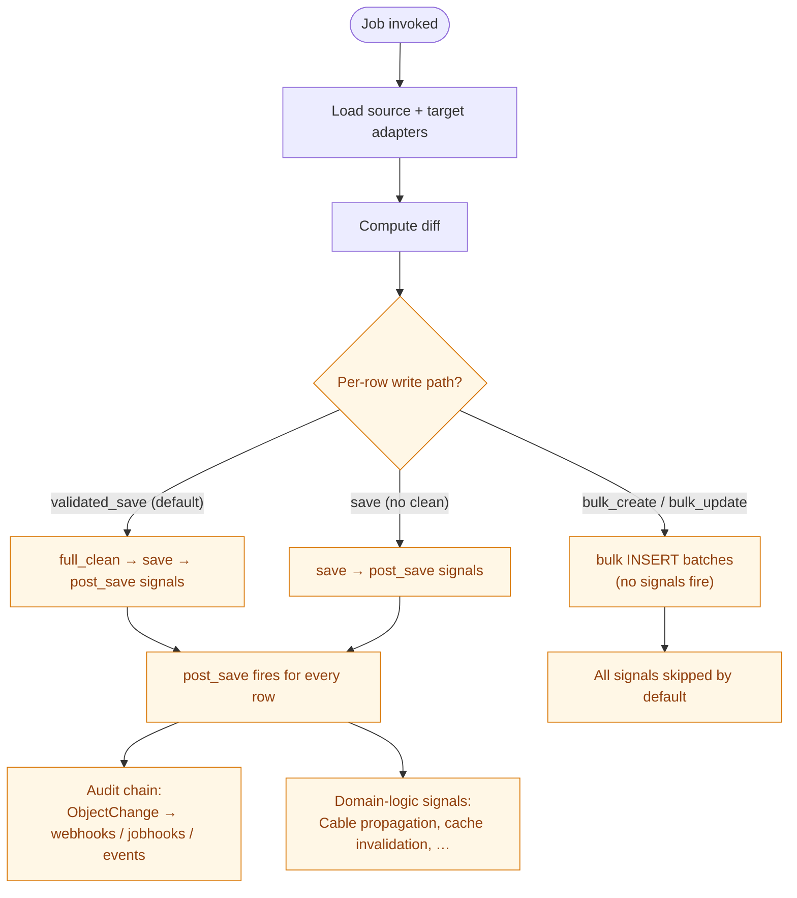

# SSoT Performance & Validation Menu

Nautobot SSoT and DiffSync provide a straightforward ETL (Extract, Transform,
Load) framework with many features out of the box. ETL is not a new idea, so
the goal isn't to invent a new technology — it's to provide structure and
best practices around one. The platform's default behavior follows a KISS
(Keep It Simple, Stupid) approach: the slow, safe, boring path that's
correct out of the box. With that approach and the breadth of features
available, there are — as always — tradeoffs worth considering.

These features aren't always easy to understand, and their performance
implications (wall-clock time, CPU, memory, I/O) aren't always obvious from
the API surface. The most common pattern for loading data into Nautobot
includes the following:

* Every object is validated for correctness
* Every object creates a changelog entry tracking the change
* Every object dispatches webhooks
* Every object fires job hooks
* Every object publishes an event
* Some objects fire additional Django signals for:
    * Cache invalidation
    * Data cleanup
    * Other custom business logic
* All data is committed together, or none of it is (atomic transactions)
* The ability to run in dry-run mode
* The ability to track changes per job run

Some — or even all — of these features may not be needed for your
implementation. For example, if you're migrating from a legacy system
where data ownership is not yet established, do you really need a changelog?
Do you want webhooks firing if you're syncing thousands of records in one
go?

Sometimes the answer is a resounding yes; other times a clean no. Sometimes
you want most of these features but are willing to trade a slightly weaker
correctness guarantee for speed. Sometimes you already know the data is
valid and don't need to validate it again. There are many reasons to choose
speed over the KISS default — and this document is intended to make those
decisions clear, and to show you how each one can be implemented.

---

## How to read this doc

* **Part 1 — the anatomy of a sync** lays out what fires per object today
  and frames each downstream effect as a knob you can dial.
* **Part 2 — the axes** is one chapter per behavioral knob.
* **Part 3 — composing it** offers pre-mixed presets, the measured matrix,
  and a per-integration recipe.
* For mechanical contracts (`SSoTFlags` enum, where the code lives), see
  the [Performance & Validation Reference][ref] document.

[ref]: performance_validation_reference.md

This document grows alongside the codebase. Each axis is added as the
feature that backs it lands.

### The benchmark substrate

Every claim in this document is measured. The bundled benchmark
(`scripts/benchmark_infoblox.py --matrix`) exercises every available
mode at three scales — tiny / small / medium (8,143 objects). All
numbers in this document are from medium scale.

The "audit chain" column in the measured matrix tracks whether each
mode produces ObjectChange rows and fires webhooks/jobhooks/events.

### Composable flag word

All SSoT pipeline + validation knobs live in a single `IntFlag` —
`nautobot_ssot.flags.SSoTFlags`. Compose with `|`. Bits 0..3 mirror
`diffsync.enum.DiffSyncFlags` exactly so the same flag word passes
through to `diff_to(flags=...)` / `sync_to(flags=...)` without
conversion. The Job UI exposes the single-bit flags as a single
`MultiChoiceVar` (replacing the legacy individual `BooleanVar`s for
`memory_profiling`, `parallel_loading`, etc.). For the bit table see
the reference doc.

The default is `CONTINUE_ON_FAILURE | LOG_UNCHANGED_RECORDS`,
preserving the historical diffsync behavior. Subclass overrides of
`run()` can OR additional bits onto `self.flags`.

---

## Part 1 — The anatomy of a sync



Every yellow node above is a knob. The default path is the leftmost —
the KISS guarantee. The rest of Part 2 walks each axis individually.

---

## Part 2 — The axes

### Change logging — `ObjectChange` rows

**What it controls.** Whether each create/update/delete writes an
`ObjectChange` row recording who changed what when.

**Default behavior.** Every `validated_save()` (or plain `save()`)
inside a `web_request_context` fires `post_save`, which the changelog
signal handler captures and INSERTs as one `ObjectChange` per row.

**Alternatives.**

| Mode | Behavior |
|---|---|
| Per-row immediate (default) | One INSERT per save |
| Deferred-batched | Capture during the block, flush in one bulk_create at end |
| None | `bulk_create()` skips `post_save` so no `ObjectChange`s |

**How to wire it.**

```python
from nautobot.extras.context_managers import (
    deferred_change_logging_for_bulk_operation, web_request_context,
)
with web_request_context(user, context_detail="my-job"):
    with deferred_change_logging_for_bulk_operation():
        ...
```

### Webhooks

**What it controls.** Outbound HTTP notifications fired by Nautobot in
response to `ObjectChange` rows.

**Alternatives.** Driven by the change-logging axis: disable changelog
→ webhooks don't fire.

### Job hooks

**What it controls.** `JobHook` objects firing in response to data
changes — same shape as webhooks but firing internal Jobs.

**Alternatives.** Driven by the change-logging axis.

### Events (Nautobot Event framework)

**What it controls.** Nautobot's pub/sub Event publication on data
changes.

**Alternatives.** Driven by the change-logging axis.

### Business-logic signals (post_save consumers)

**What it controls.** Nautobot core's `post_save` handlers — Cable
propagation, Rack location cascading, custom-field cache invalidation,
etc.

**Default behavior.** With per-row save, every handler fires per row.
With `bulk_create()`, **none of them fire**.

**Alternatives.**

| Mode | Behavior | Activated by |
|---|---|---|
| Per-row Django `post_save` | Default | Default |
| Refire after bulk | Loop and re-fire `post_save` per instance | `SSoTFlags.REFIRE_POST_SAVE` |
| Per-batch dispatch | One `bulk_post_*` signal per FK stage | `SSoTFlags.BULK_SIGNAL` |
| None | All post_save consumers skipped | `SSoTFlags.BULK_WRITES` alone |

IPAM models (Namespace, Prefix, IPAddress, VLAN, VLANGroup) have no
direct `post_save` handlers — `BULK_WRITES` alone is safe. DCIM models
(Cable, Rack, RackGroup) DO have handlers — pair with
`REFIRE_POST_SAVE`.

### Atomic transactions

**What it controls.** The granularity of rollback.

**Default behavior.** Per-Job atomic block.

**Alternatives today.** SSoT does not currently expose a knob for
transaction scope.

### Bulk-write batching

**What it controls.** Whether each row is INSERTed individually or in
batches.

**Default behavior.** `validated_save()` per row.

**Alternatives.**

| Mode | Behavior | Activated by |
|---|---|---|
| Per-row save (default) | One INSERT per row | Default |
| `bulk_create` / `bulk_update` | One INSERT per batch (default 250) | `SSoTFlags.BULK_WRITES` (in streaming pipeline) or per-integration `BulkOperationsMixin` adapter |

`bulk_create` skips `post_save`. The audit-chain restoration uses the
`refire_post_save` / `bulk_signal` / `bulk_clean` kwargs on
`flush_creates` / `flush_updates`. Composing with
`deferred_change_logging_for_bulk_operation` gives the full audit chain
on the bulk path — `bulk_b250_audit` benchmark mode demonstrates ~5 s
at medium with same audit semantics as production (~150 s).

### Concurrency

**What it controls.** Whether source and target adapters load
sequentially or in parallel.

**Default behavior.** Sequential.

**When you'd dial it.** When both adapters are I/O-bound and don't
contend for the same resource. Source is typically a remote API
(network-bound); target is the local Nautobot DB. Loading concurrently
overlaps wall-clock — about 50% saving on the load phase if both
phases are similar in length.

**Alternatives.** On / off — `SSoTFlags.PARALLEL_LOADING`.

**Cost & tradeoffs.** Concurrent threads increase peak memory (both
adapters in flight at once). Doesn't help when one phase dominates the
other.

### Dry-run

**What it controls.** Whether the sync writes or just computes the diff.

**Default behavior.** On by default in the Job UI.

**Alternatives.** On / off (the `DryRunVar`).

### Memory profiling

**What it controls.** Whether `tracemalloc` records peak memory per
phase and stores it on the `Sync` record.

**Default behavior.** Off.

**When you'd dial it.** Diagnosing OOM symptoms or budgeting against a
memory ceiling.

**Alternatives.** On / off — `SSoTFlags.MEMORY_PROFILING`. Populates
`Sync.<phase>_memory_*` fields.

---

## Part 3 — Composing it

### Per-integration recipe (in progress)

Recipe steps land here as the relevant infrastructure ships. Today
Step 2 (bulk write adapter) is documented.

#### Step 2 — Bulk write adapter

```python
from nautobot_ssot.utils.bulk import BulkOperationsMixin

class BulkNautobotMyIntAdapter(BulkOperationsMixin, NautobotMyIntAdapter):
    foo = BulkNautobotFoo
    bar = BulkNautobotBar
    _bulk_create_order = [OrmFoo, OrmBar]

    # Optional: opt into the audit chain side-effects
    refire_post_save: bool = False
    bulk_signal: bool = False
    bulk_clean: bool = False
```

For a working reference see `BulkNautobotAdapter` in
`nautobot_ssot/integrations/infoblox/diffsync/adapters/nautobot_bulk.py`.
