# SSoT Performance & Validation — Reference

Mechanical contracts and complete file manifest for the features
described in the [Performance & Validation Menu][menu]. This document
is for engineers extending the framework; readers who just want to
configure their own sync should start with the menu.

[menu]: performance_validation_menu.md

---

## `SSoTFlags` enum

Defined in `nautobot_ssot/flags.py`. `SSoTFlags(IntFlag)` is the single
composable flag word covering pipeline shape, validation hooks, and
side-effect dispatch. Bits 0..3 mirror `diffsync.enum.DiffSyncFlags`
exactly so the same flag word passes through to `diff_to(flags=...)` /
`sync_to(flags=...)` without conversion.

### Bit table

| Bit | Name | Meaning |
|---|---|---|
| 0b1 | `CONTINUE_ON_FAILURE` | (= `DiffSyncFlags.CONTINUE_ON_FAILURE`) sync continues past per-model failures |
| 0b10 | `SKIP_UNMATCHED_SRC` | (= `DiffSyncFlags.SKIP_UNMATCHED_SRC`) suppresses creates |
| 0b100 | `SKIP_UNMATCHED_DST` | (= `DiffSyncFlags.SKIP_UNMATCHED_DST`) suppresses deletes |
| 0b110 | `SKIP_UNMATCHED_BOTH` | (composite of the above two) |
| 0b1000 | `LOG_UNCHANGED_RECORDS` | (= `DiffSyncFlags.LOG_UNCHANGED_RECORDS`) emit no-change log per row |
| 0b1_0000 | `STREAMING` | SQLite-backed streaming pipeline |
| 0b10_0000 | `BULK_WRITES` | Tier 2 bulk_create (implies STREAMING when used by the streaming pipeline) |
| 0b100_0000 | `PARALLEL_LOADING` | Concurrent src + dst load |
| 0b1000_0000 | `MEMORY_PROFILING` | tracemalloc per phase |
| 0b1_0000_0000 | `VALIDATE_SOURCE_SHAPE` | Hook 1 — strict source models (informational; Hook 1 is also gated on a per-integration `Strict<Adapter>` swap) |
| 0b10_0000_0000 | `VALIDATE_ON_DUMP` | Hook 2 — `clean_fields()` at dump time |
| 0b100_0000_0000 | `VALIDATE_RELATIONS` | Hook 3 — phased validator registry |
| 0b1000_0000_0000 | `VALIDATE_STRICT` | Raise on validation failure (else log) |
| 0b1_0000_0000_0000 | `BULK_CLEAN` | Call `Model.bulk_clean(instances)` before flush (Nautobot core feature; currently no-op until shipped) |
| 0b10_0000_0000_0000 | `BULK_SIGNAL` | Fire `bulk_post_{create,update,delete}` after each flush |
| 0b100_0000_0000_0000 | `REFIRE_POST_SAVE` | Re-fire Django `post_save` per instance after each bulk batch |

### Defaults and composites

| Name | Value |
|---|---|
| `DEFAULT_FLAGS` | `CONTINUE_ON_FAILURE \| LOG_UNCHANGED_RECORDS` — applied when no flags selected |
| `STREAM_TIER1` | `STREAMING` |
| `STREAM_TIER2` | `STREAMING \| BULK_WRITES` |
| `STREAM_TIER1_5` | `STREAMING \| BULK_WRITES \| VALIDATE_SOURCE_SHAPE \| VALIDATE_ON_DUMP` |
| `STREAM_TIER1_7` | `STREAM_TIER1_5 \| VALIDATE_RELATIONS` |

Composites are code-only shortcuts — they do not appear in the Job UI's
`MultiChoiceVar` picker. The picker shows only single-bit flags;
composites are for programmatic use (`flags = SSoTFlags.STREAM_TIER1_7`).

### `SINGLE_BIT_NAMES`

Tuple of names for single-bit flags only — used to populate the Job
UI `MultiChoiceVar` choices. Composites and zero are excluded.

### Job integration

`DataSyncBaseJob.flags` is a `MultiChoiceVar` populated from
`SINGLE_BIT_NAMES`. Selected names are OR'd into `self.flags` during
`run()`. Subclasses that want to force certain bits can do so by
setting `self.flags |= SSoTFlags.X` after calling
`super().run(*args, **kwargs)`.

`self.diffsync_flags` is a property derived from `self.flags` (low 4
bits). The setter is preserved for backward compatibility with code
that does `self.diffsync_flags = DiffSyncFlags.X`.

---

## Validation registry

Defined in `nautobot_ssot/utils/validator_registry.py`.

### Phase enum

```python
class Phase(str, Enum):
    A = "A"  # after both dumps, before any flush
    B = "B"  # between parent and child flushes (Tier 2 only)
    C = "C"  # after all flushes
```

### Phase semantics

```mermaid
flowchart TB
    subgraph PA["Phase A — after both dumps, before any flush<br/>context: source_records, dest_records, diff_results"]
        A1[Same-model uniqueness in scope<br/>VID unique within VLAN group]
        A2[Same-model topology<br/>no overlapping prefixes; site DAG]
        A3[Cross-model conditional<br/>if device.status=active then primary_ip set]
        A4[Aggregate / cardinality<br/>≤ N VLANs per group; allocation %]
        A5[Mutual exclusion / exactly-one<br/>one primary_ip4 per device]
        A6[State-machine / transition<br/>old vs new status allowed?]
    end

    subgraph PB["Phase B — between parent and child flushes<br/>context: DB &#43; remaining queues &#43; adapter maps"]
        B1[FK existence pre-check<br/>fail early with row-specific error]
        B2[FK containment / fit<br/>IP fits in prefix, MTU ≤ device MTU, rack U fit]
    end

    subgraph PC["Phase C — after all flushes<br/>context: final DB"]
        C1[Post-hoc consistency audit]
        C2[Tag-rollup / metadata refresh]
    end

    Reg([Validator registry])
    Reg --> PA
    Reg --> PB
    Reg --> PC

    classDef phaseA fill:#eef2ff,stroke:#6366f1
    classDef phaseB fill:#ecfdf5,stroke:#10b981
    classDef phaseC fill:#fdf4ff,stroke:#a855f7
    class A1,A2,A3,A4,A5,A6 phaseA
    class B1,B2 phaseB
    class C1,C2 phaseC
```



### `Severity`

```python
class Severity(str, Enum):
    WARN = "warn"       # collect, log, continue
    ERROR = "error"     # collect, log, continue (unless strict)
    STRICT = "strict"   # raise immediately on issue
```

`SSoTFlags.VALIDATE_STRICT` upgrades all collected errors to raises at
the end of each phase.

### `Issue`

```python
@dataclass
class Issue:
    validator: str           # validator.name
    severity: Severity
    model_type: str          # diffsync model name
    unique_key: str
    message: str
    extra: dict | None = None
```

### `ValidatorContext`

Snapshot of pipeline state at the moment a validator runs:

```python
@dataclass
class ValidatorContext:
    store: DiffSyncStore           # the SQLite store
    dst_adapter: object            # destination adapter (with maps)
    pending_queues: dict | None    # {OrmModelClass: [orm_instance, ...]}
```

Helper methods:

* `ctx.row(table, model_type, unique_key)` — one row from
  `source_records` / `dest_records`
* `ctx.scope(table, model_type)` — iterate rows of one model type
* `ctx.queue(model_class)` — iterate queued ORM objects (Phase B)
* `ctx.aggregate(sql, params)` — SQL helper for counts/sums/group-by

### `Validator` base class

```python
class Validator:
    name: str                              # for logging + selective enable
    phase: Phase
    category: int                          # 1..8 from the taxonomy below
    severity: Severity = Severity.ERROR
    fires_before_flush_of: type | None = None  # Phase B only

    def run(self, ctx: ValidatorContext) -> list[Issue]:
        ...
```

### Registration on the destination adapter

```python
class BulkNautobotMyIntAdapter(BulkOperationsMixin, NautobotMyIntAdapter):
    validator_registry = ValidatorRegistry([
        IPAddressContainmentValidator(),    # Phase A
        VlanVidUniqueValidator(),           # Phase A
        IPInPrefixValidator(),              # Phase B
    ])
```

The `BulkSyncer` reads the registry off the adapter and dispatches
phases. Empty registry → zero overhead.

### Validator categories

Eight realistic subcategories of "validators with non-local context":

| Cat | Name | Needs to see | Phase | DB-coverable? | Examples |
|---|---|---|---|---|---|
| 1 | Referential existence | FK target | B | usually yes (FK constraint) | VLAN→VLANGroup, Device→Site |
| 2 | Referential containment / fit | FK target's content | B | partial (Postgres `<<` for inet) | IP fits in prefix, MTU ≤ device MTU |
| 3 | Same-model uniqueness in scope | all rows of model in scope | A | yes (UniqueConstraint) | VID unique in vlangroup |
| 4 | Same-model topology | all rows of model | A | rarely | prefix tree, site DAG, cable graph |
| 5 | Cross-model conditional | rows of A AND B | A | almost never | if active then primary_ip set |
| 6 | Aggregate / cardinality | all rows in scope | A | sometimes (triggers) | ≤ N VLANs per group, allocation % |
| 7 | Mutual exclusion / exactly-one | all rows in scope | A | partial (partial UNIQUE) | one primary_ip4 per Device |
| 8 | State-machine / transition | old + new for same row | A | rarely | status transition table |

### Shipped IPAM validators

`nautobot_ssot/utils/validators_ipam.py`:

| Validator | Phase | Category | Description |
|---|---|---|---|
| `IPInPrefixValidator` | B | 2 | Each queued IP fits in a valid prefix in its namespace's prefix tree (one batched DB query) |
| `IPAddressContainmentValidator` | A | 4 | IPs whose CIDR doesn't fit any prefix in their namespace |
| `VlanVidUniqueValidator` | A | 3 | Duplicate VIDs within a VLAN group |

### Reframing existing hooks under the registry model

* **Hook 1** (Pydantic source-shape) → eight "Phase A, scope=this row
  only, category=shape" validators registered by
  `IPAMShapeValidationMixin`. Still ships as a Pydantic mixin for
  performance — the registry is for non-local checks.
* **Hook 2** (`clean_fields()` at dump) → one "Phase A, scope=this row
  only, category=clean_fields" validator. Still ships as
  `validate_on_dump=True` for performance.
* **Hook 3** → live registry; first shipped validators are
  `IPInPrefixValidator` (Phase B, Category 2) and the two Phase A
  validators above.

---

## Deferred-X context contract

Defined in `nautobot_ssot/contexts.py`. Two shapes for deferring side
effects of a bulk write:

> **Shape A — per-row replay.** Handler does I/O per row (write a log
> entry, enqueue a Celery task, send a webhook). Deferral captures
> invocations and batches the I/O at end of block. Per-row Python work
> still runs N times. `deferred_change_logging_for_bulk_operation`
> (Nautobot core) is the canonical example.
>
> **Shape B — batched-handler invocation.** Handler does cross-row
> work (walk a graph, cascade a state, recompute a cache). Per-row
> replay is wasteful; one batched call against the whole set is
> dramatically cheaper. Requires the handler to be rewritten in a
> batched form. `deferred_domainlogic_cable` is our demonstration.

### Catalog

| Context | Shape | Status | What it would defer |
|---|---|---|---|
| `deferred_change_logging_for_bulk_operation` | A | **Ships in Nautobot core** | OC INSERT batched into one bulk_create |
| `nautobot_ssot.contexts.deferred_domainlogic_cable` | **B** | **Ships in SSoT** | Cable termination cache + path computation, batched + deduped |
| `deferred_domainlogic_rack` | B | Stub | Rack location → child Device cascading, single bulk_update |
| `deferred_domainlogic_rackgroup` | B | Stub | RackGroup location → child Rack cascading |
| `deferred_domainlogic_circuit` | B | Stub | CircuitTermination → parent Circuit state |
| `deferred_webhook` | A | Hypothetical | Capture webhook dispatches, batch enqueue Celery tasks |
| `deferred_jobhook` | A | Hypothetical | Same shape as deferred_webhook |
| `deferred_publish` | A | Hypothetical | Capture event publish calls, batch them |

The hypothetical shape-A entries don't exist because Nautobot core's
dispatch sites for webhooks/jobhooks/events flow through `ObjectChange`
(not direct signals). Composing `deferred_change_logging` with
`REFIRE_POST_SAVE` already gives the audit + dispatch chain at
deferred-batched cost.

### Why per-row replay is sometimes wrong (the Cable case)

Re-firing `post_save` per row solves the *correctness* problem of
`BULK_WRITES` skipping core handlers, but it doesn't solve the *cost*
problem when the handler does cross-row work.

`dcim.signals.update_connected_endpoints` is the canonical case. For
each Cable's `post_save`, it:

1. Updates the `cable` and `_cable_peer` cache fields on both
   terminations (two `.save()` calls per cable).
2. Walks the cable graph to recompute `CablePath` rows.

If two cables in a bulk batch share a termination, per-row replay runs
the graph walk for the same vertex twice. If a hundred cables get
bulk-created on the same device, that's a hundred round-trips of
two-row updates — each touching the same termination model — when one
`bulk_update` would do.

That's the shape-B opportunity: *the handler can be rewritten to take
the whole batch and do its work once.*

```python
with deferred_domainlogic_cable(batched=True):
    run_streaming_sync(
        src, dst,
        flags=SSoTFlags.STREAM_TIER2 | SSoTFlags.BULK_SIGNAL,
    )
# end-of-block:
#   * Pass 1: collect terminations needing cache update, group by class
#   * Pass 2: ONE bulk_update per termination class
#   * Pass 3: per-cable path computation, deduped by virtue of unique cable set
```

### Why we did NOT add a generic `defer_signal`

A close cousin would be: capture every per-row signal during the bulk
flow, replay them at end-of-flush in some batched form. Going generic
doesn't work cleanly:

- **Per-row replay** alone doesn't save time — it's still N invocations,
  just shifted in time.
- **Coalesced replay** (group invocations and call a "batched form" of
  the handler) requires the handler to know how to be deferred. That's
  exactly what `defer_object_changes` does — the handler reads a flag
  and stashes deferred work in a dict.

Each new domain (webhooks, search indexing, external-event push) that
wants the pattern adds its own context manager and per-handler flag —
same shape as changelog's, just for a different signal.

### Writing a new shape-B context

Pattern: register a receiver for `bulk_post_create` (or the relevant
signal) inside the context manager's `__enter__`, accumulate the
affected instances in a list, and run the batched implementation at
`__exit__`. The cable demo in `nautobot_ssot/contexts.py` is the
canonical reference.

---

## Scope reference

Defined in `nautobot_ssot/scope.py`.

### `SyncScope` dataclass

```python
@dataclass(frozen=True)
class SyncScope:
    model_type: str       # e.g. "prefix"
    unique_key: str       # e.g. "10.0.0.0/24__ns-default"
    include_root: bool = True
    integration: Optional[str] = None  # selects per-integration expander
```

### `expand_subtree(scope, store) -> set`

Returns a set of `(model_type, unique_key)` pairs covering the subtree
rooted at the scope. Used by the streaming pipeline to filter the
differ.

### Default expander

Walks the `parent_type` / `parent_key` columns that `dump_adapter`
populates when models use DiffSync's `_children` metadata. Works
generically for any integration that uses `_children` (ServiceNow,
DNA Center, Meraki, etc.).

### Per-integration expander

For integrations that encode hierarchy in `_identifiers` instead of
`_children`, register a custom expander:

```python
from nautobot_ssot.scope import register_subtree_expander
from nautobot_ssot.integrations.infoblox.scope import expand_infoblox_subtree

register_subtree_expander("infoblox", expand_infoblox_subtree)
```

Infoblox's expander
(`nautobot_ssot/integrations/infoblox/scope.py`) walks the implicit
identifier-encoded hierarchy:

```
namespace ──► prefix ──► ipaddress ─┐
                      ├─► dnsarecord ─┤── sibling group: same identifiers,
                      ├─► dnshostrecord├── different model types
                      └─► dnsptrrecord ┘
```

Sibling DNS records are unioned into the IP's subtree because Infoblox
splits "an IP" across four model types (`ipaddress`, `dnsarecord`,
`dnshostrecord`, `dnsptrrecord`) sharing the same `_identifiers`.

### Pipeline composition

```python
run_streaming_sync(
    src_adapter, dst_adapter,
    flags=SSoTFlags.STREAM_TIER2,
    scope=SyncScope("prefix", "10.0.0.0/24__ns-default", integration="infoblox"),
)
```

Scope is orthogonal to flags — any flag composition works with any
scope.

### Caveats

* **Missing parent FK at INSERT.** Scoped sync on a child whose parent
  doesn't exist on the dst side will fail at INSERT. Default behavior:
  surface the FK error. Optional `auto_promote_parents=True` (not
  built) would walk UP from the scope root, ensuring each parent
  exists.
* **Loops with outbound webhooks.** Nautobot's outbound webhooks may
  fire on the bulk-create rows we wrote — and if those flow back to
  the source system, the source might re-emit a webhook to us, looping.
  Mitigation: receiver checks `system_of_record` metadata and skips
  re-syncing rows Nautobot didn't originate.
* **Source-side scoping is opt-in per integration.** The pipeline-side
  scope filter works generically against any adapter — it filters
  AFTER full load + dump. To get the speed/memory benefit of *not*
  loading out-of-scope data, the integration's `adapter.load(scope=...)`
  needs to be implemented per-integration.

---

## API endpoint

`POST /api/plugins/ssot/sync/scoped/` — generic framework endpoint.
Defined in `nautobot_ssot/api/views.py` (`ScopedSyncTrigger`); business
logic lives in `nautobot_ssot/scoped_sync.py`.

### Request

```http
POST /api/plugins/ssot/sync/scoped/
Authorization: Token <token>
Content-Type: application/json

{
    "job_class_path": "nautobot_ssot.integrations.infoblox.jobs.InfobloxDataSource",
    "scope": {
        "model_type": "prefix",
        "unique_key": "10.0.0.0/24__ns-default",
        "include_root": true,
        "integration": "infoblox"
    },
    "flags": ["STREAMING", "BULK_WRITES"],
    "async": false
}
```

### Response

```json
{
    "sync_id": "<uuid>",
    "diff_stats": {"create": 276, "update": 1, "delete": 0,
                   "no_op": 0, "skipped_out_of_scope": 13698,
                   "scope_keys_in_subtree": 277},
    "sync_stats": {"create": 276, "update": 0, "delete": 0,
                   "errors": 0, "phase_a_issues": 0,
                   "phase_b_issues": 0, "phase_c_issues": 0},
    "duration_s": 2.04,
    "scope_keys_in_subtree": 277
}
```

### Errors

| Status | Meaning |
|---|---|
| 401 | Unauthenticated |
| 400 | Missing/invalid `scope` or unknown flag name |
| 501 | `async=true` (requires Celery; not in the demo path) |
| 500 | Sync execution error (returned with `detail`) |

Verified by `scripts/test_scoped_sync_api.py`.

---

## Engineering note: SQLite vs PyDict (honest sizing)

The `stream_tier2_pydict` mode swaps the SQLite-backed `DiffSyncStore`
for an in-memory `PyDictStore` with the same interface. Same dump →
release → diff → replay sequence; only the storage layer differs. The
purpose is to isolate "what does SQLite specifically contribute vs
plain Python dicts in the same streaming flow?"

### Time at medium (8,143 rows, averages over 3 paired runs)

| phase | SQLite | PyDict | Δ |
|---|---:|---:|---:|
| dump | 0.166 s | 0.118 s | PyDict 30% faster (no SQLite INSERTs) |
| **diff** | **0.081 s** | **0.004 s** | PyDict ~20× faster (no B-tree, no query parser) |
| sync | 0.682 s | 0.678 s | identical (same `flush_creates`) |
| **TOTAL** | 1.631 s | 1.470 s | **PyDict 10% faster overall** |

### Memory at medium (peak during diff phase, same 8,143 rows)

| store | peak resident | vs legacy | vs each other |
|---|---:|---:|---:|
| Legacy (in-memory Diff tree) | 30.3 MiB | — | — |
| **Streaming (SQLite)** | **19.8 MiB** | 1.53× smaller | baseline |
| Streaming (PyDict) | 24.4 MiB | 1.24× smaller | **23% larger than SQLite** |

**Honest reading:** SQLite is **not** saving us time. It's costing
about 10% — roughly 150 ms at 8k rows. What it IS saving is **memory**:
~4.6 MiB at 8k rows (575 bytes/row of Python object overhead PyDict
pays that SQLite avoids). Projected:

| | Time penalty | Memory savings |
|---|---:|---:|
| 8k rows | +150 ms | −5 MiB |
| 100k rows | ~+1 s | ~−60 MiB |
| 1M rows | ~+10 s | ~−600 MiB |

For OOM-pressured customers — the original motivator for streaming —
the memory crossover is the value.

### Beyond raw resource use, SQLite also enables

* **Validators** — Phase A `IPAddressContainmentValidator`,
  `VlanVidUniqueValidator` hit `store.conn.execute(...)` for SQL
  group-by / containment queries. PyDict has no `.conn`.
* **Scope expansion** — per-integration subtree walkers use SQL
  filters over `parent_type` / identifier matches. Same constraint.
* **Inspectability** — pass `sqlite_path="auto"` for a temp file that
  persists past the run; debug a failed sync by `sqlite3 /tmp/...`.
  PyDict vanishes on close.
* **Cross-process pathway** — same shape generalizes to a real RDBMS
  for multi-worker syncs. PyDict is process-local only.

### Sizing the diff phase honestly

The benchmark runs against an empty destination — every source row is
a CREATE. A typical incremental production sync looks the opposite:

```
diff_stats: {'create': 5, 'update': 5, 'delete': 0, 'no_op': 999_990}
```

It's tempting to assume SQL would dominate via indexed `LEFT JOIN ...
WHERE attrs <> attrs`. That's true *as far as it goes* — but the diff
phase is already a small slice:

| mode | load+dump | **diff** | sync | TOTAL | **diff as % of total** |
|---|---:|---:|---:|---:|---:|
| `stream_tier2` (SQLite) | 0.585 s | **0.073 s** | 0.619 s | 1.277 s | **5.7 %** |
| `stream_tier2_pydict` | 0.573 s | **0.005 s** | 0.652 s | 1.230 s | **0.4 %** |
| `stream_tier1_5` | 1.035 s | **0.079 s** | 0.715 s | 1.829 s | **4.3 %** |
| `stream_tier1_7` | 1.191 s | **0.080 s** | 0.772 s | 2.043 s | **3.9 %** |

Even if the diff phase were 100× faster (a real possibility with SQL
set-ops on incremental workloads), total wall-clock improvement on
`stream_tier2` would be `1.277 → 1.205` s — a 5.6 % saving. Real
incremental-sync leverage is **source-side incremental load** (only
fetch rows that changed) and **scoped sync** — both shrink load+dump
*and* sync proportionally, not just the diff slice.

### Recommendation

Ship the SQLite-backed pipeline as the default. If a specific workload
is small enough that memory isn't a concern AND doesn't need
validators or scope, `store_class=PyDictStore` is a 10% speedup.

To rerun the comparison:

```bash
python scripts/benchmark_infoblox.py --stream-tier2 medium
python scripts/benchmark_infoblox.py --stream-tier2-pydict medium
python scripts/test_memory_comparison.py
```

---

## Where the code lives

| Concept | Module |
|---|---|
| `SSoTFlags(IntFlag)` enum + composites | `nautobot_ssot/flags.py` |
| `bulk_post_create` / `bulk_post_update` / `bulk_post_delete` signals | `nautobot_ssot/signals.py` |
| Deferred-X context managers (shape-A and shape-B) | `nautobot_ssot/contexts.py` |
| `SyncScope` + subtree expanders | `nautobot_ssot/scope.py` |
| `run_scoped_sync_inline` helper | `nautobot_ssot/scoped_sync.py` |
| Generic scoped-sync API endpoint | `nautobot_ssot/api/views.py` (`ScopedSyncTrigger`) |
| Streaming pipeline orchestrator | `nautobot_ssot/utils/streaming_pipeline.py` |
| SQLite store | `nautobot_ssot/utils/sqlite_store.py` |
| PyDict store (SQLite alternative for benchmarking) | `nautobot_ssot/utils/pydict_store.py` |
| Streaming differ + `dump_adapter` | `nautobot_ssot/utils/streaming_differ.py` |
| Bulk syncer (Tier 1 + Tier 2) | `nautobot_ssot/utils/bulk_syncer.py` |
| Bulk write helpers | `nautobot_ssot/utils/bulk.py` (`BulkOperationsMixin`) |
| Hook 1 mixin | `nautobot_ssot/utils/diffsync_validators.py` |
| Hook 1 strict variants for Infoblox | `nautobot_ssot/integrations/infoblox/diffsync/models/validated.py` |
| Strict Infoblox source adapter | `nautobot_ssot/integrations/infoblox/diffsync/adapters/infoblox_strict.py` |
| Hook 2 ORM resolver (Infoblox) | `nautobot_ssot/integrations/infoblox/diffsync/adapters/nautobot_bulk.py` (`to_orm_kwargs`) |
| Hook 3 — validator registry framework | `nautobot_ssot/utils/validator_registry.py` |
| Hook 3 — IPAM validators | `nautobot_ssot/utils/validators_ipam.py` |
| Hook 3 — registration on adapter | `nautobot_ssot/integrations/infoblox/diffsync/adapters/nautobot_bulk.py` (`validator_registry`) |
| Infoblox-specific subtree expander | `nautobot_ssot/integrations/infoblox/scope.py` |
| Job-level wiring (`streaming_sync`, `bulk_sync_mode`, `flags` MultiChoiceVar) | `nautobot_ssot/jobs/base.py` |
| Pipeline-side scope correctness demo | `scripts/test_scoped_sync.py` |
| API contract demo | `scripts/test_scoped_sync_api.py` |
| Phase A validator smoke test | `scripts/test_phase_a_validators.py` |
| Phase B validator smoke test | `scripts/test_phase_b_validator.py` |
| Validator (Hooks 1 + 2) smoke test | `scripts/test_validators.py` |
| Memory release demo (proves `_release_adapter_store` actually frees) | `scripts/test_memory_release.py` |
| Memory comparison (legacy / SQLite / PyDict) | `scripts/test_memory_comparison.py` |
| Benchmark runner | `scripts/benchmark_infoblox.py` |
| Multi-mode benchmark wrapper | `scripts/run_benchmark_matrix.sh` |
