# SSoT Performance & Validation — Reference

Mechanical contracts and complete file manifest for the features
described in the [Performance & Validation Menu][menu]. This document
is for engineers extending the framework; readers who just want to
configure their own sync should start with the menu.

[menu]: performance_validation_menu.md

This reference grows alongside the menu — sections are added as the
backing infrastructure lands.

---

## `SSoTFlags` enum

Defined in `nautobot_ssot/flags.py`. `SSoTFlags(IntFlag)` is the single
composable flag word covering pipeline shape, validation hooks, and
side-effect dispatch. Bits 0..3 mirror `diffsync.enum.DiffSyncFlags`
exactly so the same flag word passes through to `diff_to(flags=...)` /
`sync_to(flags=...)` without conversion.

### Bit table

| Bit | Name | Meaning |
|---|---|---|
| 0b1 | `CONTINUE_ON_FAILURE` | (= `DiffSyncFlags.CONTINUE_ON_FAILURE`) sync continues past per-model failures |
| 0b10 | `SKIP_UNMATCHED_SRC` | (= `DiffSyncFlags.SKIP_UNMATCHED_SRC`) suppresses creates |
| 0b100 | `SKIP_UNMATCHED_DST` | (= `DiffSyncFlags.SKIP_UNMATCHED_DST`) suppresses deletes |
| 0b110 | `SKIP_UNMATCHED_BOTH` | (composite of the above two) |
| 0b1000 | `LOG_UNCHANGED_RECORDS` | (= `DiffSyncFlags.LOG_UNCHANGED_RECORDS`) emit no-change log per row |
| 0b1_0000 | `STREAMING` | SQLite-backed streaming pipeline |
| 0b10_0000 | `BULK_WRITES` | Tier 2 bulk_create (implies STREAMING when used by the streaming pipeline) |
| 0b100_0000 | `PARALLEL_LOADING` | Concurrent src + dst load |
| 0b1000_0000 | `MEMORY_PROFILING` | tracemalloc per phase |
| 0b1_0000_0000 | `VALIDATE_SOURCE_SHAPE` | Hook 1 — strict source models (informational; Hook 1 is also gated on a per-integration `Strict<Adapter>` swap) |
| 0b10_0000_0000 | `VALIDATE_ON_DUMP` | Hook 2 — `clean_fields()` at dump time |
| 0b100_0000_0000 | `VALIDATE_RELATIONS` | Hook 3 — phased validator registry |
| 0b1000_0000_0000 | `VALIDATE_STRICT` | Raise on validation failure (else log) |
| 0b1_0000_0000_0000 | `BULK_CLEAN` | Call `Model.bulk_clean(instances)` before flush (Nautobot core feature; currently no-op until shipped) |
| 0b10_0000_0000_0000 | `BULK_SIGNAL` | Fire `bulk_post_{create,update,delete}` after each flush |
| 0b100_0000_0000_0000 | `REFIRE_POST_SAVE` | Re-fire Django `post_save` per instance after each bulk batch |

Note: bits for streaming, validation, and scope-related features are
defined now even when the supporting infrastructure lands in later
commits — keeping the enum stable from the start prevents bit-renaming
later.

### Defaults and composites

| Name | Value |
|---|---|
| `DEFAULT_FLAGS` | `CONTINUE_ON_FAILURE \| LOG_UNCHANGED_RECORDS` — applied when no flags selected |
| `STREAM_TIER1` | `STREAMING` |
| `STREAM_TIER2` | `STREAMING \| BULK_WRITES` |
| `STREAM_TIER1_5` | `STREAMING \| BULK_WRITES \| VALIDATE_SOURCE_SHAPE \| VALIDATE_ON_DUMP` |
| `STREAM_TIER1_7` | `STREAM_TIER1_5 \| VALIDATE_RELATIONS` |

Composites are code-only shortcuts — they do not appear in the Job UI's
`MultiChoiceVar` picker. The picker shows only single-bit flags.

### `SINGLE_BIT_NAMES`

Tuple of names for single-bit flags only — used to populate the Job
UI `MultiChoiceVar` choices. Composites and zero are excluded.

### Job integration

`DataSyncBaseJob.flags` is a `MultiChoiceVar` populated from
`SINGLE_BIT_NAMES`. Selected names are OR'd into `self.flags` during
`run()`. Subclasses that want to force certain bits can do so by
setting `self.flags |= SSoTFlags.X` after calling
`super().run(*args, **kwargs)`.

`self.diffsync_flags` is a property derived from `self.flags` (low 4
bits). The setter is preserved for backward compatibility with code
that does `self.diffsync_flags = DiffSyncFlags.X`.

---

## Validation registry

Defined in `nautobot_ssot/utils/validator_registry.py`.

### Phase enum

```python
class Phase(str, Enum):
    A = "A"  # after both dumps, before any flush
    B = "B"  # between parent and child flushes (Tier 2 only)
    C = "C"  # after all flushes
```

### Phase semantics

```mermaid
flowchart TB
    subgraph PA["Phase A — after both dumps, before any flush<br/>context: source_records, dest_records, diff_results"]
        A1[Same-model uniqueness in scope]
        A2[Same-model topology]
        A3[Cross-model conditional]
        A4[Aggregate / cardinality]
    end

    subgraph PB["Phase B — between parent and child flushes<br/>context: DB &#43; remaining queues &#43; adapter maps"]
        B1[FK existence pre-check]
        B2[FK containment / fit — IP fits in prefix etc.]
    end

    subgraph PC["Phase C — after all flushes<br/>context: final DB"]
        C1[Post-hoc consistency audit]
    end

    Reg([Validator registry]) --> PA
    Reg --> PB
    Reg --> PC

    classDef phaseA fill:#eef2ff,stroke:#6366f1
    classDef phaseB fill:#ecfdf5,stroke:#10b981
    classDef phaseC fill:#fdf4ff,stroke:#a855f7
    class A1,A2,A3,A4 phaseA
    class B1,B2 phaseB
    class C1 phaseC
```



### `Severity` / `Issue` / `ValidatorContext` / `Validator`

```python
class Severity(str, Enum):
    WARN = "warn"
    ERROR = "error"
    STRICT = "strict"

@dataclass
class Issue:
    validator: str
    severity: Severity
    model_type: str
    unique_key: str
    message: str
    extra: dict | None = None

@dataclass
class ValidatorContext:
    store: DiffSyncStore
    dst_adapter: object
    pending_queues: dict | None
    # helpers: row(), scope(), queue(), aggregate()

class Validator:
    name: str
    phase: Phase
    category: int                              # 1..8
    severity: Severity = Severity.ERROR
    fires_before_flush_of: type | None = None  # Phase B only

    def run(self, ctx: ValidatorContext) -> list[Issue]: ...
```

### Registration

```python
class BulkNautobotMyIntAdapter(BulkOperationsMixin, NautobotMyIntAdapter):
    validator_registry = ValidatorRegistry([
        IPAddressContainmentValidator(),    # Phase A
        VlanVidUniqueValidator(),           # Phase A
        IPInPrefixValidator(),              # Phase B
    ])
```

The `BulkSyncer` reads the registry off the adapter and dispatches per
phase. Empty registry → zero overhead.

### Validator categories

Eight realistic subcategories of "validators with non-local context":

| Cat | Name | Needs to see | Phase | Examples |
|---|---|---|---|---|
| 1 | Referential existence | FK target | B | VLAN→VLANGroup |
| 2 | Referential containment / fit | FK target's content | B | IP fits in prefix |
| 3 | Same-model uniqueness in scope | all rows in scope | A | VID unique in vlangroup |
| 4 | Same-model topology | all rows of model | A | prefix tree, cable graph |
| 5 | Cross-model conditional | rows of A AND B | A | if active then primary_ip set |
| 6 | Aggregate / cardinality | all rows in scope | A | ≤ N VLANs per group |
| 7 | Mutual exclusion / exactly-one | all rows in scope | A | one primary_ip4 per Device |
| 8 | State-machine / transition | old + new for same row | A | status transition table |

### Shipped IPAM validators

`nautobot_ssot/utils/validators_ipam.py`:

| Validator | Phase | Category | Description |
|---|---|---|---|
| `IPInPrefixValidator` | B | 2 | Each queued IP fits in a valid prefix in its namespace's prefix tree |
| `IPAddressContainmentValidator` | A | 4 | IPs whose CIDR doesn't fit any prefix in their namespace |
| `VlanVidUniqueValidator` | A | 3 | Duplicate VIDs within a VLAN group |

---

## Deferred-X context contract

Defined in `nautobot_ssot/contexts.py`. Two shapes for deferring side
effects of a bulk write:

> **Shape A — per-row replay.** Handler captures invocations during
> the bulk window and batches I/O at end of block. Per-row Python
> work still runs N times. `deferred_change_logging_for_bulk_operation`
> (Nautobot core) is the canonical example.
>
> **Shape B — batched-handler invocation.** Handler is rewritten to
> take a list and run once at end of block. Dramatically cheaper when
> the handler does cross-row work. `deferred_domainlogic_cable` is
> our demonstration.

### Catalog

| Context | Shape | Status | Defers |
|---|---|---|---|
| `deferred_change_logging_for_bulk_operation` | A | Nautobot core | OC INSERT batched |
| `deferred_domainlogic_cable` | **B** | SSoT | Cable termination cache + path computation, batched + deduped |
| `deferred_domainlogic_rack` | B | Stub | Rack location → child Device cascading |
| `deferred_domainlogic_rackgroup` | B | Stub | RackGroup → child Rack cascading |
| `deferred_domainlogic_circuit` | B | Stub | CircuitTermination → parent Circuit state |
| `deferred_webhook` / `_jobhook` / `_publish` | A | Hypothetical | webhook/jobhook/event dispatch batching |

### The Cable case (why shape B matters)

`dcim.signals.update_connected_endpoints` does cross-row work — for
each Cable's `post_save`, it updates termination cache fields and
walks the cable graph to recompute `CablePath` rows. If a hundred
cables get bulk-created on the same device, per-row replay runs the
graph walk 100× when one `bulk_update` would do.

`deferred_domainlogic_cable` listens for `bulk_post_create` during
the block, collects affected terminations, and at end-of-block issues
one `bulk_update` per termination class + dedup'd path computation.

### Why no generic `defer_signal`

A generic "capture every signal, replay at end" mechanism either
delivers no value (timing shift only) or requires handler-side
awareness — at which point you've reinvented `BULK_SIGNAL` minus the
dedicated signal name. Each new domain that wants the pattern adds
its own context manager and per-handler flag.

### Writing a new shape-B context

Pattern: register a receiver for `bulk_post_create` (or the relevant
signal) inside the context's `__enter__`, accumulate affected
instances in a list, run the batched implementation at `__exit__`.
Cable demo is the canonical reference.

---

## Scope reference

Defined in `nautobot_ssot/scope.py`.

### `SyncScope` dataclass

```python
@dataclass(frozen=True)
class SyncScope:
    model_type: str       # e.g. "prefix"
    unique_key: str       # e.g. "10.0.0.0/24__ns-default"
    include_root: bool = True
    integration: Optional[str] = None  # selects per-integration expander
```

### `expand_subtree(scope, store) -> set`

Returns a set of `(model_type, unique_key)` pairs covering the
subtree. Used by the streaming pipeline to filter the differ.

### Default expander

Walks the `parent_type` / `parent_key` columns that `dump_adapter`
populates when models use DiffSync's `_children` metadata. Works
generically for any integration that uses `_children`.

### Per-integration expander

For integrations that encode hierarchy in `_identifiers` instead of
`_children`, register a custom expander:

```python
from nautobot_ssot.scope import register_subtree_expander
from nautobot_ssot.integrations.infoblox.scope import expand_infoblox_subtree

register_subtree_expander("infoblox", expand_infoblox_subtree)
```

Infoblox's expander walks the implicit identifier-encoded hierarchy
namespace → prefix → ipaddress, with sibling DNS records (sharing
identifiers) unioned into the IP's subtree.

### Pipeline composition

```python
run_streaming_sync(
    src_adapter, dst_adapter,
    flags=SSoTFlags.STREAM_TIER2,
    scope=SyncScope("prefix", "10.0.0.0/24__ns-default", integration="infoblox"),
)
```

Scope is orthogonal to flags — any flag composition works with any
scope.

### Caveats

* **Missing parent FK at INSERT.** Scoped sync on a child whose
  parent doesn't exist on the dst side will fail at INSERT. Optional
  `auto_promote_parents=True` (not built) would walk UP from scope
  root.
* **Source-side scoping is opt-in per integration.** The pipeline-side
  scope filter works generically — but to skip *loading* out-of-scope
  data (memory + API-call savings), the integration's
  `adapter.load(scope=...)` needs to be implemented per-integration.

---

## API endpoint

`POST /api/plugins/ssot/sync/scoped/` — generic framework endpoint.
Defined in `nautobot_ssot/api/views.py` (`ScopedSyncTrigger`); business
logic lives in `nautobot_ssot/scoped_sync.py`.

### Request

```http
POST /api/plugins/ssot/sync/scoped/
Authorization: Token <token>
Content-Type: application/json

{
    "job_class_path": "nautobot_ssot.integrations.infoblox.jobs.InfobloxDataSource",
    "scope": {
        "model_type": "prefix",
        "unique_key": "10.0.0.0/24__ns-default",
        "include_root": true,
        "integration": "infoblox"
    },
    "flags": ["STREAMING", "BULK_WRITES"],
    "async": false
}
```

### Response

```json
{
    "sync_id": "<uuid>",
    "diff_stats": {"create": 276, "update": 1, "delete": 0,
                   "no_op": 0, "skipped_out_of_scope": 13698,
                   "scope_keys_in_subtree": 277},
    "sync_stats": {"create": 276, "update": 0, "delete": 0,
                   "errors": 0},
    "duration_s": 2.04
}
```

### Errors

| Status | Meaning |
|---|---|
| 401 | Unauthenticated |
| 400 | Missing/invalid `scope` or unknown flag name |
| 501 | `async=true` (not in demo path) |
| 500 | Sync execution error |

Verified by `scripts/test_scoped_sync_api.py`.

---

## Engineering note: SQLite vs PyDict (honest sizing)

The `stream_tier2_pydict` mode swaps the SQLite-backed `DiffSyncStore`
for an in-memory `PyDictStore` with the same interface. Same dump →
release → diff → replay sequence; only the storage layer differs. The
purpose is to isolate "what does SQLite specifically contribute vs
plain Python dicts in the same streaming flow?"

### Time at medium (8,143 rows)

| phase | SQLite | PyDict | Δ |
|---|---:|---:|---:|
| dump | 0.166 s | 0.118 s | PyDict 30% faster (no SQLite INSERTs) |
| diff | 0.081 s | 0.004 s | PyDict ~20× faster (no B-tree, no query parser) |
| sync | 0.682 s | 0.678 s | identical |
| **TOTAL** | 1.631 s | 1.470 s | **PyDict ~10% faster** |

### Memory at medium (peak during diff phase)

| store | peak resident |
|---|---:|
| Legacy (in-memory Diff tree) | 30.3 MiB |
| Streaming (SQLite) | 19.8 MiB |
| Streaming (PyDict) | 24.4 MiB |

**Honest reading.** SQLite costs ~10% on time but saves ~5 MiB at 8k
rows (575 bytes/row of Python object overhead PyDict pays). Memory
crossover scales with row count.

### What SQLite enables (and PyDict cannot)

* **Validators** — Phase A `IPAddressContainmentValidator`,
  `VlanVidUniqueValidator` hit `store.conn.execute(...)`. PyDict has
  no `.conn`.
* **Scope expansion** — per-integration subtree walkers use SQL
  filters. Same constraint.
* **Inspectability** — pass `sqlite_path="auto"` for a temp file
  that persists past the run.
* **Cross-process pathway** — same shape generalizes to a real RDBMS.

### Recommendation

Ship SQLite as the default. PyDict is a benchmark instrument to keep
us honest about where the streaming win actually comes from.

```bash
python scripts/benchmark_infoblox.py --stream-tier2 medium
python scripts/benchmark_infoblox.py --stream-tier2-pydict medium
python scripts/test_memory_comparison.py
```
