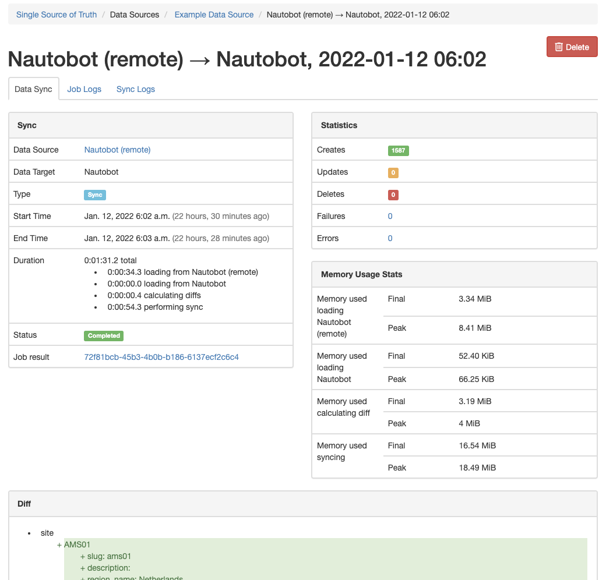
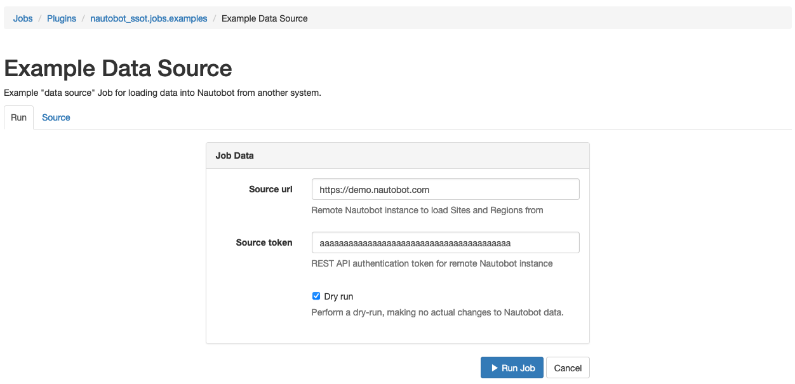
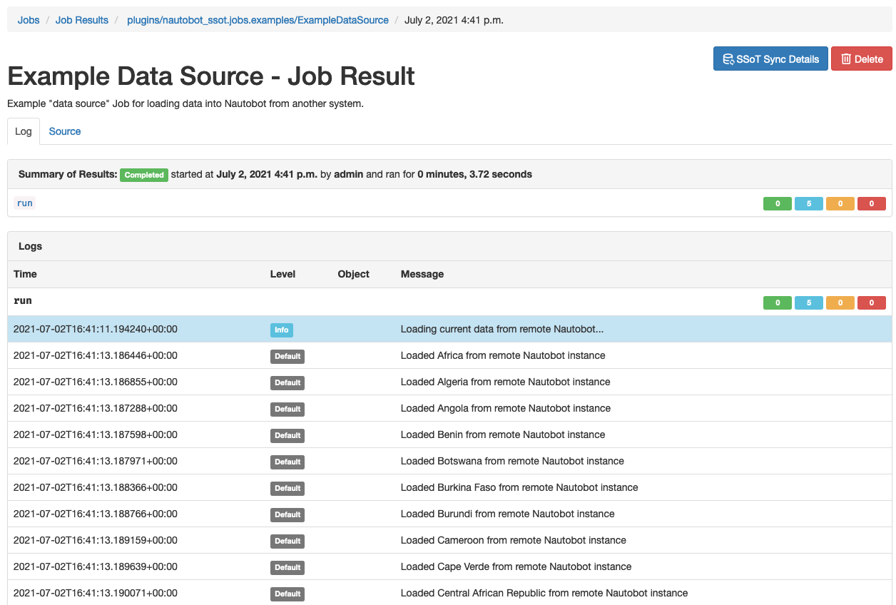

# Nautobot Single Source of Truth

A plugin for [Nautobot](https://github.com/nautobot/nautobot). This plugin facilitates integration and data synchronization between various "source of truth" (SoT) systems, with Nautobot acting as a central clearinghouse for data - a Single Source of Truth, if you will.

The `nautobot-ssot` plugin builds atop the [DiffSync](https://diffsync.readthedocs.io/en/latest/) Python library and Nautobot's [Jobs](https://nautobot.readthedocs.io/en/latest/additional-features/jobs/) feature. This enables the rapid development and integration of Jobs that can be run within Nautobot to pull data from other systems ("Data Sources") into Nautobot and/or push data from Nautobot into other systems ("Data Targets") as desired. Key features include the following:

* A dashboard UI lists all registered Data Sources and Data Targets and provides a summary of the synchronization history.
* The outcome of executing of a data synchronization Job is automatically saved to Nautobot's database for later review.
* Detailed logging output generated by DiffSync is automatically captured and saved to the database as well.

---


---


---



## Installation

The plugin is available as a Python package in PyPI and can be installed with `pip`:

```shell
pip install nautobot-ssot
```

> This plugin is compatible with Nautobot 1.0.3 and higher.

Once installed, the plugin needs to be enabled in your `nautobot_config.py`:

```python
# nautobot_config.py
PLUGINS = ["nautobot_ssot"]
```

This plugin provides examples of Data Source and Data Target jobs that you can run to get a feel for the capabilities of the plugin, but to get the most out of this plugin you will want to find other existing Jobs and/or create your own Jobs; these Jobs can be installed like any other Nautobot Job, i.e. via a plugin, by inclusion in a Git repository, or by manual installation of individual Job source files to Nautobot's `JOBS_ROOT` directory.

## Configuration

By default this plugin provides an example Data Source Job and example Data Target Job. Once you have other, more useful Jobs installed, these example Jobs can be disabled and removed from the UI by configuring `"hide_example_jobs"` to `True` in your `nautobot_config.py`:

```python
PLUGINS_CONFIG = {
    "nautobot_ssot": {
        "hide_example_jobs": True,
    }
}
```

## Usage

### Dashboard

The plugin dashboard UI can be accessed from the **Plugins > Single Source of Truth > Dashboard** menu item in Nautobot.


The left side of the dashboard lists all discovered Data Sources and Data Targets. In a fresh installation this will include the "Example Data Source" and "Example Data Target"; when you install additional data synchronization Jobs they will be automatically discovered and included in the dashboard as well.

The right side of the dashboard lists the ten most recent data syncs executed (if any) and summarizes their outcomes.

### Data Source/Target details

From the dashboard UI, you can click on the name of any given Data Source or Data Target to access a detailed view of the integration between this system and Nautobot.


This view lists the configuration (if any) of the Data Source or Data Target, provides a table describing the types of data being mapped between Nautobot and the other system, and, at the bottom of the page, lists the history of data synchronization involving this system.

### Executing a data sync

To synchronize data between Nautobot and a given Data Source or Data Target, select the **Sync** button for the desired integration from either the Dashboard view or the detailed view. This will bring up a form similar to that of executing any other Nautobot Job.



Enter any appropriate parameters here, including selecting whether to execute the synchronization as a "dry run" (identifying data to be synchronized, but not actually making any changes to the system) or as an actual database update, and select **Run Job**.

You will be redirected to a standard Nautobot "Job Result" view, which will update as the Job is enqueued, begins execution, and eventually completes. When execution is complete, an **SSoT Sync Details** button will appear at the top right of the page; you can select this button for a more detailed view of the outcome.



### Viewing a data sync record

The detailed view of a single data synchronization attempt between Nautobot and a Data Source/Target can be accessed from the Job Result view as described in the previous section, or by navigating to **Plugins > Single Source of Truth > History** and selecting the desired record from the table presented in that view.


This view describes in detail everything that occurred during the data synchronization attempt. The primary **Data Sync** tab summarizes the overall outcome of the sync attempt, including a view of the diffs (if any) identified by DiffSync and a summary of the actions taken (create, update, delete) and their outcomes (success, failure, error).

The **Job Logs** tab shows any general status messages generated by the data synchronization Job as it executed; this is equivalent to the Nautobot "Job Result" view.

The **Sync Logs** tab shows the logs captured from DiffSync regarding the individual data records being synchronized, details of any contents or changes of these records, and other detailed information. Sync logs can also be accessed directly via the **Plugins > Single Source of Truth > Logs** menu item if desired.


