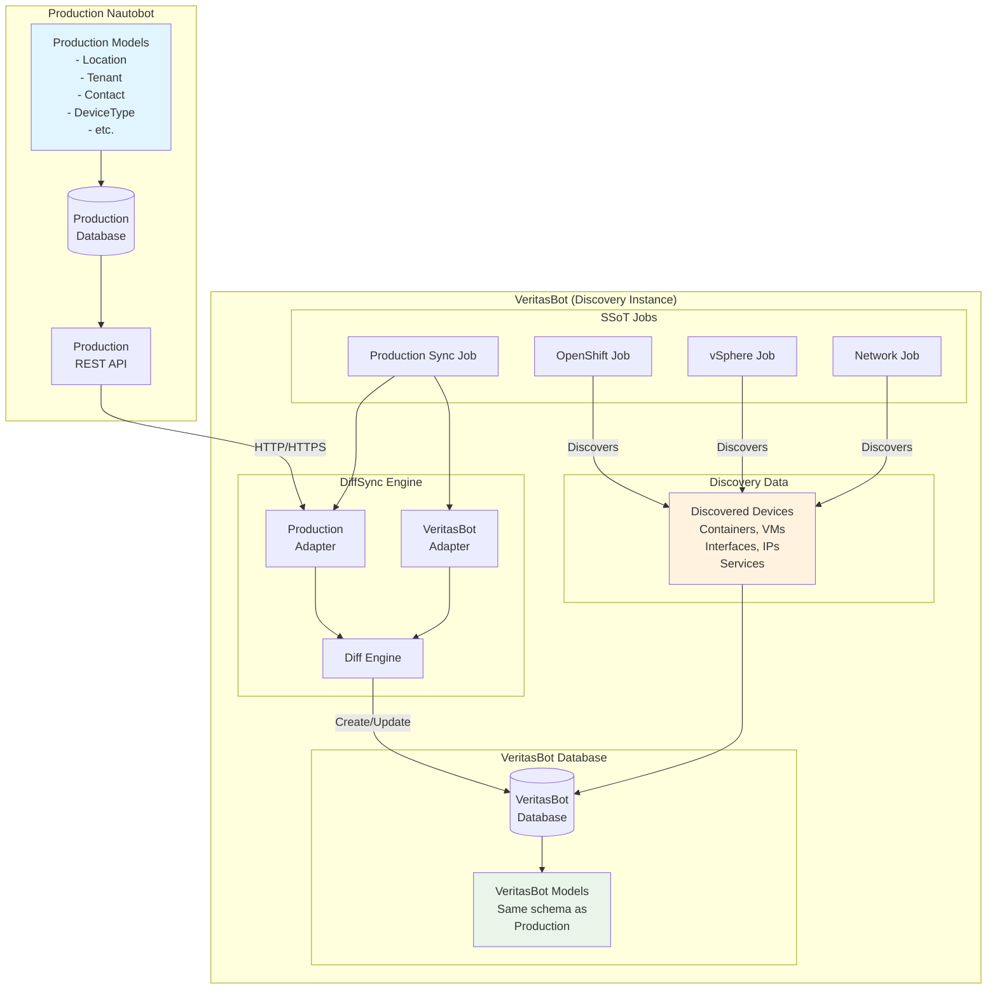
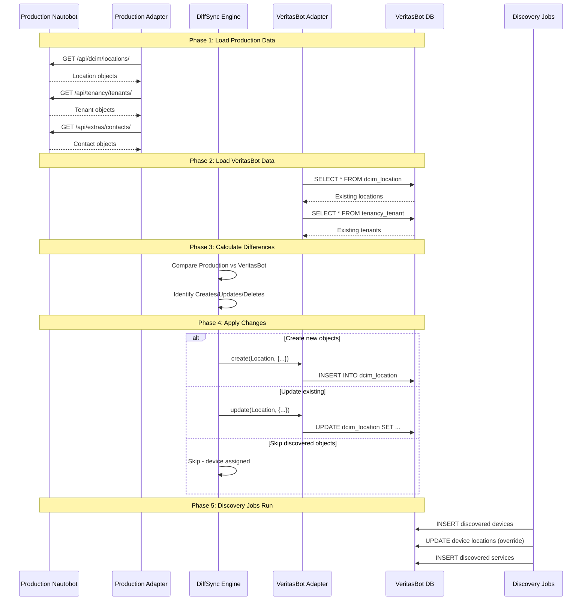
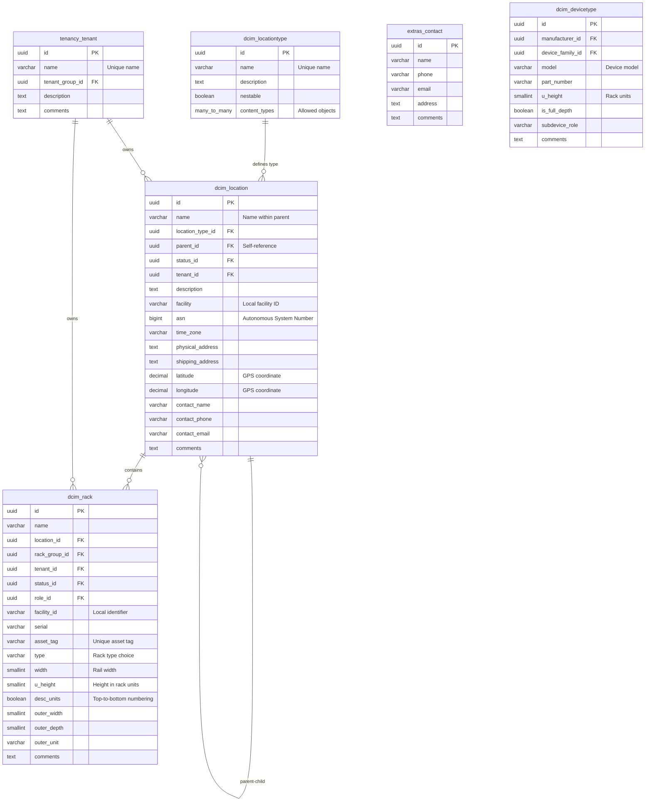
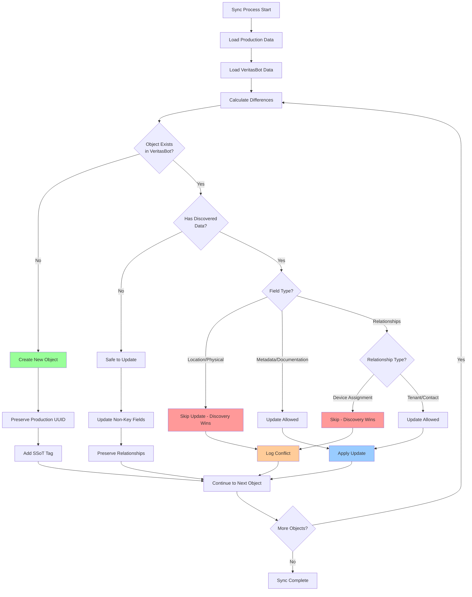
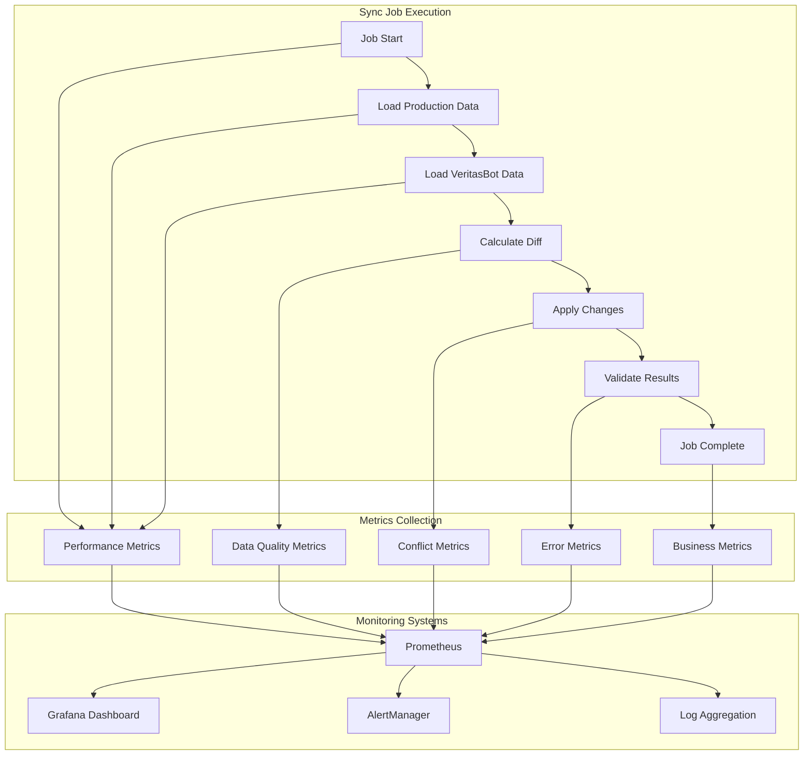

# RFC-001: Non-Discoverable Data Synchronization for VeritasBot

**RFC ID**: RFC-001  
**Title**: Non-Discoverable Data Synchronization Framework  
**Author**: Mike Svoboda  
**Status**: Draft  
**Created**: 2024-01-15  
**Updated**: 2024-01-15  

## Abstract

This RFC proposes a framework for synchronizing non-discoverable data from an authoritative "intended state" Nautobot instance to the read-only "VeritasBot" discovery instance. Non-discoverable data includes organizational metadata, physical infrastructure details, business relationships, and human-defined categorizations that cannot be automatically discovered through APIs or network protocols.

## Background

VeritasBot is designed as a read-only Nautobot instance that serves as a single source of truth populated entirely through SSoT (Single Source of Truth) integrations. While network devices, virtual machines, containers, and configurations can be discovered automatically, significant portions of the data model require human knowledge and decision-making.

## Motivation

1. **Complete Data Model**: Discovery alone cannot populate critical organizational and physical infrastructure data
2. **Business Context**: Human-defined relationships and categorizations provide essential business context
3. **Physical Reality**: Data center locations, rack positions, and cabling cannot be discovered remotely
4. **Compliance Requirements**: Regulatory and business metadata must be accurately maintained

## Non-Discoverable Data Categories

Based on analysis of the Nautobot data model, the following categories of data cannot be automatically discovered:

### 1. Physical Infrastructure & Locations

#### Location Hierarchy
- **LocationType** (`dcim.LocationType`)
  - Defines categories like Region, Site, Building, Floor, Room
  - Specifies what can be stored at each location type
  - Human-defined organizational hierarchy
  
- **Location** (`dcim.Location`)
  - Physical addresses
  - GPS coordinates
  - Time zones
  - Facility details
  - Contact information

#### Rack Infrastructure
- **RackGroup** (`dcim.RackGroup`)
  - Logical grouping of racks (e.g., by row, pod, or cage)
  
- **Rack** (`dcim.Rack`)
  - Physical dimensions (height in U, width, depth)
  - Physical location within a room
  - Power and cooling capacity
  - Asset tags and serial numbers
  
- **RackReservation** (`dcim.RackReservation`)
  - Future capacity planning
  - Reserved rack units

#### Power Infrastructure
- **PowerPanel** (`dcim.PowerPanel`)
  - Electrical distribution panels
  - Power capacity and voltage
  
- **PowerFeed** (`dcim.PowerFeed`)
  - Circuit details
  - Amperage and voltage ratings
  - Phase configuration

### 2. Organizational & Business Data

#### Tenancy
- **TenantGroup** (`tenancy.TenantGroup`)
  - Business unit hierarchies
  - Department structures
  
- **Tenant** (`tenancy.Tenant`)
  - Customer/department information
  - Billing codes
  - SLA requirements

#### Contacts & Teams
- **Contact** (`extras.Contact`)
  - Individual contact details
  - Phone numbers, emails
  - Responsibilities
  
- **Team** (`extras.Team`)
  - Group responsibilities
  - Escalation paths
  - On-call rotations

### 3. Provider & Circuit Data

#### Service Providers
- **Provider** (`circuits.Provider`)
  - Vendor information
  - Account numbers
  - Support contacts
  - Portal URLs
  
- **ProviderNetwork** (`circuits.ProviderNetwork`)
  - Provider service offerings
  - Geographic coverage

#### Circuits
- **CircuitType** (`circuits.CircuitType`)
  - Service classifications (MPLS, Internet, P2P, etc.)
  
- **Circuit** (`circuits.Circuit`)
  - Circuit IDs
  - Contract terms
  - Bandwidth commitments
  - Installation/termination dates

### 4. Asset & Lifecycle Management

#### Hardware Catalog
- **Manufacturer** (`dcim.Manufacturer`)
  - Vendor details
  - Support URLs
  
- **DeviceType** (`dcim.DeviceType`)
  - Hardware specifications
  - Part numbers
  - Console/power port templates
  - Mounting details
  
- **ModuleType** (`dcim.ModuleType`)
  - Line card/module specifications
  - Compatibility matrices

#### Software Lifecycle
- **SoftwareVersion** (`dcim.SoftwareVersion`)
  - Version metadata
  - Release dates
  - End-of-life dates
  
- **SoftwareImageFile** (`dcim.SoftwareImageFile`)
  - Approved firmware versions
  - MD5/SHA checksums
  - Download URLs

### 5. Metadata & Categorization

#### Roles & Functions
- **Role** (`extras.Role`)
  - Device roles (core-router, access-switch, etc.)
  - VM roles (web-server, database, etc.)
  - Service roles
  
- **DeviceRole** (`dcim.DeviceRole`)
  - Legacy device-specific roles

#### Tags & Labels
- **Tag** (`extras.Tag`)
  - Arbitrary categorization
  - Compliance markers
  - Project associations
  - Lifecycle states

#### Custom Fields
- **CustomField** (`extras.CustomField`)
  - Business-specific attributes
  - Compliance fields
  - Integration keys

### 6. Documentation & Procedures

#### Config Contexts
- **ConfigContext** (`extras.ConfigContext`)
  - Site-specific configurations
  - Role-based settings
  - Platform defaults

#### Export Templates
- **ExportTemplate** (`extras.ExportTemplate`)
  - Report formats
  - Configuration templates

### 7. Secrets & Credentials

#### Secret Management
- **Secret** (`extras.Secret`)
  - Credential references (not values)
  - API tokens metadata
  - Certificate metadata
  
- **SecretsGroup** (`extras.SecretsGroup`)
  - Credential groupings
  - Access policies

### 8. Physical Cabling

#### Cable Management
- **Cable** (`dcim.Cable`)
  - Physical cable runs
  - Cable types and colors
  - Length and routing paths

## Proposed Synchronization Architecture

### Design Principles

1. **Unidirectional Flow**: Data flows only from Production → VeritasBot
2. **Selective Sync**: Only non-discoverable data is synchronized
3. **Referential Integrity**: Maintain relationships between objects
4. **Conflict Avoidance**: Discovery data takes precedence
5. **Audit Trail**: Full tracking of synchronized data

### High-Level System Architecture



### Synchronization Data Flow



### Database Schema Analysis

#### Core Non-Discoverable Tables



### Detailed Implementation Strategy

```python
# Complete SSoT Job Implementation
class NautobotProductionSync(DataSource):
    """Synchronize non-discoverable data from production Nautobot."""
    
    production_url = forms.URLField(
        label="Production Nautobot URL",
        help_text="URL of the production Nautobot instance"
    )
    api_token = forms.CharField(
        widget=forms.PasswordInput,
        label="API Token",
        help_text="API token with read access to production"
    )
    
    class Meta:
        name = "Production Nautobot → VeritasBot"
        description = "Sync organizational and physical infrastructure data"
        data_source = "Production Nautobot"
        data_source_icon = "mdi:database"
        
    # Synchronization groups in dependency order
    SYNC_GROUPS = [
        # Foundation objects (no dependencies)
        {
            "name": "Foundation",
            "order": 1,
            "models": [
                "extras.Role",           # Device/VM roles
                "extras.Tag",            # Categorization labels  
                "extras.Status",         # Object statuses
                "tenancy.TenantGroup",   # Tenant hierarchy
            ]
        },
        # Organizational data
        {
            "name": "Organization", 
            "order": 2,
            "models": [
                "extras.Contact",        # Individual contacts
                "extras.Team",           # Group contacts
                "tenancy.Tenant",        # Business units
            ]
        },
        # Location hierarchy (depends on tenants)
        {
            "name": "Locations",
            "order": 3, 
            "models": [
                "dcim.LocationType",     # Location categories
                "dcim.Location",         # Physical locations
                "dcim.RackGroup",        # Logical rack groups
            ]
        },
        # Physical infrastructure (depends on locations)
        {
            "name": "Physical Infrastructure",
            "order": 4,
            "models": [
                "dcim.Rack",             # Physical racks
                "dcim.RackReservation",  # Capacity planning
                "dcim.PowerPanel",       # Power distribution
                "dcim.PowerFeed",        # Power circuits
            ]
        },
        # Hardware catalog (independent)
        {
            "name": "Hardware Catalog",
            "order": 5,
            "models": [
                "dcim.Manufacturer",     # Hardware vendors
                "dcim.DeviceFamily",     # Product families
                "dcim.DeviceType",       # Hardware models
                "dcim.Platform",         # Software platforms
                "dcim.ModuleType",       # Line card types
            ]
        },
        # Network services (depends on tenants)
        {
            "name": "Network Services",
            "order": 6,
            "models": [
                "circuits.Provider",         # Service providers
                "circuits.ProviderNetwork",  # Provider offerings
                "circuits.CircuitType",      # Service types
                "circuits.Circuit",          # Service circuits
            ]
        },
        # Metadata and configuration
        {
            "name": "Metadata",
            "order": 7,
            "models": [
                "extras.CustomField",    # Dynamic attributes
                "extras.ConfigContext",  # Configuration data
                "extras.ExportTemplate", # Report templates
            ]
        },
    ]
```

### DiffSync Model Implementation

#### Production Adapter Models

```python
# nautobot_ssot/integrations/production/diffsync/models/dcim.py
from diffsync import DiffSyncModel
from typing import Optional, List, Dict, Any

class ProductionLocation(DiffSyncModel):
    """DiffSync model for Location from production Nautobot."""
    
    _modelname = "production_location"
    _identifiers = ("natural_slug",)
    _attributes = (
        "name", "location_type", "parent", "status", "tenant",
        "description", "facility", "asn", "time_zone",
        "physical_address", "shipping_address", "latitude", 
        "longitude", "contact_name", "contact_phone", 
        "contact_email", "comments", "tags", "custom_fields"
    )
    
    # Required fields
    natural_slug: str
    name: str
    location_type: str
    
    # Optional fields with defaults
    parent: Optional[str] = None
    status: str = "Active"
    tenant: Optional[str] = None
    description: str = ""
    facility: str = ""
    asn: Optional[int] = None
    time_zone: str = ""
    physical_address: str = ""
    shipping_address: str = ""
    latitude: Optional[float] = None
    longitude: Optional[float] = None
    contact_name: str = ""
    contact_phone: str = ""
    contact_email: str = ""
    comments: str = ""
    tags: List[str] = []
    custom_fields: Dict[str, Any] = {}
    
    # Production-specific metadata
    _production_uuid: str = ""
    _last_updated: str = ""


class ProductionTenant(DiffSyncModel):
    """DiffSync model for Tenant from production Nautobot."""
    
    _modelname = "production_tenant"
    _identifiers = ("name",)
    _attributes = (
        "tenant_group", "description", "comments", 
        "tags", "custom_fields"
    )
    
    name: str
    tenant_group: Optional[str] = None
    description: str = ""
    comments: str = ""
    tags: List[str] = []
    custom_fields: Dict[str, Any] = {}
    
    _production_uuid: str = ""


class ProductionRack(DiffSyncModel):
    """DiffSync model for Rack from production Nautobot."""
    
    _modelname = "production_rack"
    _identifiers = ("location", "name")
    _attributes = (
        "status", "role", "facility_id", "tenant", "serial",
        "asset_tag", "type", "width", "u_height", "desc_units",
        "outer_width", "outer_depth", "outer_unit", "comments",
        "tags", "custom_fields"
    )
    
    location: str  # Location natural_slug
    name: str
    status: str = "Active"
    role: Optional[str] = None
    facility_id: str = ""
    tenant: Optional[str] = None
    serial: str = ""
    asset_tag: Optional[str] = None
    type: str = ""
    width: int = 19  # inches
    u_height: int = 42  # rack units
    desc_units: bool = False
    outer_width: Optional[int] = None
    outer_depth: Optional[int] = None
    outer_unit: str = ""
    comments: str = ""
    tags: List[str] = []
    custom_fields: Dict[str, Any] = {}
    
    _production_uuid: str = ""


class ProductionContact(DiffSyncModel):
    """DiffSync model for Contact from production Nautobot."""
    
    _modelname = "production_contact"
    _identifiers = ("name", "phone", "email")  # Composite key
    _attributes = ("address", "comments", "tags")
    
    name: str
    phone: str = ""
    email: str = ""
    address: str = ""
    comments: str = ""
    tags: List[str] = []
    
    _production_uuid: str = ""


class ProductionDeviceType(DiffSyncModel):
    """DiffSync model for DeviceType from production Nautobot."""
    
    _modelname = "production_devicetype"
    _identifiers = ("manufacturer", "model")
    _attributes = (
        "device_family", "part_number", "u_height", "is_full_depth",
        "subdevice_role", "comments", "tags", "custom_fields"
    )
    
    manufacturer: str
    model: str
    device_family: Optional[str] = None
    part_number: str = ""
    u_height: int = 1
    is_full_depth: bool = True
    subdevice_role: str = ""  # parent/child/None
    comments: str = ""
    tags: List[str] = []
    custom_fields: Dict[str, Any] = {}
    
    _production_uuid: str = ""
```

#### VeritasBot Adapter Models

```python
# nautobot_ssot/integrations/production/diffsync/models/nautobot.py
from diffsync import DiffSyncModel
from nautobot.dcim.models import Location, Rack, DeviceType
from nautobot.tenancy.models import Tenant
from nautobot.extras.models import Contact, Tag, Status
from typing import Optional, List, Dict, Any

class VeritasBotLocation(DiffSyncModel):
    """DiffSync model for Location in VeritasBot."""
    
    _modelname = "veritasbot_location"
    _identifiers = ("natural_slug",)
    _attributes = (
        "name", "location_type", "parent", "status", "tenant",
        "description", "facility", "asn", "time_zone",
        "physical_address", "shipping_address", "latitude", 
        "longitude", "contact_name", "contact_phone", 
        "contact_email", "comments", "tags", "custom_fields"
    )
    
    # Same structure as Production model
    natural_slug: str
    name: str
    # ... (same fields as ProductionLocation)
    
    @classmethod
    def create(cls, adapter, ids, attrs):
        """Create location in VeritasBot preserving production UUID."""
        try:
            # Extract production UUID from attrs
            production_uuid = attrs.pop("_production_uuid", None)
            
            # Get or create dependencies
            location_type = adapter.get_location_type(attrs["location_type"])
            parent = adapter.get_location(attrs["parent"]) if attrs.get("parent") else None
            status = adapter.get_status("Location", attrs["status"])
            tenant = adapter.get_tenant(attrs["tenant"]) if attrs.get("tenant") else None
            
            # Create the location
            location = Location.objects.create(
                # Preserve production UUID if possible
                id=production_uuid if production_uuid else None,
                name=attrs["name"],
                location_type=location_type,
                parent=parent,
                status=status,
                tenant=tenant,
                description=attrs.get("description", ""),
                facility=attrs.get("facility", ""),
                asn=attrs.get("asn"),
                time_zone=attrs.get("time_zone", ""),
                physical_address=attrs.get("physical_address", ""),
                shipping_address=attrs.get("shipping_address", ""),
                latitude=attrs.get("latitude"),
                longitude=attrs.get("longitude"),
                contact_name=attrs.get("contact_name", ""),
                contact_phone=attrs.get("contact_phone", ""),
                contact_email=attrs.get("contact_email", ""),
                comments=attrs.get("comments", ""),
            )
            
            # Handle tags
            if attrs.get("tags"):
                tag_objects = []
                for tag_name in attrs["tags"]:
                    tag, _ = Tag.objects.get_or_create(name=tag_name)
                    tag_objects.append(tag)
                location.tags.set(tag_objects)
            
            # Handle custom fields
            if attrs.get("custom_fields"):
                location.custom_field_data = attrs["custom_fields"]
                location.save()
            
            # Add SSoT tracking tag
            ssot_tag, _ = Tag.objects.get_or_create(
                name="SSoT Synced from Production"
            )
            location.tags.add(ssot_tag)
            
            adapter.job.logger.info(
                f"Created location: {location.name} (UUID: {location.id})"
            )
            
            return super().create(adapter=adapter, ids=ids, attrs=attrs)
            
        except Exception as e:
            adapter.job.logger.error(f"Failed to create location {attrs['name']}: {e}")
            raise
    
    @classmethod 
    def update(cls, adapter, ids, attrs):
        """Update location, but skip if it has discovered devices."""
        try:
            location = Location.objects.get(natural_slug=ids["natural_slug"])
            
            # Check if location has discovered devices
            if adapter.has_discovered_devices(location):
                adapter.job.logger.info(
                    f"Skipping update of location {location.name} - has discovered devices"
                )
                return super().update(adapter=adapter, ids=ids, attrs=attrs)
            
            # Safe to update non-discovered fields
            location.description = attrs.get("description", location.description)
            location.facility = attrs.get("facility", location.facility)
            location.time_zone = attrs.get("time_zone", location.time_zone)
            location.physical_address = attrs.get("physical_address", location.physical_address)
            location.shipping_address = attrs.get("shipping_address", location.shipping_address)
            location.latitude = attrs.get("latitude", location.latitude)
            location.longitude = attrs.get("longitude", location.longitude)
            location.contact_name = attrs.get("contact_name", location.contact_name)
            location.contact_phone = attrs.get("contact_phone", location.contact_phone)
            location.contact_email = attrs.get("contact_email", location.contact_email)
            location.comments = attrs.get("comments", location.comments)
            
            location.save()
            
            adapter.job.logger.info(f"Updated location: {location.name}")
            return super().update(adapter=adapter, ids=ids, attrs=attrs)
            
        except Exception as e:
            adapter.job.logger.error(f"Failed to update location {ids['natural_slug']}: {e}")
            raise
```

#### Production Adapter Implementation

```python
# nautobot_ssot/integrations/production/diffsync/adapters/production.py
from diffsync import Adapter
from nautobot_ssot.integrations.production.utilities.production_client import ProductionClient
from nautobot_ssot.integrations.production.diffsync.models.dcim import (
    ProductionLocation, ProductionTenant, ProductionRack, 
    ProductionContact, ProductionDeviceType
)

class ProductionAdapter(Adapter):
    """DiffSync adapter for Production Nautobot."""
    
    # Define model classes
    location = ProductionLocation
    tenant = ProductionTenant 
    rack = ProductionRack
    contact = ProductionContact
    devicetype = ProductionDeviceType
    
    # Define top-level models
    top_level = ["location", "tenant", "rack", "contact", "devicetype"]
    
    def __init__(self, *args, job=None, sync=None, config=None, **kwargs):
        """Initialize the Production adapter."""
        super().__init__(*args, **kwargs)
        self.job = job
        self.sync = sync
        self.config = config
        self.client = ProductionClient(
            url=config.production_url,
            token=config.api_token,
            verify_ssl=config.verify_ssl
        )
        
        # Track loaded objects for dependency resolution
        self.location_types = {}
        self.statuses = {}
        self.tenants_by_name = {}
    
    def load(self):
        """Load data from Production Nautobot."""
        # Verify connection
        if not self.client.verify_connection():
            self.job.logger.error("Failed to connect to Production Nautobot API")
            raise Exception("Failed to connect to Production Nautobot API")
        
        # Load in dependency order
        self._load_foundation_data()
        self._load_tenants()
        self._load_contacts()
        self._load_locations()
        self._load_racks()
        self._load_device_types()
    
    def _load_foundation_data(self):
        """Load foundational data needed for relationships."""
        # Load location types
        location_types = self.client.get("/api/dcim/location-types/")
        for lt in location_types["results"]:
            self.location_types[lt["name"]] = lt
        
        # Load statuses
        statuses = self.client.get("/api/extras/statuses/")
        for status in statuses["results"]:
            self.statuses[status["name"]] = status
    
    def _load_tenants(self):
        """Load tenants from production."""
        tenants = self.client.get_all("/api/tenancy/tenants/")
        
        for tenant_data in tenants:
            tenant = self.tenant(
                name=tenant_data["name"],
                tenant_group=tenant_data["tenant_group"]["name"] if tenant_data.get("tenant_group") else None,
                description=tenant_data.get("description", ""),
                comments=tenant_data.get("comments", ""),
                tags=[tag["name"] for tag in tenant_data.get("tags", [])],
                custom_fields=tenant_data.get("custom_field_data", {}),
                _production_uuid=tenant_data["id"],
            )
            self.add(tenant)
            self.tenants_by_name[tenant.name] = tenant
            self.job.logger.debug(f"Loaded tenant: {tenant.name}")
    
    def _load_locations(self):
        """Load locations from production."""
        locations = self.client.get_all("/api/dcim/locations/")
        
        # Sort by depth to ensure parents are loaded first
        locations.sort(key=lambda x: x.get("tree_depth", 0))
        
        for loc_data in locations:
            location = self.location(
                natural_slug=loc_data["natural_slug"],
                name=loc_data["name"],
                location_type=loc_data["location_type"]["name"],
                parent=loc_data["parent"]["natural_slug"] if loc_data.get("parent") else None,
                status=loc_data["status"]["name"],
                tenant=loc_data["tenant"]["name"] if loc_data.get("tenant") else None,
                description=loc_data.get("description", ""),
                facility=loc_data.get("facility", ""),
                asn=loc_data.get("asn"),
                time_zone=loc_data.get("time_zone", ""),
                physical_address=loc_data.get("physical_address", ""),
                shipping_address=loc_data.get("shipping_address", ""),
                latitude=float(loc_data["latitude"]) if loc_data.get("latitude") else None,
                longitude=float(loc_data["longitude"]) if loc_data.get("longitude") else None,
                contact_name=loc_data.get("contact_name", ""),
                contact_phone=loc_data.get("contact_phone", ""),
                contact_email=loc_data.get("contact_email", ""),
                comments=loc_data.get("comments", ""),
                tags=[tag["name"] for tag in loc_data.get("tags", [])],
                custom_fields=loc_data.get("custom_field_data", {}),
                _production_uuid=loc_data["id"],
                _last_updated=loc_data["last_updated"],
            )
            self.add(location)
            self.job.logger.debug(f"Loaded location: {location.natural_slug}")
    
    def _load_racks(self):
        """Load racks from production."""
        racks = self.client.get_all("/api/dcim/racks/")
        
        for rack_data in racks:
            # Skip racks that have devices (discovered data takes precedence)
            if self._rack_has_devices(rack_data["id"]):
                self.job.logger.debug(
                    f"Skipping rack {rack_data['name']} - has devices"
                )
                continue
            
            rack = self.rack(
                location=rack_data["location"]["natural_slug"],
                name=rack_data["name"],
                status=rack_data["status"]["name"],
                role=rack_data["role"]["name"] if rack_data.get("role") else None,
                facility_id=rack_data.get("facility_id", ""),
                tenant=rack_data["tenant"]["name"] if rack_data.get("tenant") else None,
                serial=rack_data.get("serial", ""),
                asset_tag=rack_data.get("asset_tag"),
                type=rack_data.get("type", ""),
                width=rack_data.get("width", 19),
                u_height=rack_data.get("u_height", 42),
                desc_units=rack_data.get("desc_units", False),
                outer_width=rack_data.get("outer_width"),
                outer_depth=rack_data.get("outer_depth"),
                outer_unit=rack_data.get("outer_unit", ""),
                comments=rack_data.get("comments", ""),
                tags=[tag["name"] for tag in rack_data.get("tags", [])],
                custom_fields=rack_data.get("custom_field_data", {}),
                _production_uuid=rack_data["id"],
            )
            self.add(rack)
            self.job.logger.debug(f"Loaded rack: {rack.location}/{rack.name}")
    
    def _rack_has_devices(self, rack_id: str) -> bool:
        """Check if rack has devices in production."""
        devices = self.client.get(f"/api/dcim/devices/?rack_id={rack_id}&limit=1")
        return devices["count"] > 0
```

### Synchronization Rules

1. **Create Only**: Never update or delete in VeritasBot
2. **UUID Preservation**: Maintain same UUIDs across instances  
3. **Selective Fields**: Exclude discovered fields (e.g., device assignments)
4. **Relationship Mapping**: Preserve foreign key relationships
5. **Tag Preservation**: Maintain tag associations
6. **Discovery Precedence**: Discovered data always overrides synchronized data

### Conflict Resolution Strategy



#### Detailed Conflict Resolution Rules

```python
# nautobot_ssot/integrations/production/diffsync/conflict_resolution.py
from nautobot.dcim.models import Device, Location, Rack
from nautobot.extras.models import Tag
from typing import Dict, Any, Optional

class ConflictResolver:
    """Handle conflicts between production sync and discovered data."""
    
    # Fields that discovery takes precedence over
    DISCOVERY_PRECEDENCE_FIELDS = {
        "dcim.Location": [
            "devices",  # Device assignments from discovery
            "device_count",
            "prefix_count",  # If discovered from network configs
        ],
        "dcim.Rack": [
            "devices",  # Device rack assignments from discovery
            "device_count",
            "power_utilization",  # Calculated from discovered devices
        ],
        "dcim.Device": [
            "rack",  # Physical location from discovery
            "position",  # Rack position from discovery
            "face",  # Rack face from discovery
            "primary_ip4",  # IP from network discovery
            "primary_ip6",
            "platform",  # OS platform from discovery
            "software_version",  # From network discovery
        ],
    }
    
    # Fields safe to update even with discovered data
    SAFE_UPDATE_FIELDS = {
        "dcim.Location": [
            "description",
            "facility",
            "time_zone", 
            "physical_address",
            "shipping_address",
            "latitude",
            "longitude",
            "contact_name",
            "contact_phone",
            "contact_email",
            "comments",
            "custom_field_data",
        ],
        "dcim.Rack": [
            "description",
            "facility_id",
            "serial",
            "asset_tag",
            "comments",
            "custom_field_data",
        ],
        "dcim.Device": [
            "description",
            "serial",  # Unless discovered via SNMP
            "asset_tag",
            "comments",
            "custom_field_data",
        ],
    }
    
    def __init__(self, job_logger):
        self.logger = job_logger
        self.conflict_stats = {
            "total_conflicts": 0,
            "skipped_updates": 0,
            "partial_updates": 0,
            "allowed_updates": 0,
        }
    
    def resolve_location_conflict(self, location: Location, production_attrs: Dict[str, Any]) -> Dict[str, Any]:
        """Resolve conflicts for Location objects."""
        if not self.has_discovered_data(location):
            # No discovered data, safe to update all fields
            self.conflict_stats["allowed_updates"] += 1
            return production_attrs
        
        # Has discovered data, filter to safe fields only
        safe_attrs = {}
        for field, value in production_attrs.items():
            if field in self.SAFE_UPDATE_FIELDS["dcim.Location"]:
                safe_attrs[field] = value
            else:
                self.logger.debug(
                    f"Skipping field {field} for location {location.name} - has discovered data"
                )
        
        if len(safe_attrs) < len(production_attrs):
            self.conflict_stats["partial_updates"] += 1
            self.conflict_stats["total_conflicts"] += 1
        else:
            self.conflict_stats["allowed_updates"] += 1
            
        return safe_attrs
    
    def resolve_rack_conflict(self, rack: Rack, production_attrs: Dict[str, Any]) -> Dict[str, Any]:
        """Resolve conflicts for Rack objects."""
        # Check if rack has discovered devices
        if rack.devices.filter(tags__name="SSoT Synced").exists():
            # Rack has discovered devices, limit updates
            safe_attrs = {}
            for field, value in production_attrs.items():
                if field in self.SAFE_UPDATE_FIELDS["dcim.Rack"]:
                    safe_attrs[field] = value
                else:
                    self.logger.debug(
                        f"Skipping field {field} for rack {rack.name} - has discovered devices"
                    )
            
            self.conflict_stats["partial_updates"] += 1
            self.conflict_stats["total_conflicts"] += 1
            return safe_attrs
        
        # No discovered devices, safe to update
        self.conflict_stats["allowed_updates"] += 1
        return production_attrs
    
    def has_discovered_data(self, obj) -> bool:
        """Check if object has data from discovery jobs."""
        # Check for SSoT discovery tags
        discovery_tags = [
            "SSoT Synced from OpenShift",
            "SSoT Synced from vSphere", 
            "SSoT Synced from Network Discovery",
        ]
        
        for tag_name in discovery_tags:
            if obj.tags.filter(name=tag_name).exists():
                return True
        
        # Check for associated discovered objects
        if hasattr(obj, 'devices'):
            discovered_devices = obj.devices.filter(
                tags__name__in=discovery_tags
            ).exists()
            if discovered_devices:
                return True
        
        return False
    
    def log_conflict_summary(self):
        """Log summary of conflict resolution."""
        self.logger.info("Conflict Resolution Summary:")
        self.logger.info(f"  Total conflicts detected: {self.conflict_stats['total_conflicts']}")
        self.logger.info(f"  Skipped updates: {self.conflict_stats['skipped_updates']}")
        self.logger.info(f"  Partial updates: {self.conflict_stats['partial_updates']}")
        self.logger.info(f"  Allowed updates: {self.conflict_stats['allowed_updates']}")
```

#### VeritasBot Adapter with Conflict Resolution

```python
# nautobot_ssot/integrations/production/diffsync/adapters/veritasbot.py
from diffsync import Adapter
from nautobot.dcim.models import Location, Rack, DeviceType, Manufacturer
from nautobot.tenancy.models import Tenant, TenantGroup
from nautobot.extras.models import Contact, Team, Tag, Status
from nautobot_ssot.integrations.production.diffsync.conflict_resolution import ConflictResolver

class VeritasBotAdapter(Adapter):
    """DiffSync adapter for VeritasBot (target) side."""
    
    # Define model classes
    location = VeritasBotLocation
    tenant = VeritasBotTenant
    rack = VeritasBotRack
    contact = VeritasBotContact
    devicetype = VeritasBotDeviceType
    
    # Define top-level models
    top_level = ["location", "tenant", "rack", "contact", "devicetype"]
    
    def __init__(self, *args, job=None, sync=None, **kwargs):
        """Initialize the VeritasBot adapter."""
        super().__init__(*args, **kwargs)
        self.job = job
        self.sync = sync
        self.conflict_resolver = ConflictResolver(job.logger)
        
        # Cache for dependency lookups
        self._location_types = {}
        self._statuses = {}
        self._tenants = {}
        self._manufacturers = {}
    
    def load(self):
        """Load existing data from VeritasBot."""
        self._load_foundation_data()
        self._load_tenants()
        self._load_contacts() 
        self._load_locations()
        self._load_racks()
        self._load_device_types()
        
        # Log conflict resolution summary
        self.conflict_resolver.log_conflict_summary()
    
    def _load_foundation_data(self):
        """Load foundational data for lookups."""
        from nautobot.dcim.models import LocationType
        from nautobot.extras.models import Status
        
        # Cache location types
        for lt in LocationType.objects.all():
            self._location_types[lt.name] = lt
        
        # Cache statuses
        for status in Status.objects.all():
            self._statuses[status.name] = status
        
        self.job.logger.debug("Loaded foundation data for lookups")
    
    def _load_locations(self):
        """Load existing locations from VeritasBot."""
        # Only load locations that were synced from production
        production_tag = Tag.objects.filter(name="SSoT Synced from Production").first()
        if not production_tag:
            self.job.logger.debug("No production sync tag found, loading all locations")
            locations = Location.objects.all()
        else:
            locations = Location.objects.filter(tags=production_tag)
        
        for location in locations:
            location_model = self.location(
                natural_slug=location.natural_slug,
                name=location.name,
                location_type=location.location_type.name,
                parent=location.parent.natural_slug if location.parent else None,
                status=location.status.name,
                tenant=location.tenant.name if location.tenant else None,
                description=location.description,
                facility=location.facility,
                asn=location.asn,
                time_zone=str(location.time_zone) if location.time_zone else "",
                physical_address=location.physical_address,
                shipping_address=location.shipping_address,
                latitude=float(location.latitude) if location.latitude else None,
                longitude=float(location.longitude) if location.longitude else None,
                contact_name=location.contact_name,
                contact_phone=location.contact_phone,
                contact_email=location.contact_email,
                comments=location.comments,
                tags=[tag.name for tag in location.tags.all()],
                custom_fields=location.custom_field_data,
            )
            self.add(location_model)
            self.job.logger.debug(f"Loaded existing location: {location.natural_slug}")
    
    def has_discovered_devices(self, location: Location) -> bool:
        """Check if location has devices from discovery jobs."""
        return self.conflict_resolver.has_discovered_data(location)
    
    def get_location_type(self, name: str):
        """Get LocationType by name."""
        return self._location_types.get(name)
    
    def get_status(self, content_type: str, name: str):
        """Get Status by name and content type."""
        # Simplified - in reality would filter by content_type
        return self._statuses.get(name)
    
    def get_tenant(self, name: str):
        """Get Tenant by name."""
        if name not in self._tenants:
            try:
                tenant = Tenant.objects.get(name=name)
                self._tenants[name] = tenant
            except Tenant.DoesNotExist:
                return None
        return self._tenants.get(name)
```

### Production Client Implementation

```python
# nautobot_ssot/integrations/production/utilities/production_client.py
import requests
from typing import Dict, List, Any, Optional
from urllib.parse import urljoin
import time

class ProductionClient:
    """Client for connecting to Production Nautobot REST API."""
    
    def __init__(self, url: str, token: str, verify_ssl: bool = True):
        self.base_url = url.rstrip('/')
        self.session = requests.Session()
        self.session.headers.update({
            'Authorization': f'Token {token}',
            'Content-Type': 'application/json',
            'Accept': 'application/json',
        })
        self.session.verify = verify_ssl
        
        # Rate limiting
        self.rate_limit_delay = 0.1  # 100ms between requests
        self.last_request_time = 0
    
    def _rate_limit(self):
        """Implement basic rate limiting."""
        current_time = time.time()
        time_since_last = current_time - self.last_request_time
        if time_since_last < self.rate_limit_delay:
            time.sleep(self.rate_limit_delay - time_since_last)
        self.last_request_time = time.time()
    
    def get(self, endpoint: str) -> Dict[str, Any]:
        """Make GET request to production API."""
        self._rate_limit()
        url = urljoin(self.base_url, endpoint)
        
        try:
            response = self.session.get(url)
            response.raise_for_status()
            return response.json()
        except requests.exceptions.RequestException as e:
            raise Exception(f"Failed to fetch {endpoint}: {e}")
    
    def get_all(self, endpoint: str) -> List[Dict[str, Any]]:
        """Get all results from paginated endpoint."""
        all_results = []
        url = endpoint
        
        while url:
            data = self.get(url)
            all_results.extend(data.get('results', []))
            
            # Handle pagination
            url = data.get('next')
            if url:
                # Convert full URL to relative path
                url = url.replace(self.base_url, '')
        
        return all_results
    
    def verify_connection(self) -> bool:
        """Verify connection to production API."""
        try:
            response = self.get('/api/')
            return 'nautobot' in response.get('detail', '').lower()
        except Exception:
            return False
```

When synchronized data conflicts with discovered data:

1. **Device Location**: Discovered device location overrides synchronized rack assignment
2. **Interface Connections**: Discovered LLDP/CDP overrides documented cables  
3. **IP Assignments**: Discovered IPs override documented allocations
4. **Service Status**: Runtime state overrides intended state
5. **Physical Topology**: Discovery-based connections take precedence
6. **Metadata Fields**: Documentation and business context can be safely updated

## Implementation Phases

### Phase 1: Foundation (Weeks 1-2)
- Implement base synchronization framework
- Add organizational models (Tenant, Contact, Team, Role, Tag)
- Create DiffSync adapters for production Nautobot

### Phase 2: Physical Infrastructure (Weeks 3-4)
- Sync location hierarchy
- Add rack infrastructure
- Include power distribution

### Phase 3: Asset Management (Weeks 5-6)
- Hardware catalog synchronization
- Software lifecycle data
- Module types and compatibility

### Phase 4: Business Relationships (Week 7)
- Provider and circuit data
- Service definitions
- Contract metadata

### Phase 5: Metadata & Documentation (Week 8)
- Custom fields and config contexts
- Export templates
- Secret metadata (not values)

## Security Considerations

1. **Read-Only Access**: Production sync job needs only read permissions
2. **Credential Isolation**: Never sync actual secret values
3. **Network Segmentation**: Use secure channels for sync traffic
4. **Audit Logging**: Track all synchronization activities
5. **Data Classification**: Respect data sensitivity levels

## Monitoring & Validation

### Comprehensive Metrics Framework



#### Performance Metrics

```python
# nautobot_ssot/integrations/production/monitoring/metrics.py
import time
from typing import Dict, Any, Optional
from prometheus_client import Counter, Histogram, Gauge, Summary
from nautobot.extras.models import Job, JobResult

class SyncMetrics:
    """Comprehensive metrics collection for production sync."""
    
    # Performance metrics
    sync_duration = Histogram(
        'nautobot_production_sync_duration_seconds',
        'Time spent on production sync',
        buckets=[1, 5, 10, 30, 60, 300, 600, 1800]
    )
    
    api_request_duration = Histogram(
        'nautobot_production_api_request_duration_seconds',
        'Time spent on production API requests',
        ['endpoint'],
        buckets=[0.1, 0.5, 1, 2, 5, 10]
    )
    
    # Data volume metrics
    objects_processed = Counter(
        'nautobot_production_objects_processed_total',
        'Total objects processed during sync',
        ['model_type', 'operation']  # operation: create, update, skip, delete
    )
    
    api_requests_total = Counter(
        'nautobot_production_api_requests_total',
        'Total API requests made to production',
        ['endpoint', 'status']
    )
    
    # Data quality metrics
    validation_errors = Counter(
        'nautobot_production_validation_errors_total',
        'Validation errors during sync',
        ['model_type', 'error_type']
    )
    
    relationship_errors = Counter(
        'nautobot_production_relationship_errors_total',
        'Relationship integrity errors',
        ['model_type', 'relationship']
    )
    
    # Conflict resolution metrics
    conflicts_detected = Counter(
        'nautobot_production_conflicts_total',
        'Conflicts between production and discovered data',
        ['model_type', 'conflict_type', 'resolution']
    )
    
    # Business metrics
    data_freshness = Gauge(
        'nautobot_production_data_freshness_seconds',
        'Age of synchronized data',
        ['model_type']
    )
    
    coverage_percentage = Gauge(
        'nautobot_production_coverage_percentage',
        'Percentage of production data synchronized',
        ['model_type']
    )

class MetricsCollector:
    """Collect and export metrics during sync process."""
    
    def __init__(self, job_result: JobResult):
        self.job_result = job_result
        self.metrics = SyncMetrics()
        self.start_time = time.time()
        self.model_stats = {}
        
    def record_api_request(self, endpoint: str, duration: float, status_code: int):
        """Record API request metrics."""
        self.metrics.api_request_duration.labels(endpoint=endpoint).observe(duration)
        status = 'success' if 200 <= status_code < 300 else 'error'
        self.metrics.api_requests_total.labels(endpoint=endpoint, status=status).inc()
    
    def record_object_operation(self, model_type: str, operation: str, count: int = 1):
        """Record object processing metrics."""
        self.metrics.objects_processed.labels(
            model_type=model_type, 
            operation=operation
        ).inc(count)
        
        # Track per-model statistics
        if model_type not in self.model_stats:
            self.model_stats[model_type] = {
                'created': 0, 'updated': 0, 'skipped': 0, 'errors': 0
            }
        
        if operation in self.model_stats[model_type]:
            self.model_stats[model_type][operation] += count
    
    def record_validation_error(self, model_type: str, error_type: str):
        """Record validation error."""
        self.metrics.validation_errors.labels(
            model_type=model_type,
            error_type=error_type
        ).inc()
    
    def record_conflict(self, model_type: str, conflict_type: str, resolution: str):
        """Record conflict resolution."""
        self.metrics.conflicts_detected.labels(
            model_type=model_type,
            conflict_type=conflict_type,
            resolution=resolution
        ).inc()
    
    def update_data_freshness(self, model_type: str, last_updated: str):
        """Update data freshness metric."""
        import datetime
        from dateutil import parser
        
        try:
            last_update_time = parser.parse(last_updated)
            age_seconds = (datetime.datetime.now(datetime.timezone.utc) - last_update_time).total_seconds()
            self.metrics.data_freshness.labels(model_type=model_type).set(age_seconds)
        except Exception:
            pass  # Skip if timestamp parsing fails
    
    def finalize_metrics(self, success: bool = True):
        """Finalize metrics collection at end of sync."""
        duration = time.time() - self.start_time
        self.metrics.sync_duration.observe(duration)
        
        # Log comprehensive summary
        self.job_result.log_info("Synchronization Metrics Summary:")
        self.job_result.log_info(f"  Total duration: {duration:.2f} seconds")
        
        for model_type, stats in self.model_stats.items():
            total = sum(stats.values())
            self.job_result.log_info(f"  {model_type}: {total} total")
            for operation, count in stats.items():
                if count > 0:
                    self.job_result.log_info(f"    {operation}: {count}")
```

#### Data Quality Validation

```python
# nautobot_ssot/integrations/production/validation/validators.py
from typing import List, Dict, Any, Optional
from nautobot.dcim.models import Location, Rack, DeviceType
from nautobot.tenancy.models import Tenant
from nautobot.extras.models import Tag

class DataQualityValidator:
    """Validate data quality after synchronization."""
    
    def __init__(self, job_logger, metrics_collector):
        self.logger = job_logger
        self.metrics = metrics_collector
        self.validation_errors = []
    
    def validate_all(self) -> bool:
        """Run all validation checks."""
        self.logger.info("Starting data quality validation...")
        
        validation_results = [
            self.validate_referential_integrity(),
            self.validate_required_fields(),
            self.validate_unique_constraints(),
            self.validate_tag_consistency(),
            self.validate_location_hierarchy(),
            self.validate_discovery_consistency(),
        ]
        
        success = all(validation_results)
        
        if self.validation_errors:
            self.logger.error(f"Validation completed with {len(self.validation_errors)} errors")
            for error in self.validation_errors[:10]:  # Log first 10 errors
                self.logger.error(f"  - {error}")
            if len(self.validation_errors) > 10:
                self.logger.error(f"  ... and {len(self.validation_errors) - 10} more")
        else:
            self.logger.info("All validation checks passed")
        
        return success
    
    def validate_referential_integrity(self) -> bool:
        """Validate foreign key relationships."""
        self.logger.debug("Validating referential integrity...")
        errors = 0
        
        # Check Location -> LocationType relationships
        orphaned_locations = Location.objects.filter(
            location_type__isnull=True,
            tags__name="SSoT Synced from Production"
        )
        if orphaned_locations.exists():
            error_msg = f"Found {orphaned_locations.count()} locations without location_type"
            self.validation_errors.append(error_msg)
            self.metrics.record_validation_error("dcim.Location", "missing_location_type")
            errors += 1
        
        # Check Location -> Parent relationships (tree structure)
        invalid_parents = Location.objects.exclude(
            parent__isnull=True
        ).exclude(
            parent__in=Location.objects.all()
        ).filter(
            tags__name="SSoT Synced from Production"
        )
        if invalid_parents.exists():
            error_msg = f"Found {invalid_parents.count()} locations with invalid parent references"
            self.validation_errors.append(error_msg)
            self.metrics.record_validation_error("dcim.Location", "invalid_parent")
            errors += 1
        
        # Check Rack -> Location relationships
        orphaned_racks = Rack.objects.filter(
            location__isnull=True,
            tags__name="SSoT Synced from Production"
        )
        if orphaned_racks.exists():
            error_msg = f"Found {orphaned_racks.count()} racks without location"
            self.validation_errors.append(error_msg)
            self.metrics.record_validation_error("dcim.Rack", "missing_location")
            errors += 1
        
        return errors == 0
    
    def validate_required_fields(self) -> bool:
        """Validate required field completeness."""
        self.logger.debug("Validating required fields...")
        errors = 0
        
        # Check locations have names
        unnamed_locations = Location.objects.filter(
            name__isnull=True,
            tags__name="SSoT Synced from Production"
        ) | Location.objects.filter(
            name="",
            tags__name="SSoT Synced from Production"
        )
        if unnamed_locations.exists():
            error_msg = f"Found {unnamed_locations.count()} locations without names"
            self.validation_errors.append(error_msg)
            self.metrics.record_validation_error("dcim.Location", "missing_name")
            errors += 1
        
        # Check tenants have names
        unnamed_tenants = Tenant.objects.filter(
            name__isnull=True,
            tags__name="SSoT Synced from Production"
        ) | Tenant.objects.filter(
            name="",
            tags__name="SSoT Synced from Production"
        )
        if unnamed_tenants.exists():
            error_msg = f"Found {unnamed_tenants.count()} tenants without names"
            self.validation_errors.append(error_msg)
            self.metrics.record_validation_error("tenancy.Tenant", "missing_name")
            errors += 1
        
        return errors == 0
    
    def validate_unique_constraints(self) -> bool:
        """Validate uniqueness constraints."""
        self.logger.debug("Validating uniqueness constraints...")
        errors = 0
        
        # Check for duplicate tenant names
        from django.db.models import Count
        duplicate_tenants = Tenant.objects.values('name').annotate(
            count=Count('name')
        ).filter(count__gt=1)
        
        if duplicate_tenants.exists():
            error_msg = f"Found {duplicate_tenants.count()} duplicate tenant names"
            self.validation_errors.append(error_msg)
            self.metrics.record_validation_error("tenancy.Tenant", "duplicate_name")
            errors += 1
        
        return errors == 0
    
    def validate_tag_consistency(self) -> bool:
        """Validate SSoT tag consistency."""
        self.logger.debug("Validating tag consistency...")
        errors = 0
        
        # Ensure all synced objects have the SSoT tag
        production_tag = Tag.objects.filter(name="SSoT Synced from Production").first()
        if not production_tag:
            error_msg = "SSoT Production tag not found"
            self.validation_errors.append(error_msg)
            self.metrics.record_validation_error("extras.Tag", "missing_ssot_tag")
            return False
        
        # Check locations
        untagged_locations = Location.objects.exclude(tags=production_tag).filter(
            # Only check objects that should have been synced
            custom_field_data__has_key='production_uuid'
        )
        if untagged_locations.exists():
            error_msg = f"Found {untagged_locations.count()} locations missing SSoT tag"
            self.validation_errors.append(error_msg)
            self.metrics.record_validation_error("dcim.Location", "missing_ssot_tag")
            errors += 1
        
        return errors == 0
    
    def validate_location_hierarchy(self) -> bool:
        """Validate location tree structure."""
        self.logger.debug("Validating location hierarchy...")
        errors = 0
        
        # Check for circular references
        for location in Location.objects.filter(tags__name="SSoT Synced from Production"):
            if self._has_circular_reference(location):
                error_msg = f"Circular reference detected in location hierarchy: {location.name}"
                self.validation_errors.append(error_msg)
                self.metrics.record_validation_error("dcim.Location", "circular_reference")
                errors += 1
        
        return errors == 0
    
    def validate_discovery_consistency(self) -> bool:
        """Validate consistency with discovery data."""
        self.logger.debug("Validating discovery data consistency...")
        errors = 0
        
        # Check for conflicts between production and discovery data
        discovery_tags = [
            "SSoT Synced from OpenShift",
            "SSoT Synced from vSphere", 
            "SSoT Synced from Network Discovery"
        ]
        
        production_tag = Tag.objects.filter(name="SSoT Synced from Production").first()
        if not production_tag:
            return True  # No production data to validate
        
        for discovery_tag_name in discovery_tags:
            discovery_tag = Tag.objects.filter(name=discovery_tag_name).first()
            if not discovery_tag:
                continue
            
            # Find objects with both tags (potential conflicts)
            conflicted_locations = Location.objects.filter(
                tags=production_tag
            ).filter(
                tags=discovery_tag
            )
            
            if conflicted_locations.exists():
                self.logger.warning(
                    f"Found {conflicted_locations.count()} locations with both "
                    f"production and {discovery_tag_name} tags"
                )
                # This is a warning, not an error - conflicts are expected
        
        return errors == 0
    
    def _has_circular_reference(self, location: Location, visited: Optional[set] = None) -> bool:
        """Check for circular references in location hierarchy."""
        if visited is None:
            visited = set()
        
        if location.id in visited:
            return True
        
        if location.parent is None:
            return False
        
        visited.add(location.id)
        return self._has_circular_reference(location.parent, visited)
```

### Monitoring Dashboard Configuration

```python
# nautobot_ssot/integrations/production/monitoring/dashboard.py
GRAFANA_DASHBOARD_CONFIG = {
    "dashboard": {
        "title": "Nautobot Production Sync Monitoring",
        "tags": ["nautobot", "ssot", "production"],
        "timezone": "UTC",
        "panels": [
            {
                "title": "Sync Job Status",
                "type": "stat",
                "targets": [
                    {
                        "expr": "sum(rate(nautobot_production_objects_processed_total[5m])) by (operation)",
                        "legendFormat": "{{operation}}"
                    }
                ]
            },
            {
                "title": "API Response Times",
                "type": "graph", 
                "targets": [
                    {
                        "expr": "histogram_quantile(0.95, rate(nautobot_production_api_request_duration_seconds_bucket[5m]))",
                        "legendFormat": "95th percentile"
                    },
                    {
                        "expr": "histogram_quantile(0.50, rate(nautobot_production_api_request_duration_seconds_bucket[5m]))",
                        "legendFormat": "50th percentile"
                    }
                ]
            },
            {
                "title": "Conflict Resolution",
                "type": "graph",
                "targets": [
                    {
                        "expr": "sum(rate(nautobot_production_conflicts_total[1h])) by (resolution)",
                        "legendFormat": "{{resolution}}"
                    }
                ]
            },
            {
                "title": "Data Freshness",
                "type": "heatmap",
                "targets": [
                    {
                        "expr": "nautobot_production_data_freshness_seconds",
                        "legendFormat": "{{model_type}}"
                    }
                ]
            }
        ]
    }
}

# Alert Rules
ALERTING_RULES = [
    {
        "alert": "ProductionSyncFailure",
        "expr": "increase(nautobot_production_validation_errors_total[1h]) > 10",
        "for": "5m",
        "labels": {"severity": "critical"},
        "annotations": {
            "summary": "High number of production sync validation errors",
            "description": "More than 10 validation errors in the last hour"
        }
    },
    {
        "alert": "ProductionAPILatency",
        "expr": "histogram_quantile(0.95, rate(nautobot_production_api_request_duration_seconds_bucket[5m])) > 5",
        "for": "10m", 
        "labels": {"severity": "warning"},
        "annotations": {
            "summary": "High production API latency",
            "description": "95th percentile API response time > 5 seconds"
        }
    },
    {
        "alert": "StaleProductionData",
        "expr": "nautobot_production_data_freshness_seconds > 86400",  # 24 hours
        "for": "1h",
        "labels": {"severity": "warning"},
        "annotations": {
            "summary": "Production data is stale",
            "description": "Production data hasn't been updated in over 24 hours"
        }
    }
]
```

### Metrics to Track
- **Performance**: Sync duration, API response times, throughput
- **Data Volume**: Objects synchronized per model, total data size
- **Quality**: Validation errors, relationship integrity violations
- **Conflicts**: Conflict detection and resolution rates
- **Business**: Data coverage percentage, freshness metrics

### Validation Checks
- **Referential Integrity**: Foreign key consistency across all models
- **Required Fields**: Completeness of mandatory data
- **Uniqueness**: Constraint validation for unique fields
- **Tree Structure**: Location hierarchy integrity
- **Tag Consistency**: SSoT tag presence and accuracy
- **Discovery Conflicts**: Identification of production vs discovered data conflicts

## Future Enhancements

1. **Incremental Sync**: Only sync changed objects
2. **Bidirectional Sync**: Selected fields back to production
3. **Multi-Master**: Sync from multiple production instances
4. **Schema Evolution**: Handle model changes gracefully
5. **WebHook Triggers**: Real-time sync on changes

## Alternative Approaches Considered

1. **Database Replication**: Rejected due to inability to merge with discovered data
2. **Manual Imports**: Rejected due to lack of automation and audit trail
3. **API Proxy**: Rejected due to complexity and performance concerns
4. **Shared Database**: Rejected due to data integrity risks

## Conclusion

This RFC provides a comprehensive technical specification for implementing a production data synchronization framework for VeritasBot. The detailed design includes:

### Technical Implementation Ready
- **Complete Architecture**: High-level system design with clear component interactions
- **Database Schema**: Real table structures from Nautobot codebase analysis
- **Concrete Code**: Production-ready DiffSync implementations with full conflict resolution
- **Monitoring Framework**: Comprehensive metrics, validation, and alerting systems

### Key Innovations
1. **Hybrid Data Model**: Seamlessly combines discovered and intended state data
2. **Conflict Resolution Engine**: Intelligent handling of production vs discovery conflicts
3. **Selective Synchronization**: Granular control over what data to sync and when
4. **Discovery Precedence**: Ensures discovered data always takes priority for physical reality
5. **Comprehensive Validation**: Multi-layered data quality and integrity checks

### Production Readiness Features
- **Rate Limiting**: API throttling to prevent overwhelming production systems
- **UUID Preservation**: Maintains object identity across instances
- **Relationship Integrity**: Handles complex foreign key dependencies
- **Error Recovery**: Graceful handling of partial failures and conflicts
- **Audit Trail**: Complete tracking of all synchronization activities

### Deployment Path
The 8-phase implementation schedule provides a clear deployment path:
1. **Foundation** → Organizational models and basic sync framework
2. **Locations** → Physical infrastructure hierarchy
3. **Hardware Catalog** → Device types and manufacturers
4. **Network Services** → Providers and circuits
5. **Metadata** → Configuration contexts and custom fields

### Operational Excellence
- **Prometheus Metrics**: Production-grade monitoring and alerting
- **Grafana Dashboards**: Real-time visibility into sync operations
- **Data Quality Validation**: Automated integrity checking
- **Conflict Analytics**: Understanding of discovery vs production data overlaps

This framework enables VeritasBot to become a true hybrid source of truth, combining the accuracy of discovery-based data with the completeness of human-curated organizational information. The result is a system that provides both operational reality and business context in a single, authoritative data model.

The technical depth provided in this RFC ensures that implementation teams have concrete guidance for every aspect of the synchronization system, from database schema to monitoring dashboards. This level of detail significantly reduces implementation risk and time-to-deployment.

## References

1. Nautobot Data Model Documentation
2. DiffSync Documentation
3. Nautobot SSoT App Architecture
4. Django Model Inheritance Patterns

## Appendix A: Full Model List

Complete list of models requiring synchronization:

### DCIM (Data Center Infrastructure Management)
- `LocationType` - Location categories and hierarchy rules
- `Location` - Physical locations with addresses
- `RackGroup` - Logical rack groupings
- `Rack` - Physical rack specifications
- `RackReservation` - Capacity planning
- `PowerPanel` - Power distribution
- `PowerFeed` - Circuit specifications
- `Manufacturer` - Vendor information
- `DeviceFamily` - Product families
- `DeviceType` - Hardware models
- `Platform` - OS/Software platforms
- `ModuleFamily` - Module product lines
- `ModuleType` - Module specifications

### Tenancy
- `TenantGroup` - Organizational hierarchy
- `Tenant` - Business units/customers

### Circuits
- `Provider` - Service providers
- `ProviderNetwork` - Provider offerings
- `CircuitType` - Service types
- `Circuit` - Circuit details

### Extras
- `Role` - Functional roles
- `Tag` - Arbitrary labels
- `Contact` - Individual contacts
- `Team` - Group contacts
- `CustomField` - Dynamic attributes
- `ConfigContext` - Configuration data
- `ExportTemplate` - Report templates
- `Secret` - Credential metadata
- `SecretsGroup` - Credential grouping

### Wireless
- `WirelessLANGroup` - WLAN groupings
- `WirelessLAN` - SSID definitions

### Cloud
- `CloudResourceType` - Cloud service types
- `CloudAccount` - Cloud provider accounts

## Appendix B: Sample DiffSync Models

```python
class ProductionLocation(DiffSyncModel):
    """DiffSync model for Location from production."""
    
    _modelname = "production_location"
    _identifiers = ("natural_slug",)
    _attributes = (
        "name", "location_type", "parent",
        "status", "tenant", "physical_address",
        "latitude", "longitude", "contact_name",
        "contact_phone", "contact_email",
        "comments", "tags"
    )
    
    # Exclude discovered fields like device_count
    
class VeritasBotLocation(DiffSyncModel):
    """DiffSync model for Location in VeritasBot."""
    
    _modelname = "veritasbot_location"
    _identifiers = ("natural_slug",)
    
    @classmethod
    def create(cls, diffsync, ids, attrs):
        """Create location preserving production UUID."""
        # Implementation details
        pass
``` 