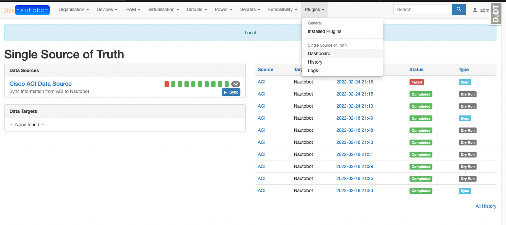
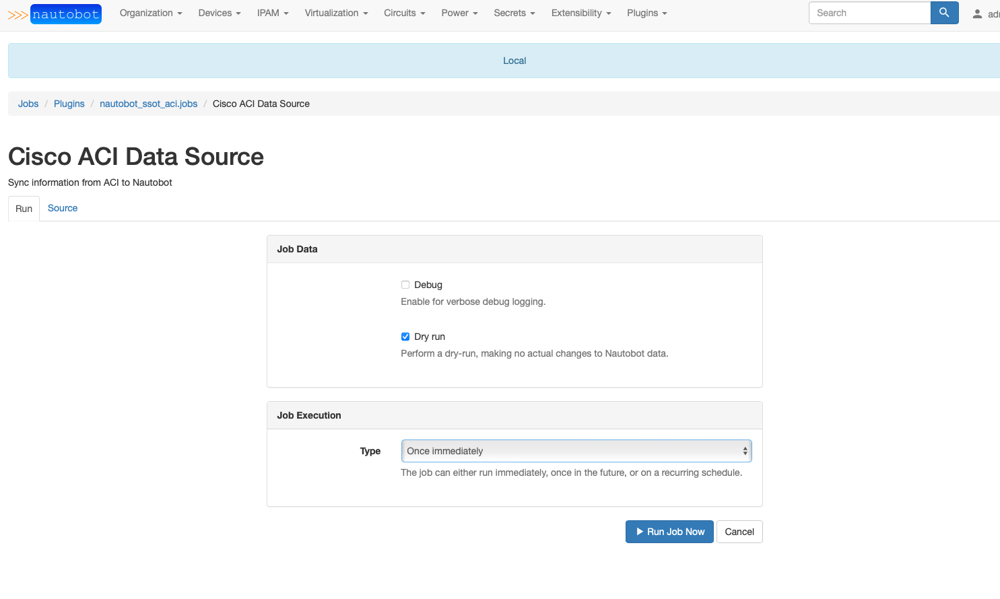
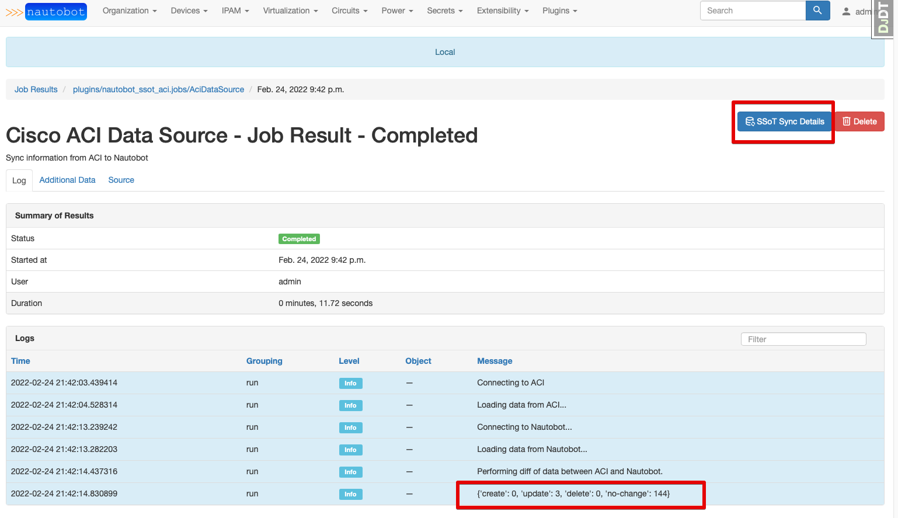
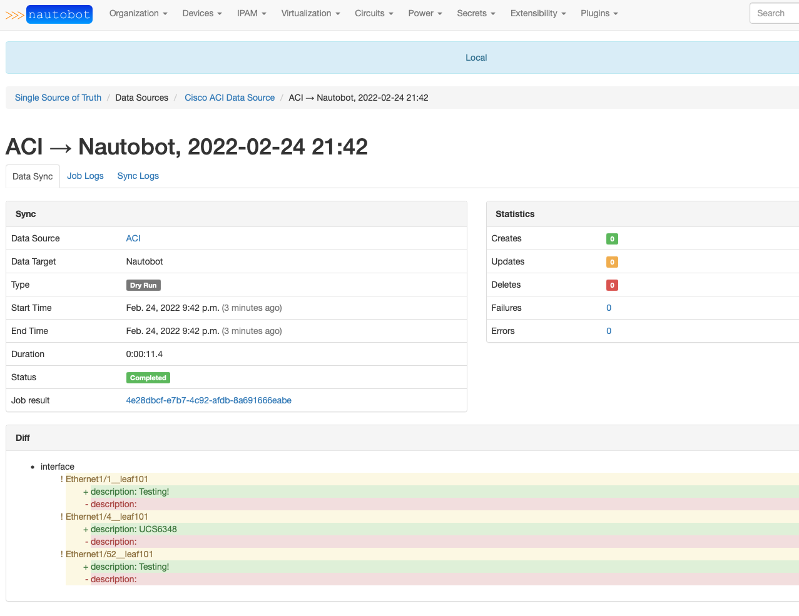
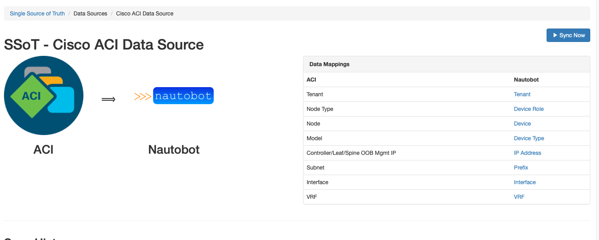
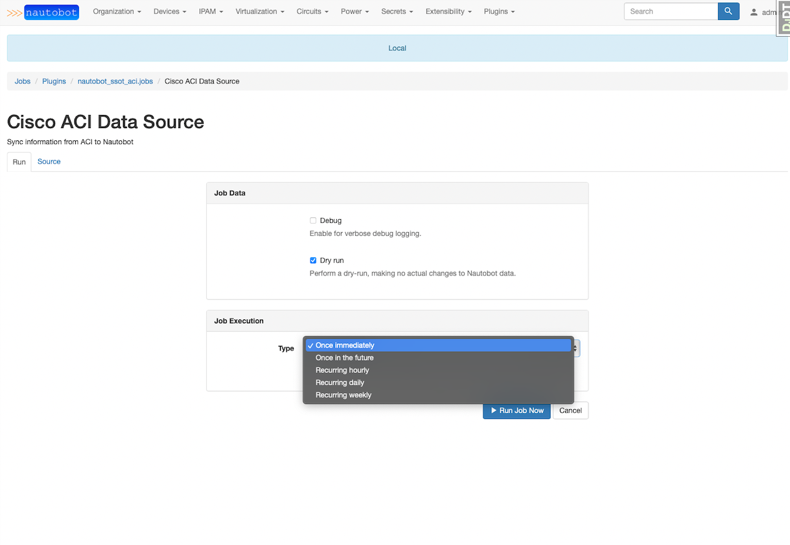
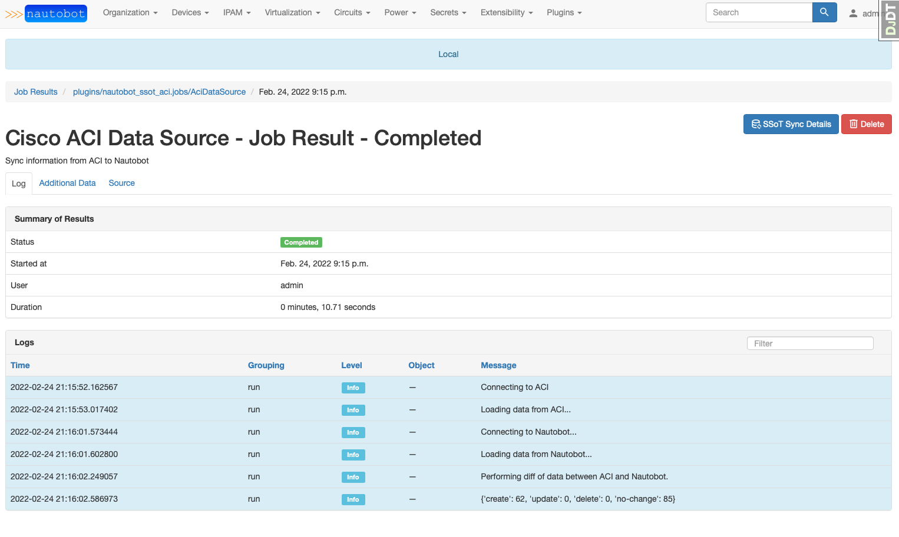
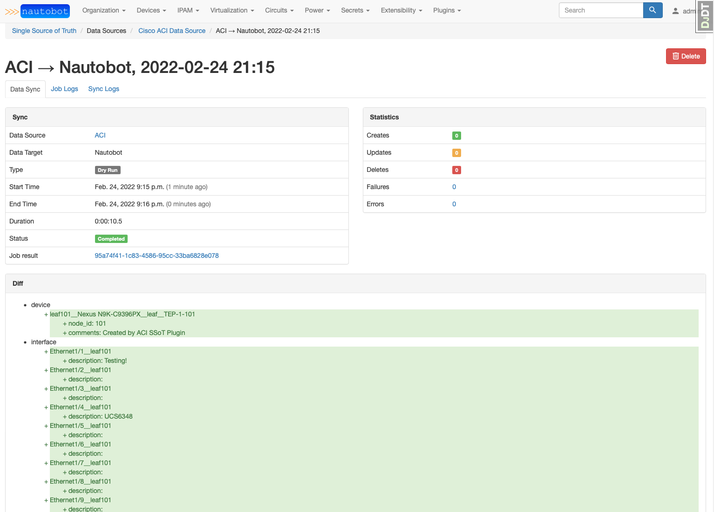
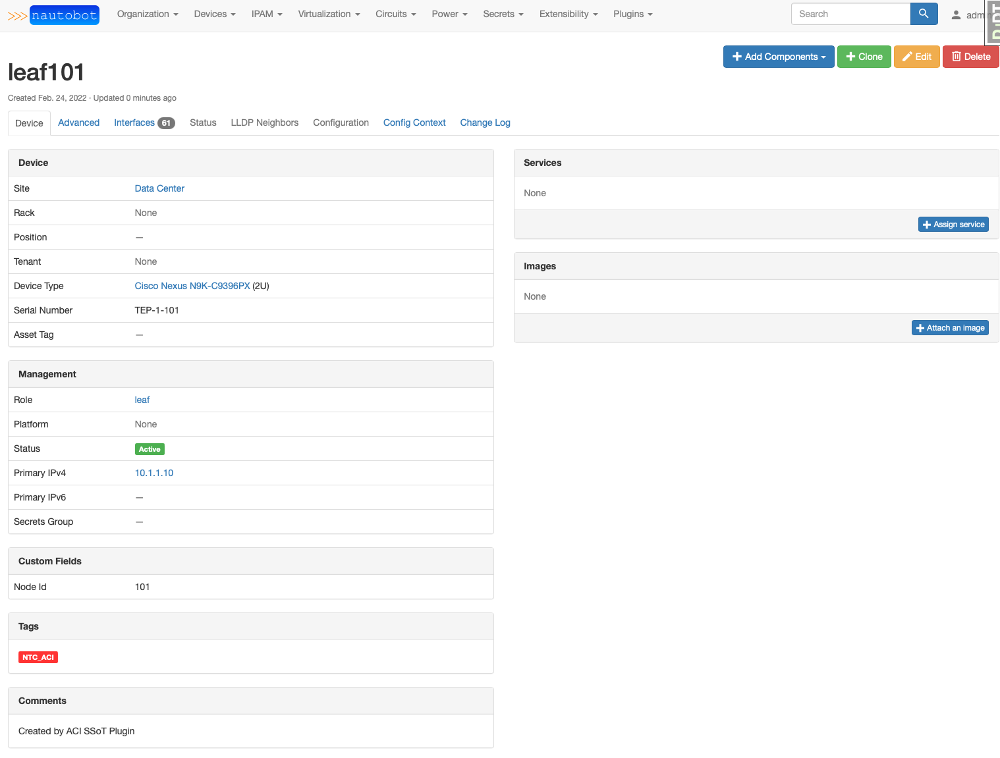
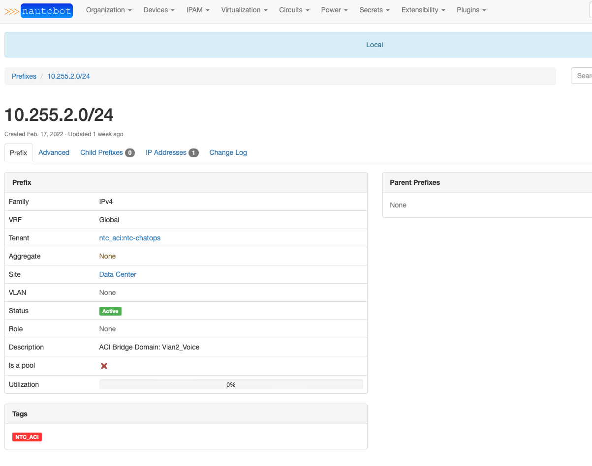

# Cisco ACI SSoT Integration

The Cisco ACI SSoT integration is built as part of the [Nautobot Single Source of Truth (SSoT)](https://github.com/nautobot/nautobot-plugin-ssot) App. The SSoT App enables Nautobot to be the aggregation point for data coming from multiple systems of record (SoR).

To accomplish the synchronization of data, the SSoT ACI integrations communicates with the Cisco ACI controller, the Application Policy Infrastructure Controller (APIC). The APIC provides a central point of administration for the ACI fabric via a web dashboard or REST API.

The SSoT ACI integration eliminates the need for manually adding objects to Nautobot that have been automatically discovered by the Cisco APIC controller. This includes information such as device model/serial numbers, node management IP addressing, and more.

In addition, any changes to the ACI fabric are reflected in Nautobot when the synchronization process is executed.

Examples of ACI changes synchronized into Nautobot:

- New devices that were registered to the fabric are added to Nautobot.
- Devices decommissioned from the fabric, are removed from Nautobot.
- Management IP addresses of devices added to the ACI fabric are created in Nautobot.
- Subnets and gateway addresses of bridge domains created in ACI are added to Nautobot as prefixes and IP addresses.
- Prefixes and IP addresses associated with removed ACI bridge domains are deleted from Nautobot.
- ACI interface description additions and updates are carried over to interface descriptions in Nautobot.

The below list shows object types that are currently synchronized and how they map between systems.

| **ACI** | **Nautobot** |
| ------- | ------------ |
| Tenant | Tenant |
| Node (Leaf/Spine/Controller) | Device |
| Model | Device Type |
| Management IP address (Leaf/Spine/Controller) | IP Address |
| Bridge Domain Subnet | Prefix, IP Address |
| Interfaces | Interface |
| VRFs | VRFs |

## Usage

You use the plugin by navigating to **Plugins > Dashboard** in Nautobot.  Then click on **Cisco ACI Data Source**.

 
From the **Cisco ACI Data Source** page you can click **Sync Now** to begin a synchronization job and view the history of synchronization jobs.

After clicking **Sync Now**, you can select whether you would like to do a dry-run as well as schedule when you would like the job to run. With a dry-run, you can see what information will be brought from ACI into Nautobot without actually performing the synchronization. The job can be run immediately, scheduled to run at a later date/time, or configured to run hourly, daily, or weekly at a specified date/time. 

Once you click **Run Job Now**, you will see the logs as the job progresses. When synchronization completes, you can click the **SSoT Sync Details** button to view the changes, or proposed changes, to Nautobot records.   

## Screenshots

