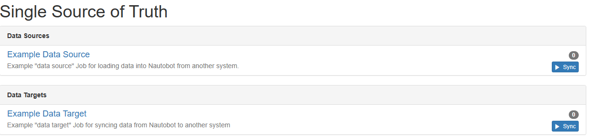
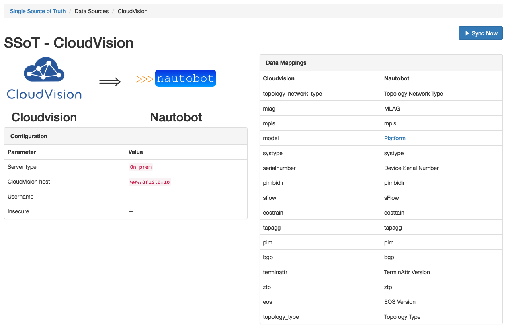
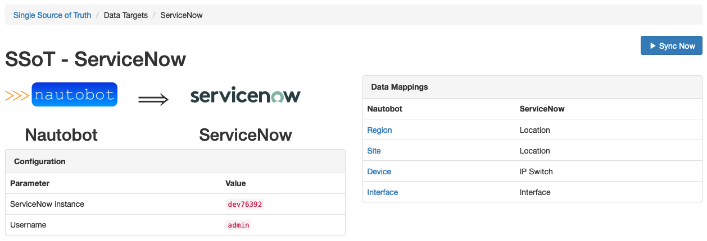

# Getting Started with the App

## Install the App

To install the App, please follow the instructions detailed in the [Installation Guide](../admin/install.md).

## First steps with the App

By default this Nautobot app provides an example Data Source Job and example Data Target Job. You can run this example job to get a feel for the capabilities of the Nautobot app.

---



However, to get the most out of this Nautobot app you will want to find other existing Jobs and/or [create your own Jobs](../dev/jobs.md). Such Jobs can be installed like any other Nautobot Job:

* by [packaging into a Nautobot Nautobot app](https://nautobot.readthedocs.io/en/stable/plugins/development/#including-jobs) which can then be installed into Nautobot's virtual environment
* by [inclusion in a Git repository](https://nautobot.readthedocs.io/en/stable/models/extras/gitrepository/#jobs) which can be configured in Nautobot and refreshed on demand
* by [manual installation of individual Job source files](https://nautobot.readthedocs.io/en/stable/additional-features/jobs/#writing-jobs) to Nautobot's `JOBS_ROOT` directory


Example screenshots of possible Data Sources and Data Targets are shown below.

---



---



Once you have other, more useful Jobs installed, these example Jobs can be disabled and removed from the UI by configuring `"hide_example_jobs"` to `True` in your `nautobot_config.py`:

```python
PLUGINS_CONFIG = {
    "nautobot_ssot": {
        "hide_example_jobs": True,
    }
}
```
