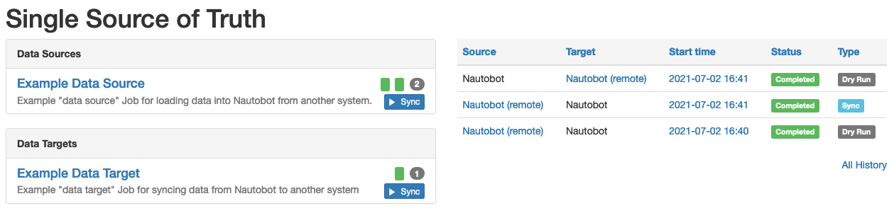

# Using the App

This document describes common use-cases and scenarios for this App.

## General Usage

### Dashboard

The dashboard UI can be accessed from the **Plugins > Single Source of Truth > Dashboard** menu item in Nautobot.

The left side of the dashboard lists all discovered Data Sources and Data Targets. In a fresh installation this will include the "Example Data Source" and "Example Data Target"; when you install additional data synchronization Jobs they will be automatically discovered and included in the dashboard as well.

The right side of the dashboard lists the ten most recent data syncs executed (if any) and summarizes their outcomes.

### Data Source/Target details

From the dashboard UI, you can click on the name of any given Data Source or Data Target to access a detailed view of the integration between this system and Nautobot.

This view lists the configuration (if any) of the Data Source or Data Target, provides a table describing the types of data being mapped between Nautobot and the other system, and, at the bottom of the page, lists the history of data synchronization involving this system.

### Executing a data sync

To synchronize data between Nautobot and a given Data Source or Data Target, select the **Sync** button for the desired integration from either the Dashboard view or the detailed view. This will bring up a form similar to that of executing any other Nautobot Job.

Enter any appropriate parameters here, including selecting whether to execute the synchronization as a "dry run" (identifying data to be synchronized, but not actually making any changes to the system) or as an actual database update, and select **Run Job**.

You will be redirected to a standard Nautobot "Job Result" view, which will update as the Job is enqueued, begins execution, and eventually completes. When execution is complete, an **SSoT Sync Details** button will appear at the top right of the page; you can select this button for a more detailed view of the outcome.

### Viewing a data sync record

The detailed view of a single data synchronization attempt between Nautobot and a Data Source/Target can be accessed from the Job Result view as described in the previous section, or by navigating to **Plugins > Single Source of Truth > History** and selecting the desired record from the table presented in that view.

This view describes in detail everything that occurred during the data synchronization attempt. The primary **Data Sync** tab summarizes the overall outcome of the sync attempt, including a view of the diffs (if any) identified by DiffSync and a summary of the actions taken (create, update, delete) and their outcomes (success, failure, error).

The **Job Logs** tab shows any general status messages generated by the data synchronization Job as it executed; this is equivalent to the Nautobot "Job Result" view.

The **Sync Logs** tab shows the logs captured from DiffSync regarding the individual data records being synchronized, details of any contents or changes of these records, and other detailed information. Sync logs can also be accessed directly via the **Plugins > Single Source of Truth > Logs** menu item if desired.

### Object Metadata Support

Object Metadata Support enables SSoT jobs to associate [object metadata](https://docs.nautobot.com/projects/core/en/stable/user-guide/platform-functionality/objectmetadata/) with Nautobot objects. This metadata is not part of the object’s core data but provides additional context—such as sync status, sync source name, or last sync timestamp—without altering the object itself.

Object Metadata can be enabled by setting the [enable_metadata_for](../admin/install.md/#app-configuration) option when using the `NautobotAdapter` class to synchronize objects, provided your Nautobot instance is the target of the synchronization. For example, if you're enabling object metadata for the `ExampleDataSource` job included in the example jobs of the nautobot-ssot app, you must include `ExampleDataSource` in the `enable_metadata_for` setting.

When Object Metadata support is enabled, each object that is created or updated during the sync will be assigned metadata. The metadata type name is the `data_source` defined in the `Meta` class of your Nautobot SSoT job, and the value is a timestamp indicating the date and time of the last sync from that specific adapter. Continuing with the `ExampleDataSource` job example, since the `data_source` is defined as `Nautobot (remote)`, the metadata type name will also be `Nautobot (remote)`.

## Management Commands

### Elongate Interface Names

This adds a command to the `nautobot-server` management commands to update DCIM.Interface names in Nautobot to their long form using [netutils](https://github.com/networktocode/netutils).
This command should only be ran when the loading of the interface names in integrations system will match the long form name.
For example, running this command, and then performing a sync from a system into Nautobot where the integration system uses different names will result in deleting the interfaces in Nautobot, and creating new ones with the name matching what is in the integration system.

## Screenshots

Here is a consolidated view of all the pages within the SSoT Nautobot app.

---

Initial dashboard showing the data targets, data sources and the last 10 syncs.

---

The detail page of the example data source.

---

The detailed page of the ServiceNow Data Target.

---

The job form page shown prior to running a job. The fields shown here depend on the job developed.

---

The job result page of running a sync.

---

The sync detail page for a given sync.

---

The sync logs page for a given sync.

