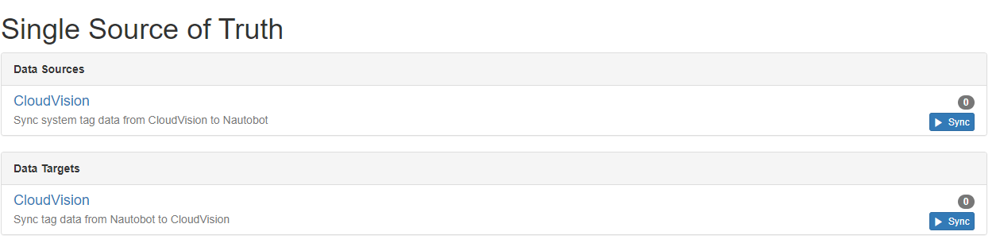
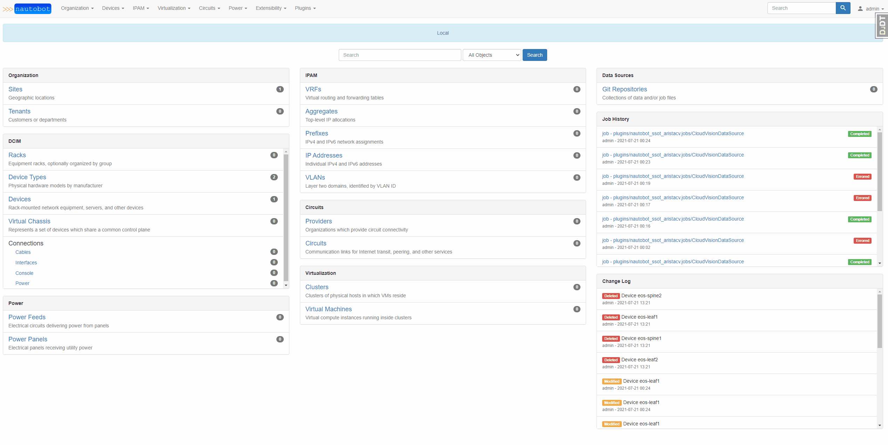
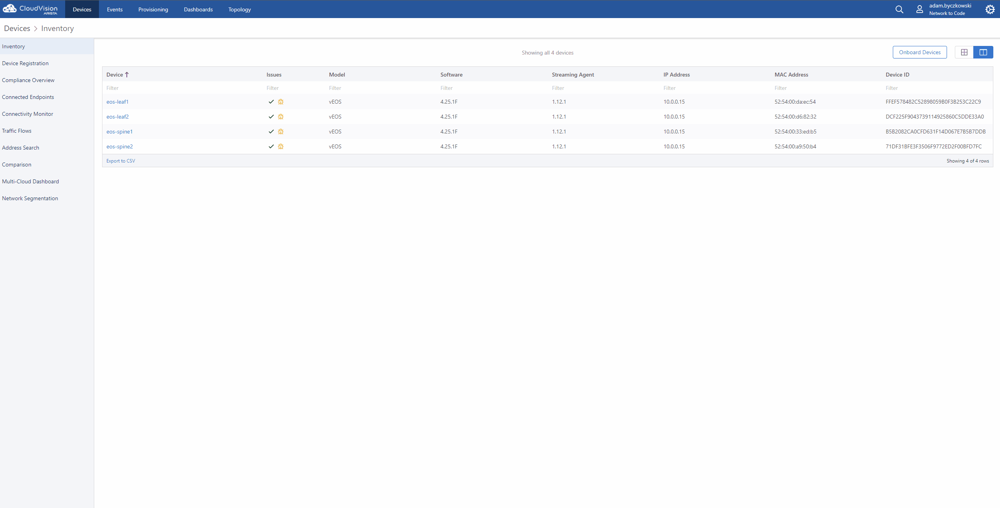
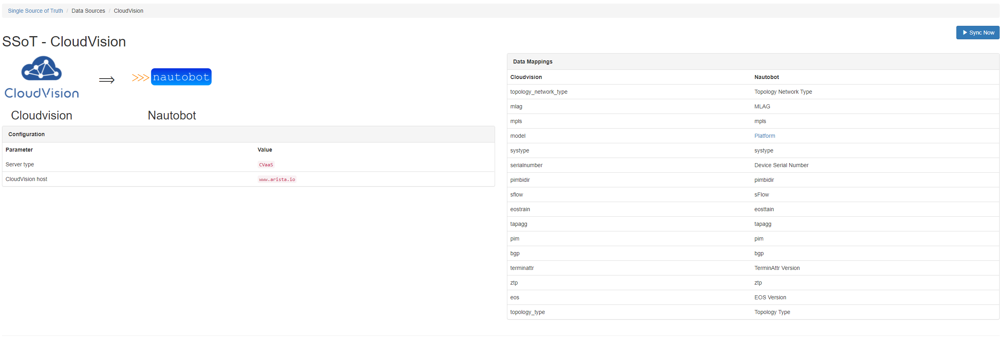
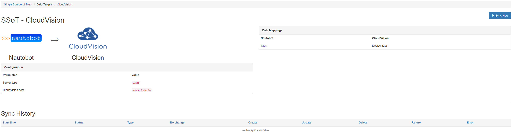

# Arista CloudVision SSoT Integration

The Arista CloudVision SSoT integration is built as part of the [Nautobot Single Source of Truth (SSoT)](../..tps://github.com/nautobot/nautobot-plugin-ssot) App. The SSoT App enables Nautobot to be the aggregation point for data coming from multiple systems of record (SoR).

From Nautobot into CloudVision, it synchronizes user device tags. From CloudVision into Nautobot, it synchronizes devices, their interfaces, associated IP addresses, and their system tags. Here is a table showing the data mappings when syncing from CloudVision.

| CloudVision System Tags | Nautobot Device Custom Field |
| ----------------------- | ---------------------------- |
| topology_network_type   | Topology Network Type        |
| mlag                    | mlag                         |
| mpls                    | mpls                         |
| model                   | Device Type `*`              |
| systype                 | systype                      |
| serialnumber            | Device Serial Number         |
| pimbidir                | pimbidir                     |
| sflow                   | sFlow                        |
| eostrain                | EOS Train                    |
| tapagg                  | TAP Aggregation              |
| pim                     | pim                          |
| bgp                     | bgp                          |
| terminattr              | TerminAttr Version           |
| ztp                     | ztp                          |
| eos                     | EOS Version `**`             |
| topology_type           | Topology Type                |

`*` The model system tag is mapped to the device type model in Nautobot.

`**` If the [Device Lifecycle plug-in](https://github.com/nautobot/nautobot-plugin-device-lifecycle-mgmt) is found to be installed, a matching Version will be created with a RelationshipAssociation connecting the device and that Version.

When syncing User tags from Nautobot to CloudVision the data mappings are as follows:

| Nautobot   | CloudVision   |
| ---------- | ------------- |
| Interface  | Interface     |
| ---------- | ------------- |
| Tags       | Device Tags   |

## Usage

This integration can sync data both `to` and `from` Nautobot. Once the integration has been installed successfully two new options are available under the [Nautobot Single Source of Truth (SSoT)](https://github.com/nautobot/nautobot-plugin-ssot) App.

Please be aware that interfaces that are part of a breakout bundle, ie a 40G port broken out into 4x10G ports, will show the base interface SFP transceiver as the interface type. This is due to the way interfaces and transceivers are returned from CloudVision.

### Syncing From CloudVision

> When loading Nautobot data, this tool only loads devices with a device type that has a manufacturer of "Arista"

When syncing data from CloudVision to Nautobot, devices along with their interfaces and tags are synchronized. When a device exists in CloudVision that doesn't exist in Nautobot, this tool creates the device in Nautobot with the default values specified in the configuration file. When a device exists in Nautobot that does not exist in CloudVision, this tool can be configured to either delete or skip that device.
You can watch the below video for an example.

When syncing data from Nautobot to CloudVision, the tag data in Nautobot is copied into User Tags in CloudVision. You can watch the video below for an example.

## Screenshots

This screenshot shows the CloudVision to Nautobot home page. This contains a list of all the system tags from CloudVision and how they map to custom fields in Nautobot. This also displays your integration configuration and the sync history.

This screenshot shows the Nautobot to CloudVision home page. It also contains data mappings, integration configuration and sync history.

