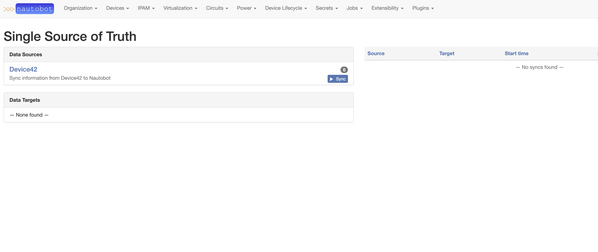
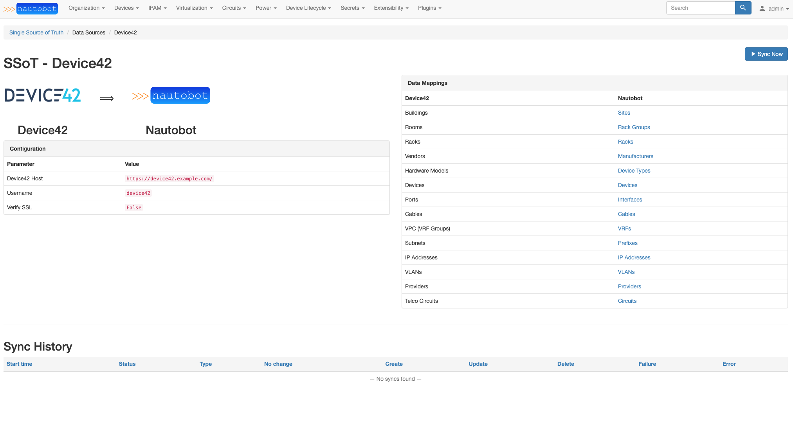
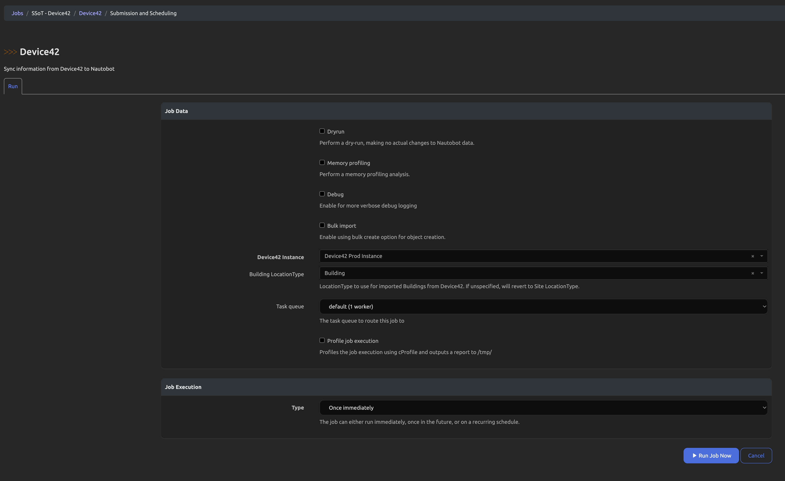
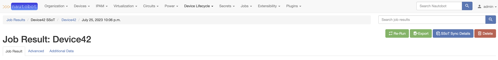
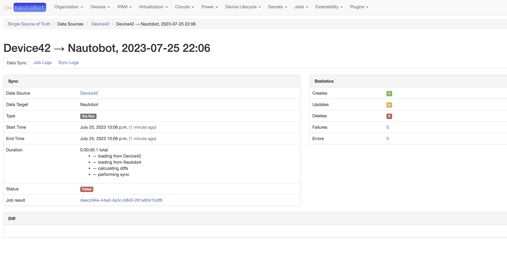

# Arista CloudVision SSoT Integration

The Device42 SSoT integration is built as part of the [Nautobot Single Source of Truth (SSoT)](../..tps://github.com/nautobot/nautobot-plugin-ssot) app. The SSoT app enables Nautobot to be the aggregation point for data coming from multiple systems of record (SoR).

From Device42 into Nautobot, it synchronizes the following objects:

| Device42                | Nautobot                     |
| ----------------------- | ---------------------------- |
| Buildings               | Sites                        |
| Rooms                   | RackGroups                   |
| Racks                   | Racks                        |
| Vendors                 | Manufacturers                |
| Hardware Models         | DeviceTypes                  |
| Devices                 | Devices                      |
| Ports                   | Interfaces                   |
| VPC (VRF Groups)        | VRFs                         |
| Subnets                 | Prefixes                     |
| IP Addresses            | IP Addresses                 |
| VLANs                   | VLANs                        |
| Vendors                 | Providers                    |
| Telco Circuits          | Circuits                     |

`**` If the [Device Lifecycle Nautobot app](https://github.com/nautobot/nautobot-plugin-device-lifecycle-mgmt) is found to be installed, a matching Version will be created with a RelationshipAssociation connecting the Device and that Version.

## Usage

Once the plugin is installed and configured, you will be able to perform a data import from Device42 into Nautobot. From the Nautobot SSoT Dashboard view (`/plugins/ssot/`), Device42 will show as a Data Source.

From the Dashboard, you can also view more information about the App by clicking on the Device42 link and see the Detail view. This view will show the mappings of Device42 objects to Nautobot objects, the sync history, and other configuration details for the App:

To start the synchronization, simply click the `Sync Now` button on the Dashboard to start the Job. You should be presented with the Job form below:

If you wish to just test the synchronization but not have any data created in Nautobot you'll want to select the `Dry run` toggle. Clicking the `Debug` toggle will enable more verbose logging to inform you of what is occuring behind the scenes. Finally, the `Bulk import` option will enable bulk create and update operations to be used when the synchronization is complete. This can improve performance times for the App by forsaking validation of the imported data. Be aware that this could potentially cause bad data to be pushed into Nautobot.

Running this Job will redirect you to a `Nautobot Job Result` view.

Once the Job has finished you can access the `SSoT Sync Details` page to see detailed information about the data that was synchronized from Device42 and the outcome of the sync Job.

