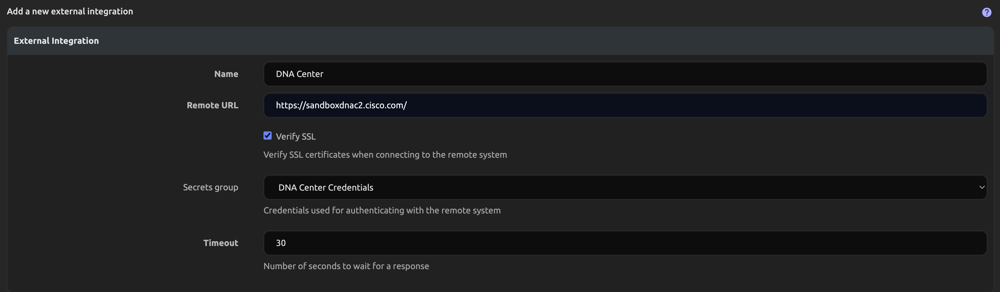
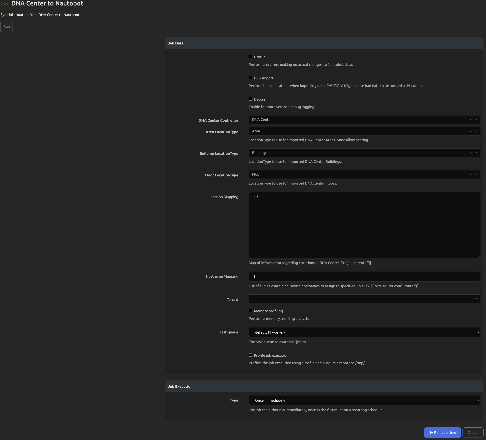

# Cisco DNA Center SSoT Integration

The Cisco DNA Center SSoT integration is built as part of the [Nautobot Single Source of Truth (SSoT)](https://github.com/nautobot/nautobot-app-ssot) app. The SSoT app enables Nautobot to be the aggregation point for data coming from multiple systems of record (SoR).

From Cisco DNA Center into Nautobot, it synchronizes the following objects:

| DNA Center              | Nautobot                     |
| ----------------------- | ---------------------------- |
| Areas                   | Location*                    |
| Buildings               | Location*                    |
| Floors                  | Location*                    |
| Devices                 | Devices**                    |
| Ports                   | Interfaces                   |
| Prefixes                | Prefixes                     |
| IP Addresses            | IP Addresses                 |

`*` As of SSoT 3.2.0 the LocationType for Areas, Buildings, and Floors can be defined in the Job form. Prior to SSoT 3.2.0 the DNA Center integration creates a Region, Site, and Floor LocationType and imports Areas as Region Locations, Buildings as Site Locations, and Floors as Floor Locations.

`**` If the [Device Lifecycle Nautobot app](https://github.com/nautobot/nautobot-app-device-lifecycle-mgmt) is found to be installed, a matching Version will be created with a RelationshipAssociation connecting the Device and that Version.

## Usage

Once the app is installed and configured, you will be able to perform an inventory ingestion from DNA Center into Nautobot. From the Nautobot SSoT Dashboard view (`/plugins/ssot/`), DNA Center will show as a Data Source.

From the Dashboard, you can also view more information about the App by clicking on the `DNA Center to Nautobot` link and see the Detail view. This view will show the mappings of DNA Center objects to Nautobot objects, the sync history, and other configuration details for the App:

In order to utilize this integration you must first enable the Job. You can find the available installed Jobs under Jobs -> Jobs:

To enable the Job you must click on the orange pencil icon to the right of the `DNA Center to Nautobot` Job. You will be presented with the settings for the Job as shown below:

You'll need to check the `Enabled` checkbox and then the `Update` button at the bottom of the page. You will then see that the play button next to the Job changes to blue and becomes functional, linking to the Job form.

Once the Job is enabled, you'll need to manually create a few objects in Nautobot to use with the Job. First, you'll need to create a Secret that contains the username and password for authenticating to your desired DNA Center instance:

Once the required Secrets are created, you'll need to create a SecretsGroup that pairs them together and defines the Access Type of HTTP(S) like shown below:

With the SecretsGroup defined containing your instance credentials you'll then need to create an ExternalIntegration object to store the information about the DNA Center instance you wish to synchronize with.

> The only required portions are the Name, Remote URL, Verify SSL, and Secrets Group. The `Extra Config` section allows you to specify the port that DNA Center is running on. It will default to 443 if unspecified.

The final step before running the Job is to create a Controller that references the ExternalIntegration that you just created. You can attach a `Managed Device Group` to the Controller for all imported Devices to be placed in. If you don't create a Managed Device Group, one will be created automatically and associated to the specified Controller with the name of `<Controller name> Managed Devices`.

> You can utilize multiple DNA Center Controllers with this integration as long as you specify a unique Tenant per Controller. The failure to use differing Tenants will have the Devices, Prefixes, and IPAddresses potentially removed if they are non-existent on the additional Controller. Locations should remain unaffected.

With those configured, you will then need to define a LocationType to use for each DNA Center location type of Areas, Buildings, and Floors. With those created, you can run the Job to start the synchronization:

> When creating the Area LocationType you must check the "Nestable" option.

If you wish to just test the synchronization but not have any data created in Nautobot you'll want to select the `Dryrun` toggle. Clicking the `Debug` toggle will enable more verbose logging to inform you of what is occuring behind the scenes. Finally, the `Bulk import` option will enable bulk create and update operations to be used when the synchronization is complete. This can improve performance times for the integration by forsaking validation of the imported data. Be aware that this could potentially cause bad data to be pushed into Nautobot. After those toggles there are also dropdowns that allow you to specify the DNA Center Controller to synchronize with and to define the LocationTypes to use for the imported Areas, Buildings, and Floors from DNA Center. In addition, there are also some optional settings on the Job form:

- The Location Mapping allows you to define a dictionary of Location mappings. This feature is intended for specifying parent Locations for the Areas and Building locations in DNA Center. This is useful if this information is missing from DNA Center but required for Nautobot or to allow you to change the information as it's imported to match information from another System of Record. The expected pattern for this field is `{"<Location Name>": {"parent": "<Parent location Name>"}}`.

- Finally there is an option to specify a Tenant to be assigned to the imported Devices, Prefixes, and IPAddreses. This is handy for cases where you have multiple DNA Center instances that are used by differing business units.

Running this Job will redirect you to a `Nautobot Job Result` view.

Once the Job has finished you can click on the `SSoT Sync Details` button at the top right of the Job Result page to see detailed information about the data that was synchronized from DNA Center and the outcome of the sync Job.

