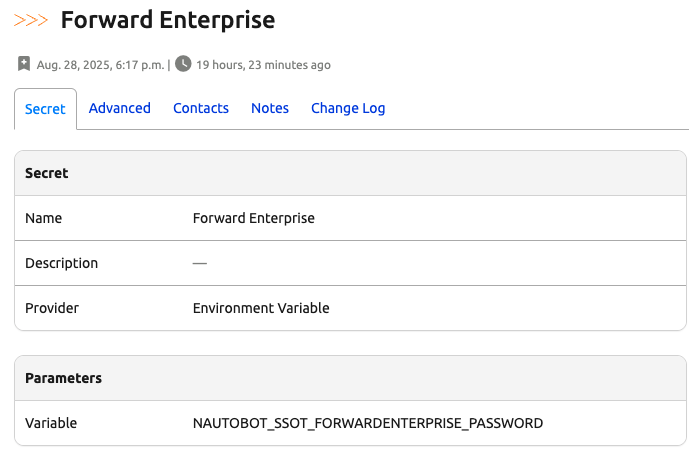
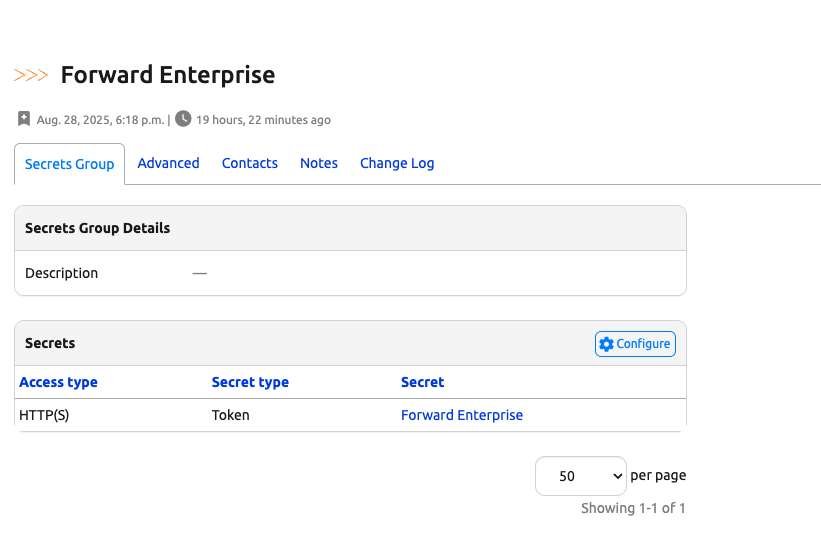
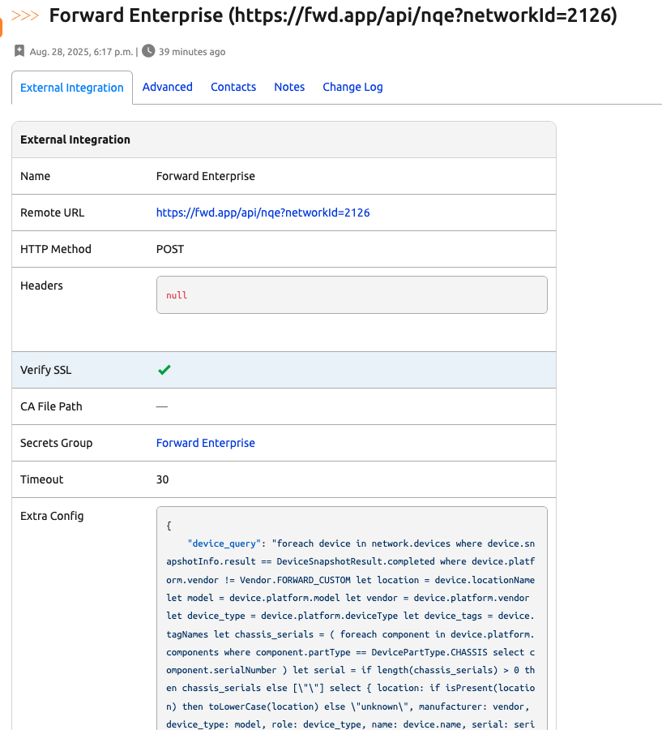
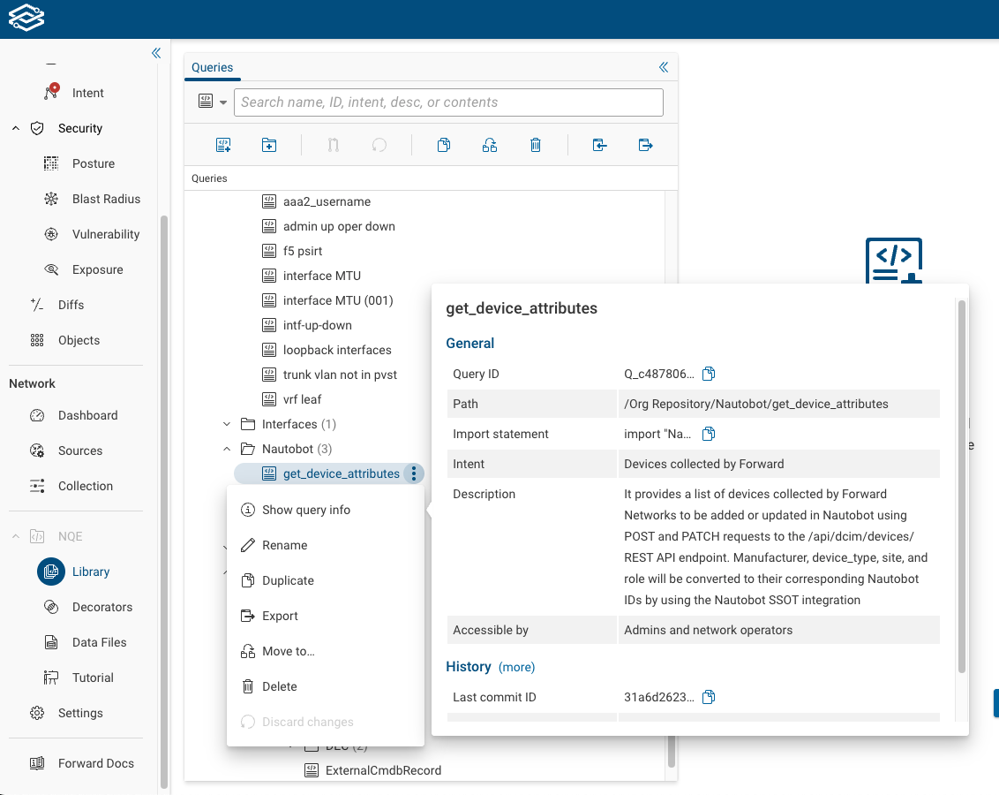

# Forward Enterprise SSoT Integration

This integration provides a simple way to synchronize data between [Forward Enterprise](https://www.forwardnetworks.com/forward-enterprise/) and [Nautobot](https://github.com/nautobot/nautobot). It supports multiple data types, including Devices, Interfaces, and IP Addresses with comprehensive error handling and duplicate management.

## Supported Data Synchronization

The integration synchronizes the following objects from Forward Enterprise to Nautobot:

| Forward Enterprise       | Nautobot                     | Notes                                           |
| -----------------------  | ---------------------------- | ----------------------------------------------- |
| Location                 | Location                     | Creates Location with Site LocationType        |
| Vendor                   | Manufacturer                 | Creates Manufacturer objects                    |
| deviceType               | Role                         | Maps device types to Nautobot Roles            |
| Model                    | Device Type                  | Creates DeviceType with Manufacturer           |
| Platform                 | Platform                     | Creates Platform objects                        |
| Devices                  | Device                       | Creates Device with all relationships          |
| Interfaces               | Interface                    | Optional sync with type normalization          |
| device_tags              | Tags                         | Creates and assigns SSoT sync tags             |

### IPAM Data Synchronization

IP information is obtained using the built-in Forward Enterprise Interface Utilities:

```nqe
import "@fwd/L3/Interface Utilities";
```

| Forward Enterprise       | Nautobot                     | Notes                                           |
| -----------------------  | ---------------------------- | ----------------------------------------------- |
| Interface VRF            | VRF                          | Creates VRFs with namespace support            |
| IP Address               | Prefix                       | Creates parent prefixes                         |
| IP Address               | IP Address                   | Creates IP addresses with parent relationships |
| IP Assignment            | IP Address to Interface      | Links IP addresses to interfaces               |
| VLAN Interfaces          | VLAN                         | Extracts VLANs from interface naming patterns  |
| VLAN / Location          | Vlan Groups                  | Groups Vlans by loction into Vlan Groups       |

## Usage

Once the integration is installed and configured, from the Nautobot SSoT Dashboard view (`/plugins/ssot/`), Forward Enterprise will be shown as a Data Source. You can click the **Sync** button to access a form view from which you can run the Forward Enterprise-to-Nautobot synchronization Job.

### Job Configuration

The Forward Enterprise Data Source job provides several configuration options:

- **Forward Enterprise Instance**: Select the External Integration object containing your Forward Enterprise API credentials and configuration
- **IPAM Namespace**: Select which Namespace to use for imported IPAM objects (defaults to "Global")
- **Sync Interfaces**: Enable synchronization of device interfaces from Forward Enterprise
- **Sync IPAM Data**: Enable synchronization of prefixes, IP addresses, and VLANs from Forward Enterprise
- **Delete Unmatched Objects**: Enable deletion of objects in Nautobot that no longer exist in Forward Enterprise (WARNING: Use with caution)

### Job Result Details

Running the job redirects you to a Nautobot **Job Result** view, from which you can access the **SSoT Sync Details** view to see:

- **Summary Statistics**: Counts of created, updated, and deleted objects by type
- **Detailed Logs**: Step-by-step sync progress with any warnings or errors
- **Memory Usage**: Performance metrics if memory profiling is enabled
- **Sync Mode Information**: Shows whether safe mode or delete mode was used
- **Configuration Details**: Displays the effective configuration used for the sync

## Configuration

### 1. Secrets Configuration

Create a Secret and Secret Group for Forward Enterprise API authentication:

#### Secret Configuration



- **Name**: `forward-enterprise-token`
- **Provider**: Generic Secret Provider
- **Secret Type**: Token
- **Secret Value**: Your Forward Enterprise API token

#### Secret Group Configuration



- **Name**: `forward-enterprise-secrets`
- **Access Type**: HTTP
- **Add the token secret** to this group

### 2. External Integration Configuration

Configure the Forward Enterprise External Integration:



#### Required Settings

- **Name**: `Forward Enterprise Production`
- **Remote URL**: `https://fwd.app/api/nqe?networkId={NETWORK_ID}`
- **HTTP Method**: `POST`
- **Secrets Group**: Select the secrets group created above
- **Verify SSL**: `True` (recommended)

#### Finding Your Network ID

Query the networks endpoint to find available networks:

```bash
curl -H "Authorization: Basic YOUR_TOKEN" https://fwd.app/api/networks
```

Response example:

```json
[
  {
    "creator": null,
    "name": "production",
    "id": "2126",
    "orgId": "924",
    "creatorId": null
  }
]
```

Use the `id` field (e.g., `2126`) in your Remote URL:

```
https://fwd.app/api/nqe?networkId=2126
```

### 3. NQE Query Configuration

Configure NQE queries in the External Integration's **Extra Config** field. You can use any of these three configuration patterns:

#### Option A: Raw NQE Queries

Use full NQE query source code for all query types:

```json
{
  "device_query": "foreach device in network.devices where device.snapshotInfo.result == DeviceSnapshotResult.completed where device.platform.vendor != Vendor.FORWARD_CUSTOM let location = device.locationName let model = device.platform.model let vendor = device.platform.vendor let device_type = device.platform.deviceType let device_tags = device.tagNames let chassis_serials = ( foreach component in device.platform.components where component.partType == DevicePartType.CHASSIS select component.serialNumber ) let serial = if length(chassis_serials) > 0 then chassis_serials else [\"\"] select { location: if isPresent(location) then toLowerCase(location) else \"unknown\", manufacturer: vendor, device_type: model, role: device_type, name: device.name, serial: serial, status: \"active\", tags: device_tags }",

  "interface_query": "foreach device in network.devices where device.snapshotInfo.result == DeviceSnapshotResult.completed where device.platform.vendor != Vendor.FORWARD_CUSTOM foreach interface in device.interfaces where interface.interfaceType == IfaceType.IF_ETHERNET let deviceName = device.name let speed = interface.ethernet.speedMbps let status = interface.operStatus let duplexMode = interface.ethernet.negotiatedDuplexMode select { device: deviceName, name: interface.name, type: speed, enabled: if status == OperStatus.UP then \"1\" else \"0\", mtu: interface.mtu, mac_address: toUpperCase(toString(interface.ethernet.macAddress)), speed: speed, duplex: if duplexMode == DuplexMode.FULL then \"full\" else \"half\", comments: \"Interface Added or Updated by Forward Enterprise\" }",

  "ipam_query": "import \"@fwd/L3/Interface Utilities\"; foreach device in network.devices foreach iface in getL3Interfaces(device) foreach address in iface.ipv4.addresses let location = device.locationName select { location: location, device: device.name, interface: iface.name, vrf: iface.vrf, ip: address.ip, prefixLength: address.prefixLength }"
}
```

#### Option B: Query IDs

Use Query IDs that reference saved queries in Forward Enterprise Query Library:

```json
{
  "device_query_id": "Q_7cc4752b18b5a5f6d031e6186dc920efdcfd607c",
  "interface_query_id": "Q_8dd5863c29c6b6g7e042f7297ed031f0edcfd608d",
  "ipam_query_id": "Q_f6343cee5d16e555775b535603b071a1de0c9806"
}
```

#### Option C: Mixed Configuration

Mix raw queries and Query IDs as needed:

```json
{
  "device_query": "foreach device in network.devices where device.snapshotInfo.result == DeviceSnapshotResult.completed select { name: device.name, manufacturer: device.platform.vendor }",
  "interface_query_id": "Q_8dd5863c29c6b6g7e042f7297ed031f0edcfd608d",
  "ipam_query_id": "Q_f6343cee5d16e555775b535603b071a1de0c9806"
}
```

To find Query IDs, use the "Show query info" option in the Forward Enterprise NQE Library:



### 4. Individual NQE Query Examples

#### Device Query

```nqe
foreach device in network.devices
where device.snapshotInfo.result == DeviceSnapshotResult.completed
where device.platform.vendor != Vendor.FORWARD_CUSTOM
let location = device.locationName
let model = device.platform.model
let vendor = device.platform.vendor
let device_type = device.platform.deviceType
let device_tags = device.tagNames
let chassis_serials = (
    foreach component in device.platform.components
    where component.partType == DevicePartType.CHASSIS
    select component.serialNumber
)

let serial = if length(chassis_serials) > 0 then chassis_serials else [""]

select {
  location: if isPresent(location) then toLowerCase(location) else "unknown",
  manufacturer: vendor,
  device_type: model,
  role: device_type,
  name: device.name,
  serial: serial,
  status: "active",
  tags: device_tags
}
```

#### Interface Query

```nqe
foreach device in network.devices
where device.snapshotInfo.result == DeviceSnapshotResult.completed
where device.platform.vendor != Vendor.FORWARD_CUSTOM
foreach interface in device.interfaces
where interface.interfaceType == IfaceType.IF_ETHERNET
let deviceName = device.name
let speed = interface.ethernet.negotiatedPortSpeed
let status = interface.operStatus
let duplexMode = interface.ethernet.negotiatedDuplexMode
select {
  device: deviceName,
  location: device.locationName,
  name: interface.name,
  enabled: if status == OperStatus.UP then "1" else "0",
  mtu: interface.mtu,
  mac_address: toUpperCase(toString(interface.ethernet.macAddress)),
  speed: speed,
  duplex: if duplexMode == DuplexMode.FULL then "full" else "half",
}
```

#### IPAM Query

```nqe
import "@fwd/L3/Interface Utilities";

foreach device in network.devices
foreach iface in getL3Interfaces(device)
foreach address in iface.ipv4.addresses
let location = device.locationName
select {
  location: location,
  device: device.name,
  interface: iface.name,
  vrf: iface.vrf,
  ip: address.ip,
  prefixLength: address.prefixLength
}
```

## Troubleshooting

### Duplicate Object Messages

The integration gracefully handles expected duplicates and won't create duplicate errors in logs.

### Debug Mode

Enable debug logging in Nautobot for detailed troubleshooting:

```python
LOGGING = {
    'loggers': {
        'nautobot_ssot.integrations.forward_enterprise': {
            'handlers': ['console'],
            'level': 'DEBUG',
        },
    },
}
```

## Best Practices

1. **Start with Device Sync**: Enable only device synchronization initially
2. **Test with Dry Run**: Always test with dry run enabled first
3. **Use Tagged Sync**: Leverage tagged object filtering for selective sync
4. **Monitor Job Results**: Review sync details for any warnings or errors
5. **Regular Sync Schedule**: Set up automated sync jobs for data freshness
6. **Backup Before Sync**: Take database backups before large sync operations
