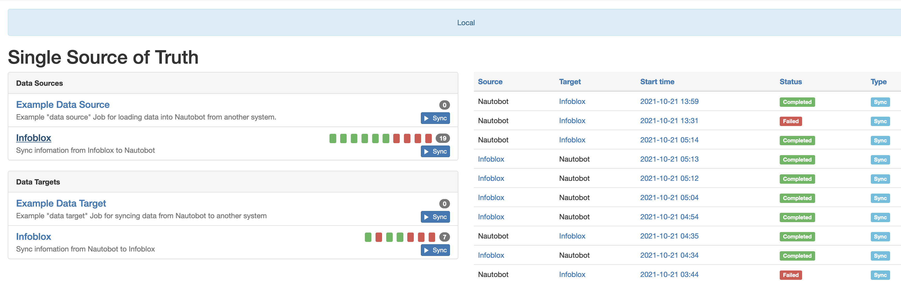
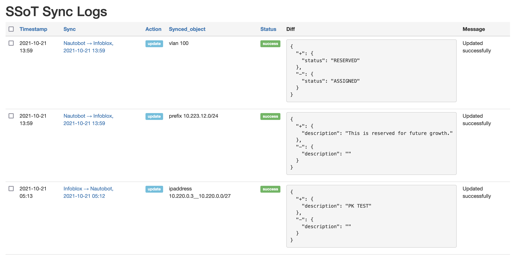
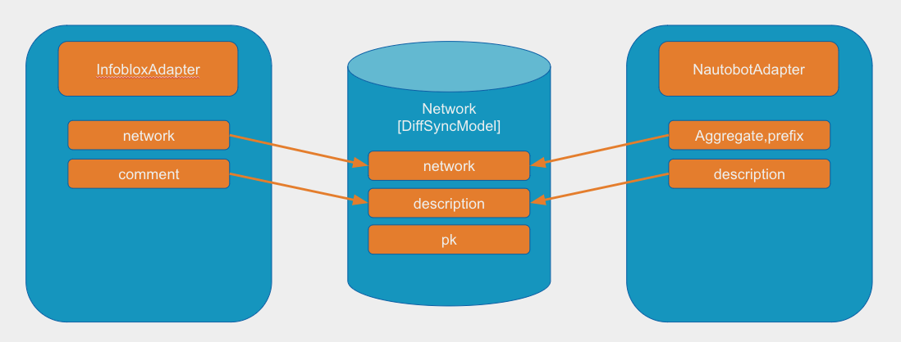
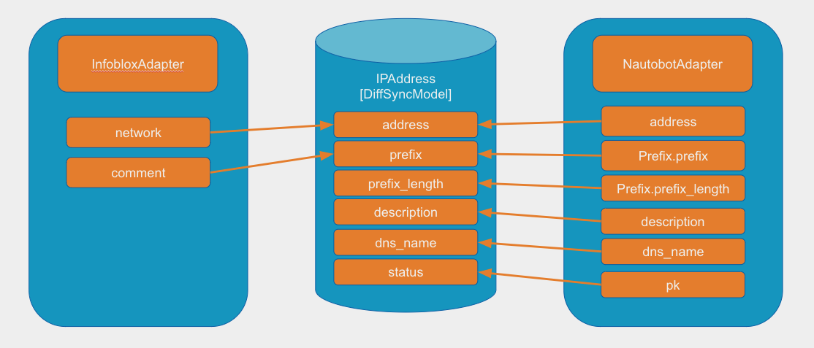
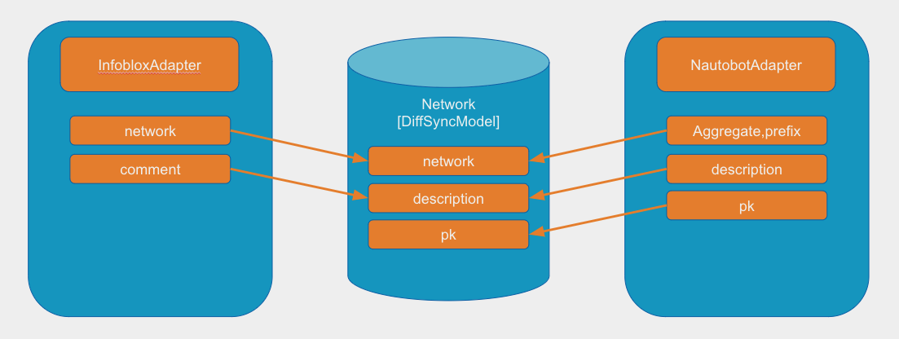

# Infoblox SSoT Integration

SSoT Infoblox integration allows synchronizing of IP network and VLAN data between [Infoblox](https://infoblox.com/) and [Nautobot](https://github.com/nautobot/nautobot).

## Usage

Below are the data mappings between objects within Infoblox and the corresponding objects within Nautobot:

| Infoblox                 | Nautobot      |
| ------------------------ | ------------- |
| Network                  | Prefix        |
| IP Address               | IP Address    |
| VLAN                     | VLAN          |
| VLAN view                | VLAN Group    |
| Network container        | Aggregate     |
| Extensibility Attributes | Custom Fields |

## Extensibility Attributes

Extensibility Attributes in Infoblox are a method of adding additional contextual information to objects in Infoblox. The closest analog in Nautobot is a Custom Field so this information has been imported as such. There is also an effort to attempt to match the information in these fields where possible to available objects in Nautobot. These available links are noted below:

### Network (Prefixes)

- Site/Facility
- VRF
- Role
- Tenant/Department

### IP Address

- VRF
- Role
- Tenant/Department

### VLAN Group

- Site/Facility

### VLAN

- Site/Facility
- Role
- Tenant/Department

### Aggregate

- Tenant/Department

## Screenshots

