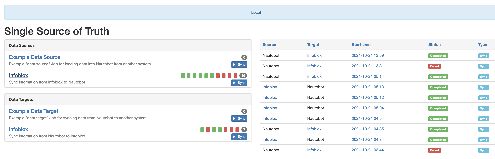
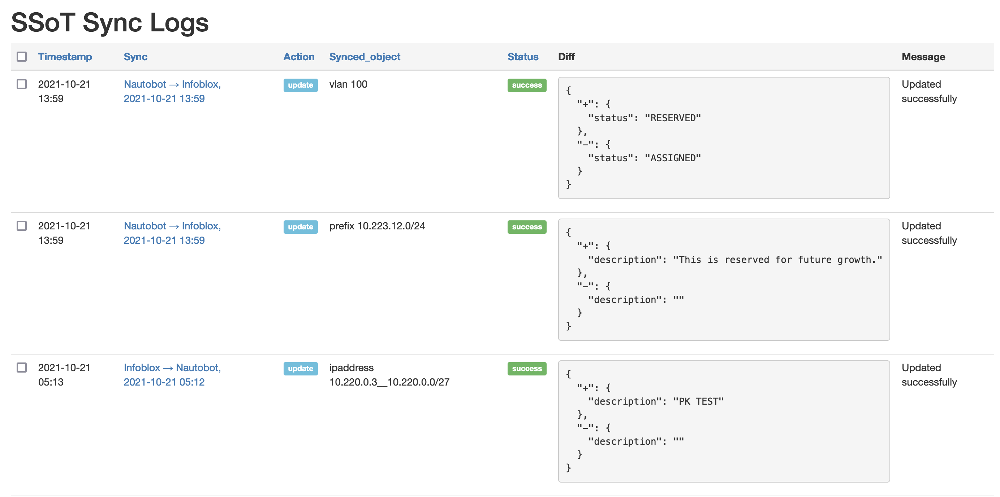
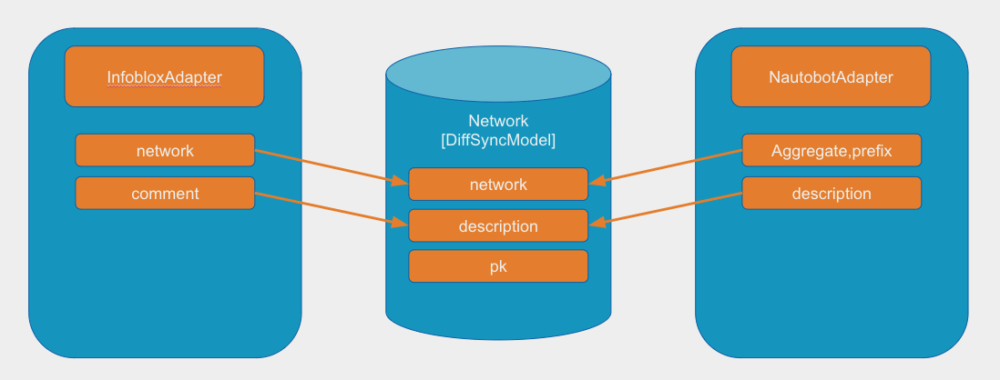
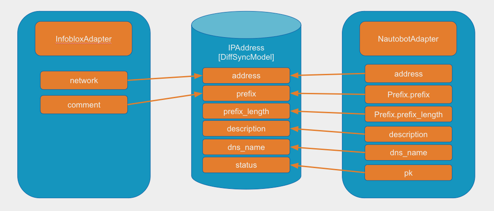
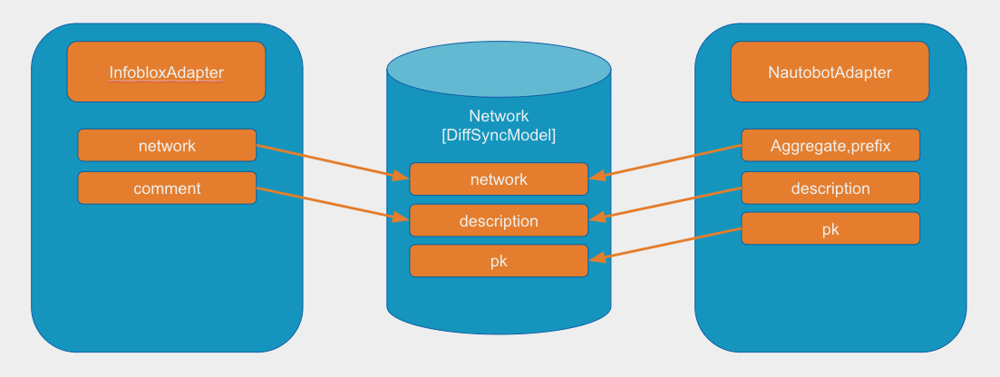

# Infoblox SSoT Integration

SSoT Infoblox integration allows synchronizing of IP network and VLAN data between [Infoblox](https://infoblox.com/) and [Nautobot](https://github.com/nautobot/nautobot).

## Usage

Below are the data mappings between objects within Infoblox and the corresponding objects within Nautobot:

| Infoblox                 | Nautobot      |
| ------------------------ | ------------- |
| Network                  | Prefix        |
| IP Address               | IP Address    |
| VLAN                     | VLAN          |
| VLAN view                | VLAN Group    |
| Network container        | Prefix        |
| Extensibility Attributes | Custom Fields |

## Extensibility Attributes

Extensibility Attributes in Infoblox are a method of adding additional contextual information to objects in Infoblox. The closest analog in Nautobot is a Custom Field so this information has been imported as such. There is also an effort to attempt to match the information in these fields where possible to available objects in Nautobot. These available links are noted below:

### Network (Prefixes)

- Site/Facility/Location
- VRF
- Role
- Tenant/Department

### IP Address

- VRF
- Role
- Tenant/Department

### VLAN Group

- Site/Facility/Location

### VLAN

- Site/Facility/Location
- Role
- Tenant/Department

### Aggregate

- Tenant/Department

!!! note
    Extensibility Attribute name matching is **case-insensitive**. An attribute named `SITE`, `Site`, or `site` is all treated as a location link.

#### Location matching

By default, an Extensibility Attribute named `site`, `facility`, or `location` is matched (by value) to a Nautobot Location. Matching is case-insensitive on both the attribute name and its value, so an Infoblox value of `MEMPHIS` will match a Nautobot Location named `Memphis`. The referenced Location must already exist in Nautobot - it is not created by the sync.

If your Infoblox instance stores the Location under a different attribute name, set the **Infoblox Location Extensibility Attribute** (`infoblox_location_ext_attr`) option on the SSoT config. When set, **only** that attribute name is matched to a Location, and the built-in `site`/`facility`/`location` names become ordinary Custom Fields. Leave the option blank to keep the default `site`/`facility`/`location` behavior.

## Screenshots

