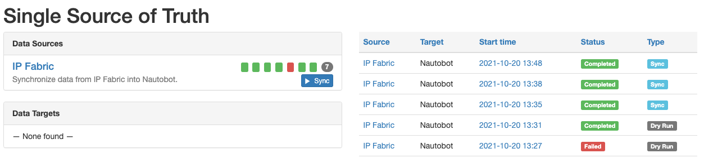
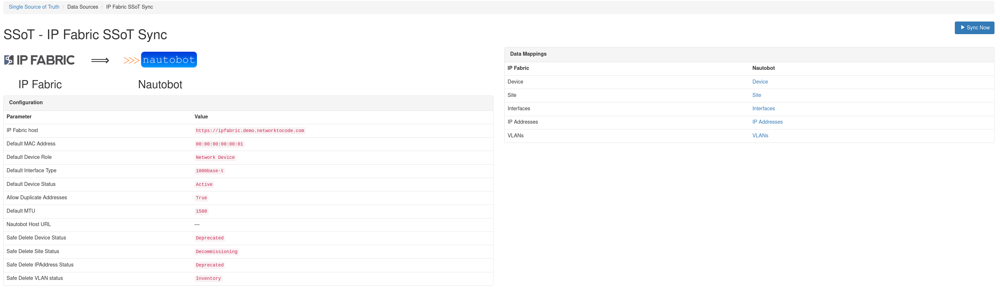
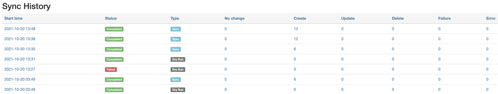
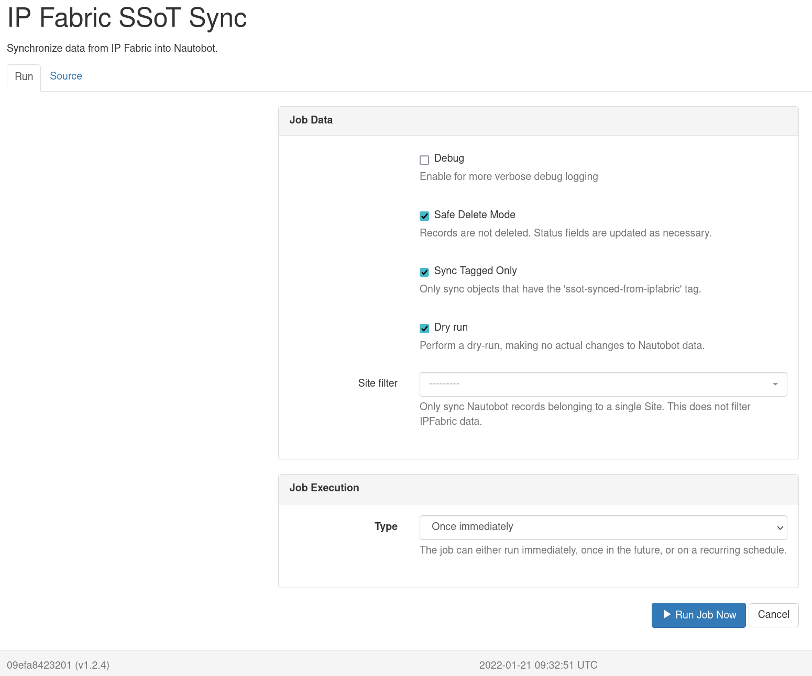
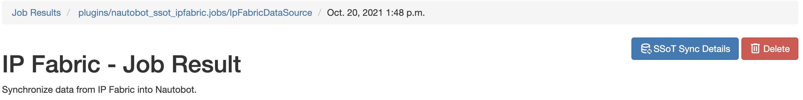
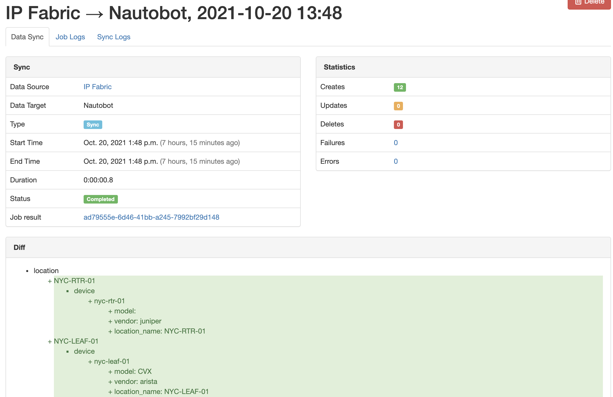
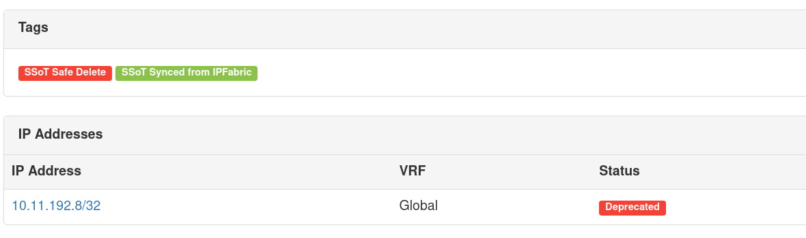
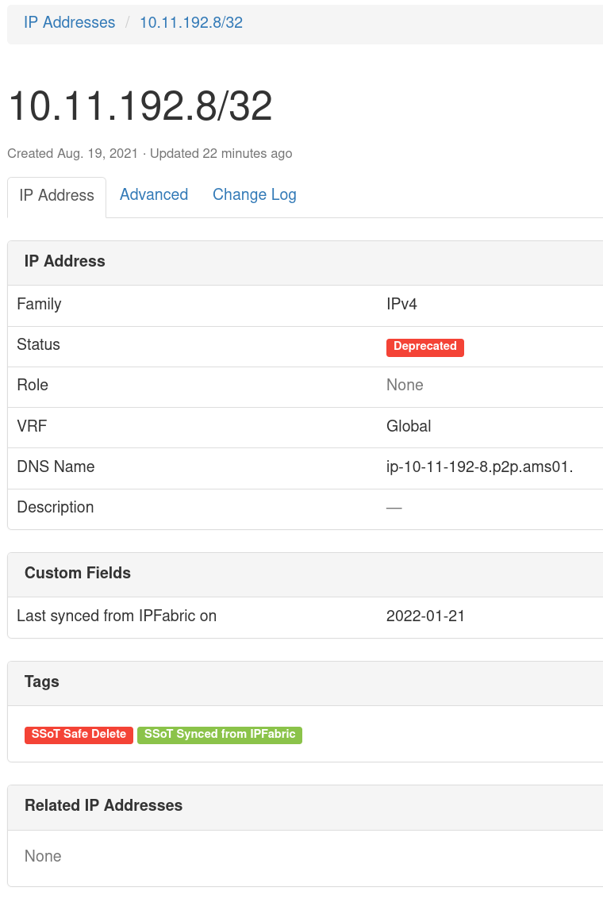
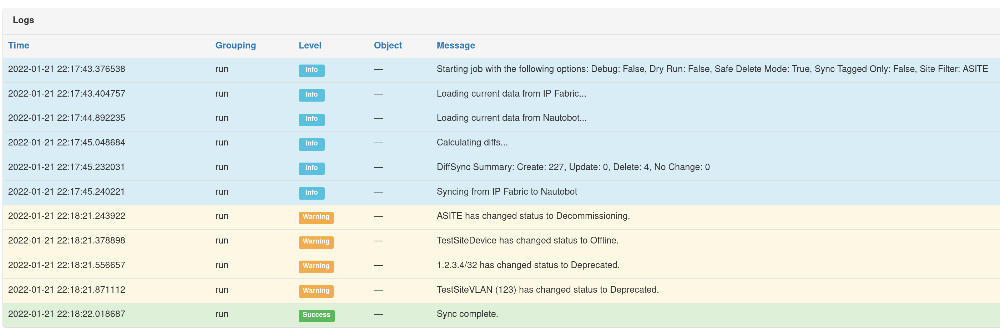
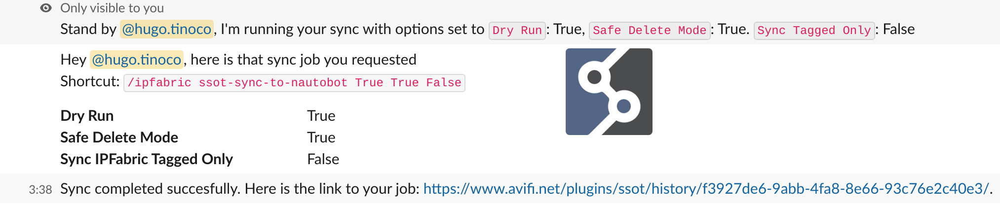

# IPFabric SSoT Integration

SSoT IPFabric integration providing a simple way to synchronize data between [IPFabric](https://ipfabric.io/) and [Nautobot](https://github.com/nautobot/nautobot). Ensure data stays consistent between the two platforms by leveraging [DiffSync](https://github.com/networktocode/diffsync) capabilities and allowing users to take full advantage of both platforms with up-to-date, synchronized data.

## Usage

You can navigate to the SSoT Dashboard with the following steps:

1. Click the **Plugins** menu and select **Dashboard** under *Single Source of Truth*.

Now you should see the dashboard with information pertaining to **IP Fabric**.

We can see **IP Fabric** under **Data Sources** with some quick information such as the results of the latest synchronizations and the ability to launch the synchronization job.

On the right-hand side, we're provided with additional information such as the source, target, start time, status, and the type of job.

Let's go ahead and click on **IP Fabric** under **Data Sources**.

Now we can see additional details as to which IP Fabric host we're syncing from and the models that get mapped between the source and destination. We can also kick off sync job by clicking on **Sync Now**, but we will revisit that shortly.

Below, the sync history is provided with more details of what happened during each synchronization job.

Now back to running the job. Let's click on **Sync Now**.

There are several options available.

- **Debug**: Enables more verbose logging that can be useful for troubleshooting synchronization issues.
- **Safe Delete Mode**: Delete operations changes the object status to a predefined value (configurable via settings) and tags the object with `ssot-safe-delete` tag.
- **Sync Tagged Only**: Only load Nautobot data into DiffSync adapters that's been tagged with `ssot-synced-from-ipfabric` tag.
- **Dry run**: This will only report the difference between the source and destination without synchronization.
- **Site Filter**: Filter the data loaded into DiffSync by a top level location of a specified Site.

If interested to see the source code, click on **Source**.

After a job is launched, you will be redirected to the job results page which will provide any logged messages during the synchronization.

If you're interested in more details, click **SSoT Sync Details**.

You can then view the details of each object.

## DiffSync Models

Currently, this integration will provide the ability to sync the following IP Fabric models into Nautobot.

- Site ➡️ Nautobot Site
- Device ➡️ Nautobot Device
- Part Numbers ➡️ Nautobot Manufacturer/Device Type/Platform
- Interfaces ➡️ Nautobot Device Interfaces
- IP Addresses ➡️ Nautobot IP Addresses

### IPFabric Site

| IP Fabric (Source) | DiffSync Model | Nautobot (Destination) |
| ------------------ | -------------- | ---------------------- |
| siteName           | Location.name  | Site                   |

### IPFabric Device

| IP Fabric (Source) | DiffSync Model       | Nautobot (Destination) |
| ------------------ | -------------------- | ---------------------- |
| hostname           | Device.name          | Device.name            |
| siteName           | Device.location_name | Device.site            |
| vendor             | Device.vendor        | Device.manufacturer    |
| model              | Device.model         | Device.device_type     |
| sn                 | Device.serial_number | Device.serial          |

### IPFabric Interface

| IP Fabric (Source) | DiffSync Model          | Nautobot (Destination)    |
| ------------------ | ----------------------- | ------------------------- |
| intName            | Interface.name          | Interface.name            |
| hostname           | Interface.device_name   | Interface.assigned_object |
| mac                | Interface.mac_address   | Interface.mac_address     |
| mtu                | Interface.mtu           | Interface.mtu             |
| N/A                | Interface.type          | Interface.type            |
| primaryIp          | Interface.ip_address    | IPAddress.address         |
| N/A                | Interface.subnet_mask   | IPAddress.address         |
| N/A                | Interface.ip_is_primary | Device.primary_ip         |

> Note: Interfaces only support synchronizing 1 IP Address at the moment.

### IPFabric VLAN

| IP Fabric (Source) | DiffSync Model | Nautobot (Destination) |
| ------------------ | -------------- | ---------------------- |
| vlanName           | Vlan.name      | VLAN.name              |
| vlanId             | Vlan.vid       | VLAN.vid               |
| status             | Vlan.status    | VLAN.status            |
| siteName           | Vlan.site      | VLAN.site              |

## Safe Delete Mode

By design, a Nautobot SSoT app using DiffSync will Create, Update or Delete when synchronizing two data sources. However, this may not always be what we want to happen with our Source of Truth (Nautobot). A job configuration option is available and enabled by default to prevent deleting objects from the database and instead, update the `Status` of said object alongside assigning a default tag, `ssot-safe-delete`. For example, if an additional snapshot is created from IPFabric, synchronized with Nautobot and, it just so happens that a device was unreachable, down for maintenance, etc., This doesn't `always` mean that our Source of Truth should delete this object, but we may need to bring attention to this matter. We let you decide what should happen. One thing to note is that some of the objects will auto recover from the changed status if a new job shows the object is present. However, currently, IP addresses and Interfaces will not auto-update to remove the `ssot-safe-delete` tag. The user is responsible for reviewing and updating accordingly. Safe delete tagging of objects works in an idempotent way. If an object has been tagged already, the custom field defining the last update will not be updated with a new sync date from IPFabric. So, if you re-run your sync job days apart and, you'd expect the date to change, but the object has been flagged as safe to delete; you will not see an updated date on the object custom field unless the status changed, in which case the tag (depending on the object) would be removed followed by updating the last date of sync.

The default status change of an object were to be `deleted` by SSoT DiffSync operations, will be specified below. These are the default transitions states, unless otherwise specified in the configuration options of the integration by a user.

- Device -> Offline (Auto deletes tag upon recovery)
- IPAddresses -> Deprecated (Does not auto-delete tag upon recovery)
- VLAN -> Deprecated (Auto deletes tag upon recovery)
- Site -> Decommissioning (Auto deletes tag upon recovery)
- Interfaces -> Tagged with `ssot-safe-delete` (Does not auto-delete tag upon recovery)

If you would like to change the default status change value, ensure you provide a valid status name available for the referenced object. Not all objects share the same `Status`.

An example object that's been modified by SSoT App and tagged as `ssot-safe-delete` and `ssot-synced-from-ipfabric`. Notice the Status and child object, IPAddress has also changed to Deprecated and, it's status changed and tagged as well.

During job execution, a warning will be provided to show the status change of an object.

If an object has already been updated with the tag, a warning message will be displayed and the object will not be modified (including sync date).

## ChatOps

As part of the SSoT synchronization capabilities with IP Fabric, this integration extends the [Nautobot ChatOps app](https://github.com/nautobot/nautobot-plugin-chatops) by providing users with the ability to begin the sync job from a ChatOps command (Slack).

## Screenshots

Main SSoT IPFabric Dashboard:

Sync Details:

