# IPFabric SSoT Integration

SSoT IPFabric integration providing a simple way to synchronize data between [IPFabric](https://ipfabric.io/) and [Nautobot](https://github.com/nautobot/nautobot). Ensure data stays consistent between the two platforms by leveraging [DiffSync](https://github.com/networktocode/diffsync) capabilities and allowing users to take full advantage of both platforms with up-to-date, synchronized data.

## Usage

You can navigate to the SSoT Dashboard with the following steps:

1. Click the **Plugins** menu and select **Dashboard** under *Single Source of Truth*.

Now you should see the dashboard with information pertaining to **IP Fabric**.

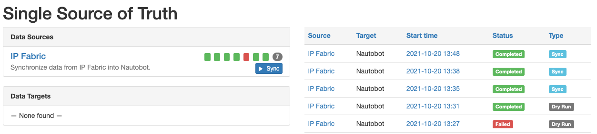

We can see **IP Fabric** under **Data Sources** with some quick information such as the results of the latest synchronizations and the ability to launch the synchronization job.

On the right-hand side, we're provided with additional information such as the source, target, start time, status, and the type of job.

Let's go ahead and click on **IP Fabric** under **Data Sources**.

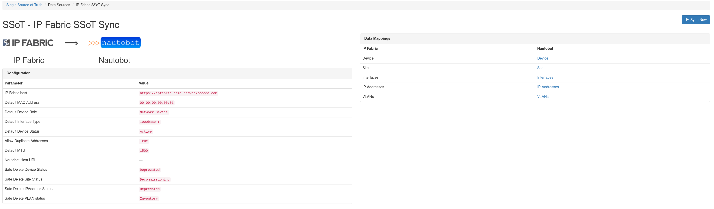

Now we can see additional details as to which IP Fabric host we're syncing from and the models that get mapped between the source and destination. We can also kick off sync job by clicking on **Sync Now**, but we will revisit that shortly.

Below, the sync history is provided with more details of what happened during each synchronization job.

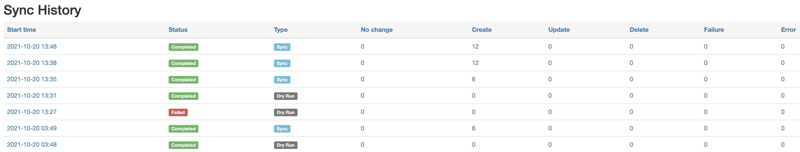

Now back to running the job. Let's click on **Sync Now**.

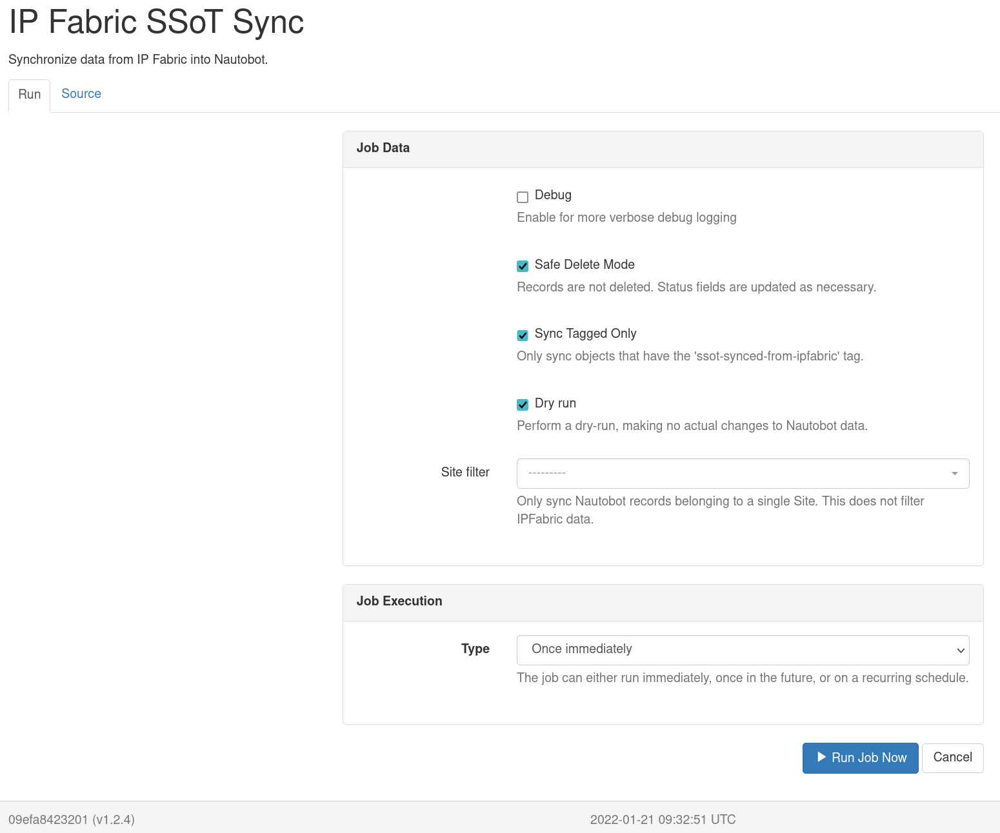

There are several options available.

- **Debug**: Enables more verbose logging that can be useful for troubleshooting synchronization issues.
- **Safe Delete Mode**: Delete operations changes the object status to a predefined value (configurable via settings) and tags the object with `SSoT Safe Delete` Tag.
- **Sync Tagged Only**: Only load Nautobot data into DiffSync adapters that has the `SSoT Synced from IPFabric` Tag.
- **Bulk Write Mode**: Write objects in batches rather than one at a time. Much faster on a large sync, at the cost of change log entries, signals and per-object validation. Disabled by default; see [Bulk Write Mode](#bulk-write-mode) for what it does and does not give up.
- **Sync Locations**: Create, update and delete Nautobot Locations from IP Fabric sites. Enabled by default. Deselect where another system owns the site list; see [Choosing what to sync](../../admin/integrations/ipfabric_setup.md#locations) for what that does and does not stop.
- **Sync Manufacturers**: Create Nautobot Manufacturers for the vendors IP Fabric reports. Enabled by default.
- **Sync Device Types**: Create Nautobot Device Types for the models IP Fabric reports. Enabled by default.
- **Sync Roles**: Create Nautobot Roles from the device types IP Fabric reports. Enabled by default.
- **Sync Platforms**: Create Nautobot Platforms from the families IP Fabric reports. Enabled by default.
- **Sync Interfaces**: Sync each Device's Interfaces. Enabled by default.
- **Sync IP Addresses**: Sync the IP Address on each Interface. Enabled by default; requires **Sync Interfaces**.
- **Sync Primary IP**: Assign a Device's primary IP from IP Fabric. Enabled by default; requires **Sync IP Addresses**. IP Fabric reports the address it logged in with, which is not necessarily the address a CMDB considers the management one.
- **Sync VLANs**: Sync each Location's VLANs. Enabled by default.
- **Sync VRFs**: Create Nautobot VRFs in the Global Namespace from the routing instances IP Fabric reports. Disabled by default. See [VRFs and Route Targets](#vrfs-and-route-targets).
- **Sync Route Targets**: Sync the Route Targets IP Fabric reports and record each synced VRF's import and export targets. Disabled by default; requires **Sync VRFs**.
- **Sync Device VRFs**: Record which Devices carry each VRF. Disabled by default; requires **Sync VRFs**.
- **Sync Interface VRFs**: Put each Interface in the VRF IP Fabric reports for it. Disabled by default; requires **Sync Interfaces** and **Sync Device VRFs**.
- **Sync Cables**: Sync the device connections in IP Fabric's connectivity matrix to Nautobot Cables. Disabled by default; requires **Sync Interfaces**. See [Cables](#cables).
- **Dry run**: This will only report the difference between the source and destination without synchronization.
- **Site Filter**: Filter the data loaded into DiffSync by a top level location of a specified Site.

Deselecting an object type keeps it out of the sync in both directions, so existing Nautobot records of that type are left untouched rather than removed as absent from IP Fabric. An object type whose requirement is not selected is skipped, and the Job log names the unmet requirement. Devices are always synced, since every other object type is either a Device or hangs off one.

Which types appear on the form, and which are pre-selected, can be set per installation. See [Choosing what to sync](../../admin/integrations/ipfabric_setup.md#choosing-what-to-sync).

If interested to see the source code, click on **Source**.

After a job is launched, you will be redirected to the job results page which will provide any logged messages during the synchronization.

If you're interested in more details, click **SSoT Sync Details**.

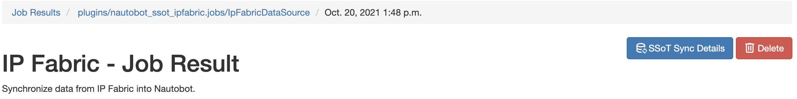

You can then view the details of each object.

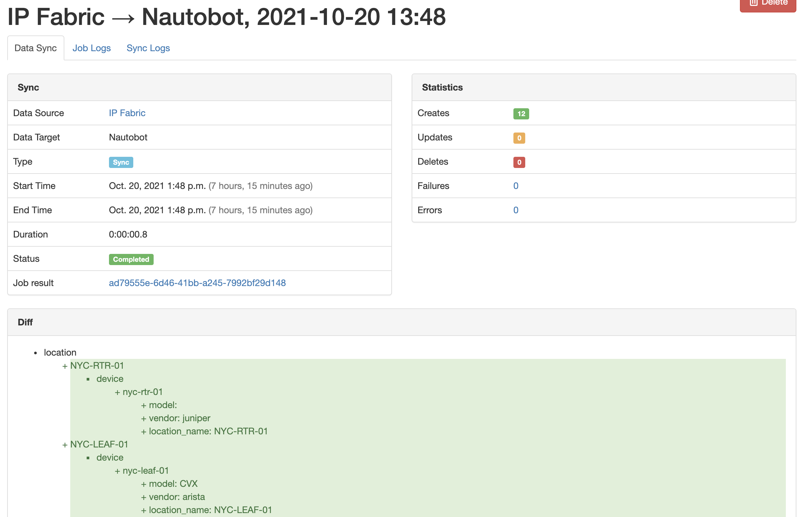

## DiffSync Models

Currently, this integration will provide the ability to sync the following IP Fabric models into Nautobot.

- Site ➡️ Nautobot Site
- Device ➡️ Nautobot Device
- Part Numbers ➡️ Nautobot Manufacturer/Device Type/Platform
- Interfaces ➡️ Nautobot Device Interfaces
- IP Addresses ➡️ Nautobot IP Addresses (primary, secondary, IPv6 and FHRP virtual)
- Stack Members ➡️ Nautobot Virtual Chassis
- Connectivity Matrix ➡️ Nautobot Cables (opt in, see [Cables](#cables))

### IPFabric Site

| IP Fabric (Source) | DiffSync Model | Nautobot (Destination) |
| ------------------ | -------------- | ---------------------- |
| siteName           | Location.name  | Site                   |

### IPFabric Device

| IP Fabric (Source) | DiffSync Model       | Nautobot (Destination) |
|--------------------|----------------------|------------------------|
| hostname           | Device.name          | Device.name            |
| siteName           | Device.location_name | Device.site            |
| vendor             | Device.vendor        | Device.manufacturer    |
| model              | Device.model         | Device.device_type     |
| sn                 | Device.serial_number | Device.serial          |
| devType*           | Device.role          | Device.role            |

> Note: `devType` is an IP Fabric field that can be used to set the Device role. This can be disabled by setting `ipfabric_sync_ipf_dev_type_to_role` to `False` in the configuration. If this is disabled, the default role will be used for adding new devices and roles will be ignored during diffsync update preventing a custom Nautobot role from being overridden.

> Note: disabling `ipfabric_sync_ipf_dev_type_to_role` does not make the sync role-neutral. It stops
> the IP Fabric device type deciding the role, but a Device the sync creates still receives the role
> named by `ipfabric_default_device_role`, because Nautobot requires one. To stop the sync creating
> that Role, deselect **Sync Roles** or select Roles under [Strict Objects](#strict-objects); a
> Device whose role Nautobot does not already hold is then skipped.

### IPFabric Interface

| IP Fabric (Source) | DiffSync Model          | Nautobot (Destination)    |
| ------------------ | ----------------------- | ------------------------- |
| intName            | Interface.name          | Interface.name            |
| hostname           | Interface.device_name   | Interface.assigned_object |
| mac                | Interface.mac_address   | Interface.mac_address     |
| mtu                | Interface.mtu           | Interface.mtu             |
| N/A                | Interface.type          | Interface.type            |
| primaryIp          | Interface.ip_address    | IPAddress.address         |
| N/A                | Interface.subnet_mask   | IPAddress.address         |
| N/A                | Interface.ip_is_primary | Device.primary_ip         |

> Note: Interfaces only support synchronizing 1 IP Address at the moment.

### IPFabric VLAN

| IP Fabric (Source) | DiffSync Model   | Nautobot (Destination) |
| ------------------ | ---------------- | ---------------------- |
| vlanId             | Vlan.vid         | VLAN.vid               |
| siteName           | Vlan.location    | VLAN.locations         |
| vlanName           | Vlan.name        | VLAN.name              |
| dscr               | Vlan.description | VLAN.description       |
| —                  | Vlan.status      | VLAN.status            |

The first two rows are what identify a VLAN; see [How a VLAN is identified](#how-a-vlan-is-identified).

### IPFabric VRF

VRFs are built from IP Fabric's VRF detail table (`tables/vrf/detail`), which names every VRF and the route distinguisher each device carrying it reports, and its L3 VPN route targets table (`tables/mpls/l3-vpn/vrf-targets`).

| IP Fabric (Source) | DiffSync Model     | Nautobot (Destination)   |
| ------------------ | ------------------ | ------------------------ |
| vrf                | Vrf.name           | VRF.name                 |
| rd                 | Vrf.rd             | VRF.rd                   |
| importRT           | Vrf.import_targets | VRF.import_targets       |
| exportRT           | Vrf.export_targets | VRF.export_targets       |
| N/A                | Vrf.status         | VRF.status               |
| N/A                | Vrf.conflict       | VRF.cf.ipfabric_vrf_conflict |

### IPFabric Route Target

Route Targets carry no attributes of their own. IP Fabric reports a route target as the value and
nothing else, so a target either exists or it does not; Nautobot's description and tenant are left
alone, and an operator can annotate one without the sync overwriting it.

| IP Fabric (Source) | DiffSync Model    | Nautobot (Destination) |
| ------------------ | ----------------- | ---------------------- |
| importRT/exportRT  | RouteTarget.name  | RouteTarget.name       |

### IPFabric VRF Device Assignment

One record per Device per VRF, from the same VRF detail table the VRFs themselves come from. A model
of its own rather than a list of VRFs on the Device, because that is the shape of the data at both
ends, so a Device that picks up one more VRF reports that assignment rather than its whole set.

| IP Fabric (Source) | DiffSync Model                    | Nautobot (Destination)     |
| ------------------ | --------------------------------- | -------------------------- |
| vrf                | VrfDeviceAssignment.vrf_name      | VRFDeviceAssignment.vrf    |
| hostname           | VrfDeviceAssignment.device_name   | VRFDeviceAssignment.device |

### IPFabric Interface VRF

Read from IP Fabric's VRF interfaces table (`tables/vrf/interfaces`) rather than from the managed
addressing the sync already reads, because an Interface can be in a VRF while carrying no address.

| IP Fabric (Source) | DiffSync Model                 | Nautobot (Destination) |
| ------------------ | ------------------------------ | ---------------------- |
| hostname           | InterfaceVrf.device_name       | Interface.device       |
| intName            | InterfaceVrf.interface_name    | Interface.name         |
| vrf                | InterfaceVrf.vrf_name          | Interface.vrf          |

### IPFabric Cable

Cables are built from IP Fabric's connectivity matrix (`tables/interfaces/connectivity-matrix`), which reports links that IP Fabric has already correlated from both ends.

| IP Fabric (Source)   | DiffSync Model               | Nautobot (Destination)      |
| -------------------- | ---------------------------- | --------------------------- |
| localHost/remoteHost | Cable.termination_a_device   | Cable.termination_a.device  |
| localInt/remoteInt   | Cable.termination_a_name     | Cable.termination_a.name    |
| localHost/remoteHost | Cable.termination_b_device   | Cable.termination_b.device  |
| localInt/remoteInt   | Cable.termination_b_name     | Cable.termination_b.name    |
| N/A                  | Cable.status                 | Cable.status                |

## How a VLAN is identified

A VLAN is identified by its **VLAN ID at a Location**. The name is an attribute, not part of the
identity, which is what makes a rename on the network read as an update to the VLAN Nautobot already
holds rather than as one VLAN replacing another. The VLAN ID is the identifier that persists across
a rename on the device, and it is what IP Fabric keys its per-site VLAN summary on.

**What this changes on upgrade.** If Nautobot already holds a VLAN with the same VLAN ID at the same
Location but a different name, the first sync after upgrading renames it to what IP Fabric reports.
Previously the sync created a second VLAN under the new name and removed — or, under Safe Delete
Mode, deprecated and tagged — the one under the old name. So an estate that has been renaming VLANs
will see a run of renames once, and stop accumulating deprecated VLANs afterwards.

**Duplicates.** Nautobot does not constrain a VLAN ID to be unique at a Location, so a deployment can
hold two VLANs with the same one. The second is reported in the job log and not loaded, and the sync
leaves it alone. Which of the two is kept is not defined, so it is worth resolving the duplicate in
Nautobot rather than relying on the sync to pick.

**Long names.** A VLAN name longer than the 255 characters Nautobot holds is truncated, and the full
value is reported in the job log. The VLAN itself is still synced, since its identity does not depend
on the name.

## Interface Addresses

An Interface carries every address IP Fabric reports for it, each synced as its own IP Address in Nautobot. Three tables are read: `technology.addressing.managed_ip_ipv4` and `managed_ip_ipv6` for the addresses configured on the interface, and `technology.fhrp.group_members` for FHRP virtual addresses. So a secondary address, an HSRP or VRRP virtual address, and IPv6 alongside IPv4 all reach Nautobot, which is what lets a template render them from Nautobot data.

A prefix length is what the sync records, not a dotted netmask, which is what makes an IPv6 address expressible at all: a netmask is undefined above a length of 32. Each address is diffed on its own. An Interface gaining a third address reports that one address rather than its whole set, one IP Fabric stops reporting is removed without touching the rest, and the job log names the address that moved. An address is matched on its host within its Interface, not on its address, because the mask is the attribute IP Fabric can change for an address it keeps reporting; matching on the mask as well would report a corrected mask as one address replacing another.

Because every address on a synced Interface is now read, an address IP Fabric does not report is removed rather than being invisible to the sync — including an IPv6 address, or a second IPv4 one, that another system put there. Safe Delete Mode, which is on by default, marks and tags such an address rather than deleting it. Take an Interface out of scope, or deselect **Sync IP Addresses**, where another system owns the addresses on it.

Removing an address goes through Safe Delete Mode as any other object does, and with that mode disabled the address is deleted rather than only reported as deleted. Removal happens only where no other Interface holds it — one Nautobot IP Address can be assigned to several Interfaces, and deleting it for one would take it from all of them. An address on another Interface is unassigned from this one instead.

The Device's `primary_ip4` and `primary_ip6` are set by marking an address already synced from the Interface carrying it. IP Fabric reports `loginIpv4` and `loginIpv6` separately, so a dual-stack Device names one of each and Nautobot carries both; a release reporting only the older single `loginIp` column marks that one. Marking an address primary resolves nothing of its own — the prefix length is the one the Interface already reported for it. **Sync Primary IP** governs the marking alone; deselecting it still syncs the addresses themselves.

An address that stops being logged in on is unmarked, so the Device stops recording it as primary — either because the primary moved to another address or because IP Fabric reports no login address for the Device at all. The unmarking is keyed on the address the Device currently points at, so a primary that moves settles whichever of the two addresses the sync writes first.

The exception is a management address reached through NAT, which belongs to no interface and so is on none of them to mark; that is what [Placeholder Interfaces](#placeholder-interfaces) covers.

### FHRP virtual addresses

A virtual address has no subnet of its own in IP Fabric's FHRP tables, so it resolves at the third rung described under [Subnet Masks](#subnet-masks): the subnet of whichever of its Interface's addresses contains it. Where none covers it, it is withheld exactly as any other address with no usable subnet is, and counted in the same summary — it is not written under a guessed mask.

The column carrying the virtual address is not the same in every IP Fabric release, and IP Fabric reports a table's columns from the appliance rather than declaring them, so the sync looks for it under `vip`, `virtualIp` and `virtualIP`. A group member carrying none of those is reported, so a release that names it differently shows up in the job log rather than silently syncing nothing.

## Subnet Masks

An address has no mask of its own in IP Fabric. The subnet comes from the managed address tables (`technology.addressing.managed_ip_ipv4` and `managed_ip_ipv6`), which are the only place IP Fabric says what subnet an address was configured with. Four sources are tried in order, so every address resolves the same way whichever table it came from: the managed tables, then a subnet the record carries itself (only the fabricated management Interface does), then a subnet already resolved for that Interface which contains the address (only a record with none of its own, such as an FHRP virtual address, may take this), and failing all of those the fallback below.

IP Fabric describes a subnet per Device, so an address on several Devices carries whatever subnet each of them reports for it. Nautobot holds one mask per IP Address, and parents an address to the most specific Prefix containing it, so two records for one address in a Namespace cannot coexist.

Where the reports disagree, the sync takes the narrowest of them for every Interface carrying that address, which is the report that agrees with the address's parent Prefix, and logs the address it did this for. Choosing once rather than per Device is what lets the mask settle; following each Device's own report left every run rewriting what the last had written.

### When no subnet mask is reported

With **IP Addresses** selected under [Strict Objects](#strict-objects), which is the default, an address the table reports no subnet mask for is reported as absent. The mask Nautobot already holds is then left alone, and an address Nautobot does not hold is not created. The job logs how many addresses this applied to; enable **Debug** to see which they were and on which Interface each was found.

The selection governs reading on both sides, as **Sync Tagged Only** does, so that an address withheld from writing is not reported as a difference on every run.

Deselecting it syncs the address as a host route instead — a `/32`, or a `/128` for IPv6. That puts it under the wrong parent Prefix and leaves nothing to distinguish it from an address genuinely configured as a host route, so every use of the fallback is logged as a warning naming the address. Deselect it only where a host route is preferable to no change at all.

A NAT management address is unaffected by this selection. It belongs to no interface, so IP Fabric reports no subnet for it and a host route is the whole of it — the value rather than a fallback. Whether that address is carried at all is decided by the **Interfaces** selection instead, since it needs an Interface the device does not have; see [Placeholder Interfaces](#placeholder-interfaces).

A subnet that does not parse counts as none reported: it is logged and passed over rather than raised, since one such row would otherwise end the job while it was still reading and lose every address that was fine. Either IP version is accepted, since what the sync records is a prefix length. Whether the subnet contains the address it was reported for is not checked; that is a different kind of wrong data, and one this sync has no better answer for than the mask itself.

## Strict Objects

**Strict Objects** is a check on the data IP Fabric reported, applied on top of what is in scope. The scope decides which object types a run covers; this decides, for the types it does cover, whether what IP Fabric said about them is taken on trust or checked first. Nothing here brings a type into scope, and selecting a type that is out of scope does nothing — the job says so rather than leaving the selection looking like the reason nothing was written.

Left unselected, the sync takes the report at face value and fills any gap itself: a site name becomes a Location, a model becomes a Device Type, a family becomes a Platform, an address with no reported subnet becomes a host route. Where the data is good that is exactly right, and it is what makes bootstrapping an empty Nautobot work. Where it is not, a typo mints a near duplicate that is indistinguishable from a curated record.

Selected, the value is checked instead. For a supporting object the check is that the name resolves to something Nautobot already holds; for an address it is that IP Fabric reported a subnet mask for it. What fails is reported, the affected record is left unwritten, and the sync carries on with the rest. Selecting a type never stops Devices syncing.

What a failed check costs differs by type:

| Selected | When the reported value does not check out |
| -------- | ------------------------------------------ |
| Locations | The site is reported and the Devices at it are skipped. |
| Manufacturers | The vendor is reported, and no Device Type is filed under it. |
| Device Types | The model is reported and the Device is skipped, since Nautobot requires one. |
| Roles | The role is reported and the Device is skipped, since Nautobot requires one. |
| Platforms | The platform is reported and the Device is synced without one, as Platform is optional. |
| Statuses | The status is reported and the record that needed it is skipped. |
| Virtual Chassis | The stack is reported and its membership is left unrecorded. |
| Interfaces | No Interface is invented to hold a management address IP Fabric reports against none, so that address goes unsynced. |
| IP Addresses | The address is reported and left as Nautobot holds it. See [Subnet Masks](#subnet-masks). |

Only **IP Addresses** is selected by default. Whether a name may be trusted depends on who owns the object, which only you know, so every other type defaults to taking the report on trust and an existing sync does not change behaviour on upgrade. A mask the source never reported is not data whoever owns IPAM, which is why that one is checked by default. Each default can be set for the whole instance with an `ipfabric_strict_<type>` setting, for example `ipfabric_strict_locations`.

For a type the sync only ever creates — Manufacturers, Device Types, Platforms, Statuses — a failed check and a deselected **Sync** option leave Nautobot in the same state, since creating is all the sync would have done. They still answer different questions: deselecting **Sync Manufacturers** means this run does not sync vendors at all, while selecting Manufacturers here means it does sync them and reports a vendor whose Manufacturer is missing rather than inventing one.

Safe Delete Mode's own statuses are outside this control. They are the integration's vocabulary rather than anything IP Fabric reported, so there is nothing to check, and refusing to create one would leave a record neither deleted nor marked — the outcome Safe Delete Mode exists to prevent.

### Placeholder Interfaces

Where a Device's management address matches no Interface IP Fabric reported, which happens when the address is reached through NAT, the sync invents an Interface named `pseudo_mgmt` to hold it. That Interface does not exist on the device, so anything reading Nautobot Interfaces as real is misled by it.

Selecting **Interfaces** under Strict Objects stops it being invented. The Interfaces IP Fabric did report are synced as before; only the placeholder is withheld, and the management address goes with it, since it had no Interface of its own to sit on.

The selection stops new placeholders rather than removing those an earlier run created. One already in Nautobot is left alone — withdrawing it from only one side of the diff would read as absent from IP Fabric and delete it — and the job names every one it found, so they can be dealt with deliberately.

## Sync Tagged Only

With **Sync Tagged Only** selected, which is the default, the sync reads and writes only Devices carrying the `SSoT Synced from IPFabric` Tag. Deselecting it brings every Device in the selected Locations into scope, including Devices another process created, and the sync then updates their Interfaces as well as those of the Devices it created itself.

The option governs reading and writing together. It has to: a Device loaded from Nautobot but excluded from writing would have every difference IP Fabric reports about it reported again on every run and never applied.

## VRFs and Route Targets

VRF synchronization is opt in via the **Sync VRFs** job option and is disabled by default, because a network whose VRFs are modelled in another system should not have them introduced by a sync. Route targets are a second option on top of it, so a deployment that wants VRFs but governs route targets elsewhere can have one without the other.

VRFs are created in the Global Namespace, the same Namespace this integration puts Prefixes and IP Addresses in.

### One value per VRF, from many devices

IP Fabric reports a route distinguisher per device, and route targets per device and per address family. Nautobot holds one route distinguisher and one set of targets per VRF. The sync therefore reconciles what the devices reported before writing anything:

- Where every device carrying a VRF reports the same route distinguisher, that is the VRF's.
- Where they disagree, the network is misconfigured. No route distinguisher is recorded, and the disagreement is written to the **IPFabric VRF Conflict** custom field. A VRF silently carrying one device's value would be worse than one carrying none: there would be nothing to say which device it came from, or that there was a disagreement at all.
- Route targets are reconciled the same way, and independently of the route distinguisher, so a VRF whose devices agree on one but not the other still records the one they agree on.
- A device's address families are combined rather than reconciled against each other, since Nautobot holds one set of targets per VRF: a device importing one target for IPv4 and another for IPv6 imports both.
- A VRF that has no route distinguisher and no route targets on any device is created as it is.

### Route Targets as objects

Route Targets are an object type of their own, synced ahead of the VRFs that name them and counted
in a run's own create and delete totals. A VRF records the targets Nautobot holds; it does not
create them.

A Route Target's name is unique across the whole of Nautobot, so one that another process already
created is the same object this sync would have made. It is adopted and marked as synced rather than
duplicated, which is what lets a first run converge against an existing estate.

Only the Route Targets this integration created are loaded back from Nautobot — those carrying the
`SSoT Synced from IPFabric` Tag. A Route Target has no Location, no Device and no Namespace to bound
a load by, so loading all of them would have the sync delete every Route Target another system owns
the moment IP Fabric stopped reporting it.

### Which Devices carry a VRF

**Sync Device VRFs** records the Devices each VRF is configured on, from the same table the VRFs come
from. The assignment inherits the VRF's route distinguisher and name, which is what Nautobot does
itself when one is created through the UI or API.

Only Devices the run covers are assigned. A Site Filter, **Sync Tagged Only**, or a stack member
whose VRFs IP Fabric reports against its master can all leave a hostname outside the run, and those
are skipped rather than assigned to a Device the sync never saw. That is also why this needs no
special handling for a filtered run, unlike the VRFs themselves: an assignment belongs to a Device,
and Devices are narrowed by the filter on both sides at once.

An assignment has neither a Status nor a Tag, so **Safe Delete Mode** has nothing to mark on one. A
run with Safe Delete Mode on therefore leaves an assignment IP Fabric no longer reports in place, and
reports it as a deletion it did not make; a run with Safe Delete Mode off removes it.

### Which VRF an Interface is in

**Sync Interface VRFs** puts each Interface in the VRF IP Fabric reports for it. It needs **Sync
Device VRFs**, because Nautobot refuses an Interface a VRF that is not assigned to the Interface's
Device, and that assignment is what **Sync Device VRFs** makes.

That requirement is also why this is written last, after every Device, VRF and assignment. An
Interface is created with its Device, which happens before any VRF exists, so the VRF it belongs to
cannot be set at the same time.

Only Interfaces that are in a VRF are tracked, on either side. An Interface IP Fabric stops
reporting a VRF for is taken out of the one it is in; nothing is deleted, so **Safe Delete Mode**
does not apply — the Interface and the VRF both remain, and what goes is the reference between them.

### What the sync will not do

A VRF name that the Global Namespace already holds twice is left alone entirely, and the Job log says so. Nautobot constrains a VRF to a unique route distinguisher within its Namespace but not to a unique name, so a Namespace can hold two VRFs called the same thing, and IP Fabric reports nothing that would say which of them its report describes.

With a **Site Filter** applied, VRFs and Route Targets are created and updated but never deleted. A filtered run sees only the VRFs configured on that site's devices, and the Route Targets those VRFs name, so everything else Nautobot holds would look absent from IP Fabric.

## Cables

Cable synchronization is opt in via the **Sync Cables** job option, and is disabled by default because Nautobot allows only one Cable per Interface. Enabling it lets the sync replace connections that were recorded by hand.

A link has no stable identifier in either system: IP Fabric reports it once from each device's point of view, and Nautobot stores whichever end was cabled first as the A side. Both adapters therefore sort a link's two `(device, interface)` endpoints and use the lower one as the A side, so the same physical link resolves to one Cable either way.

Only links with both endpoints in scope are synced, since a Cable with one end out of scope would look absent from IP Fabric and be deleted on every run. A link is skipped when:

- Either Interface was not loaded, because a Site filter excludes the far end, or because the far end is a stack member whose interfaces IP Fabric reports against the stack master.
- Either Interface is virtual or wireless. Nautobot refuses to cable these types, and IP Fabric reports links over tunnel interfaces.
- The entry does not name both a device and an interface on each side.
- The Interface at either end is already recorded on a link kept earlier in the same run. IP Fabric describes a shared segment, such as a cloud subnet, as a link from every Interface in it to the segment, so one Interface can be reported on many links. Nautobot terminates at most one Cable on an Interface, so the lowest sorting of those links is kept and the rest are logged. The choice is by sort order rather than by whichever came first in the data, so that a re-sync keeps the same link instead of replacing the Cable the previous run recorded.

When IP Fabric reports a link that has moved, the Cable holding the Interface must be removed before the new one can be recorded. With **Safe Delete Mode** enabled, this does not happen; the conflict is logged as a warning and the new Cable is not created, leaving the change for an operator to review. With Safe Delete Mode disabled, the stale Cable is deleted and the new one is created.

## Bulk Write Mode

A sync writes each object on its own: Nautobot validates it, records a change log entry, and fires
the signals any app has registered. For a few hundred objects that cost is invisible. An estate of a
few thousand devices carries a hundred thousand Interfaces and about as many IP Addresses, and there
the per-object cost is most of the job's run time.

**Bulk Write Mode** writes them in batches instead. Measured over 200 Interfaces each carrying an IP
address, a sync drops from 8.8 seconds to 0.5. It is disabled by default, because it gives up three
things that are worth understanding before turning it on.

### What it gives up

**No change log entries.** Nothing written in bulk appears in an object's Change Log tab, or in the
global change log, for that run. The objects themselves are still tagged `SSoT Synced from IPFabric`
and still carry the `last_synced_from_sor` custom field, so what the sync touched is still visible on
the object; what is missing is the before-and-after record of the change.

**No signals.** Anything an app has hooked to object creation does not run for objects written in
bulk. Webhooks do not fire.

**No per-object validation.** Nautobot's `clean()` is not called, so a check written in Python is not
applied. Database constraints still are: a row that violates one is refused, and the batch it stopped
is halved and retried until the rows at fault are isolated. Those are then written on their own with
`clean()` applied, so each is named in the job log, and everything beside them is still written in
batches rather than one at a time.

### Batch size

A thousand rows are inserted per statement. `ipfabric_bulk_write_batch_size` changes that, and the
value is a trade between two costs rather than a simple bigger-is-faster: a larger batch means fewer
statements for the rows that are fine, and more rows to narrow through when one of them is refused.
The narrowing is by halving, so the recovery cost grows with the logarithm of the batch rather than
with the batch, which is what makes a thousand a reasonable default. Lower it where an estate is
known to carry rows Nautobot will refuse, so that less is re-read to find them.

### Two differences to expect

Devices created in bulk do not get the components their Device Type templates define. IP Fabric
reports the interfaces a device actually has, and those are what the sync creates, so for this
integration that is usually what you want — but if you rely on Device Type templates populating
components, do not use this mode.

A duplicate Location name is not caught. Nautobot constrains a Location's name to be unique among its
siblings, and the sites this integration creates have no parent; PostgreSQL treats those as distinct,
so two sites of the same name would both be written where a per-object sync would have rejected the
second. IP Fabric reports each site once, so this is a difference rather than an outcome to expect.

On Nautobot 3.2 the same applies to two Interfaces of one name on a Device. Nautobot 3.1 refuses that
in the database, and 3.2 moved the check into Python, which a batched insert does not run. IP Fabric
reports each interface once, so this too is a difference rather than an outcome to expect.

### What it does not change

Cables are always written one at a time, whichever mode is selected. Creating a Cable also sets the
cable, peer and path fields on both Interfaces it connects and builds Nautobot's cable paths, and all
of that happens through signals a batched write does not fire. A Cable written in bulk would appear
in the Cables list while showing no connection on either interface.

Route Targets are always written one at a time as well, for the opposite reason: a network has a
handful of them, and the rows tying a VRF to its targets need the targets to exist already. The VRFs
themselves are written in batches.

Deletions are unaffected. **Safe Delete Mode** governs those, and it is independent of this setting.

## Safe Delete Mode

By design, a Nautobot SSoT app using DiffSync will Create, Update or Delete when synchronizing two data sources. However, this may not always be what we want to happen with our Source of Truth (Nautobot). A job configuration option is available and enabled by default to prevent deleting objects from the database and instead, update the `Status` of said object alongside assigning a default Tag, `SSoT Safe Delete`. For example, if an additional snapshot is created from IPFabric, synchronized with Nautobot and, it just so happens that a device was unreachable, down for maintenance, etc., This doesn't `always` mean that our Source of Truth should delete this object, but we may need to bring attention to this matter. We let you decide what should happen. One thing to note is that some of the objects will auto recover from the changed status if a new job shows the object is present. However, currently, IP addresses and Interfaces will not auto-update to remove the `SSoT Safe Delete` Tag. The user is responsible for reviewing and updating accordingly. Safe delete tagging of objects works in an idempotent way. If an object has been tagged already, the custom field defining the last update will not be updated with a new sync date from IPFabric. So, if you re-run your sync job days apart and, you'd expect the date to change, but the object has been flagged as safe to delete; you will not see an updated date on the object custom field unless the status changed, in which case the tag (depending on the object) would be removed followed by updating the last date of sync.

The default status change of an object were to be `deleted` by SSoT DiffSync operations, will be specified below. These are the default transitions states, unless otherwise specified in the configuration options of the integration by a user.

- Device -> Offline (Auto deletes tag upon recovery)
- IPAddresses -> Deprecated (Does not auto-delete tag upon recovery)
- VLAN -> Deprecated (Auto deletes tag upon recovery)
- Site -> Decommissioning (Auto deletes tag upon recovery)
- Interfaces -> Tagged with `SSoT Safe Delete` (Does not auto-delete Tag upon recovery)
- Cable -> Decommissioning (Auto deletes tag upon recovery)

If you would like to change the default status change value, ensure you provide a valid status name available for the referenced object. Not all objects share the same `Status`.

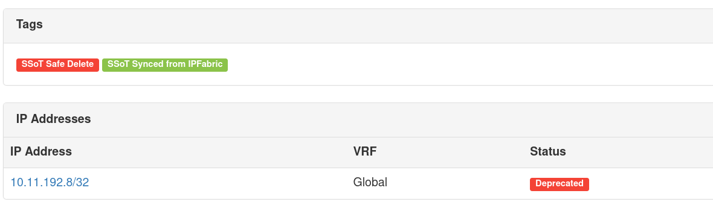

An example object that's been modified by SSoT App and tagged as `SSoT Safe Delete` and `SSoT Synced from IPFabric`. Notice the Status and child object, IPAddress has also changed to Deprecated and, it's status changed and tagged as well.

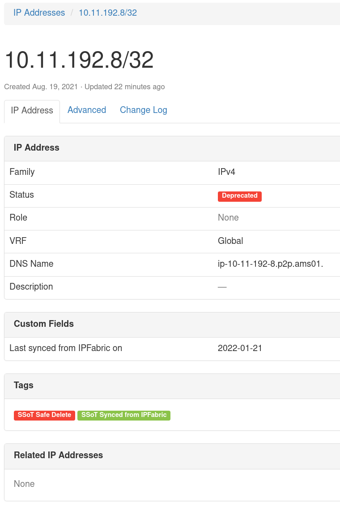

During job execution, a warning will be provided to show the status change of an object.

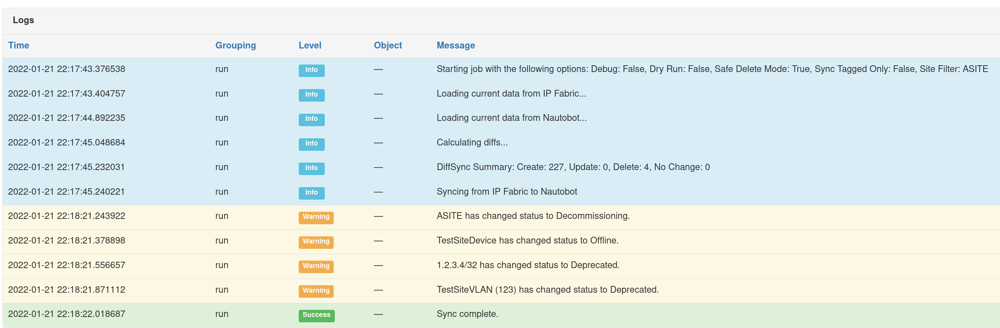

If an object has already been updated with the tag, a warning message will be displayed and the object will not be modified (including sync date).

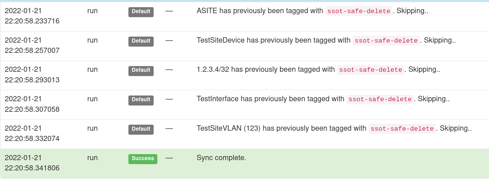

## ChatOps

As part of the SSoT synchronization capabilities with IP Fabric, this integration extends the [Nautobot ChatOps app](https://github.com/nautobot/nautobot-app-chatops) by providing users with the ability to begin the sync job from a ChatOps command (Slack).

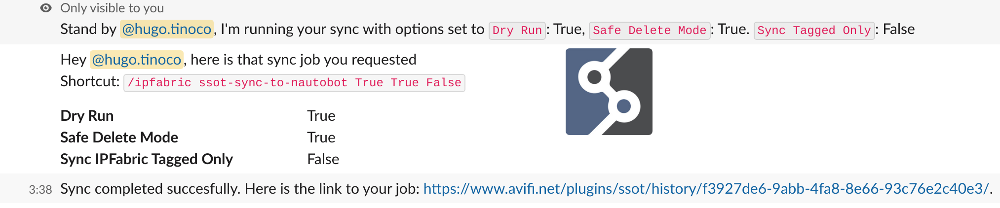

## Screenshots

Main SSoT IPFabric Dashboard:

Sync Details:

