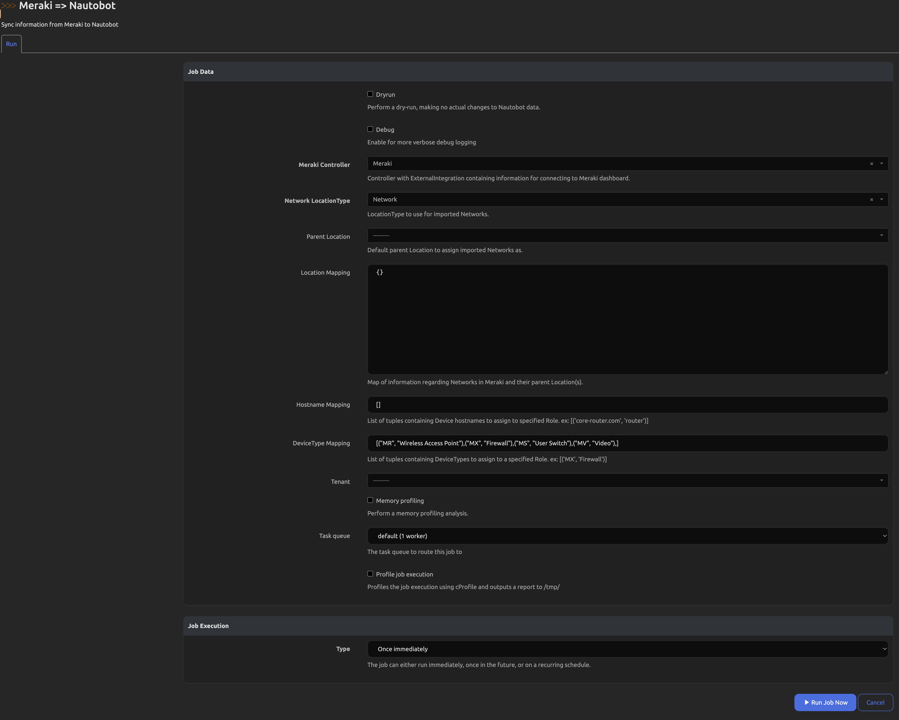

# Cisco Meraki SSoT Integration

The Cisco Meraki SSoT integration is built as part of the [Nautobot Single Source of Truth (SSoT)](https://github.com/nautobot/nautobot-app-ssot) app. The SSoT app enables Nautobot to be the aggregation point for data coming from multiple systems of record (SoR).

From Cisco Meraki into Nautobot, it synchronizes the following objects:

| Meraki              | Nautobot                     |
| ----------------------- | ---------------------------- |
| Networks                | Location*                    |
| Devices                 | Devices                      |
| Hardwares               | DeviceTypes                  |
| OSVersions              | SoftwareVersions             |
| Ports                   | Interfaces                   |
| Prefixes                | Prefixes                     |
| IP Addresses            | IP Addresses                 |

`*` As of SSoT 3.2.0 the LocationType for Networks can be defined in the Job form.

## Usage

Once the app is installed and configured, you will be able to perform an inventory ingestion from Meraki into Nautobot. From the Nautobot SSoT Dashboard view (`/plugins/ssot/`), Meraki will show as a Data Source.

From the Dashboard, you can also view more information about the App by clicking on the `Meraki to Nautobot` link and see the Detail view. This view will show the mappings of Meraki objects to Nautobot objects, the sync history, and other configuration details for the App:

In order to utilize this integration you must first enable the Job. You can find the available installed Jobs under Jobs -> Jobs:

To enable the Job you must click on the orange pencil icon to the right of the `Meraki to Nautobot` Job. You will be presented with the settings for the Job as shown below:

You'll need to check the `Enabled` checkbox and then the `Update` button at the bottom of the page. You will then see that the play button next to the Job changes to blue and becomes functional, linking to the Job form.

Once the Job is enabled, you'll need to manually create a few objects in Nautobot to use with the Job. First, you'll need to create a Secret that contains your organization ID and token for authenticating to your desired Meraki instance:

Once the required Secrets are created, you'll need to create a SecretsGroup that pairs them together and defines the Access Type of HTTP(S) like shown below:

With the SecretsGroup defined containing your instance credentials you'll then need to create an ExternalIntegration object to store the information about the Meraki instance you wish to synchronize with.

> The only required portions are the Name, Remote URL, Verify SSL, and Secrets Group.

The final step before running the Job is to create a Controller that references the ExternalIntegration that you just created. You can attach a `Managed Device Group` to the Controller for all imported Devices to be placed in. If you don't create a Managed Device Group, one will be created automatically and associated to the specified Controller with the name of `<Controller name> Managed Devices`.

> You can utilize multiple Meraki Controllers with this integration as long as you specify a unique Tenant per Controller. The failure to use differing Tenants will have the Devices, Prefixes, and IPAddresses potentially removed if they are non-existent on the additional Controller. Locations should remain unaffected.

With those configured, you will then need to define a LocationType to use for the imported Networks. With those created, you can run the Job to start the synchronization:

If you wish to just test the synchronization but not have any data created in Nautobot you'll want to select the `Dryrun` toggle. Clicking the `Debug` toggle will enable more verbose logging to inform you of what is occuring behind the scenes. After those toggles there are also dropdowns that allow you to specify the Meraki Controller to synchronize with and to define the LocationType to use for the imported Networks from Meraki. In addition, there are also some optional settings on the Job form:

- Should the LocationType that you specify for the imported Networks require a parent Location to be assigned, you can define this parent one of two ways:

1. The Parent Location field allows you to define a singular Location that will be assigned as the parent for all imported Network Locations.

2. The Location Mapping field allows you to define a dictionary of Location mappings. This feature is intended for specifying parent Locations for the Network Locations in Meraki. This is useful if this information is missing from Meraki but required for Nautobot or to allow you to change the information as it's imported to match information from another System of Record. The expected pattern for this field is `{"<Location Name>": {"parent": "<Parent location Name>"}}`.

In addition, there are two methods provided to assign Roles to your imported Devices:

1. The Hostname Mapping field allows you to specify list of tuples containing a regular expression pattern to match against Device hostnames and the Role to assign if matched. Ex: [(".*FW.*", "Firewall")]

2. The DeviceType Mapping field allows you to specify a list of tuples containing a string to match against the Device model and the Role to assign when matched. The string to match can simply be the series letters, ie MX for firewalls, or explicit models like MX84. Ex: [("MS", "Switch")]

- Finally there is an option to specify a Tenant to be assigned to the imported Devices, Prefixes, and IPAddreses. This is handy for cases where you have multiple Meraki instances that are used by differing business units.

Running this Job will redirect you to a `Nautobot Job Result` view.

Once the Job has finished you can click on the `SSoT Sync Details` button at the top right of the Job Result page to see detailed information about the data that was synchronized from Meraki and the outcome of the sync Job.
