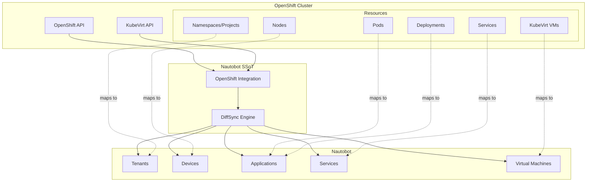
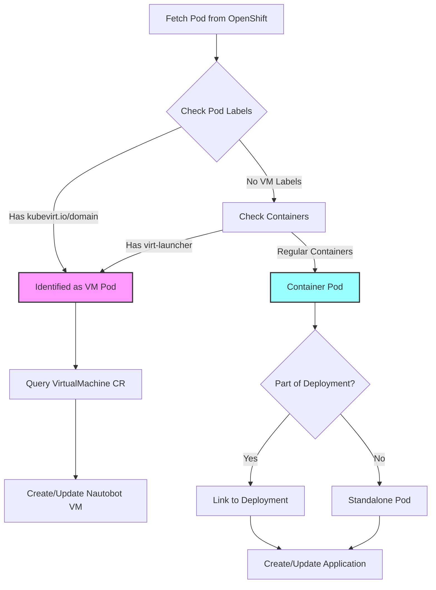
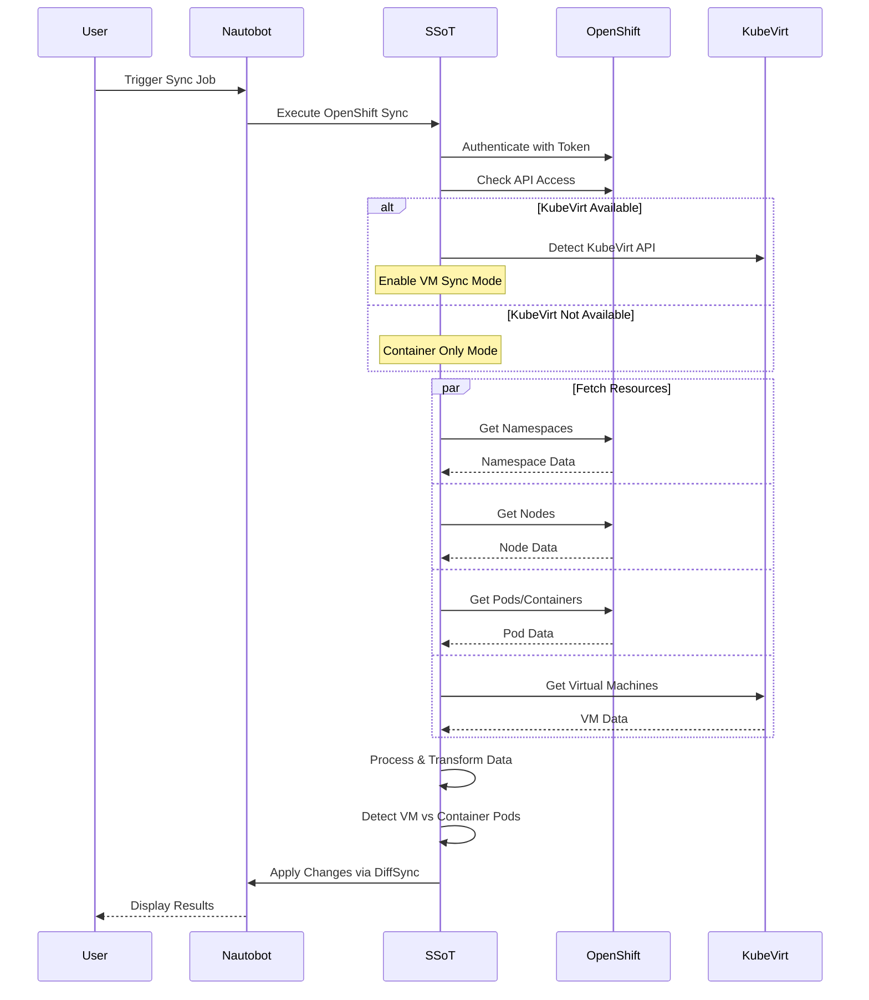
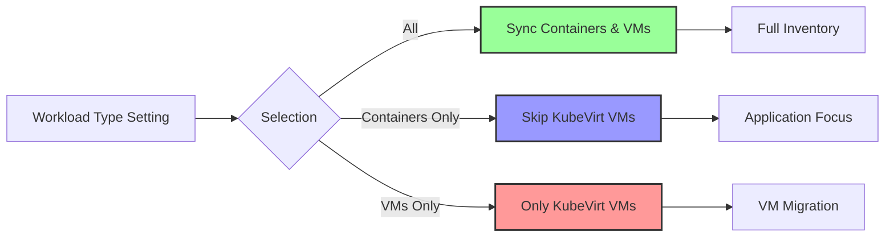

# OpenShift SSoT Integration

The SSoT OpenShift Integration allows for synchronizing container and virtual machine workloads between [Red Hat OpenShift](https://www.redhat.com/en/technologies/cloud-computing/openshift) (including KubeVirt VMs) and [Nautobot](https://github.com/nautobot/nautobot).

## Architecture Overview

## Resource Mapping

| OpenShift Resource      | Nautobot Model     | Notes                                      |
| :-------------------- | :---------------- | :----------------------------------------- |
| Project/Namespace     | Tenant            | Organizational grouping                    |
| Node                  | Device            | Physical or virtual compute nodes          |
| Pod/Container         | Application       | Container workloads                        |
| Deployment            | Application       | Grouped container workloads                |
| Service               | Service           | Network services                           |
| KubeVirt VM           | Virtual Machine   | Virtual machines running on OpenShift      |
| KubeVirt VMI          | Virtual Machine   | Running instance updates existing VM       |

## Key Features

- **Dual Workload Support**: Synchronizes both traditional container workloads and KubeVirt virtual machines
- **Intelligent Detection**: Automatically differentiates between container pods and VM pods
- **Flexible Configuration**: Choose to sync all workloads, containers only, or VMs only
- **Namespace Filtering**: Use regex patterns to sync specific namespaces
- **KubeVirt Auto-Detection**: Automatically detects if KubeVirt is installed

## Workload Detection Flow

## Usage

Once the integration is installed and configured, the OpenShift sync will show up under the Data Sources section of the Nautobot SSoT dashboard.

From the dashboard, you can view more details about the OpenShift sync by clicking the `Red Hat OpenShift -> Nautobot` link. This view shows the mapping of OpenShift objects to Nautobot objects, displaying exactly what will be created in Nautobot when the sync runs.

## Running a Sync Job

From the OpenShift sync detail page, click the `Sync Now` button to access the sync job form. The job has several configurable fields:

### Job Parameters

- **Dryrun** - When checked, the sync will run and show the diff between Nautobot and OpenShift without making any database changes
- **Memory Profiling** - Provides memory usage information during the sync
- **Debug** - Enables verbose logging for troubleshooting
- **Config** - Select the OpenShift configuration instance to use
- **Task Queue** - Choose which queue to assign this sync job to (if using multiple queues)

### Understanding Workload Types

The OpenShift integration can handle two distinct types of workloads:

#### Container Workloads
- Traditional Kubernetes pods and containers
- Synchronized as Nautobot Applications
- Includes deployments, statefulsets, and daemonsets

#### KubeVirt Virtual Machines
- Full virtual machines running on OpenShift via KubeVirt
- Synchronized as Nautobot Virtual Machines
- Maintains VM-specific attributes like CPU, memory, and disks

## Sync Process Flow

## Sync Results

Running the job redirects you to the Job Result page with real-time logs:

After completion, click the **SSoT Sync Details** button to view:
- Objects created, updated, or deleted
- Detailed diff of changes
- Any errors or warnings encountered

## Data Mapping Details

### Projects/Namespaces → Tenants
OpenShift projects are mapped to Nautobot tenants, providing organizational structure for all synced resources.

### Nodes → Devices
OpenShift nodes (master and worker) are synced as devices with:
- Role (master/worker)
- CPU, memory, and storage capacity
- Operating system information
- IP addresses

### Containers → Applications
Container workloads are synced as applications with:
- Associated namespace (tenant)
- Resource requests and limits
- Image information
- Port mappings

### KubeVirt VMs → Virtual Machines
When KubeVirt is detected, VMs are synced with:
- CPU cores and memory allocation
- Disk configuration
- Network interfaces
- Power state (running/stopped)
- Guest OS information

## Filtering and Scoping

### Namespace Filtering
Use regex patterns to sync only specific namespaces:
- `^prod-.*` - Sync only production namespaces
- `^(dev|test)-.*` - Sync dev and test namespaces
- `.*-frontend$` - Sync namespaces ending with "-frontend"

### Workload Type Selection

## Common Use Cases

### Multi-Environment Sync
Create separate configuration instances for different OpenShift clusters (dev, staging, production) and sync them to different Nautobot tenants.

### Selective VM Import
Use the "VMs Only" workload type to import just KubeVirt virtual machines, useful when migrating from traditional virtualization platforms.

### Container Inventory
Use the "Containers Only" mode to maintain an inventory of containerized applications without VM overhead.

### Compliance Reporting
Regular syncs ensure Nautobot always has current OpenShift resource information for compliance and audit purposes.

## Best Practices

1. **Start Small**: Begin with a single namespace or limited scope to verify configuration
2. **Use Dry Run**: Always test with dry run before the first production sync
3. **Regular Syncs**: Schedule regular syncs to keep data current
4. **Monitor Performance**: Use debug logging for large clusters to identify bottlenecks
5. **Namespace Organization**: Use consistent namespace naming for easier filtering

## Troubleshooting Tips

### Missing VMs
If KubeVirt VMs aren't syncing:
- Check job logs for "KubeVirt detected" message
- Verify service account has virtualization permissions
- Ensure workload type isn't set to "Containers Only"

### Performance Issues
For slow syncs:
- Use namespace filtering to reduce scope
- Enable memory profiling to identify issues
- Consider splitting large clusters across multiple configs

### Authentication Errors
- Verify service account token hasn't expired
- Check API URL includes protocol (https://)
- Test connectivity from Nautobot server to OpenShift API 