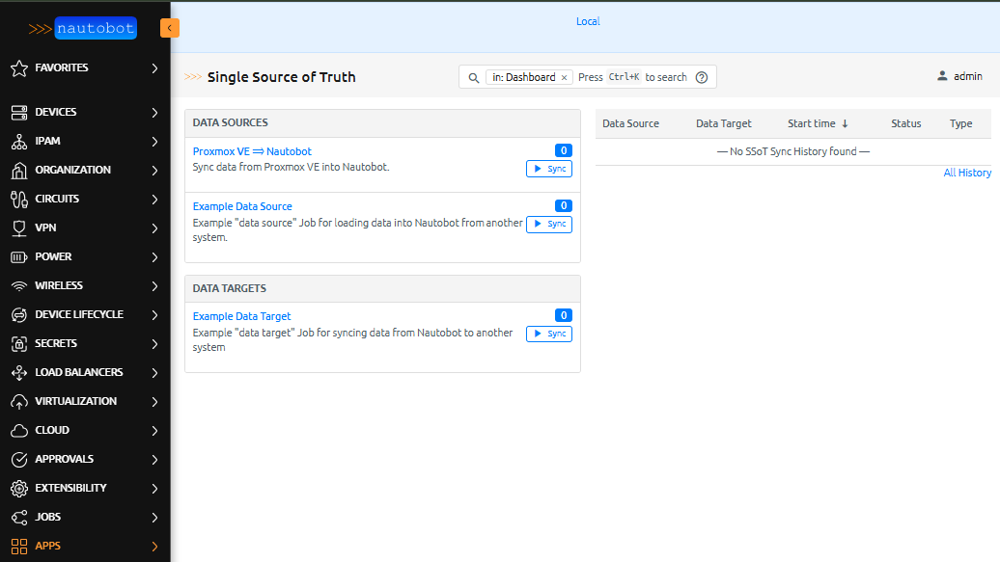
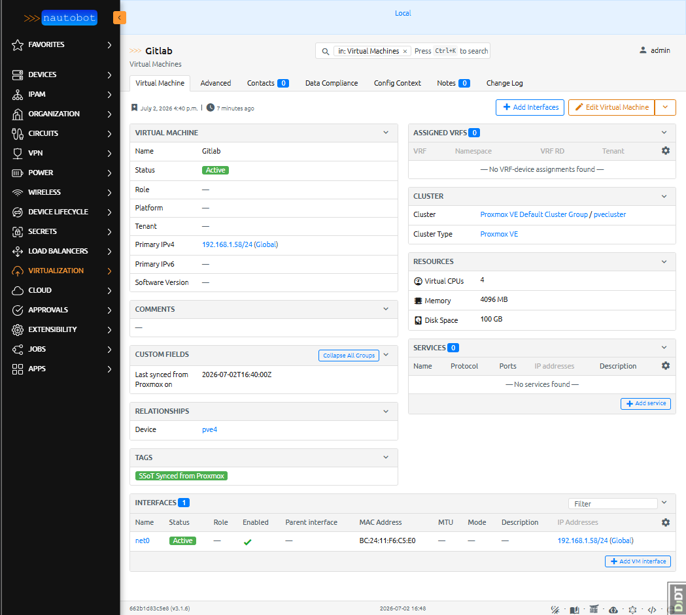
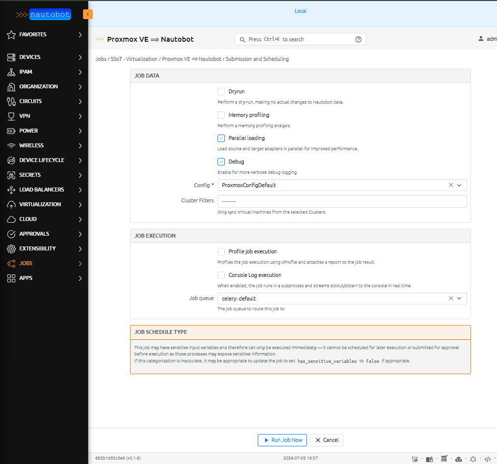
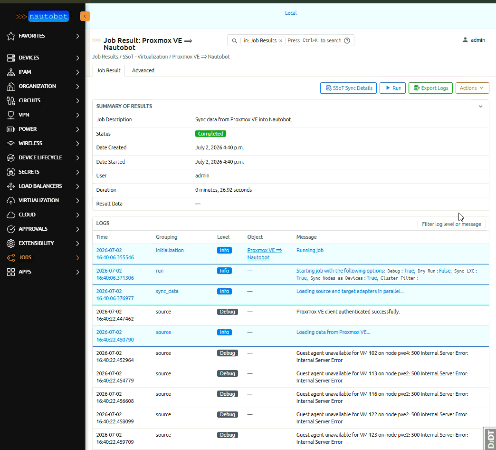

# Proxmox VE Integration

This integration syncs virtualization inventory **from Proxmox VE into Nautobot** using the
Proxmox VE REST API. It is **read-only** against Proxmox — it never writes to your Proxmox cluster.

## What is read from Proxmox VE

The sync calls these read-only REST endpoints (plus the QEMU guest agent and LXC config):

| Endpoint / source | Used for |
| ----------------- | -------- |
| `/cluster/status` | Cluster name and membership |
| `/cluster/resources` | VM/container inventory and power state |
| `/nodes` | Node (hypervisor host) inventory |
| `/nodes/{node}/status` | Node PVE version, CPU count, memory |
| `/nodes/{node}/network` | Node network interfaces and their IPs |
| QEMU guest agent | IP addresses of running QEMU VMs (agent must be installed and the VM powered on) |
| LXC container config | IP addresses of LXC containers |

## What is created / updated in Nautobot

| Proxmox VE source | Nautobot object |
| ----------------- | --------------- |
| Cluster (`/cluster/status`) | `Cluster` (ClusterType "Proxmox VE"), grouped under a `ClusterGroup` |
| Node (`/nodes`) | DCIM `Device` (host) — when *Sync Nodes as Devices* is enabled |
| Node hardware/version (`/nodes/{node}/status`) | Device custom fields: `proxmox_pve_version`, `proxmox_cpu_count`, `proxmox_memory_gb` |
| Node network interface (`/nodes/{node}/network`) | DCIM `Interface` on the node Device (type mapped per the configurable [node interface type map](../../admin/integrations/proxmox_setup.md#node-interface-type-mapping); defaults: eth→1000base-t, bond→lag, bridge→bridge, vlan→virtual), with MTU |
| Node interface topology | bridge members → `bridge`, bond slaves → `lag`, VLAN raw device → `parent_interface` |
| Node interface IP (`cidr`/`address`) | `IPAddress` assigned to the DCIM Interface; the management IP becomes the Device `primary_ip4` |
| QEMU VM | `VirtualMachine` (linked to its host node Device via the "Proxmox VM Host" relationship) |
| LXC container | `VirtualMachine` — when *Sync LXC Containers* is enabled |
| vCPU / RAM / disk | VirtualMachine `vcpus` / `memory` (MB) / `disk` (GB) |
| Power state | VirtualMachine `status` (mapped via the VM status map) |
| Proxmox VE tags | Nautobot `Tag`s on the VirtualMachine — when *Sync Proxmox VE Tags* is enabled |
| NICs | `VMInterface` |
| IP addresses | `IPAddress` + the containing `Prefix` |

Because Nautobot's `VirtualMachine` has no host-Device foreign key, the Proxmox node hosting a VM is
linked through the **"Proxmox VM Host"** custom relationship (Device → VirtualMachine).

Every synced object is tagged **SSoT Synced from Proxmox** (the tag name is configurable) and stamped
with the `last_synced_from_proxmox_on` custom field, which records the date and time (to the minute)
of the last sync.

## Running the job

1. Configure a Proxmox VE instance and credentials, and enable a config for the job (set both
   **Sync to Nautobot** and **Enabled for Sync Job**) — see the [admin setup guide](../../admin/integrations/proxmox_setup.md).
2. Go to **Jobs → SSoT - Virtualization → Proxmox VE ⟹ Nautobot**.
3. Set the job options:
    - **Config** (required) — the `SSOTProxmoxConfig` to use. Only configs that have both *Sync to
      Nautobot* and *Enabled for Sync Job* set appear here.
    - **Debug** — verbose logging.
    - **Cluster Filters** (optional) — restrict the sync to Virtual Machines in the selected clusters.
4. Run a **dry run** first to preview the diff, then run for real.

## Re-run / idempotency behavior

The sync is idempotent — running it repeatedly converges Nautobot to match Proxmox:

- Unchanged objects are left untouched, changed attributes are updated, and new objects are created.
- Only objects tagged **SSoT Synced from Proxmox** are considered for update or deletion, so objects
  you created manually are never modified or removed.
- **Deleted when they disappear from Proxmox:** `VirtualMachine`, `VMInterface`, and node
  `Interface` objects.
- **Never deleted by a sync (preserved):** `Prefix`, `IPAddress`, `Device` (nodes), `Cluster`, and
  `ClusterGroup`. This is deliberate — a cluster-filtered run does not see every object, and these
  are shared IPAM/DCIM records that should not be destroyed by virtualization syncs.
- Primary IPs (for both VMs and nodes) and intra-node interface links (bridge / bond / VLAN parent)
  are resolved in a **post-pass after the main sync**, since they require the interfaces and IPs to
  exist first. They appear correct only once the job finishes.
- Each run re-stamps the SSoT tag and the `last_synced_from_proxmox_on` custom field.
- The job runs with `CONTINUE_ON_FAILURE`, so an error on one object does not abort the whole sync;
  check the job log for any per-object warnings.

## Limitations

Keep these constraints in mind when relying on the synced data:

- **One-way and read-only.** The integration only reads from Proxmox VE and writes into Nautobot. It
  never modifies your Proxmox cluster, and there is no Nautobot → Proxmox direction.
- **VM IP discovery depends on the source.** QEMU VM IP addresses come from the **QEMU guest agent**,
  so a QEMU VM only reports IPs when it is **powered on** and has the agent installed and running.
  LXC container IPs come from the container config and do not need an agent. VMs without a reachable
  agent simply sync with no interface IPs.
- **Some objects are never deleted.** `Prefix`, `IPAddress`, `Device` (nodes), `Cluster`, and
  `ClusterGroup` are preserved even if they disappear from Proxmox (they may be shared with other
  data, and cluster-filtered runs don't see everything). Only `VirtualMachine`, `VMInterface`, and
  node `Interface` objects are removed when they vanish from the source. Clean those up manually if
  needed.
- **Only SSoT-managed objects are touched.** Objects must carry the SSoT marker tag (default
  **SSoT Synced from Proxmox**, configurable via the config's *SSoT Tag Name*) to be updated or
  deleted by the sync, so anything you created by hand is never altered.
- **Cluster Filters scope Virtual Machines only.** The job's *Cluster Filters* option restricts which
  VMs are synced; nodes, interfaces, prefixes, and IPs are not narrowed by it.
- **Link-local addresses are skipped by default.** Link-local / APIPA addresses on VM interfaces are
  ignored unless you disable *Ignore Link Local* in the config.
- **Status maps must reference existing statuses.** Values in the VM and IP status maps must be names
  of Nautobot `Status` objects that already exist; the config is rejected on save otherwise.
- **Resource values are rounded.** Memory is stored in whole **MB** and disk in whole **GB**
  (rounded down from the bytes Proxmox reports), so very small values may display as `0`.
- **Token authentication only.** The integration authenticates with a Proxmox **API token**; username
  /password login is not supported.
