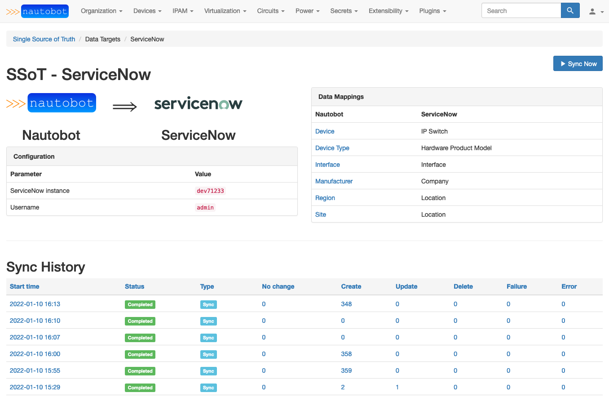
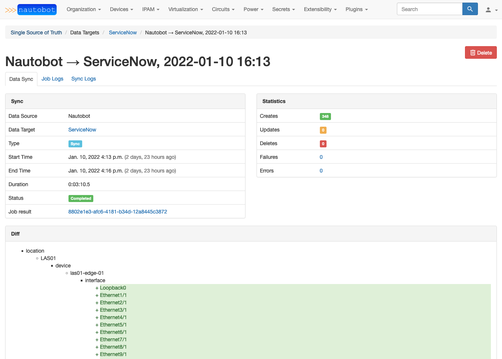

# ServiceNow SSoT Integration

This integration provides the ability to synchronize basic data from Nautobot into ServiceNow. Currently, the following data is mapped and synchronized:

- Nautobot Manufacturer table to ServiceNow Company table
- Nautobot DeviceType table to ServiceNow Hardware Product Model table
- Nautobot Locations tables to ServiceNow Location table
- Nautobot Device table to ServiceNow IP Switch table
- Nautobot Interface table to ServiceNow Interface table

## Usage

Once the integration is installed and configured, from the Nautobot SSoT dashboard view (`/plugins/ssot/`), ServiceNow will be shown as a Data Target. You can click the **Sync** button to access a form view from which you can run the Nautobot-to-ServiceNow synchronization Job. Running the job will redirect you to a Nautobot **Job Result** view, from which you can access the **SSoT Sync Details** view to see detailed information about the outcome of the sync Job.

## Screenshots

---

