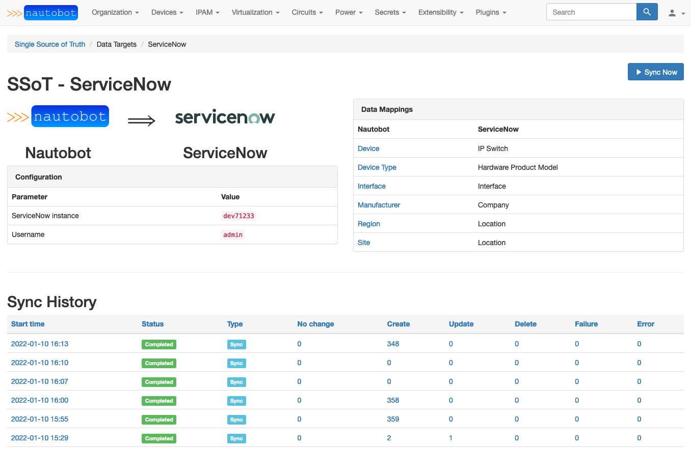
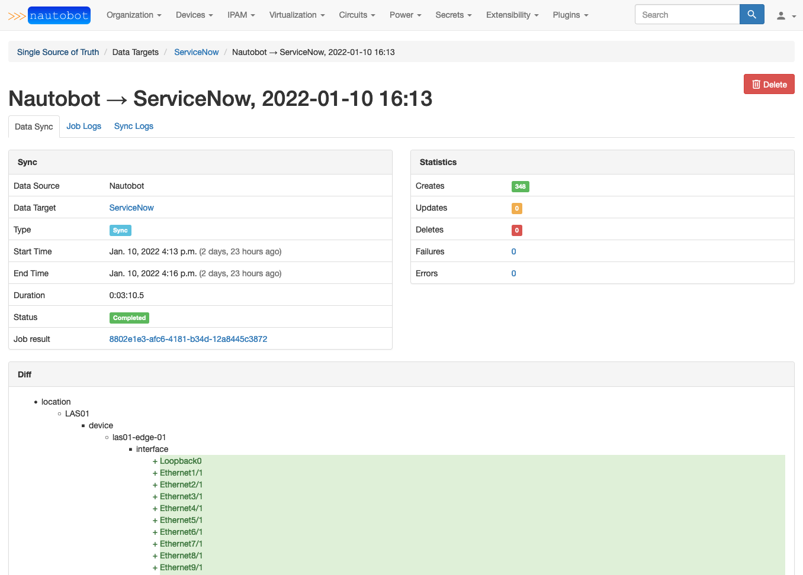

# ServiceNow SSoT Integration

This integration provides the ability to synchronize basic data from Nautobot into ServiceNow. Currently, the following data is mapped and synchronized:

- Nautobot Manufacturer table to ServiceNow Company table
- Nautobot DeviceType table to ServiceNow Hardware Product Model table
- Nautobot Locations tables to ServiceNow Location table
- Nautobot Device table to ServiceNow IP Switch table
- Nautobot Interface table to ServiceNow Interface table

## Usage

Once the integration is installed and configured, from the Nautobot SSoT dashboard view (`/plugins/ssot/`), ServiceNow will be shown as a Data Target. You can click the **Sync** button to access a form view from which you can run the Nautobot-to-ServiceNow synchronization Job. Running the job will redirect you to a Nautobot **Job Result** view, from which you can access the **SSoT Sync Details** view to see detailed information about the outcome of the sync Job.

## Reference resolution and duplicate ServiceNow records

Several of the synchronized fields are ServiceNow reference (foreign key) columns: a Device's `model_id` points at a record in `cmdb_hardware_product_model`, its `location` at a record in `cmn_location`, and so on. To write one, the sync has to identify exactly one record in the referenced table.

Where a single column cannot do that on its own, the mapping narrows the lookup by additional columns. A model name, for example, is only unique within its manufacturer, so `model_id` is resolved by name *and* manufacturer.

When a lookup still matches more than one record, or matches none, the sync no longer writes the record with that field left unset. Instead it:

- logs an error naming the record, the field, the value, the ServiceNow table, and the `sys_id` of every record that collided;
- marks that object as failed in the **SSoT Sync Details** view, while the rest of the sync continues;
- attaches an `unresolved_references.txt` report to the Job Result and logs a summary error, so a run with skipped fields is not mistaken for a clean one.

The usual cause is duplicate records in the referenced ServiceNow table; the stock developer instance ships with duplicate `cmn_location` entries, for instance. De-duplicating them in ServiceNow resolves it. Duplicates that a reference cannot tell apart are also reported as warnings while data is loaded, so a **Dry run** surfaces them before any write is attempted.

## Screenshots

---

