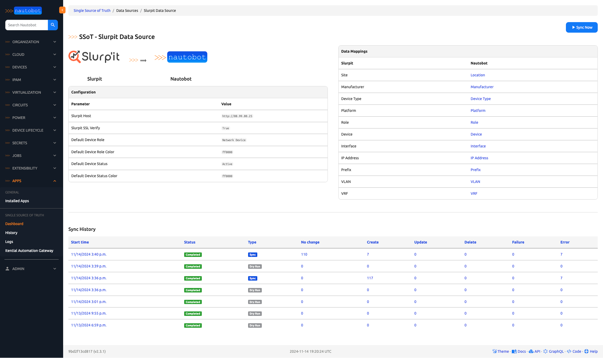
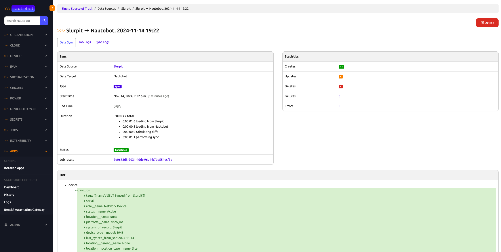

# Slurpit SSoT Integration

This integration provides a simple way to synchronize data between [Slurpit](https://slurpit.io/) and [Nautobot](https://github.com/nautobot/nautobot). It support multiple data types, including Devices, Interfaces, and IP Addresses.

It synchronizes the following objects:

| Slurpit                  | Nautobot                     |
| -----------------------  | ---------------------------- |
| Sites                    | Location                     |
| Devices                  | Manufacturer                 |
| Devices                  | Platform                     |
| Devices                  | Device Type                  |
| Devices                  | Device                       |
| Planning (Hardware Info) | Inventory Item               |
| Planning (VLANs)         | VLAN                         |
| Planning (Routing Table) | VRF                          |
| Planning (Routing Table) | Prefixe                      |
| Planning (Interfaces)    | Interface                    |
| Planning (Interfaces)    | IP Address                   |

## Usage

Once the integration is installed and configured, from the Nautobot SSoT dashboard view (`/plugins/ssot/`), Slurpit will be shown as a Data Source. You can click the **Sync** button to access a form view from which you can run the Slurpit-to-Nautobot synchronization Job. Running the job will redirect you to a Nautobot **Job Result** view, from which you can access the **SSoT Sync Details** view to see detailed information about the outcome of the sync Job.

## Screenshots

---

