# SolarWinds SSoT Integration

The SolarWinds integration is built as part of the [Nautobot Single Source of Truth (SSoT)](https://github.com/nautobot/nautobot-app-ssot) app. The SSoT app enables Nautobot to be the aggregation point for data coming from multiple systems of record (SoR).

From SolarWinds into Nautobot, it synchronizes the following objects:

| SolarWinds              | Nautobot                     |
| ----------------------- | ---------------------------- |
| Container               | Location*                    |
| Devices                 | Devices                      |
| Vendor                  | Manufacturers                |
| Model/DeviceType        | DeviceTypes                  |
| Model/Vendor            | Platforms                    |
| Versions                | SoftwareVersions             |
| Interfaces              | Interfaces                   |
| IP Addresses            | IP Addresses                 |

## Usage

Once the app is installed and configured, you will be able to perform an inventory ingestion from SolarWinds Orion into Nautobot. From the Nautobot SSoT Dashboard view (`/plugins/ssot/`), or via Apps -> Single Source of Truth -> Dashboard, SolarWinds will show as a Data Source.

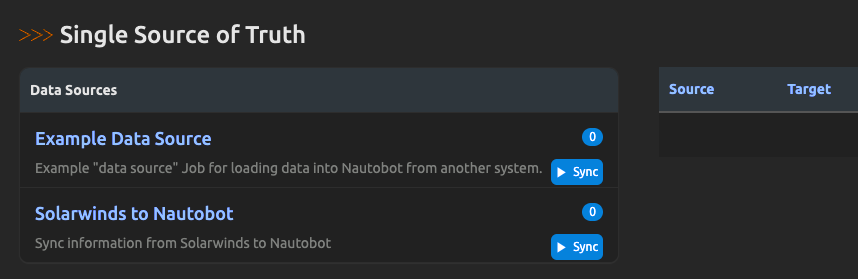

From the Dashboard, you can also view more information about the App by clicking on the `SolarWinds to Nautobot` link and see the Detail view. This view will show the mappings of SolarWinds objects to Nautobot objects, the sync history, and other configuration details for the App:

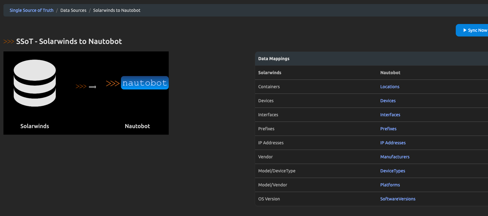

In order to utilize this integration you must first enable the Job. You can find the available installed Jobs under Jobs -> Jobs:

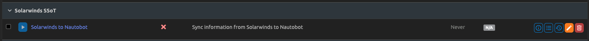

To enable the Job you must click on the orange pencil icon to the right of the `SolarWinds to Nautobot` Job. You will be presented with the settings for the Job as shown below:

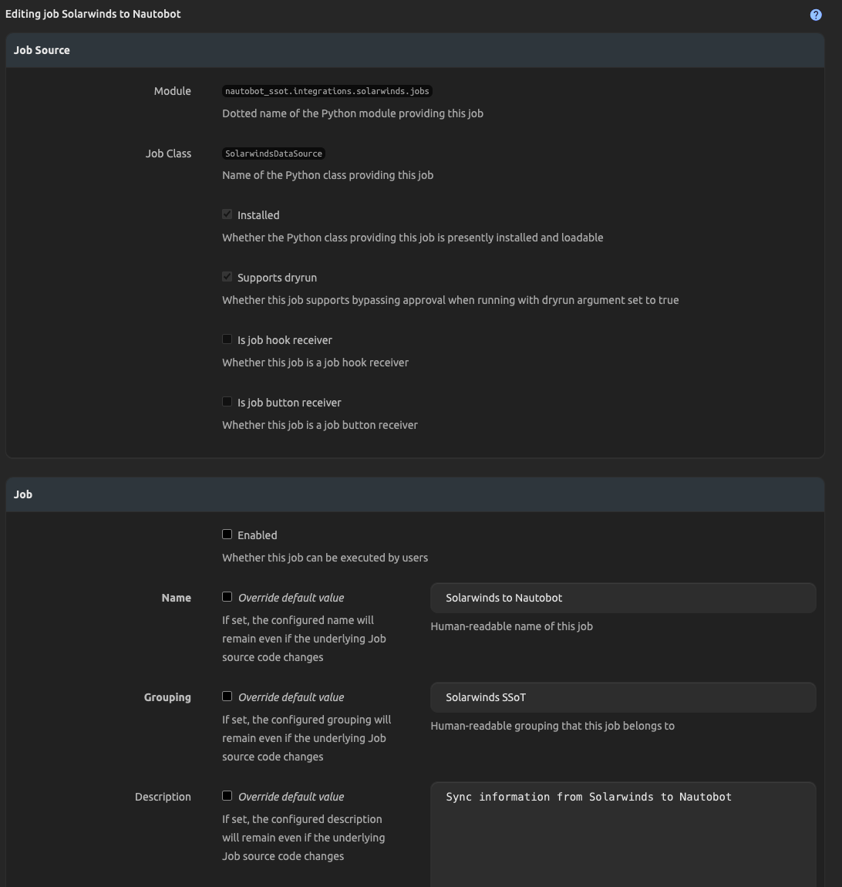

You'll need to check the `Enabled` checkbox and then the `Update` button at the bottom of the page. You will then see that the play button next to the Job changes to blue and becomes functional, linking to the Job form.

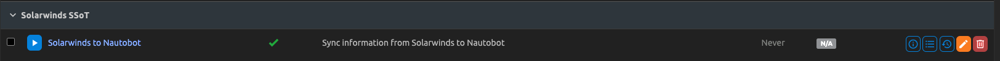

Once the Job is enabled, you'll need to manually create a few objects in Nautobot to use with the Job. First, you'll need to create a Secret that contains your SolarWinds username and Password for authenticating to your desired SolarWinds instance:

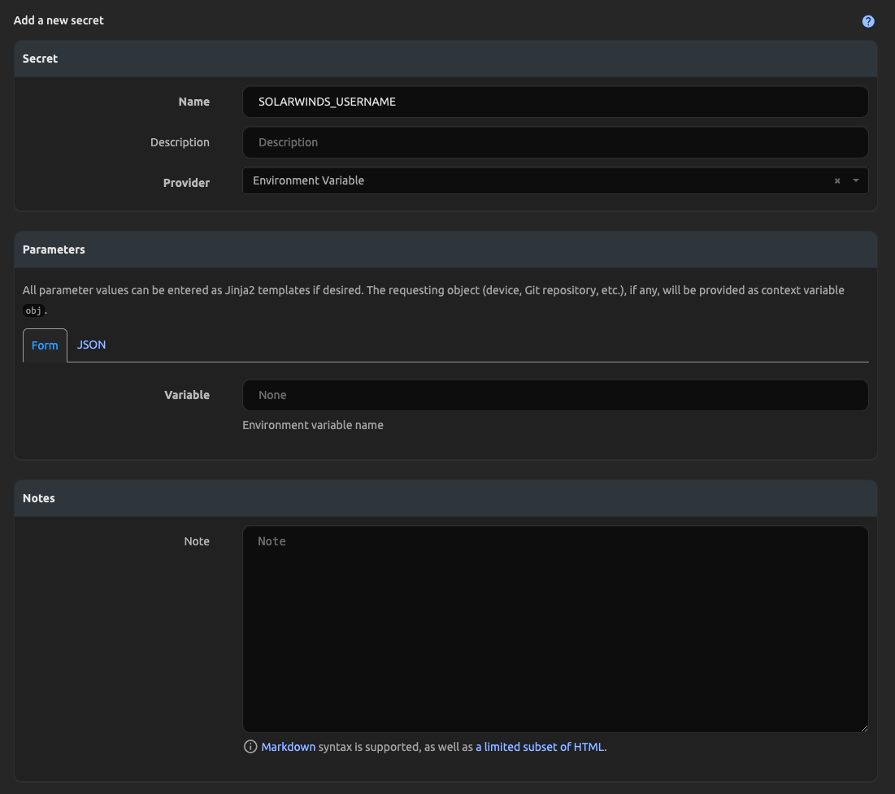

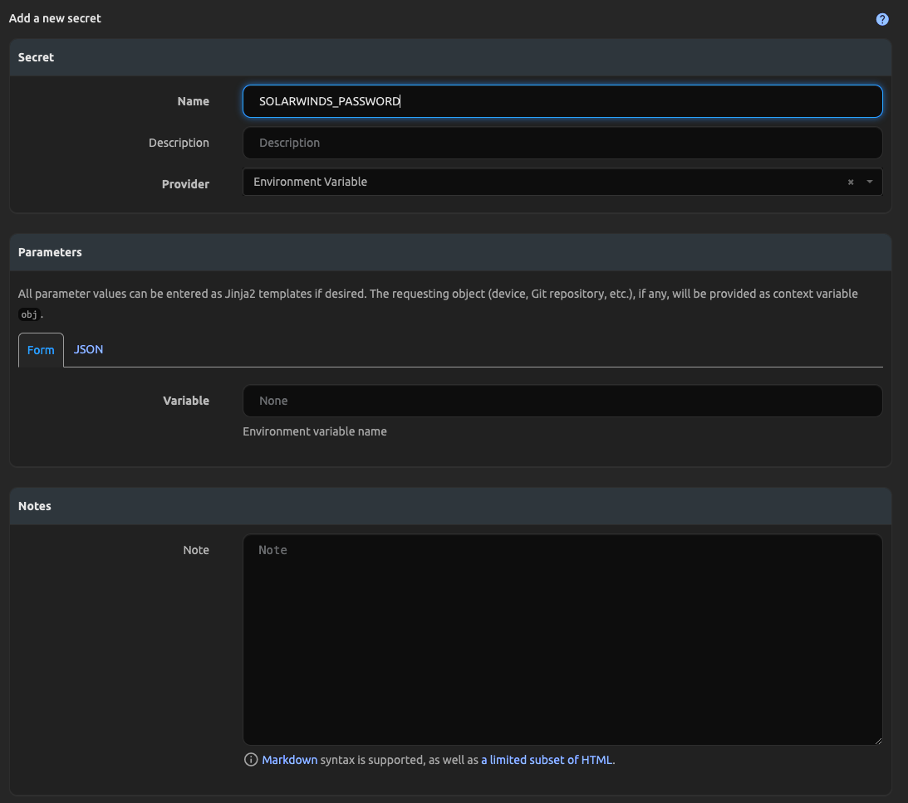

Once the required Secrets are created, you'll need to create a SecretsGroup that pairs them together and defines the Access Type of HTTP(S) like shown below:

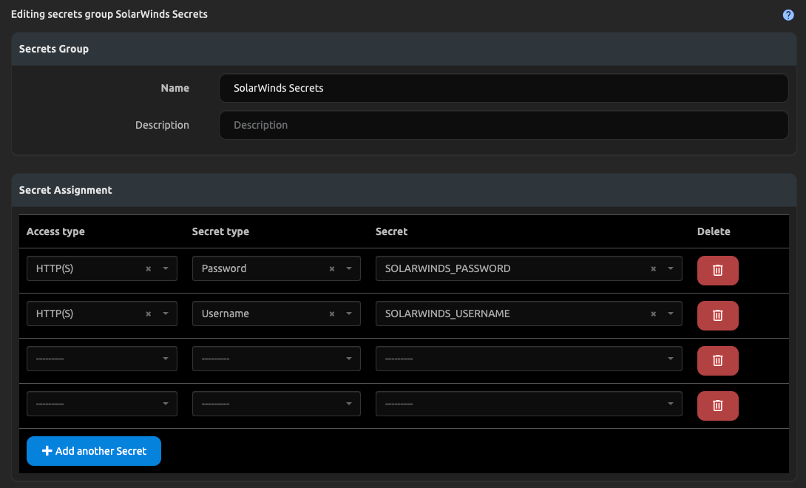

With the SecretsGroup defined containing your instance credentials you'll then need to create an ExternalIntegration object to store the information about the SolarWinds instance you wish to synchronize with.

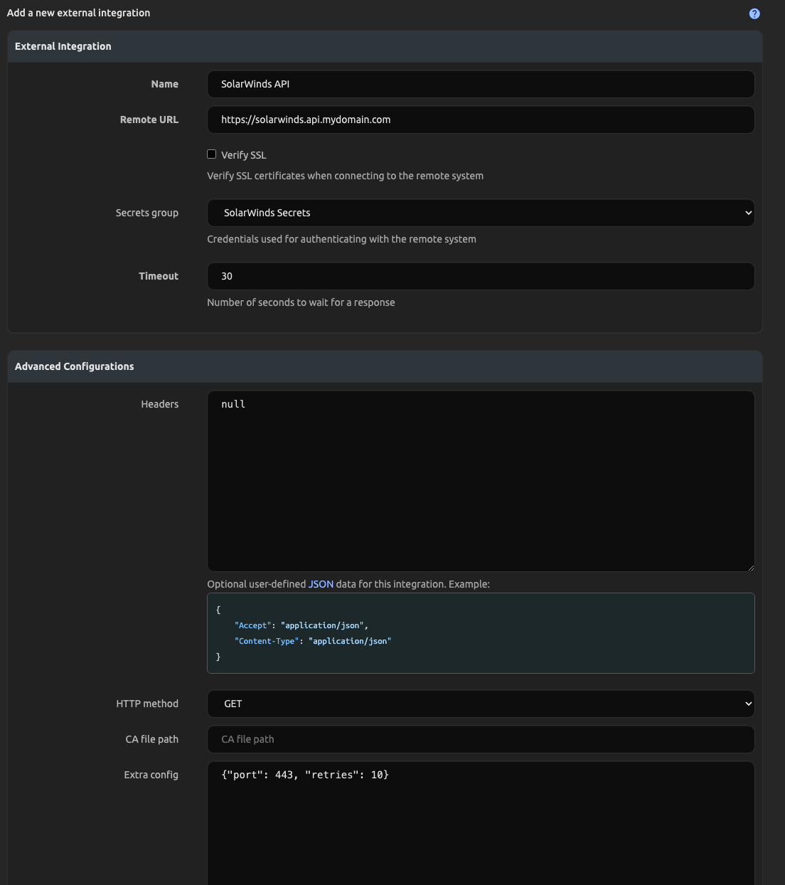

> The only required portions are the Name, Remote URL, Verify SSL, HTTP Method (GET), and Secrets Group. 
- The External Integration will need it's `http_method` set to `GET`. 
- Keep the `verify_ssl` setting in mind, uncheck this if you are using untrusted certificates

Extra settings can be configured in the Extra Config section of your External Integration, example below:

| Setting         | Default | Description                                                                       |
| --------------- | ------- | --------------------------------------------------------------------------------- |
| port            |   17774 | TCP port used for communication to the API                                        |
| retries         |       5 | How many retries before considering the connection to SolarWinds failed           |
| batch_size      |     100 | How many nodes to include in queries, this can be lowered to prevent API timeouts |

```json
{
    "port": 443,
    "retries": 10,
    "batch_size": 100
}
```

With those configured, you will then need to ensure you have the Locations and Location Types defined to be used for the imported Devices. With those created, you can run the Job to start the synchronization:

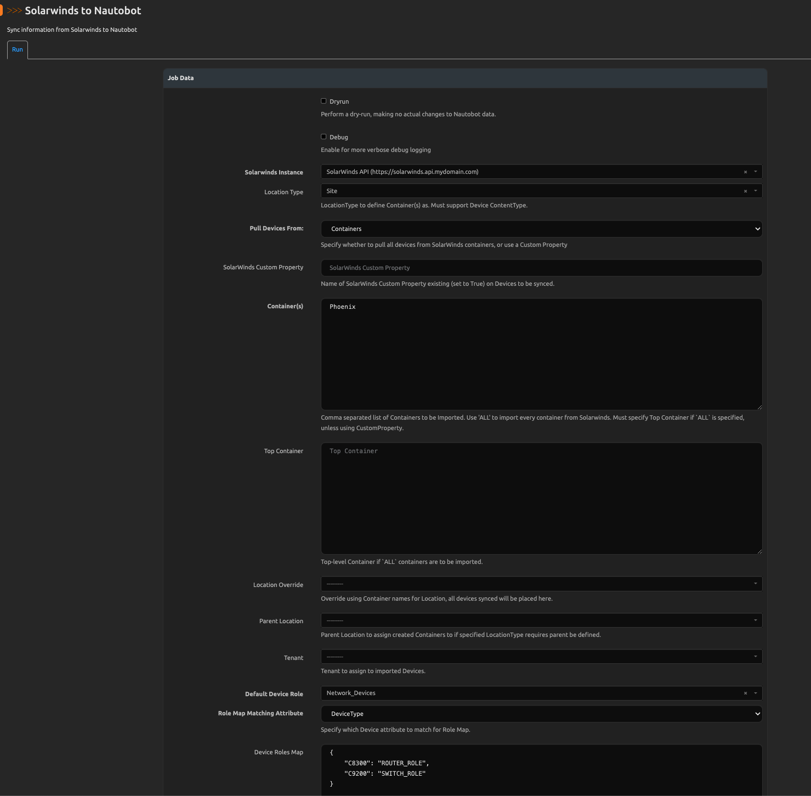

If you wish to just test the synchronization but not have any data created in Nautobot you'll want to select the `Dryrun` toggle. Clicking the `Debug` toggle will enable more verbose logging to inform you of what is occuring behind the scenes. After those toggles there are also dropdowns that allow you to specify the SolarWinds instance to synchronize with and to define the LocationType to use for the imported Devices from SolarWinds. In addition, there are also some optional settings on the Job form:

- You must add a specific SolarWinds Container or comma separated list of Containers, but you can also choose to filter these further via a SolarWinds CustomProperty. This CustomProperty should be a Boolean set to `True` within SolarWinds, and assigned to all devices you wish to sync into Nautobot. Enter the name of this CustomProperty into the CustomProperty field. All containers specified will be searched, but only those devices with the CustomProperty set to True will be synced over to Nautobot.
- You can also use the Location Override option to choose a specific Location to place all found devices in, otherwise the SSOT will create Location's based on the Container Names given to search for.
- If the LocationType that you specify for the imported Devices requires a parent LocationType to be assigned, you must also select the Parent LocationType.


In addition, there are a few methods provided to assign Roles to your imported Devices. You can choose a Default Role to be used for all Devices not mapped via a method below.

The Role Matching Attribute can be set to DeviceType or Hostname. You then provide a `role_map` to associate specific DeviceTypes or Hostnames to a Role name. This map should be a standard python dictionary if using DeviceType. Regex can be used to match Hostnames. Examples below:

```python title="Role_Map using DeviceType"
{
    "C8300": "ROUTER_ROLE",
    "C9200": "SWITCH_ROLE"
}
```
```python title="Role_Map using Hostname and Regex"
{
    "CORE.*": "ROUTER_ROLE", 
    "WLC.*": "WLC_ROLE"
}
```

- Finally there is an option to specify a Tenant to be assigned to the imported Devices, Prefixes, and IPAddresses. This is handy for cases where you have multiple SolarWinds instances that are used by differing business units.
!!! info
    Tenant names will also be used as Namespace names for any IP Addresses and Prefixes created, these Namespaces must be created by you!

Running this Job will redirect you to a `Nautobot Job Result` view.

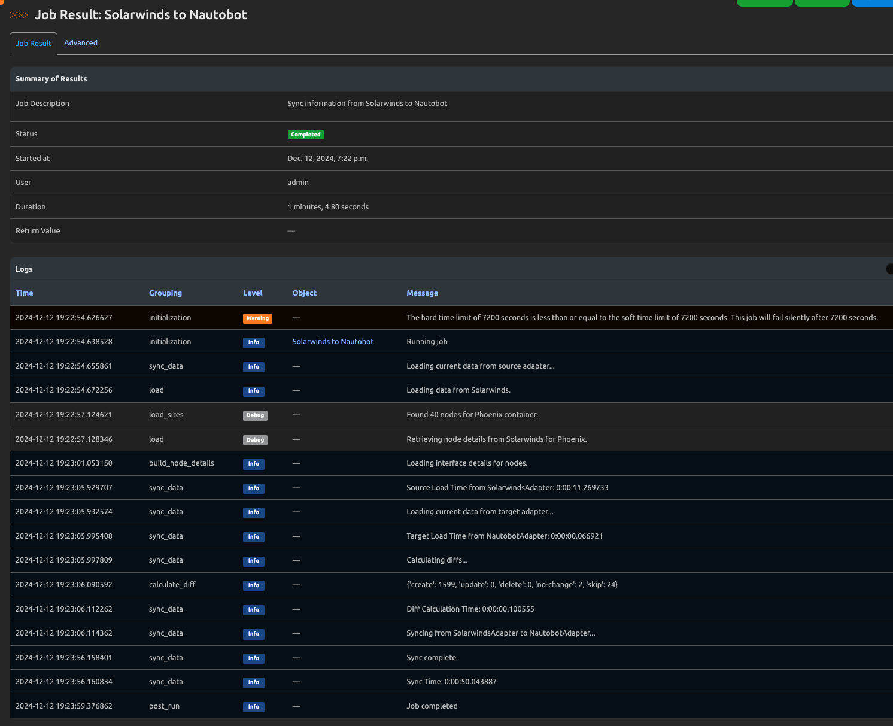

Once the Job has finished you can click on the `SSoT Sync Details` button at the top right of the Job Result page to see detailed information about the data that was synchronized from SolarWinds and the outcome of the sync Job. There are also more logs to check if you run into issues, that can be found under Apps -> Logs.
