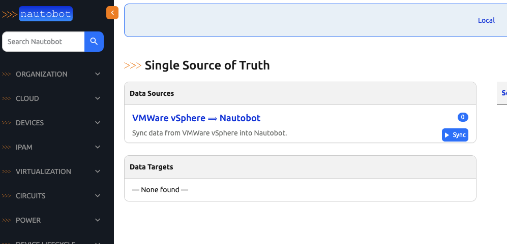
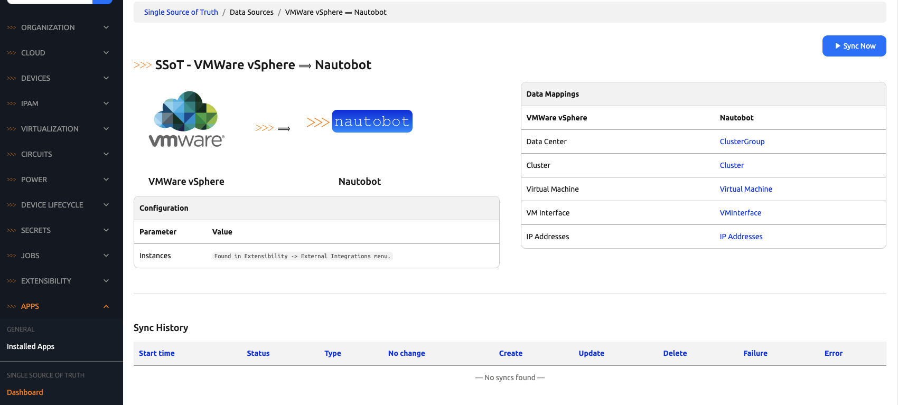
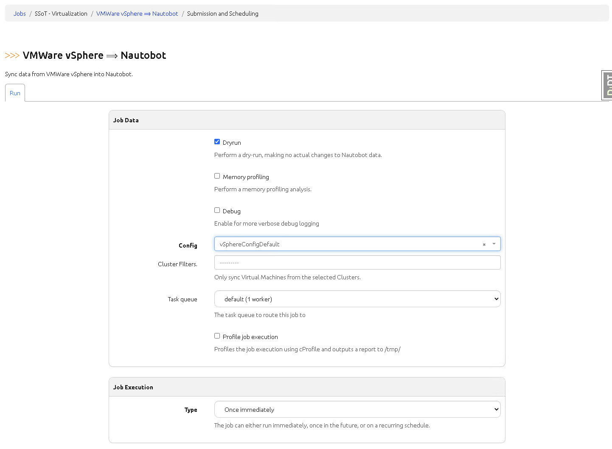
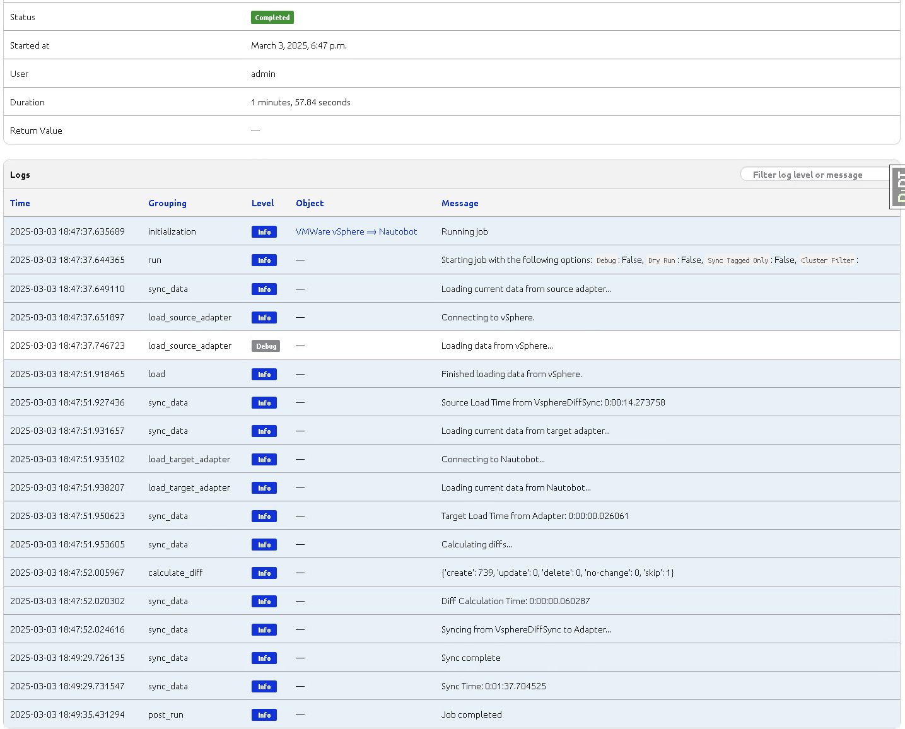

# vSphere SSoT Integration

SSoT vSphere Integration allows for synchronizing of Cluster Groups, Clusters, Virtual Machines, Virtual Machine Interfaces and IP Addresses between [VM vSphere](https://www.vmware.com/products/cloud-infrastructure/vsphere) and [Nautobot](https://github.com/nautobot/nautobot)

| vSphere         | Nautobot        |
| :-------------- | :-------------- |
| Data Center     | ClusterGroup    |
| Cluster         | Cluster         |
| Virtual Machine | Virtual Machine |
| VM Interface    | VMInterface     |
| IP Addresses    | IP Addresses    |

## Usage

Once the integration is installed and configured, the vSphere sync will show up under the Data Source section of the Nautobot SSoT dashboard view. 

From the dashboard, you can view more detail about the vSphere sync by clicking the `VMWare vSphere -> Nautobot` link. This view shows the mapping of vSphere objects to Nautobot objects so you know exactly what will get created in Nautobot when this sync is ran. It will also show you a table view of all the times this sync has been ran.

From the vSphere sync detail page, you can click the `Sync Now` button which will forward you to the sync job form. The job has fields that you can change to change the behavior of the job.

- `Dryrun` - When this is checked, the sync will run as normal and provide the diff between Nautobot and vSphere. However, it won't make any changes to Nautobot's database.
- `Memory Profiling` - Checking this will provide information about how much memory Nautobot is using during the sync.
- `Debug` - When this is checked, you will be provided with more verbose log messages in the job output.
- `Config` - The appropriate config instance created for the vSphere sync. Instructions for creating a config instance can be found [here](../../admin/integrations/vsphere_setup.md#prerequisites)
- `Cluster Filters` - This allows you to choose to sync only specific clusters when running the job. All child objects are loaded under each cluster, such as virtual machines, VM interfaces, and IP addresses.
- `Task Queue` - If you are running multiple queues in your environment, you can choose which queue to assign this sync job to.

Running the job will redirect you to the `Nautobot Job Result` view where you'll get real time logs while the job runs.

Once the job has finished, you can click on the SSoT Sync Details button on the top right of the Job Result page to see detailed information about the data that was synced from vSphere and the outcome of the sync job.

