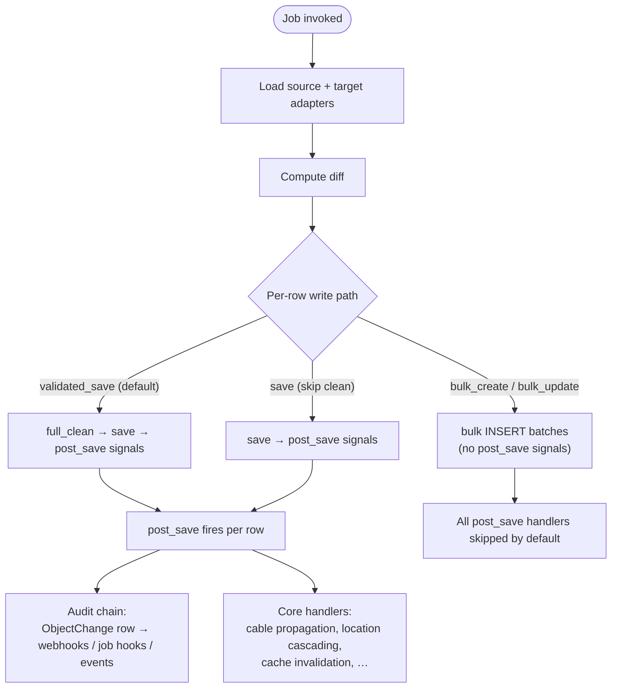

# Performance

Syncing large datasets through SSoT can become a bottleneck for jobs that run frequently or against thousands of objects. This chapter walks through the cost shape of a sync, the levers SSoT and Nautobot expose for tuning it, and the diagnostic tooling shipped with this app.

For a step-by-step walkthrough of *building* a Data Source or Data Target Job, see [Developing Data Source and Data Target Jobs](../dev/jobs.md). For the underlying DiffSync concepts, see the [DiffSync documentation](https://diffsync.readthedocs.io/en/latest/).

!!! info "Forward-looking design work"
    A draft proposal — [PR #1194](https://github.com/nautobot/nautobot-app-ssot/pull/1194) — explores a deeper menu of opt-in performance and validation primitives (composable `SSoTFlags`, an SQLite-backed streaming pipeline, batched validators, a scoped-sync API). None of the framework primitives in that PR are in `develop` today; this chapter sticks to what is shipping. For the full design, see the [Performance & Validation Design Notes](../dev/performance_validation_menu.md) and [Reference](../dev/performance_validation_reference.md). Where a section's subject matter overlaps with proposed work, the link is called out explicitly.

## What every sync row actually does

Before reaching for a tuning knob it helps to know what the default code path actually pays for. A standard SSoT job's `execute_sync` calls each DiffSync model's `create` / `update` / `delete`, which in turn calls Nautobot's `validated_save()` per row:



Per row, the default path runs:

- **Validation** — Django's `full_clean()`: per-field validators, the model's own `clean()` method (which often does its *own* DB queries — for example `IPAddress._get_closest_parent` walks the prefix tree), uniqueness checks.
- **`save()`** — one `INSERT` or `UPDATE` round trip.
- **`post_save` signals** — Nautobot core handlers that propagate state across related objects (cable termination cache, rack/rack group location cascading, virtual chassis assignment, custom-field cache invalidation, search indexing).
- **The audit chain** — when the sync runs inside a `web_request_context` (the SSoT job framework already arranges this), the changelog signal handler captures one `ObjectChange` row per save and `web_request_context` cleanup dispatches webhooks, job hooks, and events for each one.

That's a lot of work — and it's all *correct* work. The KISS default is the slow, safe path. The sections below cover where you can dial it back when you've measured a concrete cost and decided which guarantees you don't need.

## Optimizing for execution time

When syncing large amounts of data, job execution time can become an issue. Fortunately, there are a number of ways to optimize a job's performance.

### Parallel adapter loading

Think of parallel adapter loading like having two people work on different tasks at the same time instead of waiting for one to finish before starting the other. As of version 4.0.0, SSoT Jobs by default load data from both your source System of Record (where data comes from) and target System of Record (where data goes to) at the same time, rather than loading them one after another.

**What is parallel loading?**

When your SSoT job runs, it needs to load data from two places:

1. **Source adapter**: Loads data from the source system (e.g., an external API, another database)
2. **Target adapter**: Loads data from the target system (usually Nautobot)

Without parallel loading, the job would:

- First load the source adapter (wait for it to finish)
- Then load the target adapter (wait for it to finish)
- Perform sync
- Total time = Source time + Target time

With parallel loading (enabled by default):

- Both adapters load at the same time
- Total time = The longer of the two (not their sum!)

**Real-world performance example:**

Imagine your source adapter takes 30 seconds to load (maybe it's making many API calls), and your target adapter takes 20 seconds to load (querying the Nautobot database):

- **Without parallel loading**: 30 seconds + 20 seconds = **50 seconds total**
- **With parallel loading**: max(30 seconds, 20 seconds) = **30 seconds total**

That's a **40% time savings** in this example. In practice, when both adapters involve network requests or database queries, parallel loading typically reduces loading time by **30–50%**, and in some cases up to **60%** when the load times are similar.

**How it works under the hood:**

- The source adapter loads in one thread
- The target adapter loads in another thread simultaneously
- While one adapter waits for a network response, the other can keep working
- All log messages from both adapters are collected and shown in chronological order
- Each Job log shows whether it came from "source" or "target"
- You'll see timing information for each adapter separately

**When to disable parallel loading:**

Most of the time, you should keep parallel loading enabled. However, you might need to disable it if:

- Your adapter code isn't thread-safe (rare, but can happen with certain libraries)
- You need to load adapters in a specific order for debugging
- You're experiencing unexpected behavior that might be related to threading

To disable parallel loading, you can set it to `False` when running the job, or override it in your job class:

```python
class MyDataSource(DataSource):
    parallel_loading = BooleanVar(
        description="Load source and target adapters in parallel for improved performance.",
        default=False,  # Disable parallel loading by default
    )
```

**Key benefits:**

- **Faster execution**: Typically 30–50% reduction in loading time, sometimes up to 60%
- **Better efficiency**: Your computer can work on both adapters while waiting for network responses
- **Clear logging**: All messages are tagged and organized so you can see what each adapter is doing

**Important notes:**

- Your adapter code should be thread-safe (most Django and standard Python code already is)
- Database connections are handled automatically for each thread (you don't need to worry about this)
- Logs from both threads are automatically merged and displayed in the correct order

### Optimizing Nautobot database queries

As an SSoT job typically has lots of Nautobot database interaction (Nautobot is always either the source or the destination) for loading, creating, updating, and deleting objects, this is a common source of performance issues.

The following is an example of an inefficient `load` function that can be greatly improved:

```python
from diffsync import Adapter
from nautobot.dcim.models import Region, Site, Location

from my_package import ParentRegionModel, ChildRegionModel, SiteModel, LocationModel

class ExampleAdapter(Adapter):
    parent_region = ParentRegionModel
    child_region = ChildRegionModel
    site = SiteModel
    location = LocationModel
    top_level = ("parent_region",)

    ...

    def load(self):
        for parent_region in Region.objects.filter(parent__isnull=True):
            parent_region_diffsync = self.parent_region(name=parent_region.name)
            self.add(parent_region_diffsync)
            for child_region in Region.objects.filter(parent=parent_region):
                child_region_diffsync = self.child_region(name=child_region.name)
                self.add(child_region_diffsync)
                parent_region_diffsync.add_child(child_region_diffsync)
                for site in Site.objects.filter(region=child_region):
                    site_diffsync = self.site(name=site.name)
                    self.add(site_diffsync)
                    child_region_diffsync.add_child(site_diffsync)
                    for location in Location.objects.filter(site=site):
                        location_diffsync = self.location(name=location.name)
                        self.add(location_diffsync)
                        site_diffsync.add_child(location_diffsync)

```

The problem with this admittedly intuitive approach is that each call to `Model.objects.filter()` produces a single database query. This means that if you have 5000 locations under 2000 sites under 30 child regions under 3 parent regions the code will have to issue 7033 database queries. This only gets worse as you add additional data and possible further complexity to this relatively simple example.

Here is a better approach that utilizes diffsync's `get_or_instantiate` and Django's [`select_related`](https://docs.djangoproject.com/en/stable/ref/models/querysets/#select-related) for query optimization purposes:

```python
def load(self):
    # This next line represents the single (!) database query that replaces the 7033 from the previous example
    for location in Location.objects.all().select_related("site", "site__region", "site__region__parent"):
        parent_region, parent_region_created = self.get_or_instantiate("parent_region", ids={"name": location.site.region.parent.name})
        if parent_region_created:
            self.add(parent_region)
        child_region, child_region_created = self.get_or_instantiate("child_region", ids={"name": location.site.region.parent})
        if child_region_created:
            self.add(child_region)
            parent_region.add_child(child_region)
        site, site_created = self.get_or_instantiate("site", ids={"name": location.site.name})
        if site_created:
            self.add(site)
            child_region.add_child(site)
        location, location_created = self.get_or_instantiate("location", ids={"name": location.name})
        if location_created:
            self.add(location)
            site.add_child(location)
```

As an additional bonus, this way the code has fewer levels of indentation.

The essence of this is that you should make liberal use of `select_related` to join together the database tables you need into a single, big query rather than a bunch of small queries.

!!! note
    Check out the [Django documentation](https://docs.djangoproject.com/en/stable/topics/db/optimization/) for a more comprehensive source on optimizing database access.

### Optimizing worker stdout I/O

If after optimizing your database access you are still facing performance issues, check out the [Analyzing Job Performance](#analyzing-job-performance) section. Should you find that a certain `io.write` appears high up in the ranking, you are probably facing an issue where your job is writing to stdout so quickly that your worker node/process cannot drain its buffer quickly enough. To deal with this, tone down what you are logging to stdout inside your job. Common offenders include:

- diffsync's [logging configuration](https://diffsync.readthedocs.io/en/latest/api/diffsync.logging.html?highlight=logging)
- `print` calls
- other external frameworks you are using

### Minimizing external I/O

In most cases, the side of an SSoT job that interacts with the non-Nautobot system will be accessed through some form of I/O — typically HTTP requests over the network. Depending on the amount of requests, request/response size, and the latency to the remote system, this can take a lot of time. Care should be taken when crafting the I/O interaction, using bulk endpoints instead of querying each individual record on the remote system where possible.

Here is an unoptimized high-level workflow:

- Collect sites
    - For each site, collect all devices
        - For each device, collect the interface information
        - For each device, collect the VLAN information

Similar to the database example above, this suffers from having to perform a lookup (or in this case two) per instance of the lowest item in the hierarchy. Given the availability of bulk endpoints in the remote system, it could be optimized to look something like the following:

- Collect all Sites
- Collect all Devices
- Collect all Interfaces
- Collect all VLANs
- Correlate these data points in code

!!! note
    You could also look into parallelizing your HTTP requests using a library like [aiohttp](https://docs.aiohttp.org/en/stable/) for additional performance — this way you could perform the four collect operations from the previous example in parallel. Be careful not to overwhelm the remote system.

### Bulk write paths

`validated_save()` per row is the safest write path but also the most expensive. Each row pays for `full_clean()`, an `INSERT` round trip, every `post_save` handler registered on the model, and (when running inside the SSoT job's change context) one `ObjectChange` row plus a webhook / job hook / event dispatch per matching configuration. At a few hundred rows the cost is invisible; at tens of thousands of rows it dominates the sync.

Django offers `bulk_create()` and `bulk_update()` to amortize the round-trip cost over a batch. Several SSoT integrations already use this pattern — see [`nautobot_ssot/integrations/dna_center/diffsync/adapters/nautobot.py`](https://github.com/nautobot/nautobot-app-ssot/blob/develop/nautobot_ssot/integrations/dna_center/diffsync/adapters/nautobot.py) (`bulk_create_update`), [`nautobot_ssot/integrations/meraki/diffsync/adapters/nautobot.py`](https://github.com/nautobot/nautobot-app-ssot/blob/develop/nautobot_ssot/integrations/meraki/diffsync/adapters/nautobot.py), and [`nautobot_ssot/integrations/servicenow/diffsync/adapter_servicenow.py`](https://github.com/nautobot/nautobot-app-ssot/blob/develop/nautobot_ssot/integrations/servicenow/diffsync/adapter_servicenow.py) (`bulk_create_interfaces`) for working examples that queue ORM instances in `objects_to_create` lists during DiffSync `create()` calls and flush them all in `sync_complete()`.

#### What `bulk_create` skips, and why it matters

`bulk_create()` and `bulk_update()` deliberately bypass the per-row save path. That makes them fast — and, depending on the model, can leave the database in an inconsistent state if used naïvely:

- **No `full_clean()`** — invalid data slips in. If your source has already been validated upstream this is fine; if it hasn't, you'll get errors at read time rather than at write time.
- **No custom `save()` methods** — Nautobot's `Device.save()`, for example, materializes the components defined by the `DeviceType` (interfaces, console ports, etc.). Bulk-creating Devices skips that, leaving you with Devices that have no children.
- **No `post_save` signals** — and this is the consequential one. Nautobot core registers `post_save` handlers that propagate state across related objects. When `bulk_create()` skips them, that propagation does not happen.
- **No `ObjectChange` row** — and therefore no webhook, job hook, or event dispatch for the affected objects.

#### IPAM vs DCIM: where bulk is safer

Whether `bulk_create()`'s signal-skipping matters depends entirely on which models you're touching:

| Model family | Core `post_save` handlers | Bulk-create risk |
|---|---|---|
| **IPAM** — Namespace, Prefix, IPAddress, VLAN, VLANGroup | None on the IPAM models themselves | **Low.** Bulk-creating IPAM rows is safe from a signals standpoint. |
| **DCIM — Cable** | `update_connected_endpoints` rebuilds the `_cable_peer` cache and recomputes `CablePath` rows | **High.** Skipping this leaves cables disconnected in the UI even though the DB has the row. |
| **DCIM — Rack, RackGroup** | Location cascades to child Racks and Devices when the parent moves | **Medium.** Children retain stale locations until something else triggers a save. |
| **DCIM — VirtualChassis, DeviceRedundancyGroup** | Master assignment and member cleanup on save / delete | **Medium.** Memberships need the handler to settle correctly. |
| **Extras — custom fields, relationships, validation rules** | Cache invalidation handlers | **Medium.** Stale caches until another save triggers invalidation. |

For an authoritative list, consult `nautobot/<app>/signals.py` in the Nautobot core source for the apps you're syncing.

#### Recipe — bulk writes with the audit chain preserved

The audit chain (`ObjectChange` rows + webhooks + job hooks + events) is gated on `web_request_context`. The SSoT job framework already runs inside one. Per-row OC `INSERT`s can be amortized into a single `bulk_create` by wrapping the bulk flush in `deferred_change_logging_for_bulk_operation` — both context managers ship in Nautobot core today:

```python
from nautobot.extras.context_managers import (
    deferred_change_logging_for_bulk_operation,
    web_request_context,
)

# Inside an SSoT job that has accumulated ORM instances in self.objects_to_create:
def sync_complete(self, source, *args, **kwargs):
    with web_request_context(user=self.user, context_detail="my-bulk-sync"):
        with deferred_change_logging_for_bulk_operation():
            for orm_class, instances in self.objects_to_create.items():
                orm_class.objects.bulk_create(instances, batch_size=250)
    super().sync_complete(source, *args, **kwargs)
```

What this preserves and what it skips:

- ✅ One `ObjectChange` row per affected object, batched into a single `bulk_create` at end-of-block.
- ✅ Webhooks, job hooks, and events fire normally on the captured `ObjectChange` rows.
- ❌ `post_save` handlers (cable propagation, location cascading, cache invalidation) still don't fire — `bulk_create` does not emit `post_save`. If you need them, see *Re-firing `post_save` after a bulk batch* below.
- ❌ Per-row `clean()` is still skipped — see [Validation strategies](#validation-strategies).

#### Re-firing `post_save` after a bulk batch

If you need DCIM-style `post_save` handlers to run but still want bulk-write speed, manually re-fire the signal once per instance after the batch lands:

```python
from django.db.models.signals import post_save

def flush_with_signals(self, orm_class, instances, batch_size=250):
    orm_class.objects.bulk_create(instances, batch_size=batch_size)
    for instance in instances:
        post_save.send(sender=orm_class, instance=instance, created=True, raw=False, using="default")
```

This trades some of the speed back (you're now paying per-row signal dispatch) but gives you correctness for handlers that *can* be re-fired safely. It does **not** help when the handler does cross-row work (e.g., rebuilding a graph) — for those, per-row replay still wastes work because each replay rewalks the same graph. That class of handler needs a batched alternative implementation; PR #1194 sketches one for `Cable` (see [PR #1194's `deferred_domainlogic_cable`](https://github.com/nautobot/nautobot-app-ssot/pull/1194/files#diff-nautobot_ssot/contexts.py)).

#### Choosing a batch size

`batch_size=250` is the value used across SSoT integrations today and is a reasonable default. Larger batches reduce round-trip count further but increase the working-set memory of each batch. Beyond a few hundred rows per batch the marginal speedup flattens; beyond a few thousand you risk hitting database parameter limits (Postgres's 65,535-parameter cap on a single statement comes into play for wide tables).

### Validation strategies

`validated_save()`'s per-row `full_clean()` runs three things: per-field validators (CIDR/IP/regex/choices), the model's own `clean()` method, and uniqueness checks. The model's `clean()` can be expensive — for example `IPAddress.clean()` walks the prefix tree to find the closest parent, which is its own DB query.

If `full_clean` is dominating your sync time and you've measured that, layered alternatives let you keep the protections you actually need:

1. **Source-shape validation at adapter load time.** Validate raw upstream data with a fast Pydantic model (or simple type checks) when populating the source DiffSync adapter. Catches malformed input before it ever reaches Nautobot. Microseconds per row.

2. **`clean_fields()` at dump time, with FKs excluded.** Django's `clean_fields()` runs the cheap per-field validators without invoking the model's full `clean()`. Pass `exclude=[<fk_field_names>]` to skip FK existence checks (those are caught at `INSERT` time by the database constraint anyway):

    ```python
    instance.clean_fields(exclude=["site", "tenant", "status"])
    ```

3. **Cross-row validation in pure SQL.** Some checks Nautobot's per-row `clean()` can't cleanly do — duplicate VIDs within a VLAN group, prefix containment within a namespace, IP-in-prefix containment — are dramatically cheaper as a single SQL aggregate query than as N individual model queries. Run them once before flushing.

PR #1194 proposes a phased validator registry that formalizes this layering — until that lands, integrations implement the layers individually as needed.

### Memory and large adapters

Default sync execution holds both adapters' DiffSync instances plus the computed `Diff` tree in memory simultaneously. For most syncs that's fine; for very large initial loads it isn't. Two specific risks:

- **Worker memory pressure.** Worker processes have a memory budget. A 1M-object diff tree can push past it.
- **`Sync.diff` JSONField cap.** The persisted diff on the `Sync` record is stored as JSON, which has a practical size ceiling. Diffs that exceed it fail to persist after the sync has already completed, leaving you with a successful sync but no persisted record of the changes.

Strategies for today:

- **Scope the sync.** If your source supports it, restrict each run to a subset (one tenant, one namespace, one site). The diff tree shrinks proportionally.
- **Persist intermediate state to disk.** For ad-hoc one-time migrations, dumping each adapter to a temporary SQLite database and walking the diff via SQL set operations caps memory at the cost of some I/O. PR #1194 sketches this as an opt-in pipeline; today it's a DIY pattern.
- **Enable memory profiling** (see [Analyzing Job Performance](#analyzing-job-performance)) to confirm where memory is actually going before assuming the diff tree is the culprit — adapter-side caches in the source integration are sometimes the real consumer.

### Transaction boundaries

In Nautobot 2.x, jobs are no longer wrapped in a single atomic transaction by default — each Django ORM call commits independently unless your code explicitly opens a `transaction.atomic()` block. This means:

- If a sync fails partway through, already-committed writes stay committed. There is no automatic rollback of the whole job.
- DiffSync's `CONTINUE_ON_FAILURE` flag (exposed via `self.diffsync_flags`) controls per-row behavior: continue past errors, or abort on the first one.

If your sync semantics require all-or-nothing commit, wrap `execute_sync` (or your bulk flush) in `transaction.atomic()` explicitly. If you want per-batch commit so a single bad row doesn't lose 8,000 successful writes, leave the default behavior in place — each `bulk_create` commits as it lands.

See [Nautobot's Jobs documentation](https://docs.nautobot.com/projects/core/en/stable/development/jobs/) for the current behavior on transaction handling.

## Analyzing job performance

In general there are three different metrics to optimize for when developing SSoT jobs:

- CPU time (maps directly to total execution time)
- Memory usage
- I/O

We can capture data for all of these to analyze potential problems.

The built-in implementation of `sync_data`, which is the SSoT job method that encompasses all the computationally expensive steps, is composed of four steps:

- Loading data from source adapter (and target adapter in parallel, if enabled)
- Loading data from target adapter (runs in parallel with source adapter loading, if enabled)
- Calculating diff
- Executing synchronization (if the `dry-run` checkbox wasn't ticked)

!!! note
    When parallel loading is enabled, the source and target adapters are loaded simultaneously. The timing metrics will show the total parallel loading time, and individual adapter load times are logged separately in the job logs.

For each one of these four steps we can capture data for performance analysis:

- **Time spent**: available in the "Data Sync" detail view under the "Duration" section
- **Memory used at the end of the step execution**: available in the "Data Sync" detail view under "Memory Usage Stats"
- **Peak memory usage during the step execution**: available in the "Data Sync" detail view under "Memory Usage Stats"

!!! note
    Memory performance stats are optional, and you must enable them per Job execution with the related checkbox.

If your Nautobot instance has the `DEBUG` setting enabled in `nautobot_config.py`, you can use Nautobot's [Job CPU profiler](https://docs.nautobot.com/projects/core/en/stable/development/jobs/#debugging-job-performance) to run a CPU profiler on your job execution, letting you get intricate details on which exact method/function calls are taking up how much time in your SSoT job.

This data can give you insights about where most of the time is spent and how memory-efficient your process is — a big difference between peak and final numbers is a hint that something is not going well. Understanding it lets you focus on the step that needs more attention.
