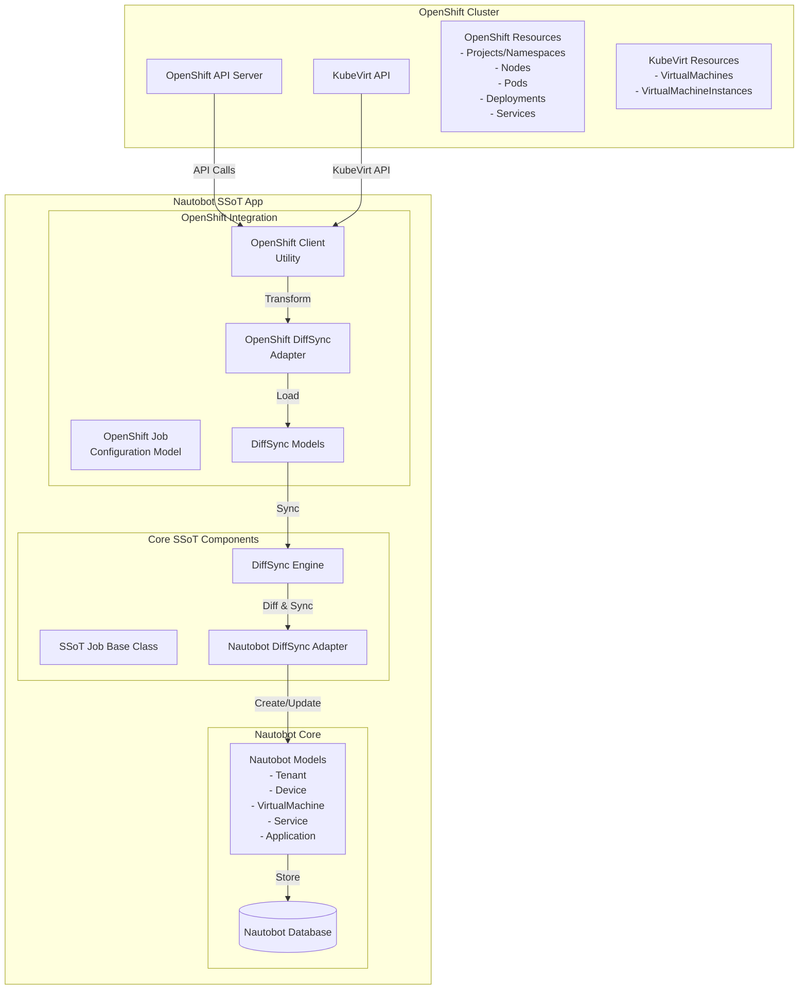
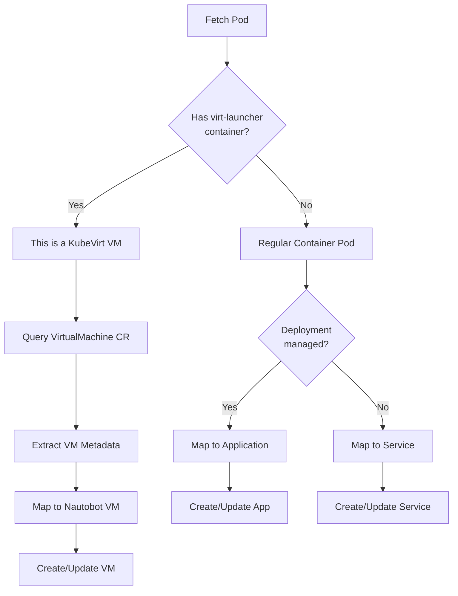

# Red Hat OpenShift Integration for Nautobot SSoT

This directory contains the comprehensive implementation for synchronizing Red Hat OpenShift resources with Nautobot, providing a single source of truth for both container workloads and KubeVirt virtual machines.

## 🚀 Features

- **🐳 Container Workload Sync**: Synchronizes pods, deployments, and services from OpenShift
- **🖥️ KubeVirt VM Support**: Automatically detects and syncs KubeVirt virtual machines  
- **⚙️ Flexible Configuration**: Granular control over what resources to sync with namespace filtering
- **🧠 Intelligent Detection**: Differentiates between container pods and VM pods automatically
- **🔒 Secure Authentication**: Uses Nautobot's ExternalIntegration and SecretsGroup for credential management
- **📊 Comprehensive UI**: Full CRUD interface with filtering, search, and audit trails

## 📁 Directory Structure & Source Code Links

```
openshift/
├── 📄 __init__.py                    # Package initialization
├── 🔧 api/                          # REST API implementation
│   ├── 📝 serializers.py            # → [DRF serializers](api/serializers.py)
│   ├── 🌐 urls.py                   # → [API URL patterns](api/urls.py)  
│   └── 👁️ views.py                  # → [API viewsets](api/views.py)
├── 🎯 choices.py                     # → [Choice definitions](choices.py)
├── 📋 constants.py                   # → [Constants and defaults](constants.py)
├── 🔄 diffsync/                     # DiffSync implementation
│   ├── 🔌 adapters/                 # DiffSync adapters
│   │   ├── 📦 adapter_nautobot.py   # → [Nautobot adapter](diffsync/adapters/adapter_nautobot.py)
│   │   └── 🐙 adapter_openshift.py  # → [OpenShift adapter](diffsync/adapters/adapter_openshift.py)
│   └── 🏗️ models/                   # DiffSync models
│       ├── 🔗 base.py               # → [Base models and mixins](diffsync/models/base.py)
│       ├── 📦 containers.py         # → [Container-specific models](diffsync/models/containers.py)
│       ├── 🖥️ kubevirt.py           # → [KubeVirt VM models](diffsync/models/kubevirt.py)
│       └── 🏛️ nautobot.py           # → [Nautobot-specific models](diffsync/models/nautobot.py)
├── 🔍 filters.py                     # → [Django filters](filters.py)
├── 📝 forms.py                       # → [Django forms](forms.py)
├── 🚀 jobs.py                        # → [SSoT job definitions](jobs.py)
├── 🗃️ models.py                      # → [Django models](models.py)
├── 📡 signals.py                     # → [Django signals](signals.py)
├── 📊 tables.py                      # → [Django tables](tables.py)
├── 🌐 urls.py                        # → [URL configuration](urls.py)
├── 🛠️ utilities/                    # Utility modules
│   ├── 🐙 openshift_client.py       # → [OpenShift API client](utilities/openshift_client.py)
│   └── 🖥️ kubevirt_utils.py         # → [KubeVirt helpers](utilities/kubevirt_utils.py)
└── 👁️ views.py                       # → [Django views](views.py)
```

## 🏗️ Architecture Overview

### High-Level Architecture



### Container vs VM Detection Flow



## 🔧 Key Components

### 📝 Configuration Model ([`models.py`](models.py))
- **`SSOTOpenshiftConfig`**: Stores comprehensive configuration for OpenShift instances
  - Secure credential management via ExternalIntegration
  - Granular sync control (namespaces, nodes, containers, deployments, services, VMs)
  - Namespace filtering with regex patterns
  - Job control flags for safety and flexibility

### 🚀 Sync Jobs ([`jobs.py`](jobs.py))
- **`OpenshiftDataSource`**: Main synchronization job from OpenShift to Nautobot
  - Secure credential extraction from SecretsGroup
  - KubeVirt auto-detection with graceful fallback
  - Comprehensive error handling with CONTINUE_ON_FAILURE
  - Progress tracking and detailed logging

### 🔄 DiffSync Models
- **Base Models** ([`diffsync/models/base.py`](diffsync/models/base.py)): Common attributes for all OpenShift resources
- **Container Models** ([`diffsync/models/containers.py`](diffsync/models/containers.py)): Pod, Container, Deployment, Service
- **KubeVirt Models** ([`diffsync/models/kubevirt.py`](diffsync/models/kubevirt.py)): VirtualMachine, VirtualMachineInstance
- **Nautobot Models** ([`diffsync/models/nautobot.py`](diffsync/models/nautobot.py)): Target Nautobot objects

### 🔌 DiffSync Adapters
- **OpenShift Adapter** ([`diffsync/adapters/adapter_openshift.py`](diffsync/adapters/adapter_openshift.py)): Loads data from OpenShift clusters
- **Nautobot Adapter** ([`diffsync/adapters/adapter_nautobot.py`](diffsync/adapters/adapter_nautobot.py)): Manages Nautobot object lifecycle

### 🐙 OpenShift Client ([`utilities/openshift_client.py`](utilities/openshift_client.py))
- Handles authentication and API calls to OpenShift
- Automatically detects KubeVirt availability
- Intelligently differentiates between container and VM workloads
- Supports namespace filtering and resource parsing

### 🖥️ KubeVirt Utilities ([`utilities/kubevirt_utils.py`](utilities/kubevirt_utils.py))
- Specialized functions for KubeVirt VM detection and management
- Memory and CPU parsing utilities
- VM state and lifecycle management helpers

## 🎨 User Interface Components

### 📝 Forms ([`forms.py`](forms.py))
- **`SSOTOpenshiftConfigForm`**: Create/edit configuration with Bootstrap styling
- **`SSOTOpenshiftConfigFilterForm`**: Search and filter configurations
- Enhanced field validation and user guidance

### 👁️ Views ([`views.py`](views.py))
- **`SSOTOpenshiftConfigUIViewSet`**: Complete CRUD operations with modern ViewSet patterns
- Custom template handling for branded UI
- Audit trail and notes functionality

### 📊 Tables ([`tables.py`](tables.py))
- **`SSOTOpenshiftConfigTable`**: Responsive table with boolean columns and action buttons
- Sortable columns and intelligent column selection
- Mobile-friendly design with touch support

### 🔍 Filters ([`filters.py`](filters.py))
- **`SSOTOpenshiftConfigFilterSet`**: Comprehensive filtering with text search
- Database-optimized queries with proper indexing
- Case-insensitive search across key fields

## 🌐 REST API

### 📝 Serializers ([`api/serializers.py`](api/serializers.py))
- **`SSOTOpenshiftConfigSerializer`**: Complete JSON serialization with security controls
- Automatic field generation with custom validation
- Write-only fields for sensitive data protection

### 👁️ API Views ([`api/views.py`](api/views.py))
- **`SSOTOpenshiftConfigViewSet`**: Full CRUD REST API operations
- Filtering, pagination, and search support
- Comprehensive error handling and validation

### 🌐 URL Configuration ([`urls.py`](urls.py), [`api/urls.py`](api/urls.py))
- RESTful URL patterns with automatic generation
- Integration with Nautobot's navigation system
- Support for all HTTP methods (GET, POST, PUT, PATCH, DELETE)

## 📡 System Integration

### 🔔 Signals ([`signals.py`](signals.py))
- **Custom Field Creation**: Automatic setup of OpenShift-specific metadata fields
- **Tag Management**: Visual indicators for synchronized objects
- **Database Initialization**: Safe, idempotent setup on first run

### ⚙️ Configuration
- **Constants** ([`constants.py`](constants.py)): Default values and system constants
- **Choices** ([`choices.py`](choices.py)): Enumerated values for consistency

## 🧪 Testing

Comprehensive test suite located in `nautobot_ssot/tests/openshift/`:

### 📋 Unit Tests
- **`test_models.py`**: Django model validation, constraints, and business logic
- **`test_openshift_client.py`**: Client initialization, connection, and KubeVirt detection  
- **`test_kubevirt_utils.py`**: KubeVirt utility functions and VM detection logic

### 🔄 DiffSync Tests
- **`test_openshift_diffsync_models.py`**: All 8 OpenShift-side DiffSync models
- **`test_nautobot_diffsync_models.py`**: All 6 Nautobot-side DiffSync models
- **`test_openshift_adapter.py`**: Adapter loading, filtering, and transformation logic
- **`test_nautobot_adapter.py`**: Nautobot adapter operations and object management

### 🔗 Integration Tests
- **`test_jobs.py`**: Job metadata, execution flow, and error handling

### 🎭 Mock Fixtures (`openshift_fixtures/`)
- **`get_projects.json`**: Sample namespace/project data with OpenShift annotations
- **`get_nodes.json`**: Sample node data with master/worker roles and capacity info
- **`get_virtualmachines.json`**: Sample KubeVirt VM data with various states

**Test Coverage**: ~100+ test methods across 8 test modules, following vSphere patterns with OpenShift-specific additions.

## 🔒 Security Features

### 🛡️ Credential Management
- **ExternalIntegration**: Secure credential storage via Nautobot's built-in system
- **SecretsGroup**: API tokens stored encrypted, never in plain text
- **Just-in-time Access**: Credentials only accessed when needed during sync
- **Audit Trails**: All credential access logged via Nautobot's audit system

### 🔐 API Security
- **Authentication Required**: All API endpoints require valid authentication
- **Permission Checks**: Object-level permissions enforced
- **Input Validation**: Comprehensive validation prevents malicious input
- **CSRF Protection**: State-changing operations protected against CSRF attacks

### 🔍 Data Protection
- **Write-only Fields**: Sensitive data never exposed in API responses
- **SSL Verification**: Configurable SSL certificate validation
- **Rate Limiting**: Protection against API abuse (configurable)

## 🚀 Getting Started

### 1. Configuration Setup
1. Create an **External Integration** in Nautobot for your OpenShift cluster
2. Configure a **SecretsGroup** with your OpenShift service account token
3. Create an **OpenShift Configuration** via the UI or API
4. Enable desired sync options and set namespace filters if needed

### 2. Running Synchronization
1. Navigate to **SSoT Jobs** in Nautobot
2. Select **"OpenShift ⟹ Nautobot"** job
3. Choose your OpenShift configuration
4. Execute the job and monitor progress

### 3. Monitoring Results
- View synchronized objects with the **"SSoT Synced from OpenShift"** tag
- Check job logs for detailed sync information
- Use custom fields to track OpenShift metadata
- Monitor change logs for audit trails

## 📚 Documentation

- **[Admin Setup Guide](../../docs/admin/integrations/openshift_setup.md)**: Configuration and troubleshooting
- **[User Guide](../../docs/user/integrations/openshift.md)**: Features and usage instructions  
- **[Implementation Guide](openshift.md)**: Comprehensive technical documentation with Mermaid diagrams
- **[Example Configuration](example_config.yaml)**: Sample YAML configurations for testing

## 🛠️ Development

### Code Organization
All source files include **extensive inline documentation** explaining:
- **Architecture patterns** and design decisions
- **Security considerations** and best practices  
- **Performance optimizations** and scalability notes
- **Extension points** for adding new functionality
- **Maintenance guidance** for future developers

### Key Patterns
- **ExternalIntegration Pattern**: Secure credential management
- **DiffSync Pattern**: Bidirectional data synchronization
- **ViewSet Pattern**: Modern Django REST API architecture
- **Signal Pattern**: Automatic system initialization

### Extension Points
- **New Resource Types**: Add to DiffSync models and adapters
- **Custom Transformations**: Extend adapter transformation logic
- **Additional Filters**: Enhance filtering and search capabilities
- **Webhook Support**: Add real-time update notifications

## 🤝 Contributing

When extending this integration:
1. **Follow Established Patterns**: Use existing patterns for consistency
2. **Add Comprehensive Tests**: Maintain high test coverage
3. **Update Documentation**: Keep documentation synchronized with code changes
4. **Security First**: Follow security best practices for credential handling
5. **Performance Aware**: Consider scalability implications

## 🔗 Related Resources

- **[Red Hat OpenShift Documentation](https://docs.openshift.com/)**
- **[KubeVirt Documentation](https://kubevirt.io/user-guide/)**
- **[Kubernetes Python Client](https://github.com/kubernetes-client/python)**
- **[DiffSync Documentation](https://diffsync.readthedocs.io/)**
- **[Nautobot SSoT Plugin](https://docs.nautobot.com/projects/ssot/)**

---

## 🏷️ Version Information

- **Current Version**: 2.0 (Security and Pattern Alignment Update)
- **Nautobot Compatibility**: 2.0+
- **Python Compatibility**: 3.8+
- **OpenShift Compatibility**: 4.x
- **KubeVirt Compatibility**: 0.x (optional)

**Last Updated**: See [changelog](openshift.md#changelog) for detailed version history and breaking changes. 