# Red Hat OpenShift Integration Implementation Guide

This document provides a comprehensive implementation guide for creating a Red Hat OpenShift integration for the Nautobot SSoT application, following the vSphere integration model.

## Overview

The OpenShift integration will synchronize container platform resources from Red Hat OpenShift into Nautobot, providing a single source of truth for:
- Container workloads (Pods and Deployments)
- KubeVirt virtual machines running on OpenShift
- Traditional OpenShift infrastructure resources

This enables unified management of both containerized applications and virtualized workloads running on the OpenShift platform.

## Architecture Overview

### High-Level Architecture Diagram

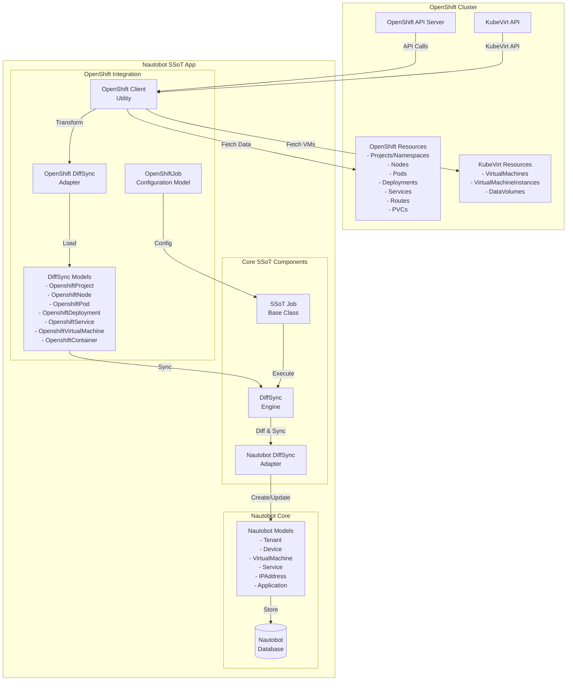

### Container vs VM Detection Flow

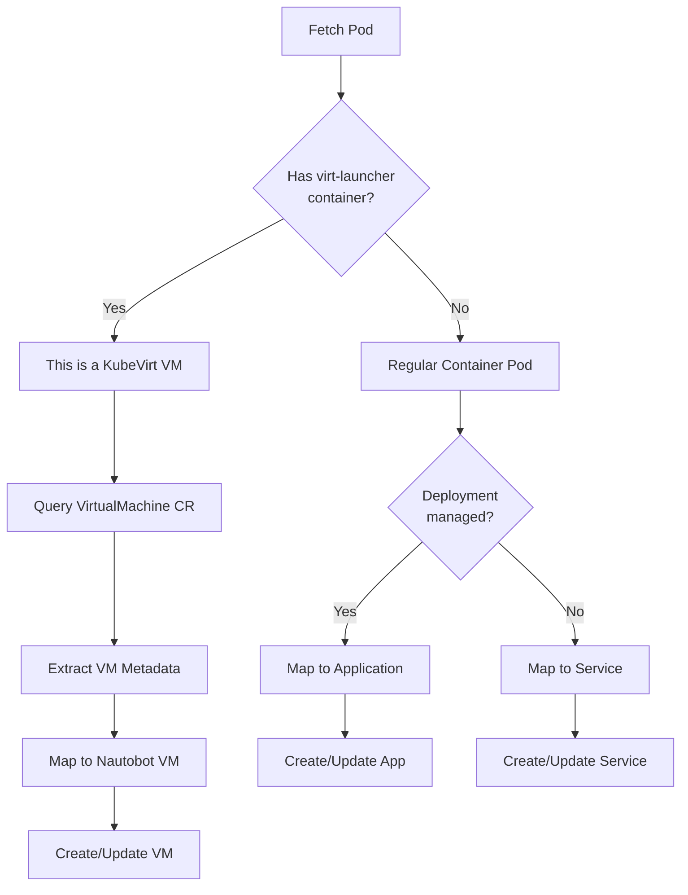

### Data Flow Sequence Diagram

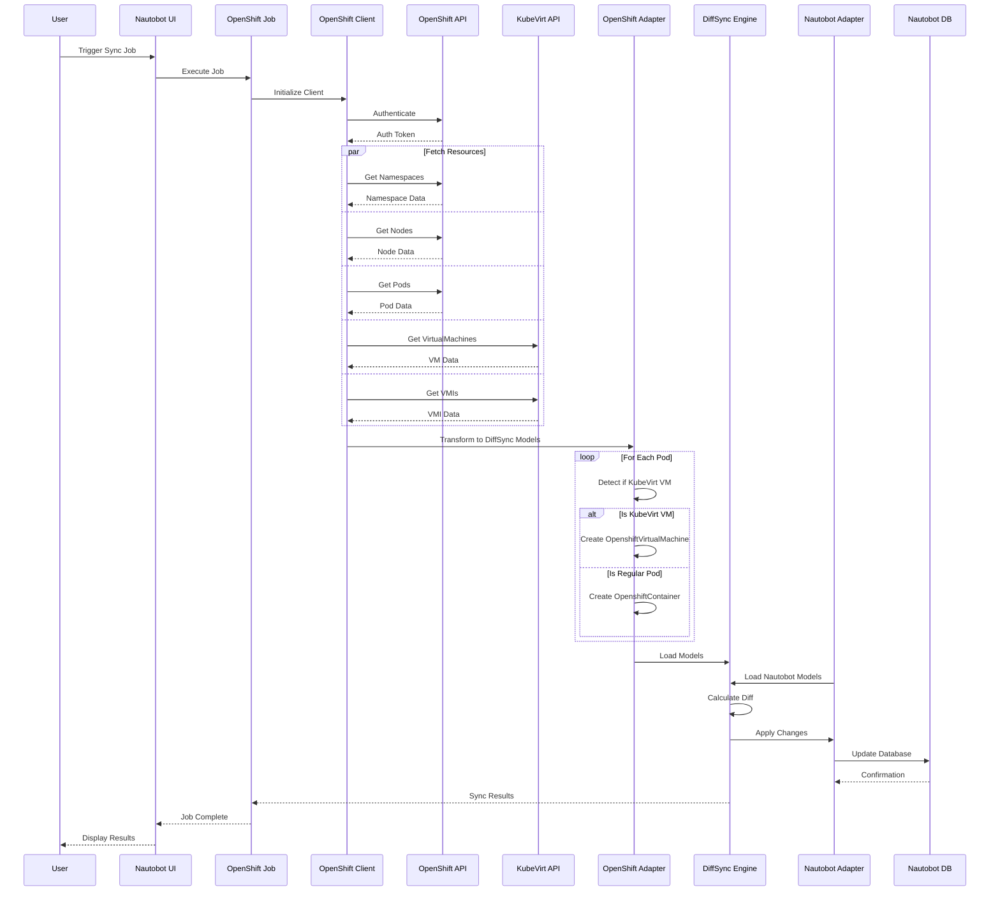

### Component Interaction Diagram

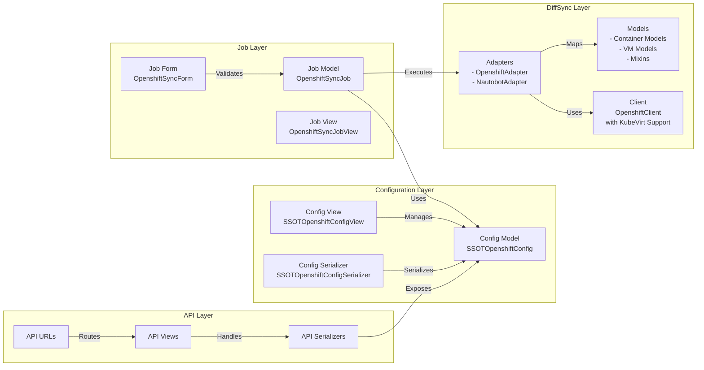

## DiffSync Implementation Details

### DiffSync Model Hierarchy

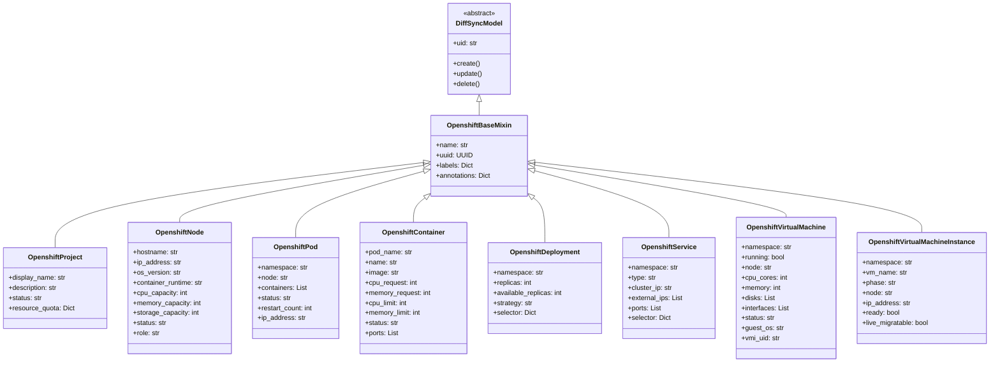

### Mapping Strategy Diagram

```mermaid
graph TD
    subgraph "OpenShift Resources"
        OP[Projects/<br/>Namespaces]
        ON[Nodes]
        OPD[Pods]
        OC[Containers]
        ODP[Deployments]
        OS[Services]
        OR[Routes]
        OVM[VirtualMachines<br/>(KubeVirt)]
        OVMI[VMInstances<br/>(KubeVirt)]
    end
    
    subgraph "Nautobot Models"
        NT[Tenant]
        ND[Device]
        NVM[VirtualMachine]
        NA[Application]
        NS[Service]
        NIP[IPAddress]
        NI[Interface]
    end
    
    OP -->|Maps to| NT
    ON -->|Maps to| ND
    OVM -->|Maps to| NVM
    OVMI -.->|Updates| NVM
    ODP -->|Maps to| NA
    OC -->|Part of| NA
    OS -->|Maps to| NS
    OR -->|Creates| NIP
    
    ODP -.->|Manages| OPD
    OPD -.->|Contains| OC
    OVM -.->|Creates| OVMI
    OVMI -.->|Runs on| ON
    OPD -.->|Runs on| ON
    OPD -.->|Assigns| NIP
    OS -.->|Links to| NIP
    NVM -.->|Has| NI
    NI -.->|Has| NIP
```

### KubeVirt VM Detection Logic

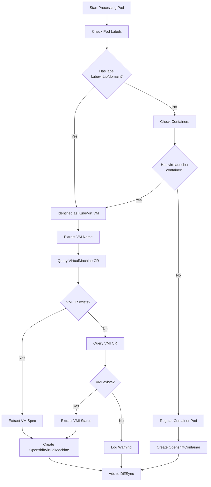

### Error Handling Flow

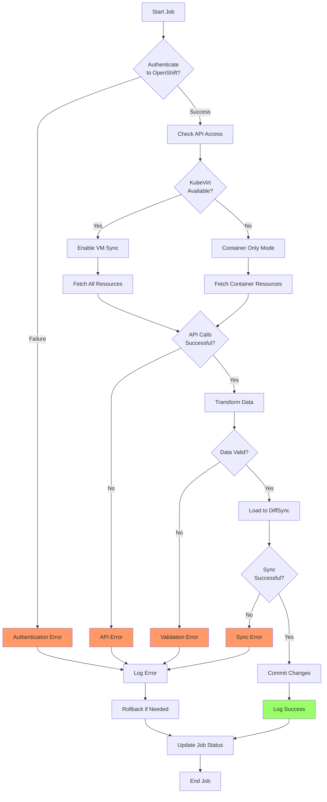

## AI Context and Implementation Notes

### For AI Models Assisting with Implementation

When implementing this OpenShift integration with KubeVirt support, here are key concepts and patterns to understand:

#### 1. **Container vs VM Detection**
OpenShift can run both traditional containers and KubeVirt virtual machines. The key to differentiation:
- KubeVirt VMs run inside special Pods with `virt-launcher` containers
- These Pods have specific labels like `kubevirt.io/domain`
- Each VM has both a VirtualMachine CR and a VirtualMachineInstance CR
- The Pod contains the VM process but is managed differently than regular containers

#### 2. **KubeVirt Resource Hierarchy**
```python
# Pattern for detecting and processing KubeVirt VMs
def is_kubevirt_vm(pod):
    """Detect if a Pod is running a KubeVirt VM."""
    # Check for KubeVirt labels
    if "kubevirt.io/domain" in pod.metadata.labels:
        return True
    
    # Check for virt-launcher container
    for container in pod.spec.containers:
        if container.name == "compute" and "virt-launcher" in container.command[0]:
            return True
    
    return False

def get_vm_for_pod(pod):
    """Get the VirtualMachine CR associated with a Pod."""
    vm_name = pod.metadata.labels.get("vm.kubevirt.io/name")
    if vm_name:
        return self.get_virtual_machine(pod.metadata.namespace, vm_name)
    return None
```

#### 3. **DiffSync Pattern for Dual Workloads**
- Create separate DiffSync models for containers and VMs
- Use the same adapter but different processing logic
- Ensure proper parent-child relationships (Pod -> Container, VM -> VMI)

#### 4. **Key Implementation Patterns from vSphere with KubeVirt Extensions**
```python
# Pattern 1: Client initialization with KubeVirt support
def __init__(self, url, api_token, verify_ssl=True):
    super().__init__(url, api_token, verify_ssl)
    
    # Check if KubeVirt is available
    try:
        self.custom_objects = client.CustomObjectsApi(self.api_client)
        self.kubevirt_available = self._check_kubevirt_apis()
    except Exception:
        self.kubevirt_available = False
        
def _check_kubevirt_apis(self):
    """Check if KubeVirt CRDs are available."""
    try:
        self.custom_objects.list_cluster_custom_object(
            group="kubevirt.io",
            version="v1",
            plural="virtualmachines"
        )
        return True
    except Exception:
        return False

# Pattern 2: Resource fetching with VM detection
def get_workloads(self):
    """Fetch and categorize workloads."""
    pods = self.core_v1.list_pod_for_all_namespaces()
    workloads = {"containers": [], "vms": []}
    
    for pod in pods.items:
        if self.is_kubevirt_vm(pod):
            vm_data = self._process_vm_pod(pod)
            if vm_data:
                workloads["vms"].append(vm_data)
        else:
            container_data = self._process_container_pod(pod)
            workloads["containers"].extend(container_data)
    
    return workloads

# Pattern 3: DiffSync model loading with type detection
def load(self):
    """Load OpenShift resources into DiffSync models."""
    workloads = self.get_workloads()
    
    # Load container workloads
    for container in workloads["containers"]:
        self.add(OpenshiftContainer(**container))
    
    # Load VM workloads
    for vm in workloads["vms"]:
        self.add(OpenshiftVirtualMachine(**vm))
```

#### 5. **Configuration Management**
- Add options to enable/disable KubeVirt sync
- Allow filtering by workload type (containers only, VMs only, or both)
- Handle cases where KubeVirt is not installed gracefully

#### 6. **Testing Strategies**
- Mock both standard Kubernetes API and KubeVirt CRD responses
- Test VM detection logic thoroughly
- Test scenarios with mixed workloads
- Test KubeVirt unavailability handling

#### 7. **Common Pitfalls to Avoid**
- Don't assume all Pods are containers - check for VMs
- Handle KubeVirt API unavailability gracefully
- Be aware that VM Pods have different resource patterns
- VMI status changes frequently - use VirtualMachine for stable data
- VM Pods have multiple containers - identify the main compute container

### Job Execution Lifecycle

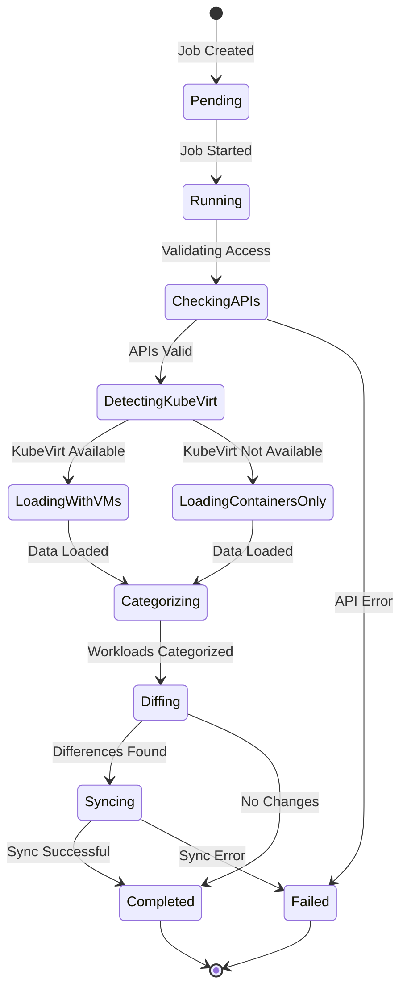

### Resource Discovery Process

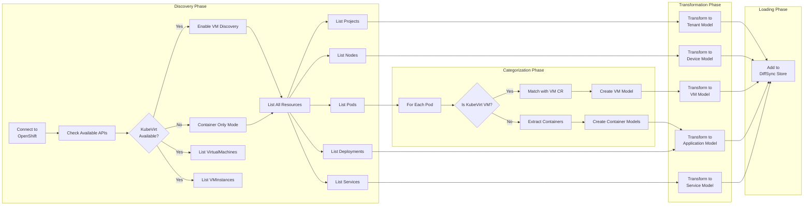

## Documentation and User Experience

### Documentation Structure

Based on the actual documentation created, the following structure has proven effective:

```
docs/
├── admin/
│   └── integrations/
│       └── openshift_setup.md      # Admin setup guide
└── user/
    └── integrations/
        └── openshift.md            # User guide

nautobot_ssot/
├── integrations/
│   └── openshift/
│       ├── openshift.md            # Implementation guide
│       └── README.md               # Integration overview
├── static/
│   └── nautobot_ssot_openshift/
│       └── README.md               # Static assets guide
└── templates/
    └── nautobot_ssot_openshift/
        ├── nautobot_ssot_openshift_config.html
        ├── ssotopenshiftconfig_list.html
        ├── ssotopenshiftconfig_retrieve.html
        └── ssotopenshiftconfig_update.html
```

### Key Documentation Insights

1. **Visual Documentation**: Mermaid diagrams significantly improve understanding:
   - Architecture overviews help visualize system components
   - Flow diagrams clarify decision logic
   - Sequence diagrams show interaction patterns

2. **User vs Admin Documentation**: Clear separation is essential:
   - Admin docs focus on setup, configuration, and troubleshooting
   - User docs focus on features, usage, and best practices

3. **Template Patterns**: Following existing patterns (like vSphere) ensures consistency:
   - Configuration views show grouped settings
   - Forms use panel organization for clarity
   - Hidden sensitive data (API tokens) in display views

### UI/UX Considerations

From creating the templates, several UI patterns emerged:

1. **Configuration Organization**:
   - Group related settings in panels
   - Separate authentication from functional settings
   - Use descriptive help text for complex options

2. **Field Display**:
   ```django
   <!-- Boolean fields -->
   {{ object.verify_ssl|render_boolean }}
   
   <!-- Optional fields -->
   {{ object.namespace_filter|placeholder }}
   
   <!-- Choice fields -->
   {{ object.get_workload_types_display }}
   
   <!-- Sensitive data -->
   <code>••••••••</code> (hidden)
   ```

3. **Navigation Consistency**:
   - Breadcrumbs maintain navigation context
   - "SSOT Configs" button provides quick return path
   - Standard CRUD operations follow Nautobot patterns

### Implementation Checklist

Based on the documentation and template creation process:

- [x] **Core Python Implementation**
  - [x] models.py - Django models for configuration
  - [x] forms.py - Django forms with validation
  - [x] views.py - Django views for CRUD operations
  - [x] tables.py - Django tables for list views
  - [x] filters.py - Filtering for configuration instances
  - [x] urls.py - URL routing
  - [x] signals.py - Django signals for initialization
  - [x] jobs.py - SSoT job implementation
  - [x] choices.py - Choice definitions
  - [x] constants.py - Integration constants

- [x] **DiffSync Implementation**
  - [x] Base models and mixins
  - [x] Container-specific models
  - [x] KubeVirt VM models
  - [x] OpenShift adapter
  - [ ] Nautobot adapter (placeholder created, needs full implementation)

- [x] **Utilities**
  - [x] OpenShift client with KubeVirt support
  - [x] KubeVirt detection utilities
  - [x] Resource transformation helpers

- [x] **API Implementation**
  - [x] Serializers for REST API
  - [x] ViewSets for API endpoints
  - [x] URL configuration

- [ ] **Testing**
  - [ ] Unit tests for models
  - [ ] Integration tests for sync job
  - [ ] Mock fixtures for API responses
  - [ ] VM detection test cases

- [x] **Templates**
  - [x] List view template (ssotopenshiftconfig_list.html)
  - [x] Detail view template (ssotopenshiftconfig_retrieve.html)  
  - [x] Create/Edit template (ssotopenshiftconfig_update.html)
  - [x] Added to main SSOT configs page

- [ ] **Static Assets**
  - [ ] OpenShift logo (48x48 PNG)
  - [ ] Any additional icons or images

- [x] **Integration Points**
  - [x] Update nautobot_ssot/__init__.py for enable flag
  - [x] Add to pyproject.toml dependencies
  - [ ] Update migration files if needed

### Lessons Learned

1. **Start with Documentation**: Creating docs first clarifies requirements
2. **Visual Aids Matter**: Diagrams make complex concepts accessible
3. **Follow Patterns**: Consistency with existing integrations reduces learning curve
4. **Think About UX Early**: Template design influences model field choices
5. **Plan for Extensibility**: KubeVirt support shows importance of flexible design

## Testing Strategy

### Test Coverage Overview

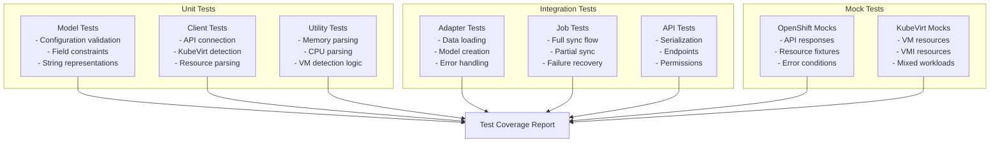

### Testing Workflow

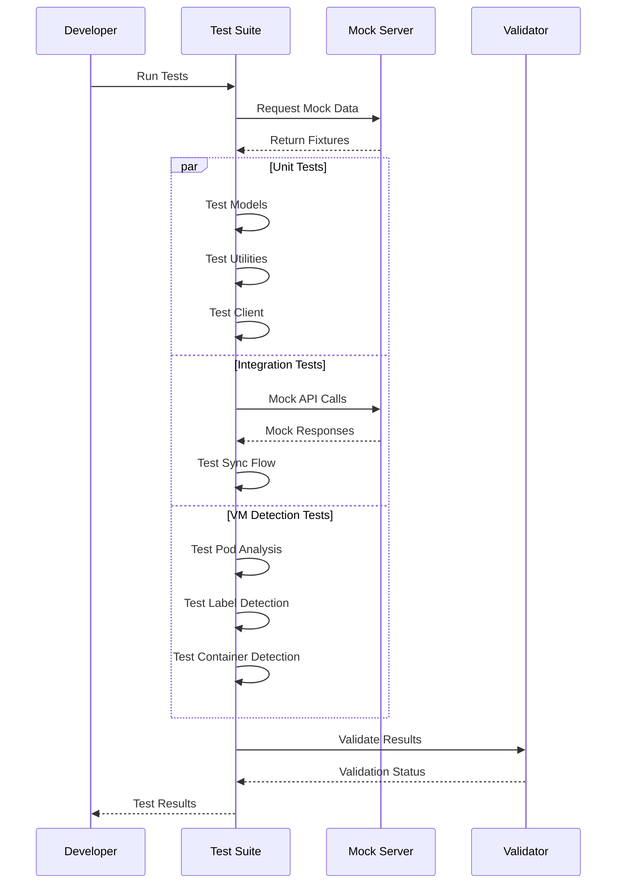

### Test Implementation Examples

#### tests/openshift/test_vm_detection.py
```python
"""Tests for KubeVirt VM detection logic."""
import pytest
from unittest.mock import Mock, MagicMock
from kubernetes.client.models import V1Pod, V1PodSpec, V1Container, V1ObjectMeta

from nautobot_ssot.integrations.openshift.utilities.openshift_client import OpenshiftClient


class TestVMDetection:
    """Test cases for VM detection logic."""
    
    def test_detect_vm_by_label(self):
        """Test VM detection via KubeVirt labels."""
        client = OpenshiftClient("https://test", "token", False)
        
        # Create mock pod with KubeVirt label
        pod = Mock(spec=V1Pod)
        pod.metadata = Mock(spec=V1ObjectMeta)
        pod.metadata.labels = {"kubevirt.io/domain": "test-vm"}
        pod.spec = Mock(spec=V1PodSpec)
        pod.spec.containers = []
        
        assert client.is_kubevirt_vm_pod(pod) is True
    
    def test_detect_vm_by_virt_launcher(self):
        """Test VM detection via virt-launcher container."""
        client = OpenshiftClient("https://test", "token", False)
        
        # Create mock pod with virt-launcher container
        pod = Mock(spec=V1Pod)
        pod.metadata = Mock(spec=V1ObjectMeta)
        pod.metadata.labels = {}
        
        container = Mock(spec=V1Container)
        container.name = "compute"
        container.command = ["/usr/bin/virt-launcher"]
        
        pod.spec = Mock(spec=V1PodSpec)
        pod.spec.containers = [container]
        
        assert client.is_kubevirt_vm_pod(pod) is True
    
    def test_regular_pod_not_vm(self):
        """Test that regular pods are not detected as VMs."""
        client = OpenshiftClient("https://test", "token", False)
        
        # Create mock regular pod
        pod = Mock(spec=V1Pod)
        pod.metadata = Mock(spec=V1ObjectMeta)
        pod.metadata.labels = {"app": "nginx"}
        
        container = Mock(spec=V1Container)
        container.name = "nginx"
        container.command = ["nginx"]
        
        pod.spec = Mock(spec=V1PodSpec)
        pod.spec.containers = [container]
        
        assert client.is_kubevirt_vm_pod(pod) is False
```

#### tests/openshift/fixtures/
Directory structure for test fixtures:
```
fixtures/
├── __init__.py
├── openshift_responses.py      # Mock API responses
├── kubevirt_resources.json     # KubeVirt resource fixtures
├── mixed_workloads.json        # Mixed container and VM fixtures
└── error_responses.py          # Error condition fixtures
```

### Development Workflow Integration

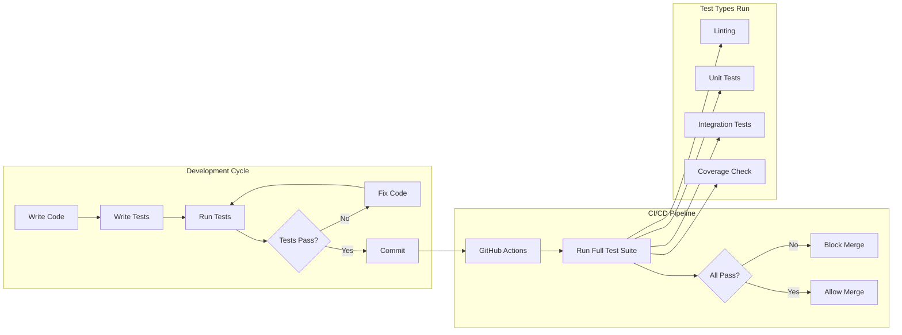

## Implementation Best Practices

Based on creating the documentation and understanding the integration requirements:

### 1. **Configuration Management**
- Use Django model validation for configuration constraints
- Provide sensible defaults where possible
- Hide sensitive data (API tokens) in UI displays
- Group related configuration options logically

### 2. **Error Handling**
- Gracefully handle KubeVirt unavailability
- Provide clear error messages for common issues
- Log detailed information for debugging
- Don't fail entire sync for partial errors

### 3. **Performance Optimization**
- Use batch operations where possible
- Implement pagination for large resource lists
- Cache KubeVirt availability check
- Consider rate limiting for API calls

### 4. **User Experience**
- Provide progress updates during long syncs
- Show meaningful status messages
- Use consistent terminology with OpenShift
- Include helpful documentation links

### 5. **Extensibility**
- Design for future resource types
- Make workload detection pluggable
- Allow custom field mappings
- Support webhook notifications

## Deployment Considerations

### Environment Setup

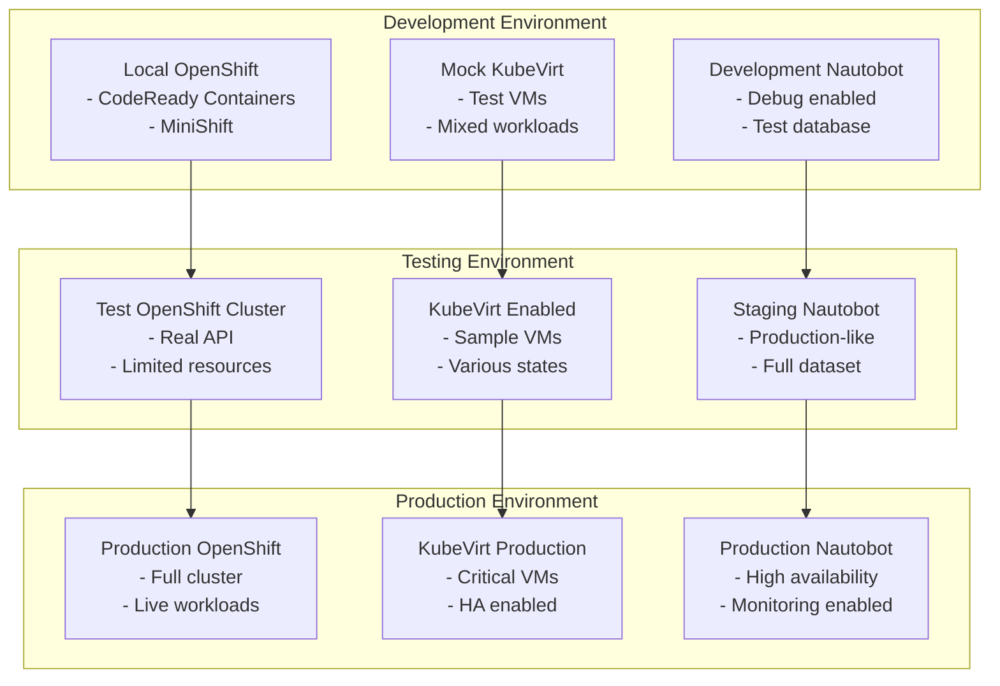

### Security Considerations

1. **API Token Management**
   - Use service accounts with minimal required permissions
   - Rotate tokens regularly
   - Store tokens securely (encrypted in database)
   - Audit token usage

2. **Network Security**
   - Use TLS for all API communications
   - Implement network policies if needed
   - Consider using a proxy for API access
   - Monitor for suspicious activity

3. **RBAC Requirements**
   ```yaml
   # Minimal ClusterRole for OpenShift SSoT
   apiVersion: rbac.authorization.k8s.io/v1
   kind: ClusterRole
   metadata:
     name: nautobot-ssot-reader
   rules:
   - apiGroups: [""]
     resources: ["namespaces", "nodes", "pods", "services"]
     verbs: ["get", "list", "watch"]
   - apiGroups: ["apps"]
     resources: ["deployments"]
     verbs: ["get", "list", "watch"]
   - apiGroups: ["kubevirt.io"]
     resources: ["virtualmachines", "virtualmachineinstances"]
     verbs: ["get", "list", "watch"]
   ```

## Conclusion

This implementation guide provides a comprehensive blueprint for creating the Red Hat OpenShift integration for Nautobot SSoT. The addition of KubeVirt support demonstrates the flexibility of the design and the importance of planning for extensibility. The visual documentation through Mermaid diagrams has proven invaluable for understanding complex workflows and will serve as excellent reference material for both implementers and users of the integration.

## Key Components to Implement

### 1. Directory Structure

Create the following directory structure under `nautobot_ssot/integrations/`:

```
openshift/
├── __init__.py
├── api/
│   ├── __init__.py
│   ├── serializers.py
│   ├── urls.py
│   └── views.py
├── choices.py
├── constants.py
├── diffsync/
│   ├── __init__.py
│   ├── adapters/
│   │   ├── __init__.py
│   │   ├── adapter_nautobot.py
│   │   └── adapter_openshift.py
│   └── models/
│       ├── __init__.py
│       ├── base.py
│       ├── containers.py
│       ├── kubevirt.py
│       └── nautobot.py
├── filters.py
├── forms.py
├── jobs.py
├── models.py
├── signals.py
├── tables.py
├── urls.py
├── utilities/
│   ├── __init__.py
│   ├── openshift_client.py
│   └── kubevirt_utils.py
└── views.py
```

### 2. Enable the Integration

Update `nautobot_ssot/__init__.py` to include:

```python
# Add to default_settings
"enable_openshift": is_truthy(os.environ.get("NAUTOBOT_SSOT_ENABLE_OPENSHIFT", "false")),

# Add to the conditional imports section
if nautobot_config["PLUGINS_CONFIG"]["nautobot_ssot"]["enable_openshift"]:
    from nautobot_ssot.integrations.openshift import signals  # noqa: F401
```

### 3. Core Models Implementation

#### models.py
```python
"""Models for Red Hat OpenShift integration."""
from django.core.exceptions import ValidationError
from django.db import models
from nautobot.core.models.generics import PrimaryModel

from nautobot_ssot.integrations.utils import get_json_type_choices


class SSOTOpenshiftConfig(PrimaryModel):
    """Model for storing OpenShift integration configuration."""
    
    is_saved_view_model = False
    
    name = models.CharField(max_length=200, unique=True)
    description = models.CharField(max_length=200, blank=True)
    url = models.URLField(
        max_length=200,
        verbose_name="OpenShift API URL",
        help_text="The URL of the OpenShift API server (e.g., https://api.cluster.example.com:6443)"
    )
    api_token = models.CharField(
        max_length=500,
        verbose_name="API Token",
        help_text="Service account token for authentication"
    )
    verify_ssl = models.BooleanField(
        default=True,
        verbose_name="Verify SSL",
        help_text="Verify SSL certificates when connecting to OpenShift"
    )
    
    # Sync options
    sync_namespaces = models.BooleanField(
        default=True,
        verbose_name="Sync Namespaces/Projects",
        help_text="Import OpenShift projects as Nautobot tenants"
    )
    sync_nodes = models.BooleanField(
        default=True,
        verbose_name="Sync Nodes",
        help_text="Import OpenShift nodes as Nautobot devices"
    )
    sync_containers = models.BooleanField(
        default=True,
        verbose_name="Sync Containers",
        help_text="Import container workloads as Nautobot applications"
    )
    sync_deployments = models.BooleanField(
        default=True,
        verbose_name="Sync Deployments",
        help_text="Import OpenShift deployments as Nautobot applications"
    )
    sync_services = models.BooleanField(
        default=True,
        verbose_name="Sync Services",
        help_text="Import OpenShift services as Nautobot services"
    )
    sync_kubevirt_vms = models.BooleanField(
        default=True,
        verbose_name="Sync KubeVirt VMs",
        help_text="Import KubeVirt virtual machines as Nautobot VMs (requires KubeVirt)"
    )
    
    # Filtering options
    namespace_filter = models.CharField(
        max_length=200,
        blank=True,
        verbose_name="Namespace Filter",
        help_text="Regex pattern to filter namespaces (leave empty to sync all)"
    )
    
    # Workload type options
    workload_types = models.CharField(
        max_length=50,
        choices=[
            ("all", "All Workloads"),
            ("containers", "Containers Only"),
            ("vms", "Virtual Machines Only"),
        ],
        default="all",
        verbose_name="Workload Types",
        help_text="Types of workloads to synchronize"
    )
    
    class Meta:
        """Metaclass for SSOTOpenshiftConfig."""
        ordering = ["name"]
        verbose_name = "SSoT OpenShift Configuration"
        verbose_name_plural = "SSoT OpenShift Configurations"

    def __str__(self):
        """String representation."""
        return self.name

    def clean(self):
        """Validate the configuration."""
        super().clean()
        
        if not self.url.startswith(("https://", "http://")):
            raise ValidationError({"url": "URL must start with http:// or https://"})
        
        if not self.api_token:
            raise ValidationError({"api_token": "API token is required"})
        
        # At least one sync option must be enabled
        sync_options = [
            self.sync_namespaces, self.sync_nodes, self.sync_containers,
            self.sync_deployments, self.sync_services, self.sync_kubevirt_vms
        ]
        if not any(sync_options):
            raise ValidationError("At least one sync option must be enabled")
        
        # Validate workload type selection
        if self.workload_types == "vms" and not self.sync_kubevirt_vms:
            raise ValidationError({
                "workload_types": "Cannot select 'VMs Only' when KubeVirt VM sync is disabled"
            })

    def get_absolute_url(self):
        """Return the absolute URL for this object."""
        return f"/plugins/nautobot-ssot/openshift/config/{self.pk}/"
```

### 4. DiffSync Models

#### diffsync/models/base.py
```python
"""Base DiffSync models for OpenShift integration."""
import uuid
from typing import Optional, List, Dict, Any
from diffsync import DiffSyncModel


class OpenshiftBaseMixin:
    """Base mixin for OpenShift models."""
    
    # Common fields across OpenShift resources
    name: str
    uuid: uuid.UUID
    labels: Optional[Dict[str, str]] = {}
    annotations: Optional[Dict[str, str]] = {}
    
    @classmethod
    def create_unique_id(cls, **kwargs) -> str:
        """Create unique identifier for the model."""
        return str(kwargs.get("uuid", kwargs.get("name", "")))


class OpenshiftProject(OpenshiftBaseMixin, DiffSyncModel):
    """DiffSync model for OpenShift projects/namespaces."""
    
    _modelname = "openshift_project"
    _identifiers = ("name",)
    _attributes = ("display_name", "description", "status", "labels", "annotations")
    
    # OpenShift specific fields
    display_name: Optional[str] = ""
    description: Optional[str] = ""
    status: str = "Active"
    resource_quota: Optional[Dict[str, Any]] = {}
    
    @classmethod
    def get_or_create(cls, adapter, **kwargs):
        """Get or create the project."""
        return adapter.get_or_create(cls, **kwargs)


class OpenshiftNode(OpenshiftBaseMixin, DiffSyncModel):
    """DiffSync model for OpenShift nodes."""
    
    _modelname = "openshift_node"
    _identifiers = ("name",)
    _attributes = (
        "hostname", "ip_address", "os_version", "container_runtime",
        "cpu_capacity", "memory_capacity", "storage_capacity", 
        "status", "role", "labels", "annotations"
    )
    
    # Node specific fields
    hostname: str
    ip_address: Optional[str] = ""
    os_version: Optional[str] = ""
    container_runtime: Optional[str] = "cri-o"
    cpu_capacity: Optional[int] = 0
    memory_capacity: Optional[int] = 0  # In MB
    storage_capacity: Optional[int] = 0  # In GB
    status: str = "Ready"
    role: str = "worker"  # master or worker
```

#### diffsync/models/containers.py
```python
"""Container-specific DiffSync models for OpenShift integration."""
from typing import Optional, List, Dict, Any
from diffsync import DiffSyncModel
from .base import OpenshiftBaseMixin


class OpenshiftPod(OpenshiftBaseMixin, DiffSyncModel):
    """DiffSync model for OpenShift pods."""
    
    _modelname = "openshift_pod"
    _identifiers = ("namespace", "name")
    _attributes = (
        "node", "containers", "status", "restart_count",
        "ip_address", "labels", "annotations", "is_kubevirt_vm"
    )
    
    # Pod specific fields
    namespace: str
    node: Optional[str] = ""
    containers: List[Dict[str, Any]] = []
    status: str = "Running"
    restart_count: int = 0
    ip_address: Optional[str] = ""
    is_kubevirt_vm: bool = False  # Flag to identify KubeVirt VMs


class OpenshiftContainer(OpenshiftBaseMixin, DiffSyncModel):
    """DiffSync model for containers within pods."""
    
    _modelname = "openshift_container"
    _identifiers = ("pod_name", "namespace", "name")
    _attributes = (
        "image", "cpu_request", "memory_request", "cpu_limit",
        "memory_limit", "status", "ports", "environment"
    )
    
    # Container specific fields
    pod_name: str
    namespace: str
    image: str
    cpu_request: Optional[int] = 0  # In millicores
    memory_request: Optional[int] = 0  # In MB
    cpu_limit: Optional[int] = 0
    memory_limit: Optional[int] = 0
    status: str = "Running"
    ports: List[Dict[str, Any]] = []
    environment: Dict[str, str] = {}


class OpenshiftDeployment(OpenshiftBaseMixin, DiffSyncModel):
    """DiffSync model for OpenShift deployments."""
    
    _modelname = "openshift_deployment"
    _identifiers = ("namespace", "name")
    _attributes = (
        "replicas", "available_replicas", "strategy", 
        "selector", "labels", "annotations"
    )
    
    # Deployment specific fields
    namespace: str
    replicas: int = 1
    available_replicas: int = 0
    strategy: str = "RollingUpdate"
    selector: Dict[str, str] = {}


class OpenshiftService(OpenshiftBaseMixin, DiffSyncModel):
    """DiffSync model for OpenShift services."""
    
    _modelname = "openshift_service"
    _identifiers = ("namespace", "name")
    _attributes = (
        "type", "cluster_ip", "external_ips", "ports",
        "selector", "labels", "annotations"
    )
    
    # Service specific fields
    namespace: str
    type: str = "ClusterIP"  # ClusterIP, NodePort, LoadBalancer
    cluster_ip: Optional[str] = ""
    external_ips: List[str] = []
    ports: List[Dict[str, Any]] = []
    selector: Dict[str, str] = {}
```

#### diffsync/models/kubevirt.py
```python
"""KubeVirt-specific DiffSync models for OpenShift integration."""
from typing import Optional, List, Dict, Any
from diffsync import DiffSyncModel
from .base import OpenshiftBaseMixin


class OpenshiftVirtualMachine(OpenshiftBaseMixin, DiffSyncModel):
    """DiffSync model for KubeVirt VirtualMachines."""
    
    _modelname = "openshift_virtualmachine"
    _identifiers = ("namespace", "name")
    _attributes = (
        "running", "node", "cpu_cores", "memory", "disks",
        "interfaces", "status", "guest_os", "vmi_uid",
        "firmware", "machine_type", "labels", "annotations"
    )
    
    # VM specific fields
    namespace: str
    running: bool = False
    node: Optional[str] = ""
    cpu_cores: int = 1
    memory: int = 1024  # In MB
    disks: List[Dict[str, Any]] = []
    interfaces: List[Dict[str, Any]] = []
    status: str = "Stopped"
    guest_os: Optional[str] = ""
    vmi_uid: Optional[str] = ""
    firmware: Optional[Dict[str, Any]] = {}
    machine_type: Optional[str] = "q35"
    
    def is_active(self) -> bool:
        """Check if VM is active."""
        return self.running and self.status in ["Running", "Migrating"]


class OpenshiftVirtualMachineInstance(OpenshiftBaseMixin, DiffSyncModel):
    """DiffSync model for KubeVirt VirtualMachineInstances."""
    
    _modelname = "openshift_vmi"
    _identifiers = ("namespace", "name")
    _attributes = (
        "vm_name", "phase", "node", "ip_address", "ready",
        "live_migratable", "conditions", "guest_agent_info"
    )
    
    # VMI specific fields
    namespace: str
    vm_name: str
    phase: str = "Pending"  # Pending, Scheduling, Scheduled, Running, Succeeded, Failed
    node: Optional[str] = ""
    ip_address: Optional[str] = ""
    ready: bool = False
    live_migratable: bool = False
    conditions: List[Dict[str, Any]] = []
    guest_agent_info: Optional[Dict[str, Any]] = {}
```

### 5. Client Implementation with KubeVirt Support

#### utilities/openshift_client.py
```python
"""OpenShift API client utility with KubeVirt support."""
import re
from typing import Dict, List, Optional, Any, Tuple
from urllib.parse import urlparse
import requests
from kubernetes import client, config


def parse_openshift_url(url: str) -> Dict[str, str]:
    """Parse OpenShift URL to extract components."""
    parsed = urlparse(url)
    return {
        "scheme": parsed.scheme,
        "hostname": parsed.hostname,
        "port": parsed.port or 6443,
        "path": parsed.path or ""
    }


class OpenshiftClient:
    """Client for interacting with OpenShift API including KubeVirt resources."""
    
    def __init__(self, url: str, api_token: str, verify_ssl: bool = True):
        """Initialize the OpenShift client."""
        self.url = url
        self.api_token = api_token
        self.verify_ssl = verify_ssl
        
        # Configure Kubernetes client
        configuration = client.Configuration()
        configuration.host = url
        configuration.api_key = {"authorization": f"Bearer {api_token}"}
        configuration.verify_ssl = verify_ssl
        
        # Initialize API clients
        self.api_client = client.ApiClient(configuration)
        self.core_v1 = client.CoreV1Api(self.api_client)
        self.apps_v1 = client.AppsV1Api(self.api_client)
        self.networking_v1 = client.NetworkingV1Api(self.api_client)
        self.custom_objects = client.CustomObjectsApi(self.api_client)
        
        # Check KubeVirt availability
        self.kubevirt_available = self._check_kubevirt_apis()
        
    def verify_connection(self) -> bool:
        """Verify connection to OpenShift cluster."""
        try:
            self.core_v1.get_api_resources()
            return True
        except Exception:
            return False
    
    def _check_kubevirt_apis(self) -> bool:
        """Check if KubeVirt CRDs are available in the cluster."""
        try:
            # Try to list VirtualMachines to check if KubeVirt is installed
            self.custom_objects.list_cluster_custom_object(
                group="kubevirt.io",
                version="v1",
                plural="virtualmachines",
                limit=1
            )
            return True
        except Exception:
            return False
    
    def is_kubevirt_vm_pod(self, pod) -> bool:
        """Check if a pod is running a KubeVirt VM."""
        # Check for KubeVirt specific labels
        if pod.metadata.labels:
            if "kubevirt.io/domain" in pod.metadata.labels:
                return True
            if "vm.kubevirt.io/name" in pod.metadata.labels:
                return True
        
        # Check for virt-launcher container
        if pod.spec.containers:
            for container in pod.spec.containers:
                if container.name == "compute":
                    if container.command and "virt-launcher" in str(container.command):
                        return True
        
        return False
    
    def get_projects(self, namespace_filter: Optional[str] = None) -> List[Dict[str, Any]]:
        """Get all projects/namespaces from OpenShift."""
        namespaces = self.core_v1.list_namespace()
        projects = []
        
        for ns in namespaces.items:
            # Apply filter if provided
            if namespace_filter and not re.match(namespace_filter, ns.metadata.name):
                continue
                
            projects.append({
                "name": ns.metadata.name,
                "uuid": ns.metadata.uid,
                "display_name": ns.metadata.annotations.get(
                    "openshift.io/display-name", ns.metadata.name
                ) if ns.metadata.annotations else ns.metadata.name,
                "description": ns.metadata.annotations.get(
                    "openshift.io/description", ""
                ) if ns.metadata.annotations else "",
                "status": ns.status.phase,
                "labels": ns.metadata.labels or {},
                "annotations": ns.metadata.annotations or {},
            })
        
        return projects
    
    def get_nodes(self) -> List[Dict[str, Any]]:
        """Get all nodes from OpenShift cluster."""
        nodes = self.core_v1.list_node()
        node_list = []
        
        for node in nodes.items:
            # Extract node information
            node_info = {
                "name": node.metadata.name,
                "uuid": node.metadata.uid,
                "hostname": node.metadata.name,
                "labels": node.metadata.labels or {},
                "annotations": node.metadata.annotations or {},
                "status": "Ready" if self._is_node_ready(node) else "NotReady",
                "role": self._get_node_role(node),
            }
            
            # Extract system info
            if node.status.node_info:
                node_info.update({
                    "os_version": node.status.node_info.os_image,
                    "container_runtime": node.status.node_info.container_runtime_version,
                })
            
            # Extract capacity
            if node.status.capacity:
                node_info.update({
                    "cpu_capacity": int(node.status.capacity.get("cpu", 0)),
                    "memory_capacity": self._parse_memory(
                        node.status.capacity.get("memory", "0")
                    ),
                    "storage_capacity": self._parse_storage(
                        node.status.capacity.get("ephemeral-storage", "0")
                    ),
                })
            
            # Extract IP address
            for addr in node.status.addresses or []:
                if addr.type == "InternalIP":
                    node_info["ip_address"] = addr.address
                    break
            
            node_list.append(node_info)
        
        return node_list
    
    def get_pods_and_containers(self, namespace: Optional[str] = None) -> Tuple[List[Dict], List[Dict]]:
        """Get pods and containers, separating regular containers from KubeVirt VMs."""
        if namespace:
            pods = self.core_v1.list_namespaced_pod(namespace)
        else:
            pods = self.core_v1.list_pod_for_all_namespaces()
        
        pod_list = []
        container_list = []
        
        for pod in pods.items:
            # Skip if pod is a KubeVirt VM (will be handled separately)
            is_vm = self.is_kubevirt_vm_pod(pod)
            
            pod_info = {
                "name": pod.metadata.name,
                "namespace": pod.metadata.namespace,
                "uuid": pod.metadata.uid,
                "labels": pod.metadata.labels or {},
                "annotations": pod.metadata.annotations or {},
                "node": pod.spec.node_name,
                "status": pod.status.phase,
                "ip_address": pod.status.pod_ip,
                "is_kubevirt_vm": is_vm,
                "containers": [],
                "restart_count": 0,
            }
            
            if not is_vm:
                # Process containers for non-VM pods
                for container in pod.spec.containers:
                    container_info = {
                        "name": container.name,
                        "pod_name": pod.metadata.name,
                        "namespace": pod.metadata.namespace,
                        "uuid": f"{pod.metadata.uid}-{container.name}",
                        "image": container.image,
                        "ports": [
                            {
                                "port": p.container_port,
                                "protocol": p.protocol,
                                "name": p.name
                            } for p in (container.ports or [])
                        ],
                        "environment": {},
                        "cpu_request": 0,
                        "memory_request": 0,
                        "cpu_limit": 0,
                        "memory_limit": 0,
                    }
                    
                    # Extract resource requests and limits
                    if container.resources:
                        if container.resources.requests:
                            container_info["cpu_request"] = self._parse_cpu(
                                container.resources.requests.get("cpu", "0")
                            )
                            container_info["memory_request"] = self._parse_memory(
                                container.resources.requests.get("memory", "0")
                            )
                        if container.resources.limits:
                            container_info["cpu_limit"] = self._parse_cpu(
                                container.resources.limits.get("cpu", "0")
                            )
                            container_info["memory_limit"] = self._parse_memory(
                                container.resources.limits.get("memory", "0")
                            )
                    
                    container_list.append(container_info)
                    pod_info["containers"].append(container_info)
                
                # Calculate total restart count
                for status in pod.status.container_statuses or []:
                    pod_info["restart_count"] += status.restart_count
            
            pod_list.append(pod_info)
        
        return pod_list, container_list
    
    def get_deployments(self, namespace: Optional[str] = None) -> List[Dict[str, Any]]:
        """Get deployments from OpenShift."""
        if namespace:
            deployments = self.apps_v1.list_namespaced_deployment(namespace)
        else:
            deployments = self.apps_v1.list_deployment_for_all_namespaces()
        
        deployment_list = []
        for dep in deployments.items:
            deployment_info = {
                "name": dep.metadata.name,
                "namespace": dep.metadata.namespace,
                "uuid": dep.metadata.uid,
                "labels": dep.metadata.labels or {},
                "annotations": dep.metadata.annotations or {},
                "replicas": dep.spec.replicas or 0,
                "available_replicas": dep.status.available_replicas or 0,
                "strategy": dep.spec.strategy.type if dep.spec.strategy else "RollingUpdate",
                "selector": dep.spec.selector.match_labels or {},
            }
            deployment_list.append(deployment_info)
        
        return deployment_list
    
    def get_services(self, namespace: Optional[str] = None) -> List[Dict[str, Any]]:
        """Get services from OpenShift."""
        if namespace:
            services = self.core_v1.list_namespaced_service(namespace)
        else:
            services = self.core_v1.list_service_for_all_namespaces()
        
        service_list = []
        for svc in services.items:
            service_info = {
                "name": svc.metadata.name,
                "namespace": svc.metadata.namespace,
                "uuid": svc.metadata.uid,
                "labels": svc.metadata.labels or {},
                "annotations": svc.metadata.annotations or {},
                "type": svc.spec.type,
                "cluster_ip": svc.spec.cluster_ip,
                "external_ips": svc.spec.external_ips or [],
                "selector": svc.spec.selector or {},
                "ports": [],
            }
            
            # Extract port information
            for port in svc.spec.ports or []:
                port_info = {
                    "name": port.name,
                    "protocol": port.protocol,
                    "port": port.port,
                    "target_port": str(port.target_port),
                    "node_port": port.node_port,
                }
                service_info["ports"].append(port_info)
            
            service_list.append(service_info)
        
        return service_list
    
    def get_virtual_machines(self, namespace: Optional[str] = None) -> List[Dict[str, Any]]:
        """Get KubeVirt VirtualMachines from OpenShift."""
        if not self.kubevirt_available:
            return []
        
        try:
            if namespace:
                vms = self.custom_objects.list_namespaced_custom_object(
                    group="kubevirt.io",
                    version="v1",
                    namespace=namespace,
                    plural="virtualmachines"
                )
            else:
                vms = self.custom_objects.list_cluster_custom_object(
                    group="kubevirt.io",
                    version="v1",
                    plural="virtualmachines"
                )
            
            vm_list = []
            for vm in vms.get("items", []):
                vm_spec = vm.get("spec", {})
                vm_status = vm.get("status", {})
                template_spec = vm_spec.get("template", {}).get("spec", {})
                domain = template_spec.get("domain", {})
                
                vm_info = {
                    "name": vm["metadata"]["name"],
                    "namespace": vm["metadata"]["namespace"],
                    "uuid": vm["metadata"]["uid"],
                    "labels": vm["metadata"].get("labels", {}),
                    "annotations": vm["metadata"].get("annotations", {}),
                    "running": vm_spec.get("running", False),
                    "status": vm_status.get("printableStatus", "Unknown"),
                    "cpu_cores": domain.get("cpu", {}).get("cores", 1),
                    "memory": self._parse_memory(
                        domain.get("resources", {}).get("requests", {}).get("memory", "1Gi")
                    ),
                    "machine_type": domain.get("machine", {}).get("type", "q35"),
                    "firmware": domain.get("firmware", {}),
                    "disks": [],
                    "interfaces": [],
                }
                
                # Extract disk information
                for disk in domain.get("devices", {}).get("disks", []):
                    disk_info = {
                        "name": disk.get("name"),
                        "bus": disk.get("disk", {}).get("bus", "virtio"),
                    }
                    vm_info["disks"].append(disk_info)
                
                # Extract interface information
                for iface in domain.get("devices", {}).get("interfaces", []):
                    iface_info = {
                        "name": iface.get("name"),
                        "type": list(iface.keys())[1] if len(iface.keys()) > 1 else "unknown",
                    }
                    vm_info["interfaces"].append(iface_info)
                
                # Get associated VMI if VM is running
                if vm_info["running"]:
                    vmi = self.get_virtual_machine_instance(
                        vm_info["namespace"], vm_info["name"]
                    )
                    if vmi:
                        vm_info["node"] = vmi.get("node", "")
                        vm_info["vmi_uid"] = vmi.get("uuid", "")
                
                vm_list.append(vm_info)
            
            return vm_list
        except Exception as e:
            # Log error but don't fail the entire sync
            print(f"Error fetching virtual machines: {e}")
            return []
    
    def get_virtual_machine_instance(self, namespace: str, name: str) -> Optional[Dict[str, Any]]:
        """Get a specific VirtualMachineInstance."""
        if not self.kubevirt_available:
            return None
        
        try:
            vmi = self.custom_objects.get_namespaced_custom_object(
                group="kubevirt.io",
                version="v1",
                namespace=namespace,
                plural="virtualmachineinstances",
                name=name
            )
            
            vmi_status = vmi.get("status", {})
            
            return {
                "name": vmi["metadata"]["name"],
                "namespace": vmi["metadata"]["namespace"],
                "uuid": vmi["metadata"]["uid"],
                "vm_name": vmi["metadata"]["name"],
                "phase": vmi_status.get("phase", "Unknown"),
                "node": vmi_status.get("nodeName", ""),
                "ip_address": vmi_status.get("interfaces", [{}])[0].get("ipAddress", "")
                    if vmi_status.get("interfaces") else "",
                "ready": vmi_status.get("ready", False),
                "live_migratable": vmi_status.get("conditions", {}).get("LiveMigratable", False),
                "conditions": vmi_status.get("conditions", []),
                "guest_agent_info": vmi_status.get("guestOSInfo", {}),
            }
        except Exception:
            return None
    
    @staticmethod
    def _is_node_ready(node) -> bool:
        """Check if node is in Ready state."""
        for condition in node.status.conditions or []:
            if condition.type == "Ready":
                return condition.status == "True"
        return False
    
    @staticmethod
    def _get_node_role(node) -> str:
        """Determine node role from labels."""
        labels = node.metadata.labels or {}
        if "node-role.kubernetes.io/master" in labels:
            return "master"
        elif "node-role.kubernetes.io/control-plane" in labels:
            return "master"
        return "worker"
    
    @staticmethod
    def _parse_memory(memory_str: str) -> int:
        """Parse memory string to MB."""
        if isinstance(memory_str, (int, float)):
            return int(memory_str)
        
        memory_str = str(memory_str)
        if memory_str.endswith("Ki"):
            return int(memory_str[:-2]) // 1024
        elif memory_str.endswith("Mi"):
            return int(memory_str[:-2])
        elif memory_str.endswith("Gi"):
            return int(memory_str[:-2]) * 1024
        elif memory_str.endswith("G"):
            return int(memory_str[:-1]) * 1024
        return 0
    
    @staticmethod
    def _parse_storage(storage_str: str) -> int:
        """Parse storage string to GB."""
        if isinstance(storage_str, (int, float)):
            return int(storage_str)
        
        storage_str = str(storage_str)
        if storage_str.endswith("Ki"):
            return int(storage_str[:-2]) // (1024 * 1024)
        elif storage_str.endswith("Mi"):
            return int(storage_str[:-2]) // 1024
        elif storage_str.endswith("Gi"):
            return int(storage_str[:-2])
        return 0
    
    @staticmethod
    def _parse_cpu(cpu_str: str) -> int:
        """Parse CPU string to millicores."""
        if isinstance(cpu_str, (int, float)):
            return int(cpu_str * 1000)
        
        cpu_str = str(cpu_str)
        if cpu_str.endswith("m"):
            return int(cpu_str[:-1])
        else:
            # Assume it's in cores, convert to millicores
            try:
                return int(float(cpu_str) * 1000)
            except ValueError:
                return 0
```

### 6. Job Implementation

#### jobs.py
```python
"""Jobs for OpenShift SSoT integration."""
from django.forms import ModelChoiceField
from django.templatetags.static import static
from django.urls import reverse
from nautobot.extras.jobs import BooleanVar, ObjectVar
from nautobot_ssot.jobs.base import DataMapping, DataSource

from nautobot_ssot.integrations.openshift.diffsync.adapters.adapter_nautobot import OpenshiftNautobotAdapter
from nautobot_ssot.integrations.openshift.diffsync.adapters.adapter_openshift import OpenshiftAdapter
from nautobot_ssot.integrations.openshift.models import SSOTOpenshiftConfig


name = "SSoT - OpenShift"  # pylint: disable=invalid-name


class OpenshiftDataSource(DataSource):
    """Job to sync data from OpenShift to Nautobot."""
    
    openshift_instance = ObjectVar(
        model=SSOTOpenshiftConfig,
        required=True,
        display_field="name",
        label="OpenShift Instance",
        description="The OpenShift configuration instance to sync from",
    )
    
    debug = BooleanVar(
        description="Enable for more verbose debug logging",
        default=False,
        required=False,
    )
    
    class Meta:
        """Metadata for the job."""
        name = "OpenShift ⟹ Nautobot"
        data_source = "OpenShift"
        data_source_icon = static("nautobot_ssot_openshift/openshift_logo.png")
        description = "Sync data from OpenShift to Nautobot (including KubeVirt VMs)"
        field_order = ["openshift_instance", "debug"]
    
    @classmethod
    def data_mappings(cls):
        """Define the data mappings for this job."""
        return (
            DataMapping("Project/Namespace", None, "Tenant", reverse("tenants:tenant_list")),
            DataMapping("Node", None, "Device", reverse("dcim:device_list")),
            DataMapping("Container/Pod", None, "Application", reverse("extras:application_list")),
            DataMapping("Deployment", None, "Application", reverse("extras:application_list")),
            DataMapping("KubeVirt VM", None, "Virtual Machine", reverse("virtualization:virtualmachine_list")),
            DataMapping("Service", None, "Service", reverse("ipam:service_list")),
        )
    
    def load_source_adapter(self):
        """Load the OpenShift adapter."""
        config = self.kwargs["openshift_instance"]
        self.source_adapter = OpenshiftAdapter(
            job=self,
            sync=self.sync,
            config=config,
        )
        
        # Check KubeVirt availability
        if self.source_adapter.client.kubevirt_available:
            self.job.logger.info("KubeVirt detected - will sync virtual machines")
        else:
            self.job.logger.info("KubeVirt not detected - will sync containers only")
        
        self.source_adapter.load()
    
    def load_target_adapter(self):
        """Load the Nautobot adapter."""
        self.target_adapter = OpenshiftNautobotAdapter(
            job=self,
            sync=self.sync,
        )
        self.target_adapter.load()
```

### 7. DiffSync Adapters

#### diffsync/adapters/adapter_openshift.py
```python
"""OpenShift adapter for DiffSync."""
from typing import Dict, List, Any
from diffsync import Adapter

from nautobot_ssot.integrations.openshift.utilities.openshift_client import OpenshiftClient
from nautobot_ssot.integrations.openshift.diffsync.models.base import (
    OpenshiftProject, OpenshiftNode
)
from nautobot_ssot.integrations.openshift.diffsync.models.containers import (
    OpenshiftPod, OpenshiftContainer, OpenshiftDeployment, OpenshiftService
)
from nautobot_ssot.integrations.openshift.diffsync.models.kubevirt import (
    OpenshiftVirtualMachine, OpenshiftVirtualMachineInstance
)


class OpenshiftAdapter(Adapter):
    """DiffSync adapter for OpenShift."""
    
    # Define model classes
    project = OpenshiftProject
    node = OpenshiftNode
    pod = OpenshiftPod
    container = OpenshiftContainer
    deployment = OpenshiftDeployment
    service = OpenshiftService
    virtualmachine = OpenshiftVirtualMachine
    vmi = OpenshiftVirtualMachineInstance
    
    # Define top-level models
    top_level = ["project", "node", "deployment", "service", "virtualmachine"]
    
    def __init__(self, *args, job=None, sync=None, config=None, **kwargs):
        """Initialize the OpenShift adapter."""
        super().__init__(*args, **kwargs)
        self.job = job
        self.sync = sync
        self.config = config
        self.client = OpenshiftClient(
            url=config.url,
            api_token=config.api_token,
            verify_ssl=config.verify_ssl
        )
    
    def load(self):
        """Load data from OpenShift."""
        # Verify connection
        if not self.client.verify_connection():
            self.job.logger.error("Failed to connect to OpenShift API")
            raise Exception("Failed to connect to OpenShift API")
        
        # Load projects/namespaces
        if self.config.sync_namespaces:
            self._load_projects()
        
        # Load nodes
        if self.config.sync_nodes:
            self._load_nodes()
        
        # Load workloads based on configuration
        if self.config.workload_types in ["all", "containers"]:
            if self.config.sync_containers:
                self._load_containers()
            if self.config.sync_deployments:
                self._load_deployments()
        
        if self.config.workload_types in ["all", "vms"]:
            if self.config.sync_kubevirt_vms and self.client.kubevirt_available:
                self._load_virtual_machines()
        
        # Load services
        if self.config.sync_services:
            self._load_services()
    
    def _load_projects(self):
        """Load OpenShift projects/namespaces."""
        projects = self.client.get_projects(self.config.namespace_filter)
        
        for project_data in projects:
            project = self.project(**project_data)
            self.add(project)
            self.job.logger.debug(f"Loaded project: {project.name}")
    
    def _load_nodes(self):
        """Load OpenShift nodes."""
        nodes = self.client.get_nodes()
        
        for node_data in nodes:
            node = self.node(**node_data)
            self.add(node)
            self.job.logger.debug(f"Loaded node: {node.name}")
    
    def _load_containers(self):
        """Load containers and pods, excluding KubeVirt VMs."""
        pods, containers = self.client.get_pods_and_containers()
        
        # Process pods
        for pod_data in pods:
            if not pod_data["is_kubevirt_vm"]:
                pod = self.pod(**pod_data)
                self.add(pod)
                self.job.logger.debug(f"Loaded pod: {pod.namespace}/{pod.name}")
        
        # Process containers
        for container_data in containers:
            container = self.container(**container_data)
            self.add(container)
            self.job.logger.debug(
                f"Loaded container: {container.namespace}/{container.pod_name}/{container.name}"
            )
    
    def _load_deployments(self):
        """Load OpenShift deployments."""
        deployments = self.client.get_deployments()
        
        for deployment_data in deployments:
            deployment = self.deployment(**deployment_data)
            self.add(deployment)
            self.job.logger.debug(f"Loaded deployment: {deployment.namespace}/{deployment.name}")
    
    def _load_services(self):
        """Load OpenShift services."""
        services = self.client.get_services()
        
        for service_data in services:
            service = self.service(**service_data)
            self.add(service)
            self.job.logger.debug(f"Loaded service: {service.namespace}/{service.name}")
    
    def _load_virtual_machines(self):
        """Load KubeVirt virtual machines."""
        vms = self.client.get_virtual_machines()
        
        for vm_data in vms:
            vm = self.virtualmachine(**vm_data)
            self.add(vm)
            self.job.logger.debug(f"Loaded VM: {vm.namespace}/{vm.name}")
            
            # If VM is running, load its instance
            if vm.running and vm.vmi_uid:
                vmi_data = self.client.get_virtual_machine_instance(
                    vm.namespace, vm.name
                )
                if vmi_data:
                    vmi = self.vmi(**vmi_data)
                    self.add(vmi)
                    self.job.logger.debug(f"Loaded VMI: {vmi.namespace}/{vmi.name}")
```

### 8. API Implementation

#### api/serializers.py
```python
"""API serializers for OpenShift integration."""
from rest_framework import serializers
from nautobot.core.api.serializers import ValidatedModelSerializer
from nautobot_ssot.integrations.openshift.models import SSOTOpenshiftConfig


class SSOTOpenshiftConfigSerializer(ValidatedModelSerializer):
    """Serializer for SSOTOpenshiftConfig model."""
    
    url = serializers.HyperlinkedIdentityField(
        view_name="plugins-api:nautobot_ssot-api:openshift-config-detail"
    )
    
    class Meta:
        """Meta class for serializer."""
        model = SSOTOpenshiftConfig
        fields = "__all__"
        extra_kwargs = {
            "api_token": {"write_only": True},
        }
```

#### api/views.py
```python
"""API views for OpenShift integration."""
from nautobot.core.api.views import ModelViewSet
from nautobot_ssot.integrations.openshift.api.serializers import SSOTOpenshiftConfigSerializer
from nautobot_ssot.integrations.openshift.filters import SSOTOpenshiftConfigFilterSet
from nautobot_ssot.integrations.openshift.models import SSOTOpenshiftConfig


class SSOTOpenshiftConfigViewSet(ModelViewSet):
    """ViewSet for SSOTOpenshiftConfig model."""
    
    queryset = SSOTOpenshiftConfig.objects.all()
    serializer_class = SSOTOpenshiftConfigSerializer
    filterset_class = SSOTOpenshiftConfigFilterSet
```

#### api/urls.py
```python
"""API URLs for OpenShift integration."""
from nautobot.core.api.routers import OrderedDefaultRouter
from nautobot_ssot.integrations.openshift.api.views import SSOTOpenshiftConfigViewSet

router = OrderedDefaultRouter()
router.register("config", SSOTOpenshiftConfigViewSet)

urlpatterns = router.urls
```

### 9. Forms, Views, and Tables

#### forms.py
```python
"""Forms for OpenShift integration."""
from django import forms
from nautobot.core.forms import BootstrapMixin
from nautobot_ssot.integrations.openshift.models import SSOTOpenshiftConfig


class SSOTOpenshiftConfigForm(BootstrapMixin, forms.ModelForm):
    """Form for SSOTOpenshiftConfig model."""
    
    api_token = forms.CharField(
        widget=forms.PasswordInput(render_value=True),
        required=True,
        help_text="Service account token for authentication",
    )
    
    class Meta:
        """Meta class for form."""
        model = SSOTOpenshiftConfig
        fields = "__all__"
        widgets = {
            "description": forms.Textarea(attrs={"rows": 3}),
        }


class SSOTOpenshiftConfigFilterForm(BootstrapMixin, forms.Form):
    """Filter form for SSOTOpenshiftConfig."""
    
    q = forms.CharField(required=False, label="Search")
    name = forms.CharField(required=False)
    url = forms.CharField(required=False)
```

#### views.py
```python
"""Views for OpenShift integration."""
from django.urls import reverse
from nautobot.core.views import generic
from nautobot_ssot.integrations.openshift import filters, forms, models, tables


class SSOTOpenshiftConfigListView(generic.ObjectListView):
    """List view for SSOTOpenshiftConfig."""
    
    queryset = models.SSOTOpenshiftConfig.objects.all()
    table = tables.SSOTOpenshiftConfigTable
    filterset = filters.SSOTOpenshiftConfigFilterSet
    filterset_form = forms.SSOTOpenshiftConfigFilterForm


class SSOTOpenshiftConfigView(generic.ObjectView):
    """Detail view for SSOTOpenshiftConfig."""
    
    queryset = models.SSOTOpenshiftConfig.objects.all()
    
    def get_extra_context(self, request, instance):
        """Add extra context."""
        return {
            "sync_jobs_url": reverse("plugins:nautobot_ssot:job_list"),
        }


class SSOTOpenshiftConfigEditView(generic.ObjectEditView):
    """Edit view for SSOTOpenshiftConfig."""
    
    queryset = models.SSOTOpenshiftConfig.objects.all()
    model_form = forms.SSOTOpenshiftConfigForm


class SSOTOpenshiftConfigDeleteView(generic.ObjectDeleteView):
    """Delete view for SSOTOpenshiftConfig."""
    
    queryset = models.SSOTOpenshiftConfig.objects.all()


class SSOTOpenshiftConfigBulkDeleteView(generic.BulkDeleteView):
    """Bulk delete view for SSOTOpenshiftConfig."""
    
    queryset = models.SSOTOpenshiftConfig.objects.all()
    table = tables.SSOTOpenshiftConfigTable
```

#### tables.py
```python
"""Tables for OpenShift integration."""
import django_tables2 as tables
from nautobot.core.tables import BaseTable, ButtonsColumn, ToggleColumn
from nautobot_ssot.integrations.openshift.models import SSOTOpenshiftConfig


class SSOTOpenshiftConfigTable(BaseTable):
    """Table for SSOTOpenshiftConfig."""
    
    pk = ToggleColumn()
    name = tables.LinkColumn()
    actions = ButtonsColumn(
        model=SSOTOpenshiftConfig,
        buttons=("edit", "delete"),
    )
    
    class Meta:
        """Meta class for table."""
        model = SSOTOpenshiftConfig
        fields = (
            "pk",
            "name",
            "url",
            "description",
            "verify_ssl",
            "sync_namespaces",
            "sync_nodes",
            "sync_containers",
            "sync_deployments",
            "sync_services",
            "sync_kubevirt_vms",
            "workload_types",
            "actions",
        )
        default_columns = (
            "pk",
            "name",
            "url",
            "description",
            "verify_ssl",
            "sync_namespaces",
            "sync_nodes",
            "sync_containers",
            "sync_deployments",
            "sync_services",
            "sync_kubevirt_vms",
            "workload_types",
            "actions",
        )
```

### 10. URL Configuration

#### urls.py
```python
"""URL patterns for OpenShift integration."""
from django.urls import path
from nautobot_ssot.integrations.openshift import views

app_name = "openshift"

urlpatterns = [
    path("config/", views.SSOTOpenshiftConfigListView.as_view(), name="config_list"),
    path("config/add/", views.SSOTOpenshiftConfigEditView.as_view(), name="config_add"),
    path("config/<uuid:pk>/", views.SSOTOpenshiftConfigView.as_view(), name="config"),
    path("config/<uuid:pk>/edit/", views.SSOTOpenshiftConfigEditView.as_view(), name="config_edit"),
    path("config/<uuid:pk>/delete/", views.SSOTOpenshiftConfigDeleteView.as_view(), name="config_delete"),
    path("config/delete/", views.SSOTOpenshiftConfigBulkDeleteView.as_view(), name="config_bulk_delete"),
]
```

### 11. Filters

#### filters.py
```python
"""Filters for OpenShift integration."""
import django_filters
from nautobot.core.filters import BaseFilterSet
from nautobot_ssot.integrations.openshift.models import SSOTOpenshiftConfig


class SSOTOpenshiftConfigFilterSet(BaseFilterSet):
    """Filter set for SSOTOpenshiftConfig."""
    
    q = django_filters.CharFilter(
        method="search",
        label="Search",
    )
    
    name = django_filters.CharFilter(
        lookup_expr="icontains",
    )
    
    url = django_filters.CharFilter(
        lookup_expr="icontains",
    )
    
    verify_ssl = django_filters.BooleanFilter()
    
    class Meta:
        """Meta class for filter set."""
        model = SSOTOpenshiftConfig
        fields = [
            "name",
            "url",
            "verify_ssl",
            "sync_namespaces",
            "sync_nodes",
            "sync_containers",
            "sync_deployments",
            "sync_services",
            "sync_kubevirt_vms",
            "workload_types",
        ]
    
    def search(self, queryset, name, value):
        """Search method."""
        if not value.strip():
            return queryset
        return queryset.filter(
            models.Q(name__icontains=value) |
            models.Q(description__icontains=value) |
            models.Q(url__icontains=value)
        )
```

### 12. Static Assets

Create the following directories and add appropriate logos:
- `nautobot_ssot/static/nautobot_ssot_openshift/`
  - Add `openshift_logo.png` (Red Hat OpenShift logo)

### 13. Templates

Create configuration templates in `nautobot_ssot/templates/nautobot_ssot_openshift/`:
- `config.html` - Configuration detail view
- Similar to vSphere templates but customized for OpenShift

### 14. Testing Structure

Create comprehensive tests under `nautobot_ssot/tests/openshift/`:

```
openshift/
├── __init__.py
├── fixtures/
│   ├── __init__.py
│   ├── projects.json
│   ├── nodes.json
│   ├── pods.json
│   └── services.json
├── test_adapters_nautobot.py
├── test_adapters_openshift.py
├── test_client.py
├── test_diffsync_models.py
├── test_jobs.py
└── test_views.py
```

## Development Workflow

### Initial Setup
1. Create the directory structure
2. Implement models and migrations
3. Add the enable flag to `__init__.py`
4. Create basic views and forms

### Implementation Order
1. **Models & Database** - Start with `models.py` and create migrations
2. **Client** - Implement OpenShift client for API communication
3. **DiffSync Models** - Define data structures for synchronization
4. **Adapters** - Create OpenShift and Nautobot adapters
5. **Job** - Implement the sync job
6. **UI Components** - Add forms, views, tables
7. **API** - Add REST API endpoints
8. **Tests** - Write comprehensive tests

### Testing Strategy
- Use mocked OpenShift API responses for unit tests
- Create fixtures for predictable test data
- Test error scenarios and edge cases
- Verify data transformations
- Test the full sync process

## Security Considerations

1. **API Token Storage** - Store tokens securely, consider encryption
2. **SSL Verification** - Default to verifying SSL certificates
3. **Namespace Filtering** - Allow restricting access to specific namespaces
4. **Rate Limiting** - Implement rate limiting for API calls
5. **Audit Logging** - Log all sync operations for audit trails

## Performance Optimization

1. **Pagination** - Use pagination for large resource lists
2. **Selective Sync** - Allow users to choose what to sync
3. **Incremental Updates** - Only sync changed resources when possible
4. **Caching** - Cache frequently accessed data
5. **Async Operations** - Consider async processing for large syncs

## Monitoring and Debugging

1. **Detailed Logging** - Log all operations with appropriate levels
2. **Metrics Collection** - Track sync duration, resource counts, errors
3. **Health Checks** - Implement health check endpoints
4. **Debug Mode** - Provide verbose logging option
5. **Dry Run Mode** - Allow preview of changes before applying

## Future Enhancements

1. **Bidirectional Sync** - Support pushing changes back to OpenShift
2. **Custom Resource Definitions** - Support for CRDs
3. **Webhook Support** - Real-time updates via webhooks
4. **Multi-cluster Support** - Manage multiple OpenShift clusters
5. **Resource Quotas** - Sync and manage resource quotas
6. **RBAC Integration** - Sync roles and permissions
7. **Operator Integration** - Support for OpenShift operators

## Troubleshooting Guide

### Common Issues

1. **Authentication Failures**
   - Verify API token is valid
   - Check token permissions
   - Ensure URL is correct

2. **SSL Certificate Errors**
   - Add CA certificate to trust store
   - Use `verify_ssl=False` for testing only

3. **Timeout Issues**
   - Increase timeout values
   - Check network connectivity
   - Verify OpenShift API performance

4. **Memory Issues**
   - Enable pagination
   - Reduce batch sizes
   - Filter unnecessary resources

5. **Data Mapping Errors**
   - Verify required Nautobot objects exist
   - Check data transformation logic
   - Review DiffSync logs

## Contributing

When contributing to this integration:
1. Follow the existing code patterns
2. Add comprehensive tests
3. Update documentation
4. Consider backwards compatibility
5. Add appropriate logging

## References

- [Red Hat OpenShift API Documentation](https://docs.openshift.com/container-platform/latest/rest_api/index.html)
- [Kubernetes Python Client](https://github.com/kubernetes-client/python)
- [DiffSync Documentation](https://diffsync.readthedocs.io/)
- [Nautobot App Developer Guide](https://docs.nautobot.com/projects/core/en/stable/development/apps/) 